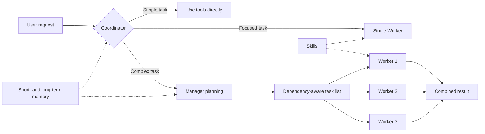

<h1 align="center">RedLotus</h1>

<p align="center">
  English · <a href="README.zh-CN.md">简体中文</a>
</p>

<p align="center">
  A terminal AI agent with task orchestration, long-term memory, and runtime skills.
</p>

<p align="center">
  <a href="https://pypi.org/project/RedLotus/"></a>
  
  
  <a href="https://ai.pydantic.dev/"></a>
</p>

RedLotus is an AI agent that runs in your terminal. It chooses how to handle each request based on its complexity: work directly, delegate a focused task to one Worker, or ask a Manager to break down and coordinate a larger job. It supports OpenAI-compatible model APIs and includes memory, runtime Skills, file extraction, browser automation, and chat bot integrations.

```bash
python -m pip install --upgrade redlotus
redlotus
```

## Features

The earlier `1.0.1.post1` release plan used the title `1.0.1-release` and preserved the existing `1.0.1` release. Its validation exclusions cover Linux, macOS, live QQ/WeChat accounts, and unconfigured model protocols; those capabilities remain unverified. Old `1.0.1` startup and upgrade tests are outside the scope. The current terminal-control changes do not publish or replace release artifacts. See the [project design](docs/design.md) and [GitHub Releases](https://github.com/Tian-ye1214/RedLotus/releases) for recorded status and artifact hashes.

Before each model request, compression uses reported input tokens and the threshold `ceil(min(configured_ratio * context_capacity, context_capacity - max_output))`. A main, child, or memory request with a durable checkpoint that is rejected for context capacity is split at complete evidence and closed tool-call boundaries for concurrent compression, then retried once after the summaries are saved. Completed tools are not repeated. The capacity rejection is logged with unknown provider usage preserved. Original records and the system prompt remain intact.

| Feature | Description |
|---------|-------------|
| Multi-agent orchestration | The Coordinator selects the execution path. For complex work, the Manager creates dependent tasks and Workers execute them in dependency-aware batches. |
| Goal mode | RedLotus keeps iterating toward a defined goal until it finishes. Additional user input can be incorporated while the goal is running. |
| Three memory layers | Incremental session records, LLM perception over 20 new user turns, project-scoped episodes and global long-term RAG. MEMORY.md contains the core profile and reusable experience. |
| Runtime Skills | `SKILL.md` files provide instructions, references, and scripts on demand. Skill directories are rescanned at the start of each user turn, so newly installed skills do not require a restart. |
| File and media handling | RedLotus can read images and extract content from PDF, Word, Excel, HTML, Markdown, CSV, JSON, and text files. PDF extraction preserves page text, tables, links, and embedded images. |
| Review workflow and safeguards | The full-screen TUI includes hunk-by-hunk diff review. Runtime safeguards include path sandboxing, dangerous-command blocking, and child-process cleanup. |

Optional capabilities include browser automation, image generation, QQ integration through NapCat / OneBot, and a WeChat bot.

## How it works



- The Coordinator handles straightforward requests directly with tools.
- A single independent task can be delegated to a temporary Worker.
- Complex requests go to the Manager. Task definitions are checked for duplicate IDs, unknown dependencies, and dependency cycles before execution.
- Planning and execution roles can use different models to balance capability, latency, and cost.

## Installation

RedLotus requires Python 3.12 or later and supports Windows, Linux, and macOS.

### Install or upgrade from PyPI

```bash
python -m pip install --upgrade redlotus
redlotus
```

To install the command in an isolated environment, use `uv`:

```bash
uv tool install redlotus
```

Windows x64 builds are available on [GitHub Releases](https://github.com/Tian-ye1214/RedLotus/releases). Extract the onedir ZIP before running `Agent.exe`, or run the onefile EXE. Both use the same user configuration and project session storage as the pip entry point. Existing configuration and memory are preserved on upgrade.

The panel compares each session's API usage with its title, exact Token count and a relative bar. Repeated API context remains in API usage; separately displayed new input is counted only once.

### Optional dependencies

```bash
pip install "redlotus[browser]"  # Browser automation
pip install "redlotus[bots]"     # QQ and WeChat bots
pip install "redlotus[viz]"      # Plotting and image tools
pip install "redlotus[all]"      # All optional dependencies
```

Install Chromium before using browser automation:

```bash
python -m playwright install chromium
```

## Initial configuration

Each parameter is resolved in this fixed order: project `src/redlotus/config.json` → project `.env` → global `~/.redlotus/config.json`. A value found at one layer stops that parameter's lookup; only unresolved parameters continue to the next layer. Nested objects follow the same rule field by field. The source launcher starts from the checkout root, pip from the current directory, and PyInstaller from the executable's directory, without searching parent directories. `/config` shows the sources and write target.

An empty value is judged by the parameter's semantics: valid `null`, `0`, `false`, and empty lists are preserved. Blank credentials can continue to the next source. A nonempty invalid value reports an error without silently falling back. `.env` keeps python-dotenv syntax and `__` for nested keys; it does not interpolate variables or import business settings from the host environment. See the [four precedence examples](docs/design.md#模型配置与上下文).

The API key, base URL, and selected roles' model configuration are enough to enter the interactive session. Startup asks only for missing values in that set, without an additional RAG or runtime questionnaire. Model commands and `/api embedding` remain available for editing their settings. Optional components read runtime settings when used; missing settings for unused capabilities do not block startup or cause an exit. A required value missing at its point of use reports its name, purpose, type, allowed choices and sources; parameters without an enum say so. There is no schema, hidden fallback value, or bundled configuration template.

Credentials are hidden during entry. After confirmation, editing reads the latest JSON under a native blocking file lock and atomically writes only the changes to an existing project JSON, otherwise to the global JSON; it does not require a configured lock timeout or write `.env`. Esc cancels without saving. An Esc received while consecutive prompts switch is passed to the next prompt, and credentials remain hidden. Entering `=role` reuses that role's model name while preserving the target role's connection and policy. `max_context_windows` is configured in the files, outside the interactive model guide; missing or valid null values after source lookup use OpenRouter metadata. The following is only a connection fragment, not a complete configuration:

```json
{
  "BASE_URL": "https://your-api.example.com/v1",
  "API_KEY": "your-api-key"
}
```

`REDLOTUS_CONFIG_FILE`, `REDLOTUS_DOTENV_FILE`, and `REDLOTUS_CONFIG_DIR` explicitly select the existing project JSON, dotenv file, and global configuration directory. They do not add another precedence layer. `REDLOTUS_DATA_DIR` isolates global state. Each project stores sessions, logs, perception progress and `AGENT.md` in `.redlotus`; artifacts, dependencies, caches and immutable reference snapshots belong in `WorkDatabase`. Memory databases remain under the user's `.redlotus`, with project-scoped access. Packages contain no private configuration, credentials or schema.

Gateways use Pydantic AI's OpenAI Chat, OpenAI Responses, Anthropic Messages and Google adapters. Manager, Worker, Coordinator and Compressor models can be configured independently or select named presets. Perception uses `memory_perception.model_role`; retrieval and reranking use `SILICONFLOW_BASE`, `SILICONFLOW_KEY`, `RAG_models` and `rag_service`. Named credential references such as `api_key_env` resolve fields in the same three-file order; host environment variables do not override them. Do not commit credentials. See [configuration and model routing](docs/design.md#模型配置与上下文).

Memory, RAG, and reference paths are read when used. Bundled Skills remain available without a configured Skills overlay. The CLI reads optional exit grace only when exiting; if it is absent, no application deadline is imposed. Process cleanup also allows an unspecified deadline.

## Terminal usage

Use `Shift+Tab` to cycle through the three TUI run modes:

| Mode | Behavior |
|------|----------|
| Review | File writes are collected for hunk-by-hunk approval or rejection. |
| Pass-through | File changes are written directly without entering the review queue. |
| Goal | RedLotus continues working toward a goal until it finishes or the user stops it. |

Common shortcuts:

| Shortcut | Action |
|----------|--------|
| `Enter` | Submit normally; pending outer turns appear as dimmed queued messages |
| `Ctrl+Enter` · `↑` | Add to the active turn at the next model request; start a normal turn when idle |
| `■` · `▶` | Pause the active turn or explicitly resume it; disabled when idle or handling a control action |
| `Shift+Tab` | Switch run mode |
| `Ctrl+R` | Open the pending-change review |
| `Ctrl+C` | Stop the current turn |
| `Ctrl+Q` | Exit |
| `@path` | Reference documents and images, with Tab completion; subject to the configured file limit. Video validation is deferred. |

Supplements appear as ordinary user messages, without an urgency label. Ctrl+Enter also accepts terminal `ctrl+j`/LF and modified CR events; ordinary Enter still submits normally, and pasted newlines do not submit. An application can distinguish the keys only when the terminal sends distinct events. Physical Ctrl+Enter verification in PyCharm remains open; IDE and terminal settings have not been changed. Keyboard diagnostics remain for testing only; physical keys and injected events are recorded separately in [keyboard behavior](docs/design.md#请求执行).

The prominent `↑` remains the urgent-submit button. The adjacent button uses the same slot for `■` while running and `▶` while paused, preserving the input draft and focus. Pause stops queue execution and cancels current model, child-agent, tool and question work while retaining the goal, mode, history, results, supplements and references. Inputs submitted while paused stay queued. Reloading a paused session still waits for `▶`; resume continues from retained history without resending the whole task or automatically replaying completed tools.

A transport-interrupted response keeps the text, thinking and usage already received and waits for the same `▶` control. Full error details remain in the log; the application does not automatically retry. The thinking box opens once on the first thinking delta of each turn, and later deltas or responses respect manual collapse.

In the simple terminal, two consecutive Ctrl+C presses on empty input exit; normal input resets the count, with no timing window. The TUI keeps its existing stop-or-exit behavior. Status and usage panels update from existing events without a periodic refresh setting.

References can be adjacent or separated by punctuation, for example `@review.md,@image.png`. Tab completes the current reference and automatically quotes paths containing spaces or delimiters; `@"path"`, `@'path'`, and `@{path}` also work. Files are deduplicated in first-appearance order. Exceeding the configured file limit produces an error instead of a partial upload.

<details>
<summary>Common slash commands</summary>

| Command | Description |
|---------|-------------|
| `/help` | Show help |
| `/clear` | Clear context and start a new conversation |
| `/pwd` · `/cd <path>` | Show or change the working directory |
| `/load` | Open the current project's session picker; the TUI session/load button is in the bottom bar after Review |
| `/config` · `/context` · `/panel` | Show configuration, context usage, or the runtime overview |
| `/skills` | List loaded Skills |
| `/LTM show` · `/STM show` | Show long- or short-term memory |
| `/agent` · `/effort` | Inspect or change role models and reasoning settings |
| `/api` · `/api embedding` | Configure the main model or retrieval API |
| `/compress` | Compress Manager and Coordinator context |
| `/status` · `/trace` · `/tasks` | Inspect lifecycle, invocation traces, and task status |
| `/stop` · `/cancel` | Stop the current turn or cancel an invocation |

</details>

`/trace` and `/status` keep complete trace and invocation history without fixed count eviction or shortened IDs. Session lists, diff context, streamed text, completions, tool arguments, usage paths and error details are not clipped. `/panel --all` remains accepted and displays the same complete list as `/panel`. Failed tasks retain their state and evidence until explicitly resumed.

## Skills

Each Skill is organized around a `SKILL.md` entry point. RedLotus initially loads only the skill name and summary, then reads full instructions, references, and scripts when needed. This keeps unrelated material out of the active context.

The repository currently includes skills for:

- Cryptocurrency backtesting and TA-Lib technical analysis
- Browser automation and web scraping
- FLUX image generation and prompting guidance
- Agentic coding and CI/CD workflows
- Skill creation, management, and pre-installation review

Compatible skills can also be installed while RedLotus is running:

```bash
npx clawhub --dir skills install <slug>
```

New skills are discovered automatically on subsequent user turns.

## Files and data

- Session traces and perception jobs stay in the project's `.redlotus`; immutable reference snapshots stay in its `WorkDatabase`. Compression changes the model view while retaining the original trace.
- Project episodes and global records use the configured LanceDB directory under the user's `.redlotus`, with scope/project isolation, vector recall, reranking, and text fallback. Sessions and logs remain in each project's `.redlotus`; references, artifacts, dependencies, and caches stay in its `WorkDatabase`.
- `MEMORY.md` contains the core profile, environment, constraints and general experience without a fixed character cap. Its complete contents and the system prompt are snapshotted for the session; memory writes do not rewrite that prefix. New confirmed information is consumed through tool results and retrieval, and a new session loads a fresh snapshot.
- File and command tools use the current project. Generated artifacts go to `WorkDatabase/`. `/cd` cancels the old session before switching context.
- Log cleanup runs once per session before input is enabled. It checks only `*.log` files directly in the log directory and deletes files whose modification age strictly exceeds `storage.cleanup.log_retention_days`. A missing or nonpositive value skips cleanup; there is no 14-day fallback. Logs do not rotate by size, and existing `.log.1` files are neither renamed nor deleted; new ones are not created. Ordinary logging and background timers do not trigger cleanup.

Enter queues a separate FIFO turn. Ctrl+Enter adds an urgent supplement to the active turn, together with the completed tool batch at the next request boundary; while paused, both stay queued until explicit resume. Child Agents use dedicated threads, event loops, and clients within the configured session limit. Perception processes each set of 20 new user turns in the current session, with three earlier turns for continuity. Opening, loading, or exiting a session does not create a short perception window. Explicit remember requests are handled immediately; failed production remains pending.

Model parameters, retrieval settings and retained runtime limits use the same three-file precedence and are read as independent copies. See [memory and retrieval design](docs/design.md#感知与记忆) for window-based production and the retained RAG parameters.

## QQ and WeChat bots

Install the bot dependencies:

```bash
pip install "redlotus[bots] @ git+https://github.com/Tian-ye1214/RedLotus.git"
```

Start either integration:

```bash
python -m redlotus.api.QQ
python -m redlotus.api.WeChat
```

QQ integration requires [NapCat](https://github.com/NapNeko/NapCatQQ) with a configured OneBot WebSocket endpoint, bot QQ number, and WebUI token. The WeChat integration prompts for QR-code login at startup.

Personal bot access must be bound in `bot.owner_channels.qq` (private QQ IDs) or `bot.owner_channels.wechat` (wxids). Unbound channels have text-only conversations and no access to personal memory or execution tools. Bots accept `/stop` and `/clear`; channel settings use the same three-file precedence, and missing required fields are reported without a setup form. Attachment order has been checked through the adapter and real model API; real account messaging remains pending. See the [channel permissions](docs/design.md#agent-与工具边界).

## Development

```bash
git clone https://github.com/Tian-ye1214/RedLotus.git
cd RedLotus

pip install -e ".[dev]"
python main.py
pytest -q
```

Build the Python package:

```bash
uv build
```

Build a PyInstaller application directory:

```powershell
pip install ".[build]"
$env:PLAYWRIGHT_BROWSERS_PATH="0"
python -m playwright install chromium
pyinstaller build.spec
```

The main package lives in `src/redlotus/`, organized into `runtime`, `sessions`, `core`, `tools`, `memory`, `prompts`, `ui`, and `api`. The `redlotus` command maps to `redlotus.api.base:main`.

This change covers terminal controls, durable pause/resume, thinking-box state, key compatibility, and explicit continuation after a transport interruption. Existing startup, three-file configuration precedence, optional settings, log age cleanup and bundled Skills remain. Private configuration is unchanged, with no new defaults, count limits or dependencies. The current source and installed-wheel suites each pass 692 tests with 18 obsolete-contract skips, plus seven independent review checks each. The original five test files stay deleted, with necessary coverage maintained in the five newer files. The eight modules and 36 application files meet the limits of five files per module and 500 effective lines per file. The required net reduction is still unmet: 10,500 effective lines exceed the 10,373 baseline; full physical-terminal acceptance also remains open. Earlier test results remain historical. No release artifacts are replaced; the long-run matrix, cache target and post-release checks remain incomplete. See the [project design](docs/design.md) and [development rules](docs/development.md).
