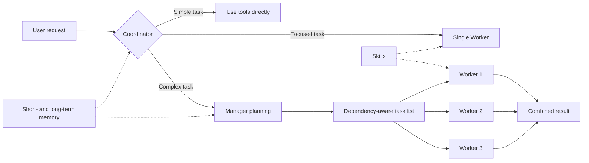

<h1 align="center">RedLotus</h1>

<p align="center">
  English · <a href="README.zh-CN.md">简体中文</a>
</p>

<p align="center">
  A terminal AI agent with task orchestration, long-term memory, and runtime skills.
</p>

<p align="center">
  <a href="https://pypi.org/project/RedLotus/"></a>
  
  
  <a href="https://ai.pydantic.dev/"></a>
</p>

RedLotus is an AI agent that runs in your terminal. It chooses how to handle each request based on its complexity: work directly, delegate a focused task to one Worker, or ask a Manager to break down and coordinate a larger job. It supports OpenAI-compatible model APIs and includes memory, runtime Skills, file extraction, browser automation, and chat bot integrations.

```bash
python -m pip install --upgrade redlotus
redlotus
```

## Features

| Feature | Description |
|---------|-------------|
| Multi-agent orchestration | The Coordinator selects the execution path. For complex work, the Manager creates dependent tasks and Workers execute them in dependency-aware batches. |
| Goal mode | RedLotus keeps iterating toward a defined goal until it finishes. Additional user input can be incorporated while the goal is running. |
| Three memory layers | Incremental session records, LLM perception over 20 new user turns, project-scoped episodes and global long-term RAG. MEMORY.md contains the core profile and reusable experience. |
| Runtime Skills | `SKILL.md` files provide instructions, references, and scripts on demand. Skill directories are rescanned at the start of each user turn, so newly installed skills do not require a restart. |
| File and media handling | RedLotus can read images and extract content from PDF, Word, Excel, HTML, Markdown, CSV, JSON, and text files. PDF extraction preserves page text, tables, links, and embedded images. |
| Review workflow and safeguards | The full-screen TUI includes hunk-by-hunk diff review. Runtime safeguards include path sandboxing, dangerous-command blocking, and child-process cleanup. |

Optional capabilities include browser automation, image generation, QQ integration through NapCat / OneBot, and a WeChat bot.

## How it works



- The Coordinator handles straightforward requests directly with tools.
- A single independent task can be delegated to a temporary Worker.
- Complex requests go to the Manager. Task definitions are checked for duplicate IDs, unknown dependencies, and dependency cycles before execution.
- Planning and execution roles can use different models to balance capability, latency, and cost.

## Installation

RedLotus requires Python 3.12 or later and supports Windows, Linux, and macOS.

### Install or upgrade from PyPI

```bash
python -m pip install --upgrade redlotus
redlotus
```

To install the command in an isolated environment, use `uv`:

```bash
uv tool install redlotus
```

Windows x64 builds are available on [GitHub Releases](https://github.com/Tian-ye1214/RedLotus/releases). Extract the onedir ZIP before running `Agent.exe`, or run the onefile EXE. Both use the same user configuration and project session storage as the pip entry point. Existing configuration and memory are preserved on upgrade.

The panel compares each session's API usage with its title, exact Token count and a relative bar. Repeated API context remains in API usage; separately displayed new input is counted only once.

### Optional dependencies

```bash
pip install "redlotus[browser]"  # Browser automation
pip install "redlotus[bots]"     # QQ and WeChat bots
pip install "redlotus[viz]"      # Plotting and image tools
pip install "redlotus[all]"      # All optional dependencies
```

Install Chromium before using browser automation:

```bash
python -m playwright install chromium
```

## Initial configuration

After pip installation, run `redlotus`. Global configuration lives at `~/.redlotus/config.json`. Optional developer overrides use this field-by-field order: local `src/redlotus/config.json`, local `.env`, then global JSON. The source launcher searches from the checkout root, pip from the current directory, and PyInstaller from the executable's directory. `/config` shows the sources and write target. No parent-directory search or AppData configuration is used.

Nested `.env` fields use JSON names separated by `__`, such as `models__worker__max_tokens=393216`. Numbers, booleans, arrays and objects use JSON values. Host environment variables never override business settings. Missing required fields produce an error; no bundled configuration is silently copied or merged. Configuration editing writes only the changes to an existing local JSON, otherwise to the global JSON. Credentials are never included in packages.

For isolated tests, `REDLOTUS_CONFIG_FILE`, `REDLOTUS_DOTENV_FILE`, and `REDLOTUS_CONFIG_DIR` explicitly select the three sources. `REDLOTUS_DATA_DIR` isolates global state. Each opened project stores sessions, perception progress, logs, and its user-maintained `AGENT.md` in `.redlotus`; artifacts, dependencies, caches, and immutable reference snapshots belong in `WorkDatabase`. Configuration and all LanceDB memory databases remain in `~/.redlotus`, with project-scoped access. The legacy `%LOCALAPPDATA%/RedLotus` directory is not read, migrated, or recreated.

For a new installation, provide a complete configuration at `~/.redlotus/config.json`; the maintained [source configuration](src/redlotus/config.json) shows the available fields. Set its storage paths for your machine. The following connection fields are only a fragment, not a complete configuration:

```json
{
  "BASE_URL": "https://your-api.example.com/v1",
  "API_KEY": "your-api-key"
}
```

Gateways support Pydantic AI's OpenAI Chat, OpenAI Responses, Anthropic Messages and Google adapters. Manager, Worker, Coordinator and Compressor models can be configured independently or select named presets. Memory perception uses the role selected by `memory_perception.model_role` (Worker by default), independently of context compression. Vector retrieval and reranking use `SILICONFLOW_BASE`, `SILICONFLOW_KEY`, `RAG_models` and `rag_service`.

Named credential references such as `api_key_env` resolve fields in the same three-layer configuration, including the local `.env`; they do not read the host environment or a global `.env`. Direct keys and references follow the same source priority. Do not commit credentials. See [configuration and model routing](docs/design.md).

## Terminal usage

Use `Shift+Tab` to cycle through the three TUI run modes:

| Mode | Behavior |
|------|----------|
| Review | File writes are collected for hunk-by-hunk approval or rejection. |
| Pass-through | File changes are written directly without entering the review queue. |
| Goal | RedLotus continues working toward a goal until it finishes or the user stops it. |

Common shortcuts:

| Shortcut | Action |
|----------|--------|
| `Enter` | Submit normally; pending outer turns appear as dimmed queued messages |
| `Ctrl+Enter` | Add to the active inner loop at the next model request; start a normal turn when idle |
| `Shift+Tab` | Switch run mode |
| `Ctrl+R` | Open the pending-change review |
| `Ctrl+C` | Stop the current turn |
| `Ctrl+Q` | Exit |
| `@path` | Reference documents and images, with Tab completion; up to 20 files. Video validation is deferred. |

Urgent messages keep normal brightness and an explicit label. The terminal uses Ctrl+Enter for urgent input. If a terminal sends the same code for Ctrl+Enter and Enter, Python cannot distinguish them; the terminal must preserve the modifier. Shift+Tab can still work because it has a separate code. Keyboard diagnostics are for testing only; see [keyboard behavior and verification](docs/design.md#请求执行).

References can be adjacent or separated by punctuation, for example `@review.md,@image.png`. Tab completes the current reference and automatically quotes paths containing spaces or delimiters; `@"path"`, `@'path'`, and `@{path}` also work. Files are deduplicated in first-appearance order. More than 20 distinct files produces an error instead of a partial upload.

<details>
<summary>Common slash commands</summary>

| Command | Description |
|---------|-------------|
| `/help` | Show help |
| `/clear` | Clear context and start a new conversation |
| `/pwd` · `/cd <path>` | Show or change the working directory |
| `/load` | Open the current project's session picker; also available through the TUI session/load button |
| `/config` · `/context` · `/panel` | Show configuration, context usage, or the runtime overview |
| `/skills` | List loaded Skills |
| `/LTM show` · `/STM show` | Show long- or short-term memory |
| `/agent` · `/effort` | Inspect or change role models and reasoning settings |
| `/api` · `/api embedding` | Configure the main model or retrieval API |
| `/compress` | Compress Manager and Coordinator context |
| `/status` · `/trace` · `/tasks` | Inspect lifecycle, invocation traces, and task status |
| `/stop` · `/cancel` | Stop the current turn or cancel an invocation |

</details>

## Skills

Each Skill is organized around a `SKILL.md` entry point. RedLotus initially loads only the skill name and summary, then reads full instructions, references, and scripts when needed. This keeps unrelated material out of the active context.

The repository currently includes skills for:

- Cryptocurrency backtesting and TA-Lib technical analysis
- Browser automation and web scraping
- FLUX image generation and prompting guidance
- Agentic coding and CI/CD workflows
- Skill creation, management, and pre-installation review

Compatible skills can also be installed while RedLotus is running:

```bash
npx clawhub --dir skills install <slug>
```

New skills are discovered automatically on subsequent user turns.

## Files and data

- Session traces and perception jobs stay in the project's `.redlotus`; immutable reference snapshots stay in its `WorkDatabase`. Compression changes the model view while retaining the original trace.
- Project episodes and global records use the configured LanceDB directory under the user's `.redlotus`, with scope/project isolation, vector recall, reranking, and text fallback. Sessions and logs remain in each project's `.redlotus`; references, artifacts, dependencies, and caches stay in its `WorkDatabase`.
- `MEMORY.md` contains the core profile, environment, constraints and general experience without a fixed character cap. Its complete contents and the system prompt are snapshotted for the session; memory writes do not rewrite that prefix. New confirmed information is consumed through tool results and retrieval, and a new session loads a fresh snapshot.
- File and command tools use the current project. Generated artifacts go to `WorkDatabase/`. `/cd` cancels the old session before switching context.

Enter queues a separate FIFO turn. Ctrl+Enter adds an urgent supplement to the active turn, together with the completed tool batch at the next request boundary. Child Agents use dedicated threads, event loops, and clients within the configured session limit. Perception processes each set of 20 new user turns in the current session, with three earlier turns for continuity. Opening, loading, or exiting a session does not create a short perception window. Explicit remember requests are handled immediately; failed production remains pending.

Model parameters, retrieval settings and runtime limits are declared in JSON and read as independent copies. See [architecture and migration](docs/design.md) for window-based production and the retained RAG parameters.

## QQ and WeChat bots

Install the bot dependencies:

```bash
pip install "redlotus[bots] @ git+https://github.com/Tian-ye1214/RedLotus.git"
```

Start either integration:

```bash
python -m redlotus.api.QQ
python -m redlotus.api.WeChat
```

QQ integration requires [NapCat](https://github.com/NapNeko/NapCatQQ) with a configured OneBot WebSocket endpoint, bot QQ number, and WebUI token. The WeChat integration prompts for QR-code login at startup.

Personal bot access must be bound in `bot.owner_channels.qq` (private QQ IDs) or `bot.owner_channels.wechat` (wxids). Unbound channels have text-only conversations and no access to personal memory or execution tools. Bots accept `/stop`, `/clear`, and `/urgent`; real account and attachment-order acceptance is still pending. See the [binding example](docs/design.md#agent-与工具边界).

## Development

```bash
git clone https://github.com/Tian-ye1214/RedLotus.git
cd RedLotus

pip install -e ".[dev]"
python main.py
pytest -q
```

Build the Python package:

```bash
uv build
```

Build a PyInstaller application directory:

```bash
pip install ".[build]"
pyinstaller build.spec
```

The main package lives in `src/redlotus/`, organized into `core`, `tools`, `api`, `prompts`, `memory`, and `runtime`. The `redlotus` command maps to `redlotus.api.base:main`.

The current restructuring and release acceptance are incomplete. Tests must include real API calls through source, installed pip, and packaged entries; isolated fault checks alone are insufficient. See the [development and acceptance rules](docs/development.md).
