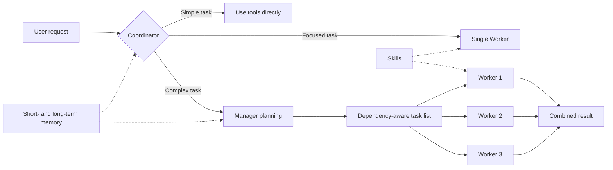

<p align="center">
  
</p>

<h1 align="center">RedLotus</h1>

<p align="center">
  English · <a href="README.zh-CN.md">简体中文</a>
</p>

<p align="center">
  A terminal AI agent with task orchestration, long-term memory, and runtime skills.
</p>

<p align="center">
  
  
  
  <a href="https://ai.pydantic.dev/"></a>
</p>

RedLotus is an AI agent that runs in your terminal. It chooses how to handle each request based on its complexity: work directly, delegate a focused task to one Worker, or ask a Manager to break down and coordinate a larger job. It supports OpenAI-compatible model APIs and includes memory, runtime Skills, file extraction, browser automation, and chat bot integrations.

```bash
pip install "redlotus @ git+https://github.com/Tian-ye1214/RedLotus.git"
redlotus
```

<p align="center">
  
</p>

## Features

| Feature | Description |
|---------|-------------|
| Multi-agent orchestration | The Coordinator selects the execution path. For complex work, the Manager creates dependent tasks and Workers execute them in dependency-aware batches. |
| Goal mode | RedLotus keeps iterating toward a defined goal until it finishes. Additional user input can be incorporated while the goal is running. |
| Three memory layers | Append-only traces, LLM perception over 25-turn windows, project-scoped episodes and global long-term RAG. MEMORY.md contains the core profile and reusable experience. |
| Runtime Skills | `SKILL.md` files provide instructions, references, and scripts on demand. Skill directories are rescanned at the start of each user turn, so newly installed skills do not require a restart. |
| File and media handling | RedLotus can read images and extract content from PDF, Word, Excel, HTML, Markdown, CSV, JSON, and text files. PDF extraction preserves page text, tables, links, and embedded images. |
| Review workflow and safeguards | The full-screen TUI includes hunk-by-hunk diff review. Runtime safeguards include path sandboxing, dangerous-command blocking, and child-process cleanup. |

Optional capabilities include browser automation, image generation, QQ integration through NapCat / OneBot, and a WeChat bot.

## How it works



- The Coordinator handles straightforward requests directly with tools.
- A single independent task can be delegated to a temporary Worker.
- Complex requests go to the Manager. Task definitions are checked for duplicate IDs, unknown dependencies, and dependency cycles before execution.
- Planning and execution roles can use different models to balance capability, latency, and cost.

## Installation

RedLotus requires Python 3.12 or later and supports Windows, Linux, and macOS.

### Install from GitHub

```bash
pip install "redlotus @ git+https://github.com/Tian-ye1214/RedLotus.git"
redlotus
```

To install the command in an isolated environment, use `uv`:

```bash
uv tool install git+https://github.com/Tian-ye1214/RedLotus.git
```

After a PyPI release is available, `pip install redlotus` and `uv tool install redlotus` can be used instead.

### Optional dependencies

```bash
pip install "redlotus[browser] @ git+https://github.com/Tian-ye1214/RedLotus.git"  # Browser automation
pip install "redlotus[bots] @ git+https://github.com/Tian-ye1214/RedLotus.git"     # QQ and WeChat bots
pip install "redlotus[viz] @ git+https://github.com/Tian-ye1214/RedLotus.git"      # Plotting and image tools
pip install "redlotus[all] @ git+https://github.com/Tian-ye1214/RedLotus.git"      # All optional dependencies
```

Install Chromium before using browser automation:

```bash
playwright install chromium
```

## Initial configuration

The development launcher `python main.py` explicitly selects `src/redlotus/config.json`. The installed `redlotus` command and frozen executables use the current OS user's global configuration, independent of the working directory. On Windows this is `%LOCALAPPDATA%/RedLotus/config.json`; `/config` shows the actual source.

Set `REDLOTUS_CONFIG_FILE` to select another file, or `REDLOTUS_CONFIG_DIR` to select a directory containing `config.json`. A missing explicitly selected file is initialized from the bundled defaults. Logs, persistent memory and immutable references remain in the user data directory, configurable through `REDLOTUS_DATA_DIR`.

At minimum, configure the model API endpoint and key:

```json
{
  "BASE_URL": "https://your-api.example.com/v1",
  "API_KEY": "your-api-key"
}
```

Gateways support Pydantic AI's OpenAI Chat, OpenAI Responses, Anthropic Messages and Google adapters. Manager, Worker, Coordinator and Compressor models can be configured independently or select named presets. Memory perception uses the role selected by `memory_perception.model_role` (Worker by default), independently of context compression. Vector retrieval and reranking use `SILICONFLOW_BASE`, `SILICONFLOW_KEY`, `RAG_models` and `rag_service`.

Credentials may be supplied by named environment references or the global configuration directory's `.env`. Only the development launcher explicitly selects the repository's `.env`; installed entry points do not search the working directory. Do not commit credentials. See [configuration and gateway examples](docs/gateway-installation.md).

## Terminal usage

Use `Shift+Tab` to cycle through the three TUI run modes:

| Mode | Behavior |
|------|----------|
| Review | File writes are collected for hunk-by-hunk approval or rejection. |
| Pass-through | File changes are written directly without entering the review queue. |
| Goal | RedLotus continues working toward a goal until it finishes or the user stops it. |

Common shortcuts:

| Shortcut | Action |
|----------|--------|
| `Enter` | Submit normally; pending outer turns appear as dimmed queued messages |
| `Ctrl+Enter` | Add to the active inner loop at the next model request; start a normal turn when idle |
| `Shift+Tab` | Switch run mode |
| `Ctrl+R` | Open the pending-change review |
| `Ctrl+C` | Stop the current turn |
| `Ctrl+Q` | Exit |
| `@path` | Reference documents and images, with Tab completion; up to 20 files. Video validation is deferred. |

Urgent messages keep normal brightness and an explicit label. The `/urgent` text command has been removed. Both LF and extended Ctrl+Enter encodings are accepted. Terminals that encode Ctrl+Enter exactly like Enter need a terminal-side mapping; see [keyboard behavior and verification](docs/keyboard-input.md).

References can be adjacent or separated by punctuation, for example `@review.md,@image.png`. Tab completes the current reference and automatically quotes paths containing spaces or delimiters; `@"path"`, `@'path'`, and `@{path}` also work. Files are deduplicated in first-appearance order. More than 20 distinct files produces an error instead of a partial upload.

<details>
<summary>Common slash commands</summary>

| Command | Description |
|---------|-------------|
| `/help` | Show help |
| `/clear` | Clear context and start a new conversation |
| `/pwd` · `/cd <path>` | Show or change the working directory |
| `/load` | Load a saved conversation for the current workspace |
| `/config` · `/context` · `/panel` | Show configuration, context usage, or the runtime overview |
| `/skills` | List loaded Skills |
| `/LTM show` · `/STM show` | Show long- or short-term memory |
| `/agent` · `/effort` | Inspect or change role models and reasoning settings |
| `/api` · `/api embedding` | Configure the main model or retrieval API |
| `/compress` | Compress Manager and Coordinator context |
| `/status` · `/trace` · `/tasks` | Inspect lifecycle, invocation traces, and task status |
| `/stop` · `/cancel` | Stop the current turn or cancel an invocation |
| `/urgent <text>` | Add a genuine user update to the active tool/model loop; ordinary messages remain FIFO |

</details>

## Skills

Each Skill is organized around a `SKILL.md` entry point. RedLotus initially loads only the skill name and summary, then reads full instructions, references, and scripts when needed. This keeps unrelated material out of the active context.

The repository currently includes skills for:

- Cryptocurrency backtesting and TA-Lib technical analysis
- Browser automation and web scraping
- FLUX image generation and prompting guidance
- Agentic coding and CI/CD workflows
- Skill creation, management, and pre-installation review

Compatible skills can also be installed while RedLotus is running:

```bash
npx clawhub --dir skills install <slug>
```

New skills are discovered automatically on subsequent user turns.

## Files and data

- Session traces, reference snapshots and perception jobs are stored under the global user data directory, with project-specific data partitioned by project ID. Compression changes the model view while retaining the original trace.
- Project episodes and global records are stored in LanceDB `memory_records_v3`, isolated by scope and project, with vector search, reranking and text fallback.
- `MEMORY.md` contains the core profile, environment, constraints and general experience without a fixed character cap. Its complete contents and the system prompt are snapshotted for the session; memory writes do not rewrite that prefix. New confirmed information is consumed through tool results and retrieval, and a new session loads a fresh snapshot.
- File and command tools use the current project. Generated artifacts go to `WorkDatabase/`. `/cd` cancels the old session before switching context.

Ordinary input is consumed as separate FIFO turns. `/urgent` joins the active inner loop together with the completed tool batch. Child Agents use dedicated threads, event loops, and clients, with three active children by default. Finished turns append observations. LLM perception processes 25 turns with a 5-turn overlap, plus short windows at session end. Explicit remember requests are handled immediately; failed production remains pending.

Model parameters, retrieval settings and runtime limits are declared in JSON and read as independent copies. See [architecture and migration](docs/refactor.md) for window-based production and the retained RAG parameters.

## QQ and WeChat bots

Install the bot dependencies:

```bash
pip install "redlotus[bots] @ git+https://github.com/Tian-ye1214/RedLotus.git"
```

Start either integration:

```bash
python -m redlotus.API.QQ
python -m redlotus.API.WeChat
```

QQ integration requires [NapCat](https://github.com/NapNeko/NapCatQQ) with a configured OneBot WebSocket endpoint, bot QQ number, and WebUI token. The WeChat integration prompts for QR-code login at startup.

Personal bot access must be bound in `bot.owner_channels.qq` (private QQ IDs) or `bot.owner_channels.wechat` (wxids). Unbound channels have text-only conversations and no access to personal memory or execution tools. `/stop`, `/clear`, and `/urgent` use the same turn semantics as the terminal. See the [binding example](docs/refactor.md#工作区渠道与迁移).

## Development

```bash
git clone https://github.com/Tian-ye1214/RedLotus.git
cd RedLotus

pip install -e ".[dev]"
python main.py
pytest -q
```

Build the Python package:

```bash
uv build
```

Build a PyInstaller application directory:

```bash
pip install ".[build]"
pyinstaller build.spec
```

The main package lives in `src/redlotus/`, organized into `core`, `tools`, `api`, `prompts`, and `memory`. The `redlotus` command maps to `redlotus.core.config:main`.
