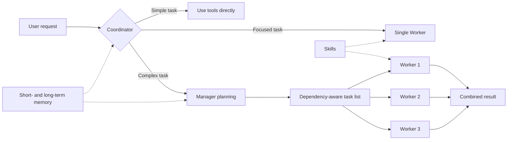

<h1 align="center">RedLotus</h1>

<p align="center">
  English · <a href="README.zh-CN.md">简体中文</a>
</p>

<p align="center">
  A terminal AI agent with task orchestration, long-term memory, and runtime skills.
</p>

<p align="center">
  <a href="https://pypi.org/project/RedLotus/"></a>
  
  
  <a href="https://ai.pydantic.dev/"></a>
</p>

RedLotus is an AI agent that runs in your terminal. It chooses how to handle each request based on its complexity: work directly, delegate a focused task to one Worker, or ask a Manager to break down and coordinate a larger job. It supports OpenAI-compatible model APIs and includes memory, runtime Skills, file extraction, browser automation, and chat bot integrations.

```bash
python -m pip install --upgrade redlotus
redlotus
```

## Features

See [GitHub Releases](https://github.com/Tian-ye1214/RedLotus/releases) for each version's artifacts, hashes, validation results, and untested scope. Simulated transport tests do not establish real QQ/WeChat account compatibility.

Before each model request, compression uses reported input tokens and the threshold `ceil(min(configured_ratio * context_capacity, context_capacity - max_output))`. A main, child, or memory request with a durable checkpoint that is rejected for context capacity is split at complete evidence and closed tool-call boundaries for concurrent compression, then retried once after the summaries are saved. Completed tools are not repeated. The capacity rejection is logged with unknown provider usage preserved. Original records and the system prompt remain intact.

| Feature | Description |
|---------|-------------|
| Multi-agent orchestration | The Coordinator selects the execution path. For complex work, the Manager creates dependent tasks and Workers execute them in dependency-aware batches. |
| Goal mode | RedLotus keeps iterating toward a defined goal until it finishes. Additional user input can be incorporated while the goal is running. |
| Three memory layers | Incremental session records, LLM perception over 20 new user turns, project-scoped episodes and global long-term RAG. MEMORY.md contains the core profile and reusable experience. |
| Runtime Skills | `SKILL.md` files provide instructions, references, and scripts on demand. Skill directories are rescanned at the start of each user turn, so newly installed skills do not require a restart. |
| File and media handling | RedLotus can read images and extract content from PDF, Word, Excel, HTML, Markdown, CSV, JSON, and text files. PDF extraction preserves page text, tables, links, and embedded images. |
| Review workflow and safeguards | The full-screen TUI includes hunk-by-hunk diff review. Runtime safeguards include path sandboxing, dangerous-command blocking, and child-process cleanup. |

Optional capabilities include browser automation, image generation, QQ integration through NapCat / OneBot, and a WeChat bot.

## How it works


```mermaid
flowchart LR
    U["User request"] --> C{"Coordinator"}
    C -->|Simple task| T["Use tools directly"]
    C -->|Focused task| W0["Single Worker"]
    C -->|Complex task| M["Manager planning"]
    M --> D["Dependency-aware task list"]
    D --> W1["Worker 1"]
    D --> W2["Worker 2"]
    D --> W3["Worker 3"]
    W1 --> R["Combined result"]
    W2 --> R
    W3 --> R
    MEM["Short- and long-term memory"] -.-> C
    MEM -.-> M
    SK["Skills"] -.-> W0
    SK -.-> W1
```

- The Coordinator handles straightforward requests directly with tools.
- A single independent task can be delegated to a temporary Worker.
- Complex requests go to the Manager. Task definitions are checked for duplicate IDs, unknown dependencies, and dependency cycles before execution.
- Planning and execution roles can use different models to balance capability, latency, and cost.

## Installation

RedLotus requires Python 3.12 or later and supports Windows, Linux, and macOS.

### Install or upgrade from PyPI

```bash
python -m pip install --upgrade redlotus
redlotus
```

To install the command in an isolated environment, use `uv`:

```bash
uv tool install redlotus
```

Windows x64 builds are available on [GitHub Releases](https://github.com/Tian-ye1214/RedLotus/releases). Extract the onedir ZIP before running `Agent.exe`, or run the onefile EXE. Both use the same user configuration and project session storage as the pip entry point. Existing configuration and memory are preserved on upgrade.

The panel compares each session's API usage with its title, exact Token count and a relative bar. Repeated API context remains in API usage; separately displayed new input is counted only once.

### Optional dependencies

```bash
pip install "redlotus[browser]"  # Browser automation
pip install "redlotus[bots]"     # QQ and WeChat bots
pip install "redlotus[viz]"      # Plotting and image tools
pip install "redlotus[speech]"   # Local CPU speech recognition and synthesis
pip install "redlotus[pets]"     # Optional desktop pixel pet
pip install "redlotus[all]"      # All optional dependencies
```

With `speech` installed, startup prepares X-ASR and the selected TTS model independently in the background. The managed TTS default is Mambo on Windows x64; set `speech.tts_backend` to `sherpa-onnx` to select Kokoro. Leave `speech.tts_package` unset or `null` to use managed downloads into `~/.redlotus/model`. A nonempty package path takes precedence and selects that read-only external package. Old active Kokoro state cannot override a Mambo selection, and update or rollback stays within the selected model family. Validation, runtime loading and bilingual warmup run on workers; text interaction stays available. Windows x64 wheels and executables ship the inference component and notices, without weights or training dependencies. Unsupported platforms report the unavailable backend before downloading instead of changing the voice. Once ASR is ready, hold the TUI recording button to create an editable draft, then submit it yourself. Voice replies start disabled; use the session switch or `/voice on|off`. `/voice test` plays one fixed bilingual sample through the production TTS and speaker path without calling an LLM or changing the switch. Use `/voice status`, `/voice prepare`, `/voice update`, `/voice rollback asr|tts`, and `/voice clean` for managed resources. External packages require a supported `model.json` with resource sizes and SHA256 values, stay read-only, and are switched by changing the path and restarting. See the [speech design](docs/design.md#本地语音输入与输出).

Voice replies read Markdown prose: headings, emphasis, lists and links retain their text, code blocks and URLs are skipped, and inline code retains its content. Displayed Markdown stays unchanged; enabling speech does not replay older content. The common `TTSModel` interface selects a supported implementation without model-brand branches in the UI or channels. Mambo uses four pre-exported ONNX graphs, matching passive frontend data and dedicated speaker features. Its bundled Windows x64 native worker reuses the ONNX Runtime in sherpa-onnx; normal startup needs no producer directory, exporter, compiler or PyTorch. Performance and complete distribution acceptance are separate release gates; the current source changes must not be treated as an already accepted application release. See [Local TTS model packages](docs/tts-model-package.md). Dedicated voice resources may persist; everyday recordings, generated PCM and pending playback text stay in memory.

Mambo delivers bounded audio chunks before the segment finishes, with stateful resampling to 24 kHz. Turning speech off stops playback immediately; the current native reply is drained before the model is reused. Public thread defaults are 2 for ASR and 8 for TTS. Override them with `speech.asr_threads` and `speech.tts_threads`; explicit settings are preserved and private configuration is never rewritten.

The TUI microphone menu starts in **Follow system default** mode and shows the actual input device in use. The selector uses at most 44 terminal columns and shrinks in narrow windows, with **Refresh** and the voice reply switch beside it. You can choose another microphone for this program run and refresh after connecting or unplugging a device. The choice stays in effect across sessions, resets to the system default when the program restarts, and never changes system sound settings or private configuration. If a selected device disappears or cannot be identified uniquely after refresh, choose a microphone again; recording will not silently switch to another one. Playback uses the operating system's default output device. Recording is unavailable while the device changes or a recording finishes.

As soon as capture begins, the TUI shows “录音中，请说话…” without waiting for the first recognized word. Microphone PCM goes directly to ASR, with no transcription WAV, original-audio evidence, or audio reference. A nonempty transcription remains editable; only the edited draft is submitted. If nothing is recognized, the TUI shows “未识别到语音，请重试。” and leaves the draft unchanged, without attaching audio or starting an Agent turn. Model preparation, device and recognition failures show a short message. When project logging is enabled, the full cause goes into `speech.log`, including startup failures before the first conversation; one model's failure does not wait for the other model to finish. QQ and WeChat voice input is recognized in memory; its audio bytes are removed from the prepared message after transcription, while other attachments follow the normal reference process. Replies are encoded and sent from memory.

With `pets` installed, `/pets` toggles one desktop pet; `/pets on charcoal` and `/pets on ivory` select the two characters, and `/pets off` or `/pets status` stop it or report its state and scale. The pet starts disabled and runs in a separate Qt process. Hover, click and drag trigger its five built-in actions; right-click offers an exit menu. Drag the corner handle to resize from 50 to 300 physical pixels (100 by default); the size lasts until RedLotus exits. A speech bubble streams the current Coordinator reply, including `/goal`, independently of voice output. Scroll to read earlier text or close the bubble; completed replies collapse after 15 seconds, paused while hovered. You can also run `python -m redlotus.pets.desktop` independently, without model configuration. See the [desktop-pet design](docs/design.md#桌面像素宠物) for resource and lifecycle details.

Custom characters are two-file resource packs: place `pet.json` and `sprites.png` in `~/.redlotus/pets/<id>/`, discover them with `/pets list`, and select them with `/pets on <id>`. Use `/pets reload` after editing. User packs override bundled characters with the same ID; failed validation keeps the running pet. Reload preserves scale and resets animation and the bubble. Source, pip and EXE installations share the user directory. See the [pack authoring guide](docs/pet-resource-packs.md).

Install Chromium before using browser automation:

```bash
python -m playwright install chromium
```

## Initial configuration

Each parameter is resolved in this fixed order: project `src/redlotus/config.json` → project `.env` → global `~/.redlotus/config.json`. A value found at one layer stops that parameter's lookup; only unresolved parameters continue to the next layer. Nested objects follow the same rule field by field. The source launcher starts from the checkout root, pip from the current directory, and PyInstaller from the executable's directory, without searching parent directories. `/config` shows the sources and write target.

An empty value is judged by the parameter's semantics: valid `null`, `0`, `false`, and empty lists are preserved. Blank credentials can continue to the next source. A nonempty invalid value reports an error without silently falling back. `.env` keeps python-dotenv syntax and `__` for nested keys; it does not interpolate variables or import business settings from the host environment. See the [four precedence examples](docs/design.md#模型配置与上下文).

The API key, base URL, and selected roles' model configuration are enough to enter the interactive session. Startup asks only for missing values in that set, without an additional RAG or runtime questionnaire. Model commands and `/api embedding` remain available for editing their settings. Optional components read runtime settings when used; missing settings for unused capabilities do not block startup or cause an exit. A required value missing at its point of use reports its name, purpose, type, allowed choices and sources; parameters without an enum say so. There is no schema, hidden fallback value, or bundled configuration template.

Credentials are hidden during entry. After confirmation, editing reads the latest JSON under a native blocking file lock and atomically writes only the changes to an existing project JSON, otherwise to the global JSON; it does not require a configured lock timeout or write `.env`. Esc cancels without saving. An Esc received while consecutive prompts switch is passed to the next prompt, and credentials remain hidden. Entering `=role` reuses that role's model name while preserving the target role's connection and policy. `max_context_windows` is configured in the files, outside the interactive model guide; missing or valid null values after source lookup use OpenRouter metadata. The following is only a connection fragment, not a complete configuration:

```json
{
  "BASE_URL": "https://your-api.example.com/v1",
  "API_KEY": "your-api-key"
}
```

`REDLOTUS_CONFIG_FILE`, `REDLOTUS_DOTENV_FILE`, and `REDLOTUS_CONFIG_DIR` explicitly select the existing project JSON, dotenv file, and global configuration directory. They do not add another precedence layer. `REDLOTUS_DATA_DIR` isolates global state. Each project stores sessions, logs, perception progress and `AGENT.md` in `.redlotus`; artifacts, dependencies, caches and immutable reference snapshots belong in `WorkDatabase`. Memory databases remain under the user's `.redlotus`, with project-scoped access. Packages contain no private configuration, credentials or schema.

Gateways use Pydantic AI's OpenAI Chat, OpenAI Responses, Anthropic Messages and Google adapters. Manager, Worker, Coordinator and Compressor models can be configured independently or select named presets. Perception uses `memory_perception.model_role`; retrieval and reranking use `SILICONFLOW_BASE`, `SILICONFLOW_KEY`, `RAG_models` and `rag_service`. Named credential references such as `api_key_env` resolve fields in the same three-file order; host environment variables do not override them. Do not commit credentials. See [configuration and model routing](docs/design.md#模型配置与上下文).

Memory, RAG, and reference paths are read when used. Bundled Skills remain available without a configured Skills overlay. The CLI reads optional exit grace only when exiting; if it is absent, no application deadline is imposed. Process cleanup also allows an unspecified deadline.

`storage.runtime_dir` holds command caches, temporary files, Office conversion intermediates, and installed Skills. Merge this field into existing JSON, or set `storage__runtime_dir=WorkDatabase/runtime` in the project `.env`, using the precedence above:

```json
{"storage": {"runtime_dir": "WorkDatabase/runtime"}}
```

Relative paths start from the current workspace; absolute paths must also remain inside it. Ordinary conversations, project file tools, and bundled Skills work without this field. Command execution, Skill installation, and Office conversion report the missing configuration when needed. Installed `runtime/skills` content is persistent and excluded from cache cleanup. No hidden path or automatic private configuration edit is added.

## Terminal usage

Use `Shift+Tab` to cycle through the three TUI run modes:

| Mode | Behavior |
|------|----------|
| Review | File writes are collected for hunk-by-hunk approval or rejection. |
| Pass-through | File changes are written directly without entering the review queue. |
| Goal | RedLotus continues working toward a goal until it finishes or the user stops it. |

Common shortcuts:

| Shortcut | Action |
|----------|--------|
| `Enter` | Submit normally; pending outer turns appear as dimmed queued messages |
| `Ctrl+Enter` · `↑` | Add to the active turn at the next model request; start a normal turn when idle |
| `■` · `▶` | Pause the active turn or explicitly resume it; disabled when idle or handling a control action |
| `Shift+Tab` | Switch run mode |
| `Ctrl+R` | Open the pending-change review |
| `Ctrl+C` | Stop the current turn |
| `Ctrl+Q` | Exit |
| `@path` | Reference documents and images, with Tab completion; subject to the configured file limit. Video validation is deferred. |

Supplements appear as ordinary user messages, without an urgency label. Ctrl+Enter also accepts terminal `ctrl+j`/LF and modified CR events; ordinary Enter still submits normally, and pasted newlines do not submit. An application can distinguish the keys only when the terminal sends distinct events. Physical Ctrl+Enter verification in PyCharm remains open; IDE and terminal settings have not been changed. Keyboard diagnostics remain for testing only; physical keys and injected events are recorded separately in [keyboard behavior](docs/design.md#请求执行).

The prominent `↑` remains the urgent-submit button. The adjacent button uses the same slot for `■` while running and `▶` while paused, preserving the input draft and focus. Pause stops queue execution and cancels current model, child-agent, tool and question work while retaining the goal, mode, history, results, supplements and references. Inputs submitted while paused stay queued. Reloading a paused session still waits for `▶`; resume continues from retained history without resending the whole task or automatically replaying completed tools.

A transport-interrupted response keeps the text, thinking and usage already received and waits for the same `▶` control. Full error details remain in the log; the application does not automatically retry. The thinking box opens once on the first thinking delta of each turn, and later deltas or responses respect manual collapse.

In the simple terminal, two consecutive Ctrl+C presses on empty input exit; normal input resets the count, with no timing window. The TUI keeps its existing stop-or-exit behavior. Status and usage panels update from existing events without a periodic refresh setting.

References can be adjacent or separated by punctuation, for example `@review.md,@image.png`. Tab completes the current reference and automatically quotes paths containing spaces or delimiters; `@"path"`, `@'path'`, and `@{path}` also work. Files are deduplicated in first-appearance order. Exceeding the configured file limit produces an error instead of a partial upload.

<details>
<summary>Common slash commands</summary>

| Command | Description |
|---------|-------------|
| `/help` | Show help |
| `/clear` | Clear context and start a new conversation |
| `/pwd` · `/cd <path>` | Show or change the working directory |
| `/load` | Open the current project's session picker; the TUI session/load button is in the bottom bar after Review |
| `/config` · `/context` · `/panel` | Show configuration, context usage, or the runtime overview |
| `/skills` | List loaded Skills |
| `/LTM show` · `/STM show` | Show long- or short-term memory |
| `/agent` · `/effort` | Inspect or change role models and reasoning settings |
| `/api` · `/api embedding` | Configure the main model or retrieval API |
| `/compress` | Compress Manager and Coordinator context |
| `/status` · `/trace` · `/tasks` | Inspect lifecycle, invocation traces, and task status |
| `/stop` · `/cancel` | Stop the current turn or cancel an invocation |
| `/pets` · `/pets on [charcoal\|ivory]` · `/pets off` · `/pets status` | Toggle, select, stop or inspect the desktop pet |

</details>

`/trace` and `/status` keep complete trace and invocation history without fixed count eviction or shortened IDs. Session lists, diff context, streamed text, completions, tool arguments, usage paths and error details are not clipped. `/panel --all` remains accepted and displays the same complete list as `/panel`. Failed tasks retain their state and evidence until explicitly resumed.

## Skills

Each Skill is organized around a `SKILL.md` entry point. RedLotus initially loads only the skill name and summary, then reads full instructions, references, and scripts when needed. This keeps unrelated material out of the active context.

The repository currently includes skills for:

- Cryptocurrency backtesting and TA-Lib technical analysis
- Browser automation and web scraping
- FLUX image generation and prompting guidance
- Agentic coding and CI/CD workflows
- Skill creation, management, and pre-installation review

Compatible skills can also be installed while RedLotus is running:

```bash
npx clawhub --dir skills install <slug>
```

New skills are discovered automatically on subsequent user turns.

## Files and data

- Session traces and perception jobs stay in the project's `.redlotus`; immutable reference snapshots stay in its `WorkDatabase`. Compression changes the model view while retaining the original trace.
- Project episodes and global records use the configured LanceDB directory under the user's `.redlotus`, with scope/project isolation, vector recall, reranking, and text fallback. Sessions and logs remain in each project's `.redlotus`; references, artifacts, dependencies, and caches stay in its `WorkDatabase`.
- Local LanceDB transactions require a filesystem with hard-link support; use NTFS on Windows. exFAT cannot commit LanceDB records ([upstream limitation](https://github.com/lancedb/lancedb/issues/1231#issuecomment-2069322193)).
- `MEMORY.md` contains the core profile, environment, constraints and general experience without a fixed character cap. Its complete contents and the system prompt are snapshotted for the session; memory writes do not rewrite that prefix. New confirmed information is consumed through tool results and retrieval, and a new session loads a fresh snapshot.
- File and command tools use the current project. Generated artifacts go to `WorkDatabase/`. `/cd` cancels the old session before switching context.
- Log cleanup runs once per session before input is enabled. It checks only `*.log` files directly in the log directory and deletes files whose modification age strictly exceeds `storage.cleanup.log_retention_days`. A missing or nonpositive value skips cleanup; there is no 14-day fallback. Logs do not rotate by size, and existing `.log.1` files are neither renamed nor deleted; new ones are not created. Ordinary logging and background timers do not trigger cleanup.

Enter queues a separate FIFO turn. Ctrl+Enter adds an urgent supplement to the active turn, together with the completed tool batch at the next request boundary; while paused, both stay queued until explicit resume. Child Agents use dedicated threads, event loops, and clients within the configured session limit. Perception processes each set of 20 new user turns in the current session, with three earlier turns for continuity. Opening, loading, or exiting a session does not create a short perception window. Explicit remember requests are handled immediately; failed production remains pending.

Model parameters, retrieval settings and retained runtime limits use the same three-file precedence and are read as independent copies. See [memory and retrieval design](docs/design.md#感知与记忆) for window-based production and the retained RAG parameters.

`completed_turns` counts one logical user request when the main assistant's complete final reply is persisted, including a complete explanation of an unsuccessful task. Queuing, pauses, interruptions, runtime exceptions, tool exchanges, child agents, supplements, question answers, and internal goal iterations add no separate count. Resume retains the original turn ID; saves and reply resends are idempotent. Legacy loading and discovery use the same historical correction, preserving audit identities and published memory. Missing evidence produces an incomplete-history label and a confirmed count, and is excluded from new perception windows.

## QQ and WeChat bots

Install the bot dependencies:

```bash
pip install "redlotus[bots] @ git+https://github.com/Tian-ye1214/RedLotus.git"
```

Start either integration:

```bash
python -m redlotus.api.QQ
python -m redlotus.api.WeChat
```

QQ integration requires [NapCat](https://github.com/NapNeko/NapCatQQ) with a configured OneBot WebSocket endpoint, bot QQ number, and WebUI token. The WeChat integration prompts for QR-code login at startup.

Bind private owner IDs in the `bot.owner_channels.qq` or `bot.owner_channels.wechat` lists. Bound private chats have the CLI's execution, delegation, and memory capabilities; other identities and group chats retain text-only permissions. QQ and WeChat keep independent conversations while sharing the CLI's `UserMessage`, `SessionController`, and `AgentSystem` execution flow.

Channels support text, images, files, attachment answers to current questions, final text, `/stop`, `/resume`, and `/clear`. Text retains newlines and indentation; attachments preserve names, actual MIME types, and available platform ordering. `ReferenceStore` supplies immutable snapshots, parsing, and limits. The whole message must prepare successfully before execution, with failed attachments identified. Attachment answers unblock the current question. Transport interruptions retain the original turn and queued attachment snapshots; `/resume` continues that turn. Reply delivery failure preserves the completed result without rerunning it. Terminal panels, configuration wizards, and hunk review remain outside the phone interface. Automated regressions use simulated platforms and models; live QQ/WeChat messaging remains unverified. See [channel permissions](docs/design.md#agent-与工具边界).

## Development

```bash
git clone https://github.com/Tian-ye1214/RedLotus.git
cd RedLotus

pip install -e ".[dev,bots]"
python main.py
pytest -q
```

Build the Python package:

```bash
uv build
```

Build a PyInstaller application directory:

```powershell
pip install ".[build]"
$env:PLAYWRIGHT_BROWSERS_PATH="0"
python -m playwright install chromium
pyinstaller build.spec
```


The main package lives in `src/redlotus/`, organized into ten modules: `runtime`, `sessions`, `core`, `tools`, `memory`, `prompts`, `ui`, `api`, `TTS`, and `pets`. The `redlotus` command maps to `redlotus.api.base:main`.

Regressions cover the current runtime-directory, phone-channel, and turn-counting/migration contracts without restoring deleted obsolete assertions. CI runs source tests and tests of an isolated wheel installation; `python scripts/verify_wheel.py dist` checks actual import origins. Zero collected tests fail. Real models, QQ/WeChat accounts, physical terminals, and long-running acceptance remain separate from simulated regression results. See the [project design](docs/design.md) and [development rules](docs/development.md).
