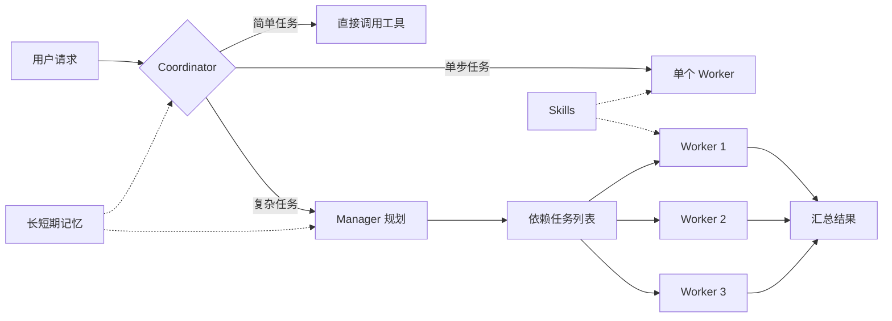

<p align="center">
  
</p>

<h1 align="center">RedLotus · 红莲极意</h1>

<p align="center">
  <a href="README.md">English</a> · 简体中文
</p>

<p align="center">
  面向终端的多 Agent 助手，支持任务编排、长期记忆与运行时技能扩展。<br>
  <sub>A terminal AI agent with orchestration, memory, and runtime skills.</sub>
</p>

<p align="center">
  
  
  
  <a href="https://ai.pydantic.dev/"></a>
</p>

RedLotus 是一个运行在终端中的 AI Agent。它会根据任务复杂度选择直接处理、委派单个 Worker，或由 Manager 拆解任务并协调多个 Worker 执行。项目兼容 OpenAI 风格的模型接口，并提供记忆、Skills、文件解析、浏览器操作和聊天机器人接入。

```bash
pip install "redlotus @ git+https://github.com/Tian-ye1214/RedLotus.git"
redlotus
```

<p align="center">
  
</p>

## 主要功能

| 功能 | 说明 |
|------|------|
| 多 Agent 编排 | Coordinator 判断处理路径；复杂任务由 Manager 构建带依赖的任务列表，Worker 按依赖分批执行并汇总结果。 |
| 目标模式 | 给定一个明确目标后持续迭代，直到任务完成；执行期间仍可接收用户补充信息。 |
| 三层记忆 | 会话原始轨迹、25 回合窗口的 LLM 情景感知、全局长期 RAG，以及每轮注入的用户画像与通用经验。 |
| 运行时 Skills | 通过 `SKILL.md` 按需加载指令、参考资料和脚本；技能目录会在用户回合开始时重新扫描，无需重启。 |
| 文件与多媒体处理 | 可读取图片，并提取 PDF、Word、Excel、HTML、Markdown、CSV、JSON 和文本文件中的内容。PDF 支持按页提取正文、表格、链接与内嵌图片。 |
| 终端审查与安全护栏 | 提供全屏 TUI、逐块 diff 审查、路径沙箱、危险命令拦截和子进程回收。 |

此外，RedLotus 提供浏览器自动化、图像生成，以及 QQ（NapCat / OneBot）和微信机器人接入。这些能力可按需安装。

## 工作方式



- 简单请求由 Coordinator 直接调用工具处理。
- 单个独立任务可以委派给一个临时 Worker。
- 复杂请求交给 Manager 拆解；任务会校验重复 ID、未知依赖和依赖环，并按依赖关系分批执行。
- 规划与执行角色可以分别配置模型，在能力、速度与成本之间做取舍。

## 安装

要求 Python 3.12 或更高版本，支持 Windows、Linux 和 macOS。

### 从 GitHub 安装

```bash
pip install "redlotus @ git+https://github.com/Tian-ye1214/RedLotus.git"
redlotus
```

如果希望将命令安装到独立环境，可以使用 `uv`：

```bash
uv tool install git+https://github.com/Tian-ye1214/RedLotus.git
```

项目发布到 PyPI 后，也可以使用 `pip install redlotus` 或 `uv tool install redlotus`。

### 可选能力

```bash
pip install "redlotus[browser] @ git+https://github.com/Tian-ye1214/RedLotus.git"  # 浏览器自动化
pip install "redlotus[bots] @ git+https://github.com/Tian-ye1214/RedLotus.git"     # QQ / 微信机器人
pip install "redlotus[viz] @ git+https://github.com/Tian-ye1214/RedLotus.git"      # 绘图与图像处理
pip install "redlotus[all] @ git+https://github.com/Tian-ye1214/RedLotus.git"      # 全部可选依赖
```

浏览器能力首次使用前还需要安装 Chromium：

```bash
playwright install chromium
```

## 首次配置

开发入口 `python main.py` 显式读取 `src/redlotus/config.json`。pip 安装的 `redlotus` 和 PyInstaller 程序读取当前操作系统用户的全局配置，不随启动目录变化；Windows 默认为 `%LOCALAPPDATA%\RedLotus\config.json`。`/config` 显示实际来源。

可用 `REDLOTUS_CONFIG_FILE` 指定另一份配置，或用 `REDLOTUS_CONFIG_DIR` 指定包含 `config.json` 的目录。显式指定的文件不存在时，会复制随包默认配置。日志、长期记忆和引用原件仍放在用户数据目录，可用 `REDLOTUS_DATA_DIR` 指定独立位置。

至少需要配置模型服务地址和密钥：

```json
{
  "BASE_URL": "https://your-api.example.com/v1",
  "API_KEY": "your-api-key"
}
```

网关复用 Pydantic AI 的 OpenAI Chat、OpenAI Responses、Anthropic Messages 和 Google 适配。Manager、Worker、Coordinator、Compressor 可以分别配置或选择命名预设。感知通过 `memory_perception.model_role` 选择子 Agent 配置，默认使用 Worker，与上下文压缩独立。RAG 连接、模型及请求策略由 `SILICONFLOW_BASE`、`SILICONFLOW_KEY`、`RAG_models` 和 `rag_service` 提供。

凭据可以使用命名环境引用或用户配置目录的 `.env`；只有开发入口显式选择仓库 `.env`，安装入口不搜索当前项目。不要将真实密钥提交到 Git。详细结构见 [全局配置、网关预设与安装说明](docs/gateway-installation.md)。

## 终端使用

全屏 TUI 提供三种运行模式，可使用 `Shift+Tab` 循环切换：

| 模式 | 行为 |
|------|------|
| 审查模式 | Agent 写入文件后进入待审查列表，可逐块决定保留或撤销。 |
| 放行模式 | 文件改动直接写入，不进入逐块审查。 |
| 目标模式 | 围绕一个目标持续执行，直到完成或被用户停止。 |

常用快捷键：

| 快捷键 | 作用 |
|--------|------|
| `Shift+Tab` | 切换运行模式 |
| `Ctrl+R` | 打开逐块改动审查 |
| `Ctrl+C` | 停止当前回合 |
| `Ctrl+Q` | 退出 |
| `@路径` | 引用文档、图片或视频，支持 Tab 补全；每次最多 20 个文件 |

引用之间不必加空格，例如 `@审稿意见.md解读这个文档，@图片.png分析这张图`。Tab 补全当前引用，遇到含空格或分隔符的路径会自动加引号，也可以手写 `@"路径"`、`@'路径'` 或 `@{路径}`。文件按首次出现顺序去重；超过 20 个不同文件会提示错误，不会只上传其中一部分。

<details>
<summary>常用斜杠命令</summary>

| 命令 | 说明 |
|------|------|
| `/help` | 显示帮助 |
| `/clear` | 清空上下文并开启新对话 |
| `/pwd` · `/cd <path>` | 查看或切换工作目录 |
| `/load` | 加载当前工作区的历史会话 |
| `/config` · `/context` · `/panel` | 查看配置、上下文和运行概览 |
| `/skills` | 查看已加载的 Skills |
| `/LTM show` · `/STM show` | 查看长期或短期记忆 |
| `/agent` · `/effort` | 查看或调整角色模型与思考配置 |
| `/api` · `/api embedding` | 配置主模型或向量检索接口 |
| `/compress` | 压缩 Manager / Coordinator 上下文 |
| `/status` · `/trace` · `/tasks` | 查看生命周期、调用追踪和任务状态 |
| `/stop` · `/cancel` | 中断当前回合或 invocation |
| `/urgent <内容>` | 加入当前内循环，与工具结果一起处理；普通消息仍逐条排队 |

</details>

## Skills

Skills 使用目录化的 `SKILL.md` 作为入口。系统只预加载技能名称与简介，在需要时再读取完整说明、参考文件和脚本，减少无关内容对上下文的占用。

项目当前包含以下类型的内置技能：

- 量化回测与 TA-Lib 技术分析
- 浏览器自动化与网页抓取
- FLUX 图像生成与提示词规范
- Agent 编程与 CI/CD 工作流
- 技能创建、管理和安装前审核

也可以在运行期间安装兼容技能：

```bash
npx clawhub --dir skills install <slug>
```

新技能会在后续用户回合自动发现。

## 文件与数据位置

- 会话轨迹、引用快照和感知任务保存在全局用户数据目录，项目事件按 `project_id` 分区；压缩只改变模型视图，完整原文保留。
- 项目情景与全局长期记录保存在 LanceDB `memory_records_v3`，按 scope 和项目隔离，通过向量检索与重排召回，服务不可用时保留文本检索。
- `MEMORY.md` 保存用户画像、环境、行为约束与通用经验，不设固定字符上限。它与 system prompt 在会话开始时完整形成快照，写入记忆不重写本会话前缀；新信息通过工具结果和检索消费，新会话读取最新版本。
- 文件和命令工具默认操作当前项目，生成产物保存在 `WorkDatabase/`。`/cd` 先取消旧会话，再切换运行上下文。

普通输入逐条 FIFO 消费，`/urgent` 与当前工具批次结果合并进入后续模型请求。子 Agent 各自拥有线程、事件循环和客户端，默认最多同时运行 3 个。每个结束的回合只追加原始事件；默认 25 回合、5 回合重叠后由 LLM 聚合，收尾时补处理短窗口。主动记忆通过 remember 即时处理，失败和取消不会自动成为成功经验。

向量模型、重排、分块、相似度阈值、候选数量和索引参数继续保留。完整的保留项、替代项与迁移行为见 [重构及 RAG 参数说明](docs/refactor.md)。

## QQ 与微信机器人

安装机器人依赖：

```bash
pip install "redlotus[bots] @ git+https://github.com/Tian-ye1214/RedLotus.git"
```

启动方式：

```bash
python -m redlotus.API.QQ
python -m redlotus.API.WeChat
```

QQ 接入需要先运行 [NapCat](https://github.com/NapNeko/NapCatQQ)，并配置 OneBot WebSocket、机器人 QQ 号和 WebUI token。微信接入在启动后按提示扫码登录。

个人聊天渠道需要配置 `bot.owner_channels.qq`（本人私聊 QQ 号）或 `bot.owner_channels.wechat`（本人 wxid）。未绑定渠道提供文本对话，不开放个人记忆和执行工具。`/stop`、`/clear`、`/urgent` 与终端使用同一回合语义。配置示例见 [渠道绑定](docs/refactor.md#工作区渠道与迁移)。

## 本地开发

```bash
git clone https://github.com/Tian-ye1214/RedLotus.git
cd RedLotus

pip install -e ".[dev]"
python main.py
pytest -q
```

构建 Python 包：

```bash
uv build
```

构建 PyInstaller 可执行目录：

```bash
pip install ".[build]"
pyinstaller build.spec
```

项目主要代码位于 `src/redlotus/`，命令入口为 `redlotus.agent_core.entrypoint:main`。
