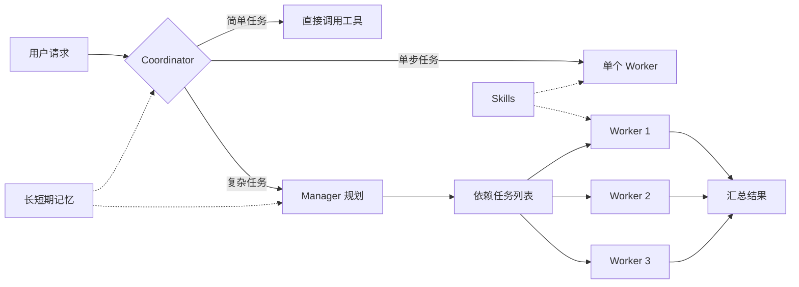

<h1 align="center">RedLotus · 红莲极意</h1>

<p align="center">
  <a href="README.md">English</a> · 简体中文
</p>

<p align="center">
  面向终端的多 Agent 助手，支持任务编排、长期记忆与运行时技能扩展。<br>
  <sub>A terminal AI agent with orchestration, memory, and runtime skills.</sub>
</p>

<p align="center">
  <a href="https://pypi.org/project/RedLotus/"></a>
  
  
  <a href="https://ai.pydantic.dev/"></a>
</p>

RedLotus 是一个运行在终端中的 AI Agent。它会根据任务复杂度选择直接处理、委派单个 Worker，或由 Manager 拆解任务并协调多个 Worker 执行。项目兼容 OpenAI 风格的模型接口，并提供记忆、Skills、文件解析、浏览器操作和聊天机器人接入。

```bash
python -m pip install --upgrade redlotus
redlotus
```

## 主要功能

此前 `1.0.1.post1` 发布计划采用标题 `1.0.1-release`，保留线上既有 `1.0.1`。原授权豁免 Linux、macOS、真实 QQ／微信账号及未配置模型协议的真实验收，对应功能保留并标记未验证；旧版 `1.0.1` 启动及升级测试已从范围移除。本轮终端控制改动不发布或替换线上制品。记录状态见[项目设计](docs/design.md)，已发布制品及哈希见 [GitHub Releases](https://github.com/Tian-ye1214/RedLotus/releases)。

每次模型请求前，使用已报告的真实输入 Token 检查 `ceil(min(配置比例×上下文容量, 上下文容量－最大输出))`。支持持久检查点的主 Agent、子 Agent 和记忆请求被服务判定超限时，沿完整证据和闭合工具调用边界分段并发压缩，摘要全部保存成功后只重试该请求一次，不重复已经执行的工具；日志保留原始容量拒绝，服务未返回的 usage 仍记为未知。原始记录和 system 保留。

| 功能 | 说明 |
|------|------|
| 多 Agent 编排 | Coordinator 判断处理路径；复杂任务由 Manager 构建带依赖的任务列表，Worker 按依赖分批执行并汇总结果。 |
| 目标模式 | 给定一个明确目标后持续迭代，直到任务完成；执行期间仍可接收用户补充信息。 |
| 三层记忆 | 会话增量记录、每 20 个新增用户回合的 LLM 情景感知、项目情景与全局长期 RAG，以及会话内固定的用户画像与通用经验快照。 |
| 运行时 Skills | 通过 `SKILL.md` 按需加载指令、参考资料和脚本；技能目录会在用户回合开始时重新扫描，无需重启。 |
| 文件与多媒体处理 | 可读取图片，并提取 PDF、Word、Excel、HTML、Markdown、CSV、JSON 和文本文件中的内容。PDF 支持按页提取正文、表格、链接与内嵌图片。 |
| 终端审查与安全护栏 | 提供全屏 TUI、逐块 diff 审查、路径沙箱、危险命令拦截和子进程回收。 |

此外，RedLotus 提供浏览器自动化、图像生成，以及 QQ（NapCat / OneBot）和微信机器人接入。这些能力可按需安装。

## 工作方式



- 简单请求由 Coordinator 直接调用工具处理。
- 单个独立任务可以委派给一个临时 Worker。
- 复杂请求交给 Manager 拆解；任务会校验重复 ID、未知依赖和依赖环，并按依赖关系分批执行。
- 规划与执行角色可以分别配置模型，在能力、速度与成本之间做取舍。

## 安装

要求 Python 3.12 或更高版本，支持 Windows、Linux 和 macOS。

### 从 PyPI 安装或更新

```bash
python -m pip install --upgrade redlotus
redlotus
```

如果希望将命令安装到独立环境，可以使用 `uv`：

```bash
uv tool install redlotus
```

Windows x64 安装包见 [GitHub Releases](https://github.com/Tian-ye1214/RedLotus/releases)。onedir ZIP 解压后运行 `Agent.exe`，onefile EXE 可直接运行；两者与 pip 入口共用用户配置和项目会话存储，升级不覆盖现有配置与记忆。

面板以会话标题、准确 Token 数及横向条形对比 API 用量。API 用量包含历史重发，单独展示的新增用户输入只计一次。

### 可选能力

```bash
pip install "redlotus[browser]"  # 浏览器自动化
pip install "redlotus[bots]"     # QQ / 微信机器人
pip install "redlotus[viz]"      # 绘图与图像处理
pip install "redlotus[all]"      # 全部可选依赖
```

浏览器能力首次使用前还需要安装 Chromium：

```bash
python -m playwright install chromium
```

## 首次配置

每个参数固定按项目 `src/redlotus/config.json` → 项目 `.env` → 全局 `~/.redlotus/config.json` 查找。命中即停止，只有尚未解决的参数才进入下一层；嵌套对象也逐字段处理。源码以仓库根目录、pip 以当前目录、PyInstaller 以 EXE 目录为查找基准，不向父目录搜索。`/config` 显示实际来源和修改目标。

“空”按参数自身语义判断，合法的 `null`、`0`、`false`、空列表保留；空白凭据可继续向下查找。非空但非法的值明确报错，不静默回退。`.env` 沿用 python-dotenv 格式，以 `__` 表示嵌套字段，不插值、不从宿主环境变量读取业务参数。四个优先级示例见[模型、配置与上下文](docs/design.md#模型配置与上下文)。

API Key、Base URL 与所选角色的模型配置齐全即可进入交互；启动只询问这些缺项，不额外询问 RAG 或运行策略。模型命令和 `/api embedding` 保留各自编辑入口。可选组件在实际使用时读取运行参数，缺少未使用能力的配置不阻止启动或导致退出；实际使用时缺少必需参数，报错列出名称、作用、类型、可选值与来源，没有枚举限制时如实说明。不进入通用填写、不补隐藏默认值，不保留 schema 或随包配置模板。

凭据隐藏输入；确认后在原生阻塞文件锁内读取最新 JSON，再原子提交本次差异至既有项目 JSON，否则写全局 JSON，不要求锁超时配置，也不写 `.env`。Esc 取消不保存；连续提示切换时提前到达的 Esc 会传交下一提示，凭据保持隐藏。输入 `=角色名` 只复用模型名，保留目标角色的连接与策略。`max_context_windows` 在上述文件中配置，不由模型引导填写；三层查找后仍缺失或命中合法 `null` 时查询 OpenRouter 元数据。以下只是连接片段，不是完整配置：

```json
{
  "BASE_URL": "https://your-api.example.com/v1",
  "API_KEY": "your-api-key"
}
```

`REDLOTUS_CONFIG_FILE`、`REDLOTUS_DOTENV_FILE`、`REDLOTUS_CONFIG_DIR` 分别显式选择既有项目 JSON、dotenv 文件与全局配置目录，不增加新的优先级层；`REDLOTUS_DATA_DIR` 隔离全局状态。项目会话、日志、感知进度和 `AGENT.md` 保存在项目 `.redlotus`，引用快照、缓存和产物位于 `WorkDatabase`；记忆数据库及长期记忆文档位于用户 `.redlotus`。安装包不含私人配置、凭据或 schema。

网关复用 Pydantic AI 的 OpenAI Chat、OpenAI Responses、Anthropic Messages 和 Google 适配。Manager、Worker、Coordinator、Compressor 可以分别配置或选择预设；感知使用 `memory_perception.model_role`，RAG 使用 `SILICONFLOW_BASE`、`SILICONFLOW_KEY`、`RAG_models` 和 `rag_service`。命名凭据引用（如 `api_key_env`）按同一三层优先级读取字段，宿主环境变量不覆盖业务配置。不要提交真实密钥。配置与模型路由见[配置与模型路由](docs/design.md#模型配置与上下文)。

记忆、RAG 与引用路径在实际使用时读取，Skills overlay 未配置不影响随包 Skills。CLI 在退出时才读取可选退出宽限，缺失时不设置应用期限；进程清理同样允许没有配置期限。

## 终端使用

全屏 TUI 提供三种运行模式，可使用 `Shift+Tab` 循环切换：

| 模式 | 行为 |
|------|------|
| 审查模式 | Agent 写入文件后进入待审查列表，可逐块决定保留或撤销。 |
| 放行模式 | 文件改动直接写入，不进入逐块审查。 |
| 目标模式 | 围绕一个目标持续执行，直到完成或被用户停止。 |

常用快捷键：

| 快捷键 | 作用 |
|--------|------|
| `Enter` | 普通提交；执行中加入外循环队列，以浅灰色“排队”消息显示 |
| `Ctrl+Enter` · `↑` | 加急补充当前回合，与本批工具结果进入下一次模型请求；空闲时开始新回合 |
| `■` · `▶` | 暂停当前回合或明确恢复；空闲及控制操作进行中禁用 |
| `Shift+Tab` | 切换运行模式 |
| `Ctrl+R` | 打开逐块改动审查 |
| `Ctrl+C` | 停止当前回合 |
| `Ctrl+Q` | 退出 |
| `@路径` | 引用文档或图片，支持 Tab 补全；文件数量按配置检查，视频验收暂缓 |

补充内容显示为普通用户消息，不添加“加急”标记。Ctrl+Enter 接受终端的 `ctrl+j`／LF 和带修饰 CR 编码；普通 Enter 仍正常提交，粘贴文本中的换行不触发提交。应用只能区分终端实际传入的不同按键事件；PyCharm 的真实 Ctrl+Enter 验收尚未关闭，没有修改 IDE 或终端设置。按键检测只用于测试，物理按键与注入事件分别记录，见[按键输入说明](docs/design.md#请求执行)。

输入旁醒目的 `↑` 保持加急提交，相邻按钮在同一槽位显示运行时的 `■` 或暂停后的 `▶`，保留输入草稿与焦点。暂停先阻止队列执行，再取消当前模型、子 Agent、工具和待答问题，保留目标、模式、历史、结果、补充与引用。暂停期间输入只排队；重新加载暂停会话也等待 `▶`。恢复从保留的历史继续，不重发整段任务或自动重放已完成工具。

传输中断会保留已收到的正文、思考和用量，等待同一个 `▶` 恢复；完整错误详情写入日志，应用不自动重试。思考框每个回合只在首个思考 delta 自动展开一次，后续片段和响应尊重手动折叠。

简单终端在空行连续两次 Ctrl+C 后退出，正常输入会清除连续计数，不设时间窗；TUI 保留停止当前回合与空闲退出的既有行为。状态栏和用量面板沿用现有事件更新，不需要周期刷新配置。

引用之间不必加空格，例如 `@审稿意见.md解读这个文档，@图片.png分析这张图`。Tab 补全当前引用，遇到含空格或分隔符的路径会自动加引号，也可以手写 `@"路径"`、`@'路径'` 或 `@{路径}`。文件按首次出现顺序去重；超过配置的文件数量会提示错误，不会只上传其中一部分。

<details>
<summary>常用斜杠命令</summary>

| 命令 | 说明 |
|------|------|
| `/help` | 显示帮助 |
| `/clear` | 清空上下文并开启新对话 |
| `/pwd` · `/cd <path>` | 查看或切换工作目录 |
| `/load` | 加载当前工作区的历史会话；TUI 加载按钮位于底栏“审查”之后 |
| `/config` · `/context` · `/panel` | 查看配置、上下文和运行概览 |
| `/skills` | 查看已加载的 Skills |
| `/LTM show` · `/STM show` | 查看长期或短期记忆 |
| `/agent` · `/effort` | 查看或调整角色模型与思考配置 |
| `/api` · `/api embedding` | 配置主模型或向量检索接口 |
| `/compress` | 压缩 Manager / Coordinator 上下文 |
| `/status` · `/trace` · `/tasks` | 查看生命周期、调用追踪和任务状态 |
| `/stop` · `/cancel` | 中断当前回合或 invocation |

</details>

`/trace` 与 `/status` 保留完整轨迹和调用历史，不按固定数量淘汰或缩短 ID。会话列表、diff 上下文、流式正文、补全、工具参数、用量路径和错误详情不裁剪；`/panel --all` 仍可使用，与 `/panel` 显示同一完整列表。失败任务保留状态和证据，由明确恢复入口继续。

## Skills

Skills 使用目录化的 `SKILL.md` 作为入口。系统只预加载技能名称与简介，在需要时再读取完整说明、参考文件和脚本，减少无关内容对上下文的占用。

项目当前包含以下类型的内置技能：

- 量化回测与 TA-Lib 技术分析
- 浏览器自动化与网页抓取
- FLUX 图像生成与提示词规范
- Agent 编程与 CI/CD 工作流
- 技能创建、管理和安装前审核

也可以在运行期间安装兼容技能：

```bash
npx clawhub --dir skills install <slug>
```

新技能会在后续用户回合自动发现。

## 文件与数据位置

- 会话轨迹和感知任务保存在项目 `.redlotus`，不可变引用快照保存在项目 `WorkDatabase`；压缩只改变模型视图，完整原文保留。
- 项目情景与全局长期记录保存在 LanceDB `memory_records_v3`，按 scope 和项目隔离，通过向量检索与重排召回，服务不可用时保留文本检索。
- `MEMORY.md` 保存用户画像、环境、行为约束与通用经验，不设固定字符上限。它与 system prompt 在会话开始时完整形成快照，写入记忆不重写本会话前缀；新信息通过工具结果和检索消费，新会话读取最新版本。
- 文件和命令工具默认操作当前项目，生成产物保存在 `WorkDatabase/`。`/cd` 先取消旧会话，再切换运行上下文。
- 日志年龄清理每个会话只在输入开放前执行一次，仅按修改时间处理日志根目录直接包含的 `*.log`，严格超过 `storage.cleanup.log_retention_days` 才删除。字段缺失或小于等于零时跳过，不使用 14 天兜底。日志不按大小轮转，不创建、重命名或删除 `.log.1`，已有文件原样保留；普通日志写入和后台周期任务不触发清理。

Enter 将输入排入 FIFO 队列；Ctrl+Enter 将加急补充加入当前回合，在下一请求边界与本批工具结果一起送给模型；暂停时两者均保留排队，等待明确恢复。子 Agent 各自拥有线程、事件循环和客户端，遵守配置中的会话线程上限。感知只处理当前会话每 20 个新增用户回合，附带前 3 回合衔接；新建、加载和退出不额外产生短窗口。主动记忆通过 remember 即时处理，失败和取消不会自动成为成功经验。

向量模型、重排、分块、相似度阈值、候选数量和索引参数继续保留，按同一三层优先级读取独立副本。完整的保留项、替代项与迁移行为见 [记忆与检索设计](docs/design.md#感知与记忆)。

## QQ 与微信机器人

安装机器人依赖：

```bash
pip install "redlotus[bots] @ git+https://github.com/Tian-ye1214/RedLotus.git"
```

启动方式：

```bash
python -m redlotus.api.QQ
python -m redlotus.api.WeChat
```

QQ 接入需要先运行 [NapCat](https://github.com/NapNeko/NapCatQQ)，并配置 OneBot WebSocket、机器人 QQ 号和 WebUI token。微信接入在启动后按提示扫码登录。

个人聊天渠道需要配置 `bot.owner_channels.qq`（本人私聊 QQ 号）或 `bot.owner_channels.wechat`（本人 wxid）。未绑定渠道提供文本对话，不开放个人记忆和执行工具。机器人支持 `/stop`、`/clear`；渠道运行策略按同一三层优先级读取，必需项缺失明确报错，不逐项引导填写。适配器至真实模型的附件顺序已验证，真实账号收发仍待验收。配置示例见 [渠道权限](docs/design.md#agent-与工具边界)。

## 本地开发

```bash
git clone https://github.com/Tian-ye1214/RedLotus.git
cd RedLotus

pip install -e ".[dev]"
python main.py
pytest -q
```

构建 Python 包：

```bash
uv build
```

构建 PyInstaller 可执行目录：

```powershell
pip install ".[build]"
$env:PLAYWRIGHT_BROWSERS_PATH="0"
python -m playwright install chromium
pyinstaller build.spec
```

项目主要代码位于 `src/redlotus/`，分为 `runtime`、`sessions`、`core`、`tools`、`memory`、`prompts`、`ui`、`api` 八个模块；命令入口为 `redlotus.api.base:main`。

本轮覆盖终端控制、持久暂停／恢复、思考框状态、按键兼容及传输中断后的明确续接。已有启动、三层配置优先级、按需读取、日志年龄清理与随包 Skills 保留；私人配置字节不变，没有新增默认值、数量限制或依赖。当前源码与实际安装 wheel 各 692 项通过、18 项旧功能断言跳过，另各 7 项独立审查回归通过；先前结果均为历史证据。原五个测试文件保持删除，必要覆盖在现有五份新测试中维护。八模块、36 个应用文件及每模块五文件、单文件 500 有效行满足；应用 10,500 有效行高于既定 10,373 基线，整体净精简仍未通过，完整双终端物理验收也未关闭。不替换发布制品，最终长测、缓存目标和发布后验收仍未完成。详见[项目设计](docs/design.md)及[开发约定](docs/development.md)。
