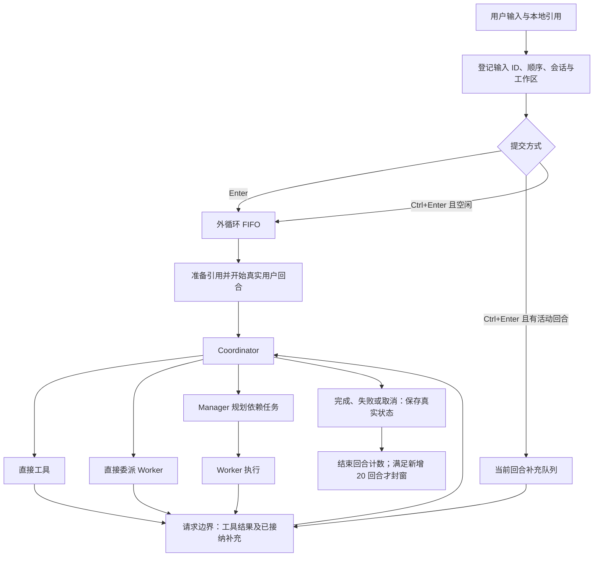
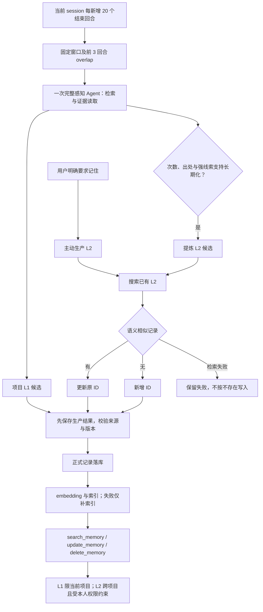

# RedLotus 现行设计

> 本轮从审查基线 `ca98b811` 重新实施，工作分支为 `codex/lgtm-hardening`。用户于 2026-09-21 授权全部已列整改包，保留私人配置与提示词资源，交付后统一审查。实现状态与真实验收分别记录，历史证据不自动适用于当前版本。

## 状态说明

- **已实现**：有对应代码路径；是否真实验证另行说明。
- **已确认但未完成**：用户已明确要求，仍缺实现、质量验证或完整交付。
- **尚未真实验证**：没有当前版本、对应入口的充分真实证据；本地检查不能替代。

以后每次功能测试、缺陷复测与发布验收，必须从新用户安装、首次配置和公开启动入口开始，实际调用对应服务 API 并核验产物与恢复。模拟仅限用户操作，不模拟模型响应；离线检查不能单独支持功能通过或 LGTM。具体流程及证据要求见[真实验收习惯](development.md#真实验收习惯)。

## 模块职责

| 板块 | 唯一职责 |
| --- | --- |
| `runtime` | 配置、路径、日志、HTTP 客户端生命周期、锁及原子文件 I/O |
| `core` | 输入生命周期、会话协调、任务状态机、Agent 工厂和目标循环 |
| `models` | 模型协议、请求、上下文压缩和用量汇总 |
| `storage` | 会话日志提交与恢复、角色上下文、索引摘要和清理 |
| `tools` | 业务工具集合、Skills、浏览器和保留原位置的 Worker 执行实现 |
| `execution` | 命令校验、执行环境和进程资源回收 |
| `documents` | 本地引用、文档读取、用户消息和文件审查 |
| `terminal` | CLI／TUI 的输入、命令和会话控制 |
| `presentation` | 输出接收器、差异及面板渲染，核心只调用注入的事件接口 |
| `api` | QQ／微信的事件转换、权限、附件准备和回复 |
| `memory` | 记忆生产、版本校验、正式记录、投影与索引 |
| `prompts` | 提示词资源及基于显式输入的组装 |

本轮按已授权的职责整理实施：终端构造核心对象并注入展示处理器，core 不导入 CLI／TUI；Worker 与记忆接收工厂能力，不导入核心工厂实现。`tools/worker_tools.py` 保留实际 Worker 执行代码，任务状态由 core 统一持久化。会话存储继承同一日志提交／恢复实现，避免重复原子写入。公开命令为 `redlotus.terminal.console:main`，源码 `main.py` 与既有机器人模块入口保留。

代码简洁性为最高优先级：先复用现有函数、适用继承和标准库，再论证新增实现。最终验收原则上每模块递归最多 5 个 `.py` 文件、每文件最多 500 有效行，同时报告物理行数。新增代码按包审批，例外单独确认；具体口径、逐行必要性及正交职责审查见[开发与验收审批](development.md#开发与验收审批)。文件数量达标不代替行为和依赖验证。

## 请求执行

输入在引用解析前登记；请求边界固定补充消息范围，等待该范围解析，再按顺序接在工具结果后；更晚的补充进入后续边界。加急显示为普通用户消息，不添加“加急”标签或说明。QQ／微信复用同一个输入控制器，收到事件后即登记 ID、顺序及代次，再准备附件；慢附件按原顺序消费，清空使旧代次失效。任一附件失败会报告文件身份、保留原事件供重试，不执行不完整请求。工具问答暂只接收文本；带附件的回答明确拒绝并保留问题，不静默丢弃附件。真实机器人账号验收仍待完成。

- `/stop` 停止当前操作及所属补充，保留独立普通任务队列。
- 清空、加载、切项目和退出使旧代次的迟到结果失效；切换期间锁定输入。
- 加载采用先完整准备、再提交切换；取消或准备失败保留原会话、草稿、引用和资源。
- 工具往返、重试、中间回复、补充及子 Agent 内部消息不增加感知所用的结束回合数；会话选择器改用独立的用户输入次数，详见展示与统计。
- 退出取消子 Agent 和感知，不等待模型完成；清理使用既有退出期限并保留可恢复状态。

正式程序已删除按键检测页面、按钮和启动探测，检测仅用于测试阶段。Enter 与 Ctrl+Enter 保持既有提交行为，Shift+Tab 不变；不增加 LF／Ctrl+J 或文字加急命令。PyCharm 无法区分 Ctrl+Enter 时使用底部已有的“发送”操作，不新增快捷键或全局 Hook。

终端若将 Enter 与 Ctrl+Enter 都编码为 CR，应用收到的输入已相同，Python 原生库无法还原丢失的修饰键。Shift+Tab 可单独编码为 ESC `[Z`，能识别它不代表支持 Ctrl+Enter。JetBrains 的 [JediTerm 按键编码实现](https://github.com/JetBrains/jediterm/blob/master/core/src/com/jediterm/terminal/TerminalKeyEncoder.java)可解释这一差异；具体 PyCharm 版本仍须物理按键实测，不能靠注入事件宣称支持。程序不自动修改终端设置。

## Agent 与工具边界

**已实现：**英文函数 docstring 是工具描述来源，Pydantic AI 根据函数签名和类型生成参数定义。不得用外部 Markdown 覆盖描述、修改 `__doc__` 或决定注册内容。

| 身份 | 注册范围 |
| --- | --- |
| 本人 Coordinator | 下表执行工具，另加 `execute_task_with_manager`、`execute_task_with_worker` |
| Manager 规划 | `create_todo_list`、`get_todo_list`、`resume_task`、`ask_user`；本人权限下加 `search_memory` |
| Manager 最终汇报 | 不注册规划工具 |
| Coordinator 直接委派的 Worker | 下表执行工具，包含浏览器 |
| Manager 委派的 Worker | 同一执行集合，排除浏览器 |
| 感知 Agent | `search_memory`、`read_evidence`、`read_reference` |
| Compressor / Title | 无业务工具 |
| 未绑定本人的渠道 Coordinator | 当前实现只提供文本对话，不注册执行或个人记忆工具；实际渠道边界尚未真实验收 |

| 执行工具组 | 函数清单 |
| --- | --- |
| 常驻读取 | `list_files`、`read_file`、`search_in_files`、`search_web`、`ask_user`、`read_reference` |
| 文件修改 | `write_file`、`edit_file` |
| 命令 | `run_command`、`execution_environment` |
| 文档与生成 | `extract_text`、`generate_image` |
| 本人记忆 | `search_memory`、`remember`、`update_memory`、`delete_memory` |
| Skills | `list_available_skills`、`get_skill_instructions`、`load_skill_resource`、`refresh_skills`、`execute_skill_script` |
| 浏览器 | `browser_navigate`、`browser_get_content`、`browser_screenshot`、`browser_click`、`browser_fill`、`browser_press_key`、`browser_wait_for_selector`、`browser_evaluate`、`browser_close` |

Worker 使用 SDK 原生能力组：读取工具常驻，其他工具按组渐进加载。Coordinator 直接执行复用完整函数集合。Skills 的名称与简介进入会话提示词快照，正文和资源按需读取；磁盘 Skills 在后续用户回合重新发现，不重写已固定的 system 快照。

同一 session 的工厂线程上限为已确认的 16，Worker、Manager 及感知按实际工厂调用共享额度；取得名额后才创建线程。等待名额不另开 Agent 线程，工具调用不单独算 Agent。这个上限不是整个进程的操作系统线程总数。

### 执行环境与保护

源码和 pip 使用启动解释器；EXE 寻找 PATH 中已有的外部 Python。没有外部 Python 时仅阻止相关 Python 功能。命令和 Skill 共用检查入口，保留日常 Git／SSH 等用户环境；外部命令环境筛除模型凭据，依赖缓存与 TEMP 指向项目 runtime。

已确认的进程保护作为工具业务逻辑保留：检查命令位置、静态包装和已识别的进程 API；普通字符串、注释及业务对象同名方法不应被误拦。已识别启动调用无法确定目标时拒绝并要求明确命令。取消只处理确认归属当前调用的资源，不按端口判断所有权，不引入 Windows 权限库、Hook 或账户隔离。

**边界：**这不是任意代码或第三方程序的系统级隔离；未登记且已脱离的后代进程不承诺全面回收。Playwright 驱动默认环境及全部浏览器临时目录归属，尚未完成隔离验证，不能将命令入口的验证结论套用到浏览器。

## 本地引用与交付审查

**已实现：**引用只接受本地图片或文件。保留中文、空格、单双引号、花括号、相邻引用及多文件输入；规范路径按首次出现顺序去重。数量和字节限制读取配置，已确认的常规边界为 20 个原始文件、未另声明时单文件 20,000,000 字节；发送前还检查声明的请求限制。

`@HTTP(S)网址` 应报“引用仅支持本地文件”并保留输入；普通正文网址保持文本。已有渠道明确提供的图片附件可直接携带图片 URL，这不是网址引用入口。`read_image` 已删除；本地图片由 SDK 按实际 MIME 编码为 base64 data URL，不能只发送文件名。

引用建立不可变快照，按内容哈希复用；恢复会话继续关联原快照。正文带文件身份、内容范围和定位，不能冒充用户指令或主动记忆要求。PDF、Word、Excel、PPT、CSV、Markdown／HTML 等保留对应结构；旧 DOC／PPT／XLS 转换需要现有 LibreOffice。扫描材料可带页面图片，不承诺未验证的格式质量或视频识别。

`read_reference` 读取登记快照，`read_file` 读取项目磁盘当前文本，`extract_text` 解析文档。文件错误应返回可恢复结果并保持调用配对；不能静默漏文件。审查模式保留逐块决定、撤销及外部修改冲突检查；核验依据是实际文件，不是界面是否显示成功。goal 持续迭代保留目标、约束、完成状态和未决事项。

## 会话与数据存储

**已实现：**项目以当前打开文件夹为边界，不向父目录查找项目。配置指定项目路径，全局 LanceDB 仍位于用户数据目录；已撤回 SQLite 方案，不保留两套运行后端。

| 数据 | 归属与保存策略 |
| --- | --- |
| 主会话 | 项目 `.redlotus` 内按 session ID 保存 `model_messages.json` |
| 其他角色 | 同目录懒创建 `model_messages.<role>.json`，同角色按 Agent／调用身份区分 |
| 会话索引 | 轻量摘要元数据，不复制聊天正文 |
| 引用原件与解析快照 | 项目 `WorkDatabase/references`，普通退出不删除 |
| 项目日志、感知进度、`AGENT.md` | 项目 `.redlotus`；进度与恢复必要状态随会话保存 |
| 产物、依赖缓存、临时文件、技能 overlay | 项目 `WorkDatabase` 及其 runtime |
| 正式 L1／L2 与向量索引 | 用户 `~/.redlotus` 下配置指定的 LanceDB；按作用域和项目隔离 |
| 核心长期投影 | 用户数据目录中的 `LongTermMemory/MEMORY.md` |

角色拆分是对早期“整个 session 只有一个文件”要求的后续明确调整：每个角色恢复文件只保留自身必要上下文，主会话保留子任务调用和返回，不混入子 Agent 全部内部历史。完成且已交付的 Worker 正文可清理，累计 usage 保留。

增量批次用 `json.dump` 缩进写入；正常提交后文件保持合法 JSON。消息、工具关系、提示词快照、引用身份、任务状态、计数和感知进度按事务提交，包含序号与完整性校验。清理只处理已无恢复或待感知用途的正文，不丢累计统计。已提交批次不因普通节点保存而反复完整序列化。

尾部半写只在能确认损坏范围时恢复上一完整批次；中间损坏或后方存在有效提交时拒绝自动修复，保留文件。未完成工具配对补“结果未知”回执，不自动重放副作用。旧混合角色记录仍可读取，拆分成功后才移除重复保存。

启动有历史时选择新建、恢复或取消；无历史时首次输入才创建恢复文件。恢复沿用原 session ID、文件、提示词和计数。保存失败不得假报成功：按已配置且获确认的七天历史清理及缓存清理策略处理空间不足，保护活动会话和正式数据；仍失败则暂停，保留内存进度和队列，下一次普通输入先重试原保存。权限／路径错误不触发无效清理。

## 模型、配置与上下文

**已实现：**三层配置逐字段合并并返回独立副本：本地 JSON → 本地 `.env` → 全局 JSON。源码基准为仓库根，pip 为启动目录，EXE 为程序目录；不向父目录搜索、不从解压目录读取业务配置。宿主环境变量不覆盖业务参数，既有显式路径选择用于隔离；不存在全局 `.env` 第四层回退。

空白凭据继续查找下层；有效的 false、0、空列表及允许的 null 保持语义。类型错误或损坏 JSON 报来源和字段，不静默忽略。配置命令仅写既有本地 JSON，否则写全局 JSON，不回写整个合并结果。空配置和仅有连接的配置可以进入模型／连接填写；确认后只写本次修改，取消不落盘。运行策略必须先在配置文件明确提供，向导不会生成隐含策略，因此不能把两项连接配置称为完整启动配置。

**已确认目标：**交互只填写模型、连接和凭据，运行策略全部从配置读取；允许明确复用角色，取消不落盘，确认只写修改。角色列表复用现有 `get_agent_roles`／`get_context_profile_roles`，不另加硬编码名单。`max_context_windows` 缺失或为 `null` 直接使用既有 OpenRouter metadata，正整数才覆盖容量；不要求输入、不暗补参数。基线容量读取已有此回退，后续应复用而不是再建一套配置框架。

模型标识采用 Pydantic AI 的“服务:模型”路由，地址和凭据由统一入口注入。没有新增 provider 配置；`parallel_tool_calls=True` 是用户明确批准的例外。模型、采样、RAG、超时及压缩政策取自现有配置。非当前实际服务的协议适配只能记为代码／辅助检查覆盖，不能称真实跨服务验收完成。

### 配置字段参考

首次安装请先在全局 `~/.redlotus/config.json` 中填写下列运行字段，再运行 `redlotus` 补齐模型和连接。也可以先完成模型／连接向导：确认后这些修改会保留，程序会一次列出仍缺少的运行字段并停止启动，编辑后重新运行即可。取消向导不会写入本次任何修改。这里是现有代码读取的字段说明，不是自动生成的模板，也不提供隐含策略值；表中的路径建议不是程序默认值。

JSON 对象层级对应点分字段名；`.env` 同一字段用 `__` 分隔。`int` 为整数，不能用 `true`/`false` 代替；`number` 为有限整数或小数；`bool` 为 JSON 布尔值；字符串列表的成员必须为字符串。数值策略没有单位换算：秒、天、字节、Token 和回合数分别按下表填写。启动前会检查必填字段、类型、正数／非负数边界和窗口关系；错误包含字段和来源文件，不打印凭据值。

**模型、连接与角色声明**

角色枚举只来自配置的 `models` 键。完整内置功能会按名字使用 `coordinator`（对话）、`manager`（规划和汇总）、`worker`（执行）、`compressor`（压缩）、`title`（标题）；请显式声明这些消费者需要的角色。感知使用 `memory_perception.model_role` 指向的已声明角色，可以独立声明，也可以明确复用。程序不会自动创建其他角色或复制角色参数；只填写 coordinator 的向导不等于已经配置所有功能。

| 字段 | 类型、单位与要求 |
| --- | --- |
| `models.<role>` | 对象，或引用 `model_presets` 中名称的字符串；至少声明入口使用的 coordinator，其他功能须声明对应角色。每个声明的角色都会检查模型和输入限制 |
| `models.<role>.name` | 非空字符串，Pydantic AI 的 `服务:模型` 标识；从 preset 继承时可省略。需使用服务实际提供的模型名 |
| `models.<role>.preset` | 可选字符串，引用已声明的 `model_presets.<name>`；角色显式字段覆盖同来源 preset 字段，仍遵守配置来源优先级 |
| `model_presets.<name>` | 可选对象，包含与角色相同的 name、gateway、采样和上下文字段；没有内置预设 |
| `models.<role>.gateway` / `model_presets.<name>.gateway` | 可选字符串，引用 `gateways.<name>`。不指定时读取顶层 `BASE_URL` / `API_KEY` |
| `BASE_URL` / `API_KEY` | 直接连接使用的地址／凭据字符串；向导要求完整 http(s) 地址。采用命名网关的角色不要求这两个顶层字段 |
| `gateways.<name>.base_url` | 命名网关地址字符串，服务所要求的完整 http(s) 地址 |
| `gateways.<name>.api_key` / `.api_key_env` | 直接凭据或配置内的凭据字段名，两者至少提供有效凭据来源；引用读取同一三层配置，不读取宿主环境。直接值与引用按来源排序，同来源直接值优先 |
| `MODEL_HTTP_TIMEOUT` | 正 number，秒；没有配置网关独立 timeout 的角色必需 |
| `gateways.<name>.timeout` / `.connect_timeout` | 可选正 number，秒；timeout 缺省使用 `MODEL_HTTP_TIMEOUT`，connect_timeout 缺省使用已解析的 timeout |
| `models.<role>.settings` / `model_presets.<name>.settings` | 可选对象，SDK 模型参数；同一对象的直接字段覆盖 settings 同名字段 |
| `max_tokens` / `temperature` / `top_p` | 对应角色或 preset 的 SDK 参数；分别为 int / number / number（可为 SDK 接受的 null），限制依服务而定，无程序生成值 |
| `thinking` / `reasoning_effort` | 角色／preset 可选字符串；thinking 支持 enabled 或 disabled/off/false；启用时 effort 按所选服务支持填写，max 映射为 xhigh |
| `request_limit` | 必需；单次 Agent 运行模型请求次数，正 int；`null` 或字符串 `none` / `null` / `unlimited` / 空串明确表示不限。兼容正整数字符串；不是并发数 |

`input_limits` 按字段合并：`input_limits.defaults` → 网关 `.input_limits` → 角色／preset `.input_limits` → `input_limits.<role>`，右侧优先。每个角色最终必须有 `max_files`（非负 int，个数）和 `max_file_bytes`（正 int，单文件字节）；可选 `max_request_bytes` 为正 int 字节或 null，约束编码后的整个请求。可以全部写在 defaults，也可以由各角色／网关提供，不强制创建 defaults。

**运行和存储（必需，除明确注明的条件字段）**

| 字段 | 类型、单位与含义 |
| --- | --- |
| `lifecycle.shutdown_grace_seconds` | 正 number，秒，退出清理期限 |
| `lifecycle.invocation_history_per_session` | 正 int，每会话保留的调用历史条数 |
| `agent_run_policy.max_concurrent_threads_per_session` | 正 int，同会话工厂线程并发额度；不是所有系统线程总数 |
| `agent_run_policy.max_command_timeout_seconds` | 正 int，秒，命令超时上限 |
| `storage.state_dir` | 字符串，全局状态目录；明确空串使用现有 `~/.redlotus` 路径规则。`REDLOTUS_DATA_DIR` 是测试隔离路径覆盖 |
| `storage.project_dir` | 非空路径字符串，项目资料／记忆进度根；通常选择项目 `.redlotus` |
| `storage.sessions_dir` | 非空路径字符串，会话根；通常选择 `.redlotus/sessions` |
| `storage.project_logs_dir` | 非空路径字符串，日志根；通常选择 `.redlotus/logs` |
| `storage.references_dir` | 非空路径字符串，不可变引用快照；通常选择 `WorkDatabase/references` |
| `storage.runtime_dir` | 非空路径字符串，缓存／临时内容／技能 overlay；通常选择 `WorkDatabase/runtime` |
| `storage.cleanup` | 可选对象，仅用于空间不足时清理。启用需填写 `enabled` 和 `execution_cache`（bool），`session_retention_days`（正 number，天）；未配置不启用清理 |

五个项目路径都相对当前项目根解析，也可使用该项目内的绝对路径；不得越出当前项目。全局 state 路径支持 `~`，非空相对路径按当前工作目录解析。旧 `agent_run_policy.max_tool_output_chars` 字段仍被忽略，不是必填项。

**记忆与 RAG**

记忆的正式存储和窗口策略在 Agent 初始化时需要；RAG 接口可稍后通过 `/api embedding` 配置，缺接口时保留已有文本回退。全局向量库与项目作用域共享下面的检索策略，长期库仅覆盖 table_name。

| 字段 | 类型、单位与要求 |
| --- | --- |
| `memory_perception.model_role` | 必需非空字符串，必须引用 models 声明的角色 |
| `memory_perception.window_turns` / `.overlap_turns` | 必需 int，已结束真实回合数；window > 0，0 ≤ overlap < window |
| `short_term_memory.db_path` | 必需非空路径字符串，LanceDB 根；相对路径位于全局 state_dir，支持绝对路径和 `~`。测试可用 `RAG_DB_PATH` 显式隔离 |
| `short_term_memory.table_name` / `long_term_memory.table_name` | 必需非空字符串，项目／全局向量表名前缀；embedding 模型改变时按模型身份区分索引 |
| `short_term_memory.turn_token_limit` / `.turn_chunk_overlap_tokens` | 必需 int，分块 Token 数与重叠 Token 数；limit > 0，0 ≤ overlap < limit |
| `short_term_memory.final_top_k` | 必需正 int，去重后的检索结果条数（文本回退也使用） |
| `short_term_memory.use_rerank` | 必需 bool，是否重排；开启且使用 RAG 时需 reranker 模型 |
| `short_term_memory.index` | 必需对象；未配置 RAG 时可暂填空对象。启用向量检索后须填写下列索引参数，检索和索引创建都会读取它们 |
| `short_term_memory.index.min_rows` / `.rebuild_every_n_adds` / `.rows_per_partition` / `.dimensions_per_sub_vector` | 使用 RAG 时必需正 int；分别为最少行数、重建间隔新增行数、每分区行数、每子向量维数 |
| `short_term_memory.index.metric` | 同上条件必需非空字符串，LanceDB 支持的距离类型，如 cosine、l2、dot |
| `short_term_memory.vector_search_limit` / `.min_similarity` | 使用 RAG 时必需；分别为正 int 候选条数和有限 number 相似度阈值，阈值依所选 metric 的语义填写 |
| `SILICONFLOW_BASE` / `SILICONFLOW_KEY` | 向量／重排服务地址与凭据字符串，RAG 使用时必需，纯聊天可暂缺 |
| `RAG_models.embedding` / `.reranker` | RAG 模型名字符串；embedding 用于向量检索，reranker 仅重排开启时需要 |
| `rag_service.http2` / `.timeout` | RAG 接口配置完整时必需，bool / 正 number（秒） |
| `rag_service.embedding_batch_size` / `.index_batch_size` | 同上条件必需正 int，单次 embedding 文本条数／补索引批次条数 |

**上下文和元数据**

以下上下文字段放在角色或 preset 内，也可放在它们的 settings 内；不另建全局 context 策略块。

| 字段 | 类型、单位与要求 |
| --- | --- |
| `max_context_windows` | 可缺省或 null，使用 OpenRouter metadata 的容量；显式值必须为正 int，Token。向导不会询问或写入这个字段 |
| `auto_compress_ratio` | 可选 number，0 < ratio ≤ 1；声明后启用该角色自动压缩。Coordinator／Manager 的手动 `/compress` 也读取该角色的此策略 |
| `compress_head_turns` / `compress_tail_turns` | 声明自动压缩时必需非负 int，保留的头／尾完整消息组数；手动压缩不会保留尾部 |
| `model_metadata.url` / `.timeout` | 使用容量回退或元数据功能时需提供的 URL 字符串／正 number 秒。URL 返回现有 OpenRouter models metadata 格式；已有缓存优先读取 |
| `model_metadata.supported_thinking_efforts` | 配置 metadata 功能时必需字符串列表，用于 `/effort` 的候选集；与服务公布的支持项取交集 |

辅助可选字段还有 `bot.owner_channels.qq` / `.wechat`（本人通道 ID 列表，其他渠道不获得本人记忆权限）、`QQBOT_ID`、`QQ_AGENT_TIMEOUT_S` / `WECHAT_AGENT_TIMEOUT_S`、`QQ_SEND_REPLY_TIMEOUT_S` / `WECHAT_SEND_REPLY_TIMEOUT_S`（渠道超时秒），`BROWSER_HEADLESS`（false/0/no 使用有窗口浏览器），`LIBREOFFICE_PATH`（已有转换器路径）以及 `BFL_BASE_URL` / `BFL_API_KEY`（图像服务连接）。这些不阻止未使用相关功能的普通聊天。QQ SDK 自身的 `config.yaml` 仍按现有渠道入口管理。

本参考仅根据当前 Python 消费路径整理。旧配置中未被当前实现读取的 `task_title`、`conversation_log` 或全局 `context` 块不替代上述字段，也不是新安装必填块。

### 提示词与压缩

上下文按以下边界处理，压缩不能改写固定部分：

| 内容 | 是否可压缩 |
| --- | --- |
| `system_prompt`：角色定义、初始 Skills 定义／索引、系统与项目资料、行为约束及长期记忆快照 | 否；每会话与 Agent 首次生成后复用，恢复也沿用原快照 |
| 工具定义与参数 schema | 否；由 SDK 工具注册字段提供，不拼进待压缩正文 |
| `user_prompt`：用户输入及后续补充 | 是 |
| 工具调用与返回内容，包括按需读取的完整 Skill 正文 | 是；保留必要调用关系、事实及证据 |
| `assistant`：服务返回的可见思考和回复 | 是；不处理不透明／加密思考、签名或内部标识 |

新增时间、补充输入和工具结果随新消息追加；记忆写入不重写当前会话前缀。主 Agent 和子 Agent 均在首次调用前保存提示词快照，续执行与恢复按会话、角色及 Agent 身份复用。压缩正文包含实际可见思考，排除签名和不透明字段。

自动压缩按“有效上下文容量 × 配置比例”判断，比例已确认为 0.9；例如容量为 1,024,000 时阈值为 921,600。容量优先角色 `max_context_windows`，否则查询既有 OpenRouter 元数据。使用最近已报告的服务端输入 Token，在模型请求边界检查，不扣除最大输出预算提前触发，也不把含历史思考的字符估算冒充实际用量。新增长材料在首次发送前的实际 Token 尚未知，不能声称已经精确测量。

首尾保留量来自角色配置；压缩内部字段不发给模型 API。Coordinator／Manager／Worker 的压缩候选经持久化回调保存后才采用；回调核验会话及调用归属，失败不继续请求模型。取消检查点携带原任务取消状态，不能进入普通的“等待下一次输入重试”流程。手动 `/compress` 串行执行、不增加用户回合，停止或切换使迟到候选失效。Compressor 的思考和输出参数仍由配置提供，感知独立使用所选角色。

待压缩正文不预先截断工具、引用或证据。**已确认但未完成：**最终版本在实际自动阈值下的摘要保真和三环境长会话验收；手动压缩成功不能替代这项验证。

## 感知与记忆

| 层级／入口 | 规则 | 状态 |
| --- | --- | --- |
| 主动生产 L2 | 用户明确要求“记住”，立即登记生产，不等待自动窗口 | 已实现；有真实生产与更新证据 |
| 感知生产 L1 | 只根据当前 session 的封存回合生成项目情景 | 已实现；完整 60 回合质量复核未完成 |
| L1 提炼 L2 | 保存独立次数与出处，由模型结合强线索判断；不设固定次数门槛 | 已实现；完整多样场景质量尚未真实验证 |
| 记忆消费 | 三个工具：`search_memory`、`update_memory`、`delete_memory` | 已实现；有局部跨项目及遗忘实测 |

明确长期表述可以一次构成强线索；临时要求不能成为长期偏好。工具往返、助手复述、重试、恢复和 overlap 不增加独立证据次数。全部 L2 生产先搜索：语义相似则更新原 ID，无相似项才新增；搜索失败不能当作空结果，提交前核对版本，避免并发重复。

自动窗口不扫描其他 session，也不重复消费已封存的新回合：

| 已结束真实回合 | 新消费 | 衔接 overlap |
| --- | --- | --- |
| 0–19 | 不调度 | 无 |
| 20 | 1–20 | 无 |
| 40 | 21–40 | 18–20 |
| 60 | 41–60 | 38–40 |

新建、加载、清空、切项目和退出不额外产生不足 20 回合的任务。加载第 19 回合后的第 20 回合应形成首窗。失败窗口保留原身份与状态供后续重试；自动任务数与 API 请求次数分别统计，一次感知允许多次工具／模型往返。无记忆价值可以完成消费并返回空结果。

`search_memory` 同时支持搜索和按 ID 读取完整记录及关联引用；`remember` 是生产入口，不算第四个消费工具。各入口检查 L1 项目归属及本人权限。更新、遗忘和清空的版本边界优先于旧任务，不能由 overlap 或过期索引恢复旧事实。五种任务结果与 L1／L2 层级分开。

正式记录和索引继续使用 LanceDB，保留 embedding、向量候选、相似度过滤、rerank、分块去重与服务不可用时的文本回退。embedding 在写锁外执行，写入前重新核对正文及有效状态。索引失败只补索引，不重新调用模型生产。

感知在后台静默执行。准备、等待额度、API、工具、保存及索引耗时应分别记录；用户已允许真实 API 延迟超过早期一分钟标准，但不接受框架反复消费、无限积压或退出等待模型完成。每 60–120 个真实回合通常对应 3–6 个自动窗口，主动记忆另计。

## 展示与统计

**已实现：**主 Agent 的服务端思考与正文独立流式展示，执行时展开思考、结束后折叠并允许手动展开。不展示签名或内部标识，不伪造思考内容；子 Agent 使用自身状态和结果展示。

| 区域 | 统计口径 |
| --- | --- |
| 会话选择器／加载提示 | 显示“用户输入次数”：普通输入、加急补充和 `ask_user` 回复按已接纳输入 ID 各计一次；重试和恢复不重复，排除本地命令、空输入、被拒绝输入及引用记录 |
| 会话 API 用量 | 历史会话表中显示时间、标题、Agent、响应数、准确 Token 数及相对条形；最近 20／全部范围 |
| 新增用户输入 | 按真正进入回合的输入 ID 计正文，同一引用内容哈希在会话内只计一次；标注文本估算 |
| 模型与推理输出 | 按唯一响应累加；推理是输出子项，拆分后不重复相加 |
| API 实际用量／`/usage` | 服务端累计输入、输出、缓存命中与未命中；历史重发确实消耗的输入仍计入 |
| Running／Queued | 当前前台 Agent 的实际运行和等待额度状态，不把工具、标题、压缩或感知混算 |
| 计划任务进度 | 来自任务清单，与 Agent 状态分开；没有清单显示“暂无计划任务” |

图片等无法独立计量的附件、缺失 reasoning 或旧会话统计缺项，必须明确标注未知／不完整。压缩、角色正文清理和恢复不能重复输入计数，也不能清零累计用量。缺 usage 的请求不能被当作零消耗来证明缓存达标。

用户输入次数与感知窗口的结束回合数分开保存；改变列表显示不改变 20／40／60 回合封窗规则。旧记录缺失输入身份时明确显示数据不完整，不能伪造次数。取消、失败和中断按真实状态展示。标题调用前先分配逻辑会话，主 Agent、普通子 Agent、标题／压缩／感知等辅助角色通过统一接口按响应身份记账；正文清理、压缩与恢复保留累计值。运行时与 SDK 合成回执不遮蔽最近的真实用量，真实服务未返回 usage 则保持未知。

## 验收状态与已知缺口

本轮实现与定向证据列在下表。真实发布门槛独立保留；构建、隔离回归和真实服务结果不混算。

| 项目 | 当前证据与限制 |
| --- | --- |
| 源码调度 | 结构整理及审查修复后的真实 CLI 已完成 Worker 写入／读取、Python 命令输出 42、Manager 创建 A → B 依赖并核验实际文件；两任务完成状态均已落盘 |
| 输入与恢复 | 源码、已安装 pip、onedir、onefile 均完成连续两条输入、退出后选择原会话继续；已安装 pip 完成真实 `ask_user` 回答及等待中 `/stop`，取消检查点保存成功。此前 `/load` 的 4 次输入显示有定向证据；物理按键仍按终端单独验收 |
| 记忆 | 本轮通过真实感知调用写入正式 L2，在 `/clear` 后新会话实际检索到同一记录；并发版本和失败边界由隔离回归辅助核验，完整窗口验收未完成 |
| 压缩与用量 | 四个公开入口均实际完成手动压缩、账本显示及恢复后的累计统计；主／子／辅助角色分别记录，缺 usage 保持未知。真实 TUI 压缩期间拒绝文件改动后，原文件恢复、旧压缩候选丢弃、撤销通知持久化。没有把手动压缩计作自动压缩 |
| 文件审查 | 真实 TUI 中 Agent 首次写入、用户外部编辑、再次工具写入冲突、拒绝改动后保留用户正文；辅助回归另覆盖删除、部分拒绝和写盘失败 |
| 浏览器与清理 | 源码、已安装 pip、最终 onedir／onefile 均通过真实 Worker 导航、读取页面标题／正文和关闭；验收采集实际工具返回并拒绝临时修补环境。onefile 冷启动使用已安装缓存，正常退出后临时目录已清理 |
| 正常日志 | 上述最终定向会话无日志级别 WARNING／ERROR，也无 PyInstaller 临时目录清理警告。首次失败的浏览器缓存路径、中文输入与外部解释器路径记录保留，修复后重新验收，不将模型临时修复环境计为通过 |
| 首次配置 | 空配置进入模型／连接填写，确认提交、取消不写及类型／必填聚合检查由隔离回归验证；运行策略仍须在配置文件提供，见[字段参考](#配置字段参考)。全新用户完整流程尚未真实验收 |
| 日常 pip 与 EXE | 当前候选 wheel 已在日常 Miniconda 安装，从实际 `redlotus` 命令调用 API；实际 onedir／onefile 也已完成中文输入、Worker、命令、压缩和恢复。两种 EXE 使用原生 UTF-8 启动选项，修复首次实测的乱码；版本仍为 1.0.1，不等于公开新版本或真实升级 |
| QQ／微信及其他协议 | 渠道排序、清空、失败和权限的辅助回归通过；尚缺真实账号收发与四类协议各自服务的验收 |
| 平台、终端和媒体 | Windows 为当前实际环境；Linux／macOS 全流程、PyCharm 物理按键、视频与全部文档变体仍待真实验证。实际 Windows `py` 启动器未安装，其命令分支由真实子进程替代启动器进行辅助验证，不计作 py-only-PATH 集成验收 |

历史证据仍可用 `git show d6bcc414:docs/framework-remediation-audit.md` 及旧版本文档查阅。其临时资料可能已经清理，不能视为本轮可重复执行的入口。

## 本次一致性修复

用户已授权以下全部整改包，本轮连续实施并在交付时统一审查。新增代码仍须逐段对应需求，核对复用、异常分支依据、函数职责及有效／物理行数；此次授权不改变后续审批规则。

| 变更包 | 实现与验收行为 |
| --- | --- |
| 配置与终端 | 运行策略只读配置；容量缺失／null 使用既有 OpenRouter metadata；模型与连接填写确认后提交；移除正式按键检测；加载显示去重用户输入次数与真实结果 |
| 浏览器 | 已安装 Playwright Chromium；打包时保留显式浏览器路径，未指定时复用 Playwright 原生缓存查找，避免误查包内临时目录。源码／pip／onedir／onefile 的真实 Worker 导航、求值及关闭均通过 |
| 文件一致性 | 再次写入和撤销按审查决定重建预期文件；外部编辑／删除导致可恢复冲突，保留实际文件；复用同目录原子替换，失败保留原文件 |
| 记忆一致性 | 生产任务保存原始版本与提交阶段；先验证人工修改及版本，再提交正式记录，最后幂等投影。数据库成功后投影失败只重试投影；过期候选不能提高版本号强行覆盖 |
| 检索完整性 | 每次检索返回独立完整性状态；缺失／过期／部分索引和文本降级可供读取，不能证明不存在；只有正式库为空才允许完整空结果 |
| 任务与取消 | 创建及状态转换在所属循环持久化，完成保存后才启动依赖；`resume_task` 按真实新输入恢复指定阻塞任务，保留完成结果；中断 running 标为未验证，取消和失败不自动重放 |
| 模型上下文与用量 | 首次提示词快照持久化、恢复复用；可见思考进入压缩，固定前缀不变；子 Agent 候选保存后采用；真实响应统一记账、按身份去重，辅助角色单列 |
| 渠道输入 | 先登记再准备附件；FIFO 和清空代次共享核心控制器；任一附件失败拒绝完整请求并保留重试信息；工具问答的媒体回复明确拒绝，保持问题待回答 |
| 简化与分发 | 按职责减少重复并切断展示对核心的反向依赖；Worker 实现在原文件保留；最终文件规模、实际安装与制品证据随交付核对 |

没有新增独立取消框架、硬编码角色枚举或生成配置模板。取消状态通过既有持久化回调显式传递，原子文件操作复用标准库；生产角色从配置读取。

## 本次验收边界

本轮已执行的定向 API 场景与辅助回归属于重新实施版本；撤回版本的 108 项测试及旧制品构建不参与本次结论。源码、日常 pip、onedir、onefile 均从公开入口启动，使用实际服务，不替换模型响应；定向场景只证明已执行的行为。结构、代码或资源变化后，须重新验证受影响的公开入口与构建产物。

最终辅助回归为 **81 passed，13.65 秒**，在未设置 `PYTHONUTF8` 的 Windows 环境运行，零收集会失败。外部解释器路径通过标准库文件系统编码传递，覆盖子进程 UTF-8 开启／关闭，避免用测试环境变量掩盖中文路径错误。独立代码复审已关闭六项集成问题及随后真实验收发现的打包缺陷；这不豁免下述完整发布门槛。

本机原始输出、失败记录、最终结果、制品指纹和结构逐文件统计保留在 `WorkDatabase/runtime/lgtm-remediation/`，不随包发布。失败记录不删除，临时修复环境后的结果不冒充首次成功；子 Agent 正文按既有策略清理前，验收程序从已提交日志采集实际工具返回。

当前划分为 12 个模块、50 个应用 Python 文件，每模块最多 5 个，最大 499 有效行；**物理行数最大 626，仍有 13 个文件超过 500 物理行**。没有通过删除工具描述或挤行隐藏这些差异；若以物理行数为准，这项约束仍未完成，需在审查时明确处理，不能据有效行检查称其完全达标。

构建检查逐一核验 wheel、sdist、onedir、onefile 的 86 项提示词、Skills 和示例资源哈希，并扫描全部归档条目排除私人配置、凭据及运行数据。PyInstaller 的 `pycparser.lextab`、`pycparser.yacctab`、`jinja2` 三项可选导入警告仍保留：来源分别为依赖扫描钩子，当前已测路径不依赖它们，不能由此声称所有文档／媒体路径均已验证。日常环境原有其他软件的依赖冲突也没有被隐藏或改写；候选以 `--no-deps` 安装，干净安装另列门槛。

截至结构整理前，两个真实测试会话累计主 Agent＋普通子 Agent 输入 678,257 Token、缓存读取 509,312 Token，约 75.09%，未达到发布要求的 90%。辅助 title／compressor／perception 已分别记账，不能将其剔除或挑选高命中请求后声称总体达标。真实响应所返回的模型别名无法匹配价格时，金额明确显示不可用，不编造成本。

完整发布仍需：源码／日常 pip／实际 onedir 各 100 主会话＋20 跨会话，共 360 回合；各环境至少三次实际阈值自动压缩；20／40／60 回合窗口、100 回合五窗及第 19 回合恢复后续封窗；主 Agent＋普通子 Agent 各环境服务端总体缓存命中率 >90%，辅助角色单列且缺 usage 不按零；真实 QQ／微信、四类模型协议、浏览器回收、声明支持的文档媒体、干净安装和真实版本升级、wheel／sdist／onedir／onefile 资源及凭据排除，以及 Linux／macOS 安装和核心流程。公开发布另需授权，未执行或外部阻塞保留未完成。正常流程不得存在未解释的 WARNING／ERROR。

三平台 CI 只执行隔离辅助回归、安装和构建，不持有真实服务凭据，也不代替真实 API 验收；未经远端实际运行的 CI 不能写成三平台通过。pytest 收集为零时退出失败。真实测试的正常、异常、并发、恢复、数据和资源维度见[场景与证据](development.md#场景与证据)。
