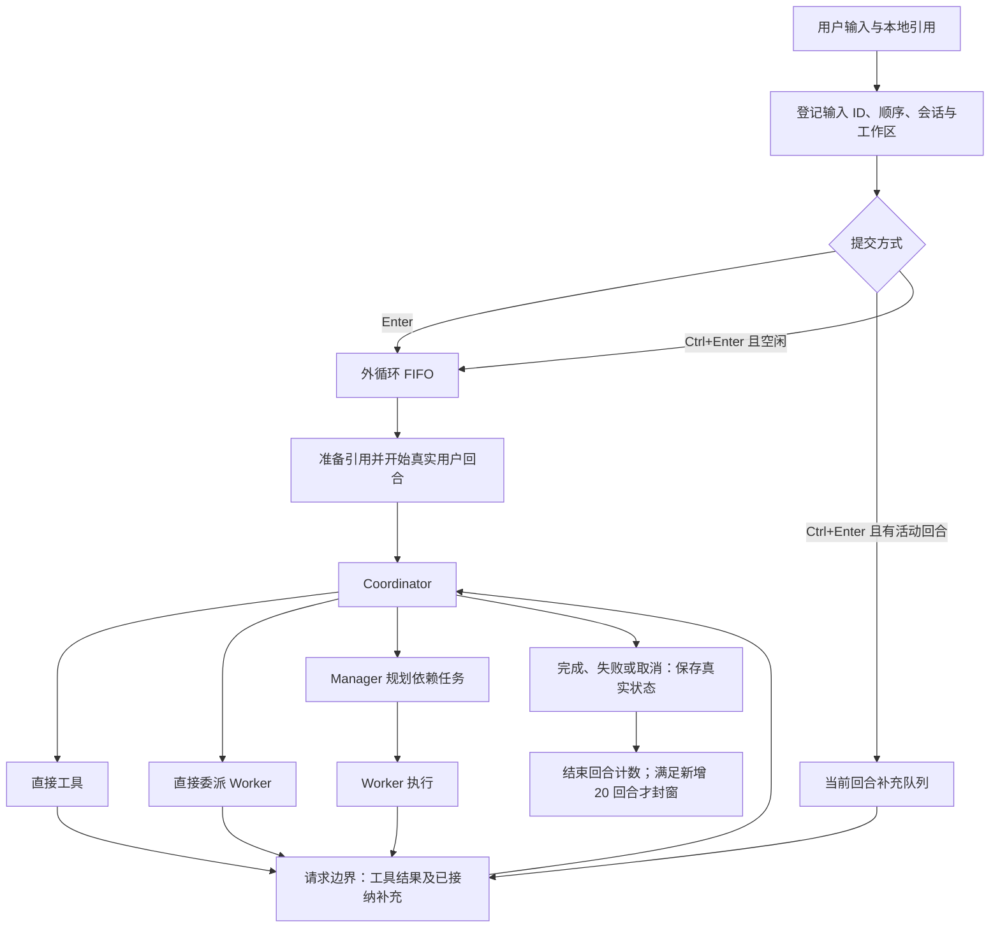
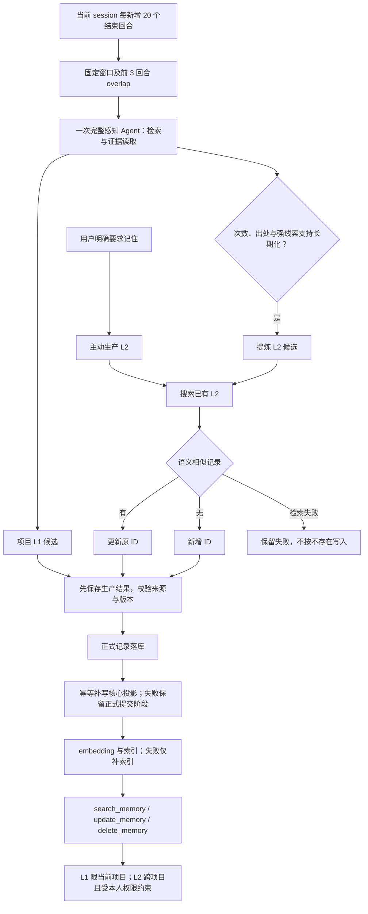

# RedLotus 现行设计

> 本轮代码已通过 `9b7e95c8` 完整撤回 12 模块整改版本，恢复到 `ca98b811`。用户要求功能完整、原则上 6 模块且必要时最多 8 模块、每模块最多 5 个 Python 文件、每文件最多 500 有效行；物理行数不限。当前正在重新精简，旧版通过记录不代表新版已通过。

## 状态说明

- **已实现**：有对应代码路径；是否真实验证另行说明。
- **已确认但未完成**：用户已明确要求，仍缺实现、质量验证或完整交付。
- **尚未真实验证**：没有当前版本、对应入口的充分真实证据；本地检查不能替代。

## 现有职责与八模块边界

本次整合采用用户新授权的必要扩展：`ui` 独立承载 CLI/TUI、可复用控件与展示，入口把展示能力注入 core 和工具，core 不再创建终端控制器。`sessions` 独立承载会话日志、事务恢复、输入控制、上下文数据和存储清理，提供渠道、编排及记忆共用的会话边界。两者分别消除反向界面依赖和会话文件的多重职责；不会新增第九模块或用空代理保留重复实现。隔离子进程验证 runtime、sessions 不加载上层模块，core 不加载终端，tools／memory 不直接加载 core。

| 板块 | 文件数／单文件最大有效行 | 职责与边界 | 状态 |
| --- | --- | --- | --- |
| `core` | 5／498 | Agent 工厂、模型请求、任务调度、压缩、用量与应用编排 | 任务状态和 Manager／goal 调度集中到 tasks；不创建终端 |
| `tools` | 5／473 | 身份工具集合、注册和执行检查、文件引用、文档解析、浏览器及 Skills | 已实现 |
| `api` | 5／430 | CLI 启动与配置向导、QQ／微信消息接入、本人身份判断、附件转换 | 启动及渠道适配器已复用共享会话入口；真实账号验收待办 |
| `prompts` | 2／72 | 提示词资源、组装、系统信息及会话快照 | 已实现；正文变更仍受单独审批约束 |
| `memory` | 5／398 | 记忆生产、证据与消费、LanceDB、embedding／rerank 和索引恢复 | 已实现；完整质量门槛未完成 |
| `runtime` | 4／334 | 配置、工作区路径、日志、HTTP 客户端与模型连接、锁及原子 I/O | 四个文件；独立导入不加载应用层 |
| `ui` | 5／496 | CLI／TUI 控制、命令、展示及 Textual 原生控件 | 五个文件；展示通过入口注入；控件共享同一输入及会话控制器 |
| `sessions` | 5／372 | 会话事务、证据视图、输入代次、上下文数据及存储清理 | 五个文件；SessionFile 继承真实日志事务实现，共享取消与保存边界 |

CLI/TUI 和渠道适配器进入统一的 AgentSystem 会话接口。工具通过工厂获得调用身份和工作区；记忆服务使用会话证据和统一模型入口。代码规模要求及逐函数审查状态见[开发约定](development.md#代码组织与精简)。

以上八个模块是当前实现，已达到本轮允许的模块上限。工具执行实现在 `tools/worker_tools.py`，Agent 构造、运行与注册通过已存在的工厂注入；不保留重复转发模块。重做保留已有功能，应用有效行必须少于基线 10,373 行，代码删除行数大于新增行数；逐函数以职责、调用关系和删除后具体行为损坏的证据验收。不得挤行、将业务实现藏入资源／测试、硬删功能或人为制造崩溃来达标。功能改造和测试审批均执行同一约束。

## 请求执行

**已实现：**输入在附件解析前登记；解析完成速度不能改变原提交顺序。请求边界固定补充消息范围，等待该范围解析，再按顺序接在工具结果后；更晚的补充进入后续边界。加急显示为普通用户消息，不添加“加急”标签或说明。

- `/stop` 停止当前操作及所属补充，保留独立普通任务队列。
- 清空、加载、切项目和退出使旧代次的迟到结果失效；切换期间锁定输入。
- 加载采用先完整准备、再提交切换；取消或准备失败保留原会话、草稿、引用和资源。
- 同一回合的工具往返、重试、中间回复、补充及子 Agent 内部消息，不增加用户回合计数。
- 退出取消子 Agent 和感知，不等待模型完成；清理使用既有退出期限并保留可恢复状态。

按键检测仅用于开发验收，正式程序不包含检测页面、按钮或启动校准。仅 Enter 与 Ctrl+Enter 分别承担两种提交行为；不使用 LF／Ctrl+J 兼容加急，不恢复文字加急命令。Windows Terminal 曾由用户物理验证；PyCharm Classic 的事件不可区分问题仍存在，新环境须在测试阶段实际检测。程序不会自动修改终端设置，Textual 注入事件通过不等于物理按键通过。

## Agent 与工具边界

**已实现：**英文函数 docstring 是工具描述来源，Pydantic AI 根据函数签名和类型生成参数定义。不得用外部 Markdown 覆盖描述、修改 `__doc__` 或决定注册内容。

| 身份 | 注册范围 |
| --- | --- |
| 本人 Coordinator | 下表执行工具，另加 `execute_task_with_manager`、`execute_task_with_worker`、`resume_task` |
| Manager 规划 | `create_todo_list`、`get_todo_list`、`ask_user`；本人权限下加 `search_memory` |
| Manager 最终汇报 | 不注册规划工具 |
| Coordinator 直接委派的 Worker | 下表执行工具，包含浏览器 |
| Manager 委派的 Worker | 同一执行集合，排除浏览器 |
| 感知 Agent | `search_memory`、`read_evidence`、`read_reference` |
| Compressor / Title | 无业务工具 |
| 未绑定本人的渠道 Coordinator | 当前实现只提供文本对话，不注册执行或个人记忆工具；实际渠道边界尚未真实验收 |

| 执行工具组 | 函数清单 |
| --- | --- |
| 常驻读取 | `list_files`、`read_file`、`search_in_files`、`search_web`、`ask_user`、`read_reference` |
| 文件修改 | `write_file`、`edit_file` |
| 命令 | `run_command`、`execution_environment` |
| 文档与生成 | `extract_text`、`generate_image` |
| 本人记忆 | `search_memory`、`remember`、`update_memory`、`delete_memory` |
| Skills | `list_available_skills`、`get_skill_instructions`、`load_skill_resource`、`refresh_skills`、`execute_skill_script` |
| 浏览器 | `browser_navigate`、`browser_get_content`、`browser_screenshot`、`browser_click`、`browser_fill`、`browser_press_key`、`browser_wait_for_selector`、`browser_evaluate`、`browser_close` |

Worker 使用 SDK 原生能力组：读取工具常驻，其他工具按组渐进加载。Coordinator 直接执行复用完整函数集合。Skills 的名称与简介进入会话提示词快照，正文和资源按需读取；磁盘 Skills 在后续用户回合重新发现，不重写已固定的 system 快照。

计划创建、派发和结果转换经同一会话的持久化回调保存；依赖批次等待完成状态落盘。加载时把中断的 running 标成 unverified，取消及未验证结果不进入自动重试。`resume_task(task_id)` 只恢复指定阻塞任务，取用当前会话实际接纳的新用户输入，保留其他已完成结果；重新提交相同任务定义不能解除阻塞。

Worker 输入分别标明父目标背景、唯一分配的任务 ID／描述、已完成依赖结果及用户补充；结构化结果仅描述该 Worker 的任务。真实 API 首测暴露过 A、C 同时执行 C 的追加操作，调整输入结构后重测为 A 等输入、C 执行一次。C 的首次产物仍有行尾空格，不能据此宣称产物验收完全通过。

Manager／Worker 续执行从历史复用基础 instructions；SDK 的动态工具说明不作为基础提示词再次拼入。请求元数据保存静态前缀长度，旧会话依据 SDK 自身的目录标记兼容读取。真实续跑曾暴露重复追加 6,701 字符；修复后相同 Worker 的新请求提示词指纹恢复为首次值。压缩候选与普通检查点共用保存回调，保存成功并核对会话及取消状态后才采用。回合清理保留未完成计划任务的 Worker 上下文。真实自动压缩阈值和全部新建／重建身份路径仍待完整验收。

同一 session 的工厂线程上限为已确认的 16，Worker、Manager 及感知按实际工厂调用共享额度；取得名额后才创建线程。等待名额不另开 Agent 线程，工具调用不单独算 Agent。这个上限不是整个进程的操作系统线程总数。

### 执行环境与保护

源码和 pip 使用启动解释器；EXE 寻找 PATH 中已有的外部 Python。没有外部 Python 时仅阻止相关 Python 功能。命令和 Skill 共用检查入口，保留日常 Git／SSH 等用户环境；外部命令环境筛除模型凭据，依赖缓存与 TEMP 指向项目 runtime。

已确认的进程保护作为工具业务逻辑保留：检查命令位置、静态包装和已识别的进程 API；普通字符串、注释及业务对象同名方法不应被误拦。已识别启动调用无法确定目标时拒绝并要求明确命令。取消只处理确认归属当前调用的资源，不按端口判断所有权，不引入 Windows 权限库、Hook 或账户隔离。

**边界：**这不是任意代码或第三方程序的系统级隔离；未登记且已脱离的后代进程不承诺全面回收。Playwright 驱动默认环境及全部浏览器临时目录归属，尚未完成隔离验证，不能将命令入口的验证结论套用到浏览器。

## 本地引用与交付审查

**已实现：**引用只接受本地图片或文件。保留中文、空格、单双引号、花括号、相邻引用及多文件输入；规范路径按首次出现顺序去重。数量和字节限制读取配置，已确认的常规边界为 20 个原始文件、未另声明时单文件 20,000,000 字节；发送前还检查声明的请求限制。

`@HTTP(S)网址` 应报“引用仅支持本地文件”并保留输入；普通正文网址保持文本。渠道附件在登记输入后逐一下载为真实内容，任一失败都报告文件身份和重试信息，不向模型执行残缺请求。`read_image` 已删除；本地图片由 SDK 按实际 MIME 编码为 base64 data URL，不能只发送文件名。

引用建立不可变快照，按内容哈希复用；恢复会话继续关联原快照。正文带文件身份、内容范围和定位，不能冒充用户指令或主动记忆要求。PDF、Word、Excel、PPT、CSV、Markdown／HTML 等保留对应结构；旧 DOC／PPT／XLS 转换需要现有 LibreOffice。扫描材料可带页面图片，不承诺未验证的格式质量或视频识别。

`read_reference` 读取登记快照，`read_file` 读取项目磁盘当前文本，`extract_text` 解析文档。文件错误应返回可恢复结果并保持调用配对；不能静默漏文件。审查模式保留逐块决定、撤销及外部修改冲突检查；核验依据是实际文件，不是界面是否显示成功。goal 持续迭代保留目标、约束、完成状态和未决事项。

## 会话与数据存储

**已实现：**项目以当前打开文件夹为边界，不向父目录查找项目。配置指定项目路径，全局 LanceDB 仍位于用户数据目录；已撤回 SQLite 方案，不保留两套运行后端。

| 数据 | 归属与保存策略 |
| --- | --- |
| 主会话 | 项目 `.redlotus` 内按 session ID 保存 `model_messages.json` |
| 其他角色 | 同目录懒创建 `model_messages.<role>.json`，同角色按 Agent／调用身份区分 |
| 会话索引 | 轻量摘要元数据，不复制聊天正文 |
| 引用原件与解析快照 | 项目 `WorkDatabase/references`，普通退出不删除 |
| 项目日志、感知进度、`AGENT.md` | 项目 `.redlotus`；进度与恢复必要状态随会话保存 |
| 产物、依赖缓存、临时文件、技能 overlay | 项目 `WorkDatabase` 及其 runtime |
| 正式 L1／L2 与向量索引 | 用户 `~/.redlotus` 下配置指定的 LanceDB；按作用域和项目隔离 |
| 核心长期投影 | 用户数据目录中的 `LongTermMemory/MEMORY.md` |

角色拆分是对早期“整个 session 只有一个文件”要求的后续明确调整：每个角色恢复文件只保留自身必要上下文，主会话保留子任务调用和返回，不混入子 Agent 全部内部历史。完成且已交付的 Worker 正文可清理，累计 usage 保留。

增量批次用 `json.dump` 缩进写入；正常提交后文件保持合法 JSON。消息、工具关系、提示词快照、引用身份、任务状态、计数和感知进度按事务提交，包含序号与完整性校验。清理只处理已无恢复或待感知用途的正文，不丢累计统计。已提交批次不因普通节点保存而反复完整序列化。

尾部半写只在能确认损坏范围时恢复上一完整批次；中间损坏或后方存在有效提交时拒绝自动修复，保留文件。未完成工具配对补“结果未知”回执，不自动重放副作用。旧混合角色记录仍可读取，拆分成功后才移除重复保存。

启动有历史时选择新建、恢复或取消；无历史时首次输入才创建恢复文件。恢复沿用原 session ID、文件、提示词和计数。保存失败不得假报成功：按已配置且获确认的七天历史清理及缓存清理策略处理空间不足，保护活动会话和正式数据；仍失败则暂停，保留内存进度和队列，下一次普通输入先重试原保存。权限／路径错误不触发无效清理。

## 模型、配置与上下文

**已实现：**三层配置逐字段合并并返回独立副本：本地 JSON → 本地 `.env` → 全局 JSON。源码基准为仓库根，pip 为启动目录，EXE 为程序目录；不向父目录搜索、不从解压目录读取业务配置。宿主环境变量不覆盖业务参数，既有显式路径选择用于隔离；不存在全局 `.env` 第四层回退。

空白凭据继续查找下层；有效的 false、0、空列表及允许的 null 保持语义。类型错误或损坏 JSON 报来源和字段，不静默忽略。配置命令仅写既有本地 JSON，否则写全局 JSON，不回写整个合并结果。随包配置复制与隐藏模板已删除；完全无配置的首次使用尚不具备已验收的完整填表初始化流程。

模型标识采用 Pydantic AI 的“服务:模型”路由，地址和凭据由统一入口注入。没有新增 provider 配置；`parallel_tool_calls=True` 是用户明确批准的例外。模型、采样、RAG、超时及压缩政策取自现有配置。非当前实际服务的协议适配只能记为代码／辅助检查覆盖，不能称真实跨服务验收完成。

首用向导与配置读取共用字段契约。内置能力的必填关系写在 schema，运行时仍枚举实际配置身份；schema 的范围校验不是默认配置。新增必填字段为 `agent_run_policy.max_task_retries`、`storage.cleanup.log_retention_days`、`storage.cleanup.session_log_max_bytes`。QQ／微信额外收集 `bot` 下的执行期限、回复期限、分块长度、闲置保留期、清理间隔及问答期限，具体字段见契约；CLI 不强制填写未使用的渠道策略。重试上限始终取当前配置，恢复的旧任务不能用已保存的旧上限绕过新设置。日志轮转阈值按会话上下文快照读取，清理保留期在实际清理时读取。工具默认等待值等剩余运行策略仍需逐项审查，不能宣称所有字面量均已消除。

### 提示词与压缩

会话 system 保存 Skills 布局及简介、系统信息、行为约束、长期记忆和项目 `AGENT.md` 快照。新增时间、补充输入和工具结果随新消息追加；记忆写入不重写当前会话前缀，恢复沿用原快照。

自动压缩按“有效上下文容量 × 配置比例”判断，比例已确认为 0.9；例如容量为 1,024,000 时阈值为 921,600。容量优先角色 `max_context_windows`，否则查询既有 OpenRouter 元数据。使用最近已报告的服务端输入 Token，在模型请求边界检查，不扣除最大输出预算提前触发，也不把含历史思考的字符估算冒充实际用量。新增长材料在首次发送前的实际 Token 尚未知，不能声称已经精确测量。

首尾保留量来自角色配置；压缩内部字段不发给模型 API。压缩候选先校验并持久保存，成功才替换运行上下文，失败保留历史。手动 `/compress` 串行执行、不增加用户回合，停止或切换使迟到候选失效。Compressor 已确认使用 max 思考及 131,072 最大输出；这些值仍由配置提供，感知独立使用所选角色。

待压缩正文不预先截断工具、引用或证据。**已确认但未完成：**最终版本在实际自动阈值下的摘要保真和三环境长会话验收；手动压缩成功不能替代这项验证。

## 感知与记忆

| 层级／入口 | 规则 | 状态 |
| --- | --- | --- |
| 主动生产 L2 | 用户明确要求“记住”，立即登记生产，不等待自动窗口 | 已实现；有真实生产与更新证据 |
| 感知生产 L1 | 只根据当前 session 的封存回合生成项目情景 | 已实现；完整 60 回合质量复核未完成 |
| L1 提炼 L2 | 保存独立次数与出处，由模型结合强线索判断；不设固定次数门槛 | 已实现；完整多样场景质量尚未真实验证 |
| 记忆消费 | 三个工具：`search_memory`、`update_memory`、`delete_memory` | 已实现；有局部跨项目及遗忘实测 |

明确长期表述可以一次构成强线索；临时要求不能成为长期偏好。工具往返、助手复述、重试、恢复和 overlap 不增加独立证据次数。全部 L2 生产先搜索：语义相似则更新原 ID，无相似项才新增；搜索失败不能当作空结果，提交前核对版本，避免并发重复。

自动窗口不扫描其他 session，也不重复消费已封存的新回合：

| 已结束真实回合 | 新消费 | 衔接 overlap |
| --- | --- | --- |
| 0–19 | 不调度 | 无 |
| 20 | 1–20 | 无 |
| 40 | 21–40 | 18–20 |
| 60 | 41–60 | 38–40 |

新建、加载、清空、切项目和退出不额外产生不足 20 回合的任务。加载第 19 回合后的第 20 回合应形成首窗。失败窗口保留原身份与状态供后续重试；自动任务数与 API 请求次数分别统计，一次感知允许多次工具／模型往返。无记忆价值可以完成消费并返回空结果。

`search_memory` 同时支持搜索和按 ID 读取完整记录及关联引用；`remember` 是生产入口，不算第四个消费工具。各入口检查 L1 项目归属及本人权限。更新、遗忘和清空的版本边界优先于旧任务，不能由 overlap 或过期索引恢复旧事实。五种任务结果与 L1／L2 层级分开。

正式记录和索引继续使用 LanceDB，保留 embedding、向量候选、相似度过滤、rerank、分块去重与服务不可用时的文本回退。embedding 在写锁外执行，写入前重新核对正文及有效状态。索引失败只补索引，不重新调用模型生产。

记忆候选沿用现有持久化任务，保存生成时的版本和核心文件快照。先校验版本与手工修改，再提交正式记录并保存提交阶段，最后原子更新 `MEMORY.md`；投影失败恢复该阶段，不重新调用模型，也不覆盖后来提交的新版本。新会话只注入与正式记录版本一致的托管块，保留非托管手写内容；同一会话仍复用首次快照。投影失败回执明确区分“正式记忆已保存”和“核心投影尚未完成”。

感知在后台静默执行。准备、等待额度、API、工具、保存及索引耗时应分别记录；用户已允许真实 API 延迟超过早期一分钟标准，但不接受框架反复消费、无限积压或退出等待模型完成。每 60–120 个真实回合通常对应 3–6 个自动窗口，主动记忆另计。

## 展示与统计

**已实现：**主 Agent 的服务端思考与正文独立流式展示，执行时展开思考、结束后折叠并允许手动展开。不展示签名或内部标识，不伪造思考内容；子 Agent 使用自身状态和结果展示。

| 区域 | 统计口径 |
| --- | --- |
| 会话 API 用量 | 历史会话表中显示时间、标题、Agent、响应数、准确 Token 数及相对条形；最近 20／全部范围 |
| 新增用户输入 | 按真正进入回合的输入 ID 计正文，同一引用内容哈希在会话内只计一次；标注文本估算 |
| 模型与推理输出 | 按唯一响应累加；推理是输出子项，拆分后不重复相加 |
| API 实际用量／`/usage` | 服务端累计输入、输出、缓存命中与未命中；历史重发确实消耗的输入仍计入 |
| Running／Queued | 当前前台 Agent 的实际运行和等待额度状态，不把工具、标题、压缩或感知混算 |
| 计划任务进度 | 来自任务清单，与 Agent 状态分开；没有清单显示“暂无计划任务” |

图片等无法独立计量的附件、缺失 reasoning 或旧会话统计缺项，必须明确标注未知／不完整。压缩、角色正文清理和恢复不能重复输入计数，也不能清零累计用量。缺 usage 的请求不能被当作零消耗来证明缓存达标。

## 验收状态与已知缺口

**当前不能 LGTM。** 应用及两个 EXE 候选为 `5de4006b`，沿用 `03acaea2` 的原生 onefile 解包。相对重做基线 `ca98b811`：8 个模块、36 个应用 Python 文件，每模块最多 5 文件、每文件最多 498 有效行；总计 10,305 有效行，少 68 行，应用 Python 毛新增 5,958、毛删除 6,181。第三方 Skills 资源另计，不能借此排除自有实现。逐函数必要性与完整发布门槛没有因数量达标而通过。

源码完整辅助回归为 **161 项通过（38.28 秒）**，日常环境实际安装的 wheel 同样 **161 项通过（37.94 秒）**；清空源码导入路径验证安装来源，另一个隔离安装环境的依赖检查通过。覆盖文件外部编辑／删除、LF 与 CRLF 字节恢复、写盘失败、记忆事务、任务取消／恢复、上下文账本、输入顺序、配置、QQ 公网地址／TLS／回退、原生类型化附件、终端中断及资源回收。本批没有增加应用或测试文件。故障注入与网络夹具使用隔离数据，不能替代真实 API、机器人账号和跨平台验收。Ruff 与 whitespace 检查通过，14 个受保护配置及提示词指纹未变。日常共享 Python 环境的 `pip check` 仍返回六项第三方依赖冲突，见 `qq-tls-daily-pip-check.log`；本次 `--no-deps` 只替换 RedLotus，没有更改冲突软件的依赖。

### 当前候选与真实入口

| 入口／制品 | 本批实际证据 | 边界 |
| --- | --- | --- |
| 源码微信原生 SDK 至模型与图像服务 | 两个同前缀模拟本人身份各生成一张 512×512 图片；蓝色／橙色方块内容与各自目录核对通过。2 回合／4 次模型响应，结束后会话和 HTTP 池归零 | `channel-directory-source-live.json`；真实模型及图像服务，回复传输为夹具。图像服务未报告用量，不按零消耗处理 |
| 日常 pip 双渠道并发 | 实际安装包并发执行命令计算，分别返回 15833／16571；清空 A 后 B 仍记得 16571。3 回合／5 次模型响应，目录分别使用完整身份，资源释放完成 | `channel-directory-pip-live.json`；原生微信消息类型，未登录真实账号；渠道产物目录不是安全隔离边界 |
| onedir 5de4006b | 实际输入 19 回合后退出，从启动选择器恢复同一会话并完成第 20 回合；只封存一个窗口，正式 L1 保留全部 19 条事实，索引完成，无全局记忆。20 主响应＋1 标题＋2 感知响应，用量无缺失，退出 0 | `5de4006b-window-live.json`；20＋3 取现有配置，首窗 overlap 为 0；提示词指纹及恢复前用量不变。未触发自动压缩，不代表完整长测 |
| onefile 5de4006b | 实际 EXE 用包内浏览器打开 Example Domain、读取标题并关闭；1 回合／5 次响应，标题单列，用量无缺失，活动 Agent 为 0，退出 0 | `5de4006b-onefile-live.json`；所属进程及显式 E 盘 TMP 下原生解包目录均回收；不代表任意路径或跨平台通过 |
| wheel／sdist | `packages-5de4006b/inspection.json` 核对应用与资源；日常和独立环境均安装 wheel，后者依赖检查通过 | wheel SHA-256 以 `99d2cbcd` 开头；同版本 1.0.1 本地候选，未公开发布 |
| 新 EXE 资源 | `frozen/5de4006b-manifest.json` 核对 33 个可达应用模块的编译代码、2,670 项资源、schema、包内 Chromium 和私人配置排除 | onedir／onefile 指纹以 `e39fd151`／`35ef58ef` 开头；构建使用 Python 3.12.13、PyInstaller 6.20.0；QQ／微信仍为源码／pip 入口 |

本批四入口新增 26 回合、37 次模型响应，输入 316,692／输出 34,807 Token，模型 usage 无缺失；标题、感知单列在 `5de4006b-entry-summary.json`。另外两次图像生成及索引服务不混入模型响应总量，也不假定零用量。onedir 感知耗时约 136 秒，其中模型 API 约 134.45 秒；主 Agent 本场景缓存命中约 93.40%，不足以关闭三环境整体缓存门槛。首次微信驾驶器缺少 SDK 必填 timestamp，在 API 调用前失败，原结果保留。

本次缺陷来自 `BotBase._agent_for_session` 在共用命名入口之前固定截取 20 字符，使两个不同身份混放产物。删除切片后复用 `storage.filename_max_chars`，没有另建命名器或移动既有文件；配置短名称仍可能形成同名目录，不能夸大为账号隔离或覆盖事故已获证明。`channel-directory-before.json`／`channel-directory-after.json` 和原有测试的失败／通过记录保留直接对照。

此前 `4825e43b` 的同步退出包装删除及四种退出控制仍按原证据解释。该版本 pip 附件回答的反引号差异也继续保留：另一次明确纯文本要求成功，没有关闭原题稳定性缺口，详见 `4825e43b-pip-format-analysis.json`。

独立审查定位 FileLock 的 singleton 参数冲突，以及 CONNECT 502 对应的 `ProxyError` 未进入地址回退；两项各改一个现有语句，无新增应用文件或函数。完整回归前的首次 pytest 调用因共享临时目录权限未进入测试，随后改用显式隔离路径保留红绿结果。构建专用 venv 没有 build／pip，wheel 改由已有日常 Python 的 pip 调用 setuptools 后端生成，没有为此增加依赖。

onefile 原来强制在项目 `WorkDatabase` 解压，新的 264 字符目标再次失败。`03acaea2` 移除此覆盖后，同一工作目录和 E 盘 `TMP` 下的目标为 218 字符，注册表未改；正常退出由 bootloader 清理临时展开目录，项目会话和数据归属不变。两版资源名称全部相同，2,669 项字节相同，`base_library.zip` 的成员内容也逐一相同。`0b876831-onefile-deeper-red.json`、`0b876831-onefile-explicit-temp-red.json` 保留失败；原版本在较浅目录恢复 4 回合并新增浏览器回合的结果单列在 `0b876831-onefile-live.json`，其历史缺 usage 仍为 1，不能混算为新版本新增测试。

旧记忆接口兼容证据 `memory-reader-contract-live.json` 使用隔离正式记录及真实检索服务：四次 embedding、两次 rerank，后者 usage 未报告。项目 episode 过滤、不同返回结构、无效／已删除／外项目记录的拒绝及本人权限通过；接口外部使用需求仍未确认，继续保留。该证据对应 `45937e81`；其原生 QQ 三场景及回复复用对照仍按 `qq-sdk-native-reply-*-live.json`、`qq-native-reply-comparison.json` 的原提交解释。

原生 SDK 验证发现三个此前夹具未暴露的问题：装饰器不能给绑定方法写入注册属性；接收段使用 `msg_seg_type` 和实例字段，旧读取会漏掉附件；正常前端退出不发送原清理回调，导致循环关闭后遗留 HTTP 客户端。分别保留 `qq-sdk-bound-method-red.json`、`qq-typed-red.log` 和 `qq-sdk-frontend-red.json`。当前直接复用原生注册方法与标准库绑定，在连接协程的 `finally` 释放资源，源码及已安装 wheel 均实际经过该前端。早先手工触发 shutdown 回调的成功记录不能证明 SDK 会触发它，已由实际前端失败和修复证据纠正。

`6e1911b1` 安装包失败群聊没有本人工具权限，持久化响应确为文本且无 `tool-call`；没有执行文本中的命令。原始 HTTP 响应未单独抓取，不能进一步归因到服务内部哪一层。首次事后分析错用仅返回计数的账本接口，改从 `SessionFile.model_messages` 读取后完成核对，没有新增 API 调用。随后仅对 `tool_choice` 做一次省略／显式 `none` 对照：两次原题都返回正文 `12017`，没有结构化工具调用，结束原因为 `stop`。这与 [DeepSeek 的无工具默认行为](https://api-docs.deepseek.com/api/create-chat-completion/)一致，未证明参数缺陷，故没有加入协议补丁；原失败及回答稳定性门槛继续保留。协议诊断与本批源码／pip 用量分列在 `45937e81-entry-summary.json`。

原生 SDK 的两个 WARNING 分别是隔离插件目录首次创建、夹具中 localhost 监听值与 127.0.0.1 主机名不同；均按 SDK 校验源码解释，不算真实连接通过。SDK 的继承环境 `LOG_FORMAT=json` 冲突及密码检查正则差异另有原始记录，测试只调整自身进程和公开夹具，没有修改产品环境或供应方代码。

### 此前的入口证据

| 入口／制品 | `6d9b8f86` 实际证据 | 边界 |
| --- | --- | --- |
| 源码／日常 pip | 分别计算 167×41=6847、173×43=7439，各 1 回合／2 次响应；面板四列、标题单列，usage 无缺失、活动 Agent 0、退出 0 | pip 使用本批 wheel；不是公开发布或版本升级 |
| onedir | 实际运行新 EXE，模型通过命令工具算出 179×47=8413；1 回合／3 次响应，面板、usage、退出均核对 | 本批未重复此前浏览器场景 |
| onefile | 在原深目录恢复 2 回合会话；补测 181 * 53=9593，面板显示未知用量，退出 0 后两个所属进程及解压目录消失 | 首轮终端输入丢失乘号，已取消并保留；本批新增 1 成功＋1 取消回合／5 次响应，累计 4／13，其中 1 次缺 usage，不计为零消耗 |
| 微信 SDK 至真实模型 | 从核验指纹的 wechatbot-sdk 0.2.1 wheel 加载真实 SDK，经过注册、原生 `_dispatch`、应用处理、真实模型及 read_file；1 回合／2 次响应、usage 无缺失，停止和资源释放已到达 | 登录、启动接收和回复传输为本地夹具，没有登录账号或对外发机器人消息 |
| 原生复用对照 | 四个日志回调的级别、正文与参数契约相同；Rich 在 40／80／140 宽度及已知／未知用量的六组渲染逐项相同 | SDK 过期／错误日志是明确的故障夹具；驾驶器不等于物理键盘测试 |
| wheel／sdist／EXE | `packages-6d9b8f86/inspection.json` 核对 36 个应用文件和 schema；`frozen/6d9b8f86-manifest.json` 核对两个 EXE 的 33 个可达 Python 文件的编译代码、2,670 项资源及包内 Chromium，排除私人配置 | 使用 Python 3.12.13、PyInstaller 6.20.0；sdist 包含随后的文档提交，应用代码身份仍为 `6d9b8f86` |

逐入口账本见 `6d9b8f86-entry-summary.json`，onefile 的原输入、取消和回收见 `6d9b8f86-onefile-live.json`。该批微信 SDK 最终证据为 `native-reuse-sdk-live-verified.json`；第一次驱动把 Literal 当作枚举，在调用模型前失败，第二次完成真实请求但误把 DEBUG 入站日志计入四个回调，分别保留在 `native-reuse-sdk-live.json`、`native-reuse-sdk-live-corrected.json`，没有覆盖成通过。该批 wheel 指纹以 `476b18ff` 开头，onedir／onefile 以 `32942d50`／`5b363c68` 开头；完整指纹及 sdist 文档身份以制品检查记录为准。

### 此前已记录的真实证据

以下证据保留各自应用提交及首次失败，不计作当前候选重新执行的测试。

| 入口／制品 | 当前证据 | 边界 |
| --- | --- | --- |
| 源码 Textual 与模型 | 真实 `ask_user` 追问／补充，搜索省略数量时返回配置的 2 条，CRLF CSV 最末行 omega=99 正确进入模型；实际写文件后按 n 撤销，原始 LF 文件逐字节恢复 | 初次真实验收发现换行丢失，失败记录保留；修复后重新完整执行 |
| 源码原生 UI | 面板和状态栏都显示配置的 0.2 秒；Shift+Tab 三模式、真实输入补全、加载按钮和选中恢复、恢复后 Ctrl+Enter 单次提交、Ctrl+Q 退出均已观察 | 驾驶器事件不是 Windows Terminal／PyCharm 物理键盘测试 |
| 流式与账本 | 67 次实际预览中 7 次按配置裁剪，正文及三回合完整保存；7 次真实模型响应，主 Agent 6 次与标题 1 次分列；51,816 输入／693 输出 Token，usage 无缺失，活动 Agent 0、资源释放 | 缓存约 81.77%，不满足 >90% 发布门槛；辅助角色仍须单列 |
| 最终源码入口 | 从当前提交恢复日常 pip 的 1 回合会话，模型按上一轮因子各加 1 算出 6720；新增 1 回合／1 次响应，累计 2／3，usage 无缺失、活动 Agent 0、退出 0 | 本次与 pip 共用隔离会话，恢复不重跑上一回合；详见 `7b8344d0-entry-summary.json` |
| 渠道生命周期补验 | 已配置的模拟本人实际调用 read_file，通知送达对应输入；慢回复和排队输入跨过空闲期限仍保留，空闲后关闭旧会话，再输入创建新会话。成功 3 回合／4 次响应，usage 无缺失，收集任务和 HTTP 池释放 | `channel-lifecycle-owner-live.json`；使用公开隔离配置的 0.5 秒空闲期限及本地回复接收端，不是机器人真实传输或长期资源测试 |
| TUI 正式退出链路 | 从 run_cli 经正式 run_textual_tui 进入原生 App.run_async；真实文件写入、浏览器及 ask_user 后，本进程原生 SIGTERM 触发停止。待答问题、审查订阅、面板、加载回调及五个浏览器所属进程全部回收，外层 run_cli 关闭 HTTP 池 | `tui-wrapper-live.json`；1 个成功回合＋1 个取消回合，合计 4 次响应、usage 无缺失；原生 auto_pilot 不算物理键盘验收，封存回合数 2 不等于成功回答 2 次 |
| 原生配置向导补验 | 真实终端 Esc 取消后文件字节不变；再次填写并确认只补齐公开测试配置中一个缺失字段，随后真实模型算出 151×43=6493，正常退出；1 回合／2 次响应、usage 无缺失 | `native-config-live.json`；测试策略最后逐字节恢复。仅覆盖缺项、取消、最小写回和启动衔接，不冒充全空配置的完整新人填写 |
| wheel／sdist | `packages-7b8344d0/inspection.json`：全部 36 个应用文件及 schema 与当前提交一致，无私人配置；日常 pip 和独立环境均安装，sdist 另核对 main.py 和 build.spec | 同版本 1.0.1 候选替换，不是公开新包发布或真实版本升级 |
| QQ 下载至真实模型 | 源码及日常 pip 对同一 python.org 附件先验证超时拒绝、未创建 Agent，再成功下载 537 字节，由实际配置模型准确列出五个 User-agent；各 1 回合／1 次响应，资源释放 | 入站消息与回复接收端是隔离驾驶器，没有登录机器人账号或调用 NapCat 文件 ID 接口 |
| 日常 pip 实际入口 | 当前 wheel 在简单终端取消启动快照选择、清空草稿，再由真实模型算出 139×47=6533；1 回合／2 次响应、usage 无缺失；两次空行 Ctrl+C 相隔 6 秒按测试配置退出 0 | 测试策略最后恢复；草稿未进入持久化输入，未读正式数据；不是物理 PyCharm 测试 |
| onedir 实际 EXE | 新 EXE 加载列表分别显示 10／2 回合；恢复 10 回合会话后，包内浏览器读取 Example Domain、960×640、en-US 并关闭；新增 1 回合／4 次响应，累计 11／63，usage 无缺失、活动 Agent 0、退出 0 | 旧 CRLF 指定写入及原样复制仍未通过；本次浏览器成功不改变该失败结论 |
| onefile 实际 EXE | 新 EXE 在原失败深目录恢复 1 回合；真实浏览器读取 Example Domain、960×640、en-US 并截图；新增 1 回合／3 次响应，累计 2／8；浏览器保持打开时连按 Ctrl+C 退出 0，七个所属进程及解压目录全部回收 | `7b8344d0-onefile-live.json`；旧截图指纹不变；不保证任意更深路径 |
| PyInstaller 资源核验 | `frozen/7b8344d0-manifest.json`：新构建两个 EXE 的 33 个 CLI/TUI 可达应用模块与当前源码的原生代码对象一致，schema 和 Chromium 存在，私人文件未入包 | QQ／微信既有入口仍为源码／pip 模块；构建保留已解释的可选 pycparser 表及 pandas Styler/jinja2 警告 |

`7b8344d0` 的制品指纹见 `packages-7b8344d0/inspection.json` 和 `frozen/7b8344d0-manifest.json`。该版使用 Python 3.12.13、PyInstaller 6.20.0 构建，两种 EXE 均保留 2,670 项资源、schema 和包内 Chromium，未包含私人配置。`7b8344d0-entry-summary.json` 区分该批新增回合与旧版本累计，不能把恢复的 10 回合当作新测。

生命周期补验没有修改应用代码或重新构建制品，仍对应 `7b8344d0`。首轮渠道模拟身份未配置为本人，按既有权限不注册工具；服务返回了工具标记的普通文字，没有实际工具调用，不能计作通知通过。首轮脚本还误将用量读取接口的二元返回值传入统计，零响应统计无效；按原会话重新读取后确为 2 次响应且无缺失。首次失败及纠正分别保留在 `channel-lifecycle-live.json`、`channel-lifecycle-initial-analysis.json`，未覆盖成通过结果。

`b0a2eec2` 只将 onefile 原生解压根从 `WorkDatabase/runtime/pyinstaller` 改为启动工作目录下的 `WorkDatabase`，仍由 bootloader 创建唯一 `_MEI...` 并在正常退出时清理。在同一原失败目录、`LongPathsEnabled=0` 未变的情况下，最长目标从 273 降到 253 字符。前后资源名称全部保留；2,669 项外层资源字节相同，`base_library.zip` 仅成员顺序不同，155 个成员内容逐字节相同。原失败和新实际浏览器／退出证据分别保留在 `onefile-original-deep-red.json`、`onefile-project-runtime-live.json`，没有通过换浅目录或删资源取得通过。

`7b8344d0` 删除旧终端的 `_get_session`／`_loop` 两层单次转发，运行循环仍在公开 `run`。连按间隔来自 `ui.interrupt_repeat_seconds`。真实 Ctrl+C 复现了输入子任务的 `KeyboardInterrupt` 逃逸；现直接使用 SDK 的 `interrupt_exception=InterruptedError` 和原生 `eager` 绑定。启动快照选择也将实际中断归入既有取消结果，避免漏过主循环的处理边界。`legacy-repl-*-red.log` 保留各次失败；源码完整终端的真实 API、Tab 补全及退出见 `legacy-repl-source-live.json`，最终安装 wheel 的简单终端与启动取消由本批实际入口补齐。

`qq-tls-source-live.json`／`qq-tls-pip-live.json` 分别记录本批真实渠道链路；正常请求含下载及模型处理约 27.64／27.92 秒，原文件 SHA-256 相同。`qq-policy-source-live*.json`、`qq_native_ipv4_probe.json` 保留原失败，`qq_native_ipv4_socket_probe.json` 证实同步连接需要适配 `wrap_socket`。当前复用同一个适配函数覆盖原生 socket 与 BIO，在每跳独立 context 内恢复原域名，并保留 HTTPX 原证书信任来源及代理。TLS-in-TLS 的映射有辅助回归，尚未运行真实 HTTPS 代理验收。

`remaining-policy-live-initial.json` 保留初次真实撤销失败，`remaining-policy-live.json` 保存修复后的三回合证据。已查明最初文件恢复经过文本 I/O 自动转换换行；当前审查复用原子字节写入，完整 LF／CRLF 回归和真实 LF 原件恢复均通过。测试自身也曾假定 Windows 的 `write_text` 写出 LF，现夹具明确指定 LF／CRLF 字节，初次失败没有删除。

`onedir-146af307-crlf-attempts.json` 和 `onedir-146af307-crlf-copy.json` 逐项记录真实工具边界：源文件／read_file 返回 `6e6f7274680d0a736f7574680d0a`，模型后续 write_file 参数为 `6e6f7274680a736f7574680a`。工具精确保留参数，模型生成丢失了 CR；此复制任务仍失败，不能把模型对链路的推测当作已定位的工具缺陷。

此前 `b6b9dfcf` 的图像证据继续按历史版本解释：源码和日常 pip 分别真实生成白底蓝圆、红方块，均为配置的 512×512 JPEG；首次脚本误查任务图片目录的失败保留，核对原产物后纠正，没有重复收费调用。相关 `ui-image-live-verified.json`、`b6b9dfcf-entry-summary.json` 不算本次候选新做的图像请求。完整 diff 日志、审查和正式会话不受任何预览上限影响。

### 已完成整改的证据边界

| 整改 | 已有证据 | 仍保留的限制或首次失败 |
| --- | --- | --- |
| 文件审查与原子 I/O | 外部编辑／删除、再次写入、部分／全部拒绝、替换失败有实际文件回归；真实 UI 验证完整审查以及按 n 撤销逐字节恢复原 LF 文件；147 项回归含 LF／CRLF | 不能凭文件工具成功证明模型产物都符合用户要求 |
| 任务依赖与续执行 | 真实 Manager 保存 A 待输入、B 待依赖、C 完成；重启、补充后 A 再执行，随后 B，C 输入边界和产物保持不变 | 第一次模型恢复调用不存在能力，保留未验证；C 行尾空格及 B 格式答复偏差仍是原题失败证据 |
| 取消和持久化 | 真实 Coordinator 委派期间注入 Worker 检查点持续写盘失败，停止、清空、切项目均返回；取消回合准确保存；隔离回归核对压缩保存失败后没有新模型请求 | 故障发生于 Worker 模型请求前，不冒充模型生成中断全覆盖 |
| 记忆提交 | 正常画像跨会话读取；数据库故障保留候选，投影故障先保存正式 v1，重启后仅补写投影；感知模型调用次数不增加、版本不重复增长 | 首轮“虚构用户”被归为非画像资料，只算保存／检索；完整窗口、并发质量和三环境仍待办 |
| 记忆范围和分类 | 项目限定的即时请求在全局 L2 生产前拒绝，明确全局请求可保存；感知复用 Worker 模型仍计为辅助类别，原 ID 更新到 v2 | 旧误保存记录保留 deleted v2；不宣称新增手动项目记忆能力 |
| 共享渠道输入 | 微信适配器接真实模型，验证慢附件、后续文本、单附件失败、停止与清空；保存故障后新普通输入唤醒原保存，未重复调用模型 | 入站 SDK 消息是夹具、回复在本地；首轮未分类流式失败保留；真实账号未登录、未收发 |
| QQ 代理附件 | 先验证全部 DNS 答案，再按原顺序尝试已校验地址；重定向逐跳验证，socket／BIO 共用原域名证书身份；源码与实际 pip 在原代理环境完成失败拒绝及同题成功下载 | 同步下载线程不能被外层 asyncio 取消立即中断；连接失败回退的最坏等待为各地址超时之和，不声称提供附件总时限或立即中断底层 I/O |
| 上下文、压缩、用量 | 主／普通子／辅助账本去重和恢复；真实标题、Worker、手动压缩、重启续答；取消的压缩保留缺失 usage；提示词快照保持 | 手动压缩不算自动阈值通过；旧缺失用量不能补成零 |
| 配置与元数据 | 共享 schema 的空配置、类型、角色预设、三层覆盖、取消和最小写回回归；源码／pip／onedir 实际首问取消无落盘；真实 OpenRouter 缺失／null 容量回退；单字段真实补齐后续答 | 三种环境完整新人填写和真实升级没有完成；未修改私人配置 |
| 浏览器与命令 | 包内 Chromium 实际打开、读取、截图、关闭；恢复后旧截图未变。配置视口／区域及等待生效。Worker 的 1 秒命令超时后，独立观察器在子进程 600 秒自然结束前确认父子 PID 消失 | 早期命令被检查拒绝、一次 PID 检查太迟，均不能作为回收通过证据 |
| 图像取消 | 同一个原生 asyncio 超时覆盖提交、轮询和下载；各阶段超时、外部取消、跨域下载不携带 x-key 有隔离回归；真实服务成功下载已有证据 | 外部取消仅证明本地请求退出，不声称远端任务停止计费 |

前述历史整改证据保留在本地 `WorkDatabase/runtime/six-module-redo`：`channel_checkpoint_live.json`、`publication-*.json`、`memory-scope-live.json`、`reuse-source-live.json`、`runtime-policy-child-verified-evidence.json` 等。它们按各自应用检查点解释，不把旧制品的累计回合充作本次候选新增回合。旧逐次构建记录可用 Git 查阅；当前文档集中列现行事实，历史失败没有被改写为通过。

### 发布阻断与待办

| 门槛 | 当前状态与下一步 |
| --- | --- |
| 深目录 onefile | `03acaea2` 已在相同失败工作目录完成真实 API、浏览器和清理；原生临时目录选择不再被项目深度覆盖。验收使用显式 E 盘 `TMP`，未承诺任意临时路径、权限和跨平台都可用，未修改注册表 |
| 逐函数必要性／正交性 | 当前 991 个函数＋79 个 lambda；`necessity-current-reconciliation.json` 衔接 994 个 AST 未变节点、72 个修改和 4 个新增。`necessity-channel-directory-delta.json` 补充此次单函数修改；完全相同函数体扫描只命中两项 Protocol 声明，不能证明其他逻辑均正交或必要。旧记忆接口的外部需求、真实账号生命周期及全项目逐函数证明仍未完成 |
| 运行策略来源 | 已关闭原列出的轨迹、刷新、diff、重定向、图像、流式预览、会话展示、补全和搜索策略；通知／明细上限、名称长度、CSV 探测和 Ctrl+C 连按间隔也来自配置。渠道目录固定 20 字符截断已删除；剩余固定展示布局继续按职责评估，身份／协议格式不随意参数化 |
| 模型字节保真 | onedir 的 CRLF 指定写入和严格原样复制未通过。工具回执及模型下一次参数已分开记录；后续需验证模型对精确内容约束的遵守，不用事后文本相似或 shell 修正替代原题通过 |
| 无工具群聊回答 | `6e1911b1` 的真实计算请求得到 DSML 工具标记正文，没有答案；没有可执行工具调用，权限未放开。后续协议对照及本批原题成功未证明原因或解决方案，原失败保留，稳定性门槛仍未关闭；不把正文解析为工具调用或修改题面取得通过 |
| 长会话与自动压缩 | onedir 的第 19 回合恢复、20 回合首窗及事实保真已通过；其余环境及 40／60／100 回合窗口仍未完成。三环境各 100 主会话＋20 跨会话、合计 360 回合与每环境三次实际阈值自动压缩门槛继续保留 |
| 缓存和资源 | 主 Agent＋普通子 Agent 每环境总体缓存 >90% 未通过；辅助角色单列、缺 usage 保持未知。长期线程、进程、存储增长与浏览器默认环境仍需验收 |
| 真实渠道、模型、媒体 | QQ／微信本人权限及真实收发／附件失败／停止、四类模型协议、全部声明文档和媒体能力未完成。SDK 构造和适配器回放不能替代 |
| 平台、首用及升级 | Windows 定向场景已有证据；Linux／macOS 完整安装和核心真实流程未完成。三平台辅助 CI 已加入但未在远端运行；零收集为失败。完整新人填写、真实版本升级及公开发布未完成 |
| 终端按键 | 用户物理验证 Windows Terminal 可识别 Ctrl+Enter，PyCharm Classic 仍有协议限制。正式包没有按键检测页面；原生测试驾驶器注入不算物理识别 |

包内浏览器依照 [Playwright 官方 PyInstaller 说明](https://playwright.dev/python/docs/library#pyinstaller)安装并收集；系统已有浏览器不是制品完整性的证据。QQ SNI 边界参见 [HTTPX 官方扩展说明](https://www.python-httpx.org/advanced/extensions/#sni_hostname)，当前安装版本的代理路径与直接连接须分别验证。onefile 故障发生在 [PyInstaller bootloader 解压路径](https://github.com/pyinstaller/pyinstaller/blob/v6.20.0/bootloader/src/pyi_path.c)，不能由 Python 层已经启动后的处理解决。

未推送、合并或发布新版本。完整门槛尚未通过，不使用 LGTM 或“可合并且测试完全通过”描述当前分支。
