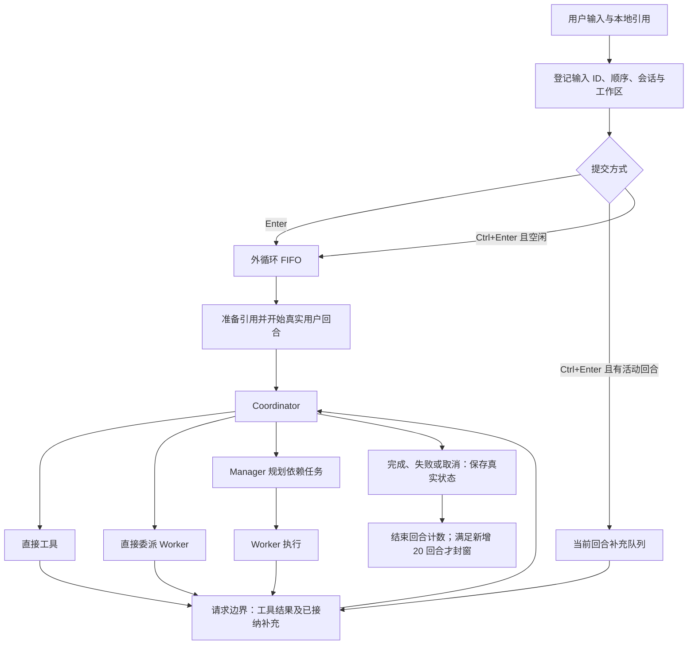
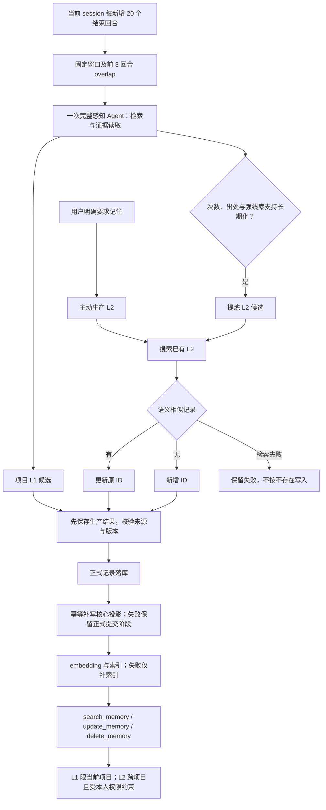

# RedLotus 现行设计

> 本轮代码已通过 `9b7e95c8` 完整撤回 12 模块整改版本，恢复到 `ca98b811`。用户要求功能完整、原则上 6 模块且必要时最多 8 模块、每模块最多 5 个 Python 文件、每文件最多 500 有效行；物理行数不限。当前正在重新精简，旧版通过记录不代表新版已通过。

## 状态说明

### `1.0.1-release` 执行边界（2026-09-24）

本轮已获准在 develop 完成整改与验收，全部未豁免门槛通过后合入 master。Python 包版本为 `1.0.1.post1`，标签 `v1.0.1.post1`，GitHub Release 标题 `1.0.1-release`；线上既有 1.0.1 保留。当前仍在实施，尚未 LGTM、合并 master 或发布。

2026-09-24 修复检查点：九项已复现缺陷均已有最小修复及红绿回归。原子写入排他创建同目录唯一临时文件，并只清理该次拥有的文件；会话清理保留中断回合及未完成任务关联证据；未提交的记忆冲突重新搜索、生成和校验，已提交作业仅幂等补全；空文本检索／索引异常保留异常类型，索引失败不消费或清理证据。补充输入与引用一起持久化；退出审查在同一锁内核对版本并移除；搜索逐项验证解析路径；截图遵守现有项目写入边界，项目外 Skills 仍可读取但不能作为截图目标。公开工具接口、配置结构及持久化格式不变。

修复后的原项目 `.venv` 使用 Python 3.12.11，锁文件版本已同步；完整源码回归 285 项通过、无警告，发布脚本 10 项检查通过。应用为 8 模块、36 文件、10,366 有效行，低于基线 10,373；相对基线 Git 毛新增 6,646、毛删除 6,749。五个测试文件均不超过 500 有效行，公共夹具集中到既有 conftest，原断言保留。首次失败、夹具修正和 Windows 原生并发替换冲突均保留于 `WorkDatabase/runtime/post1-approved-release`；该检查点尚未完成新制品、360 回合和公开发布验收，不能据此 LGTM。下文较早候选数字均为历史证据。

用户明确豁免本轮 Linux、macOS、真实 QQ／微信账号及未配置模型协议的真实验收；保留实现并在发布说明标明未验证。2026-09-22 后续明确删除旧版 1.0.1 的启动、兼容配置及升级测试验收，不恢复其废弃策略值。其余真实 API、360 回合、每环境三次自动压缩、缓存、资源、首用、新版制品及架构门槛不变，历史候选不能代替最终候选。主、子 Agent 同样遵守用户工具及副作用限制；获准只向 common_conduct 补充这一通用规则，其余提示词正文及旧会话快照保留。

每轮内部模型请求前，以真实输入 usage 检查 `ceil(min(配置比例×上下文容量, 上下文容量－最大输出))`；配置比例保持 0.8，当前触发值为 630,784，不新增估算器或固定轮数。感知请求被服务明确判定超限时，沿完整证据／回合和闭合工具边界分成两段并发压缩；压缩器自身仍超限则递归二分，最小完整单元仍失败就保留原文和失败状态。各段按源顺序组成一个检查点，全部完成且保存成功后才能采用，该次业务请求仅重试一次。正式记忆 20＋3 封窗不变。

2026-09-23 最新调整已通过 264 项源码辅助回归；原始红测为 24 项失败、43 项通过，修复后定向 67 项通过。测试覆盖真实 SDK 的内部工具循环、分段并发屏障、闭合工具对、合并证据请求、单段失败／取消、最小单元超限及保存失败。没有新增文件、配置或模型，应用净减 1 有效行至 10,370；记忆测试去重导入和简单异步夹具后为 497 行。原失败记忆窗口正在通过真实 CLI 恢复，不能把辅助回归算作真实 API 或发布验收通过。

上一候选 `d9514331` 的 pip／onedir 各 100＋20 回答及记忆提交、索引完成，主 Agent＋普通子 Agent 总体缓存为 90.0538%／90.0750%，冷请求和已知失败用量未剔除，辅助角色单列。源码完成 100 主回合后，60→80 记忆窗口的首次压缩重试成功，随后内部请求由 434,481 增至 839,745 输入 Token，加最大输出后被服务拒绝；80→100 窗口仍在排队，跨会话未开始。原完整回执、原题及故障诊断保留在 `post1-final-f-*.json`、`post1-f-memory-capacity-diagnostic.json`；新公式及分段修改后必须重新构建并完成同一候选验收。

执行记录：已有整改已快进整合到 develop，本地配置指纹未变。此前应用候选 `38af6084` 的源码与独立安装 wheel 完整辅助回归各 **234 项通过（83.73／80.47 秒）**。独立安装环境第一次为 233 通过、1 项夹具原子替换发生 Windows `WinError 5`；原文件未损坏，同路径原生替换及随后 1,000 次标准库替换均成功，完整复测通过。原失败保留，造成临时拒绝的进程或权限原因尚未确定，不据此增加应用重试。压缩定向回归先复现 12 项失败；实际 onedir 又暴露 SDK 合并相邻请求使证据边界丢失，增加原生 SDK 合并场景后先有 3 项失败，修复后 39 项定向检查通过。工作候选为 8 模块、36 个应用 Python 文件、10,365 有效行，所有文件不超过 500；相对 `ca98b811` 的应用 Python 毛新增 6,604 行、毛删除 6,725 行。结构数字不能替代业务必要性审查。

真实 Worker 原题的第一次复测仍失败：Coordinator 添加了写文件要求，Worker 使用文件和命令工具。仅进一步澄清已批准的通用委派规则和原工具 docstring 后，同一原题返回 200 行，ID 1–200 完整；仅有一次委派及 Worker 结构化结果调用，无产物文件。两次结果分别保留在 `post1-worker-original-source*.json`，独立核对见 `post1-worker-original-verified.json`，不以模型声称“未使用其他工具”判定通过。

独立取消场景先观察到运行中的 Worker，再发送 `/stop`，1.23 秒后主、子调用均取消，随后新回合正确回答、活动调用归零、进程退出。Worker 未获得 usage 的请求单列未知，不能按零消耗。初次取消驱动发现 `/status` 的方括号状态被 Rich 隐藏；改用普通括号，无新函数，真实重测见 `post1-worker-cancel-source-2.json`。首轮驱动失配、onedir 过长构建路径、混合输出编码和原超限任务的失败记录均保留。原 onedir 60→80 失败任务已恢复到 indexed，20＋3 窗口、来源、正式 v3 记录、索引及消费位置 80 独立核对通过，见 `post1-original-onedir-independent.json`；不将历史候选恢复算作最终长测。当前 onedir 再加载原会话并执行 `/STM retry` 后正常退出，作业、正式 v3 记录及 384 条用量均未变化，消费位置仍为 80，无新增模型请求，见 `post1-original-onedir-noop-c.json`。

2026-09-23 渠道真实复测发现 `/stop` 回执进入随后保留的普通消息。修复复用现有 `(generation, turn_id)`：停止前、第一次 await 前绑定所属回合，取出时只接受相同身份；不增加配置、函数或模块。原失败、第一次不完整修复的失败、OpenRouter SSL EOF 导致未进入场景的失败均保留。完整修复的同题真实 API 复测通过慢附件顺序、单附件失败拒绝、停止保留普通队列、清空丢弃旧代次及资源回收，见 `post1-channel-adapter-fixed-3-summary.json`。独立代码审查通过，不能代替新候选发布门槛。

源码完整新人配置已用真实终端填写 102 项公共测试答案，核对类型错误拦截、角色复用、不询问容量、不落盘凭据，并完成首轮真实 API，见 `post1-new-user-source-wizard.json`。当前候选的日常 pip 和实际 onedir 均完成同样的原生终端配置并进入就绪界面，见 `post1-new-user-c-*-wizard.json`；因服务余额不足，首轮 API 尚未验证。驱动误判提示造成的取消、并发配置提交在零等待锁策略下的失败均保留，失败配置仍为空，pip 单独重测成功；没有修改正式策略或凭据。

`38af6084` 的 wheel、sdist、onedir、onefile 已构建，核对源码／编译代码身份、Chromium、schema、提示词与 Skills 资源及凭据排除，见 `packages-post1-c/inspection.json` 和 `frozen/post1-c-manifest.json`。首次四入口浏览器题均在模型请求处收到 HTTP 402，原失败保留。用户充值后，同题在源码、日常 pip、onedir、onefile 均实际读取 Example Domain、生成相同截图并关闭浏览器，进程退出 0；冷启动分别为 23.17／15.27／10.44／206.67 秒。onefile 本次拥有的解压目录及观察到的子进程均已回收，见 `post1-browser-funded-independent.json`。这些结果对应字符视图修改前的应用，后续候选仍需更新制品。更深工作目录的会话锁路径 264 字符曾触及本机 Windows 路径限制，该失败及强制结束后的临时目录另记，不宣称任意深度均可用。

字符视图前的严格 CRLF 原样复制失败。原失败会话最高输入 58,481 Token，阈值 504,628，没有压缩器调用；原始历史、SDK 映射和实际 HTTP 请求中的工具结果均为 `north\r\nsouth\r\n`。原始服务端流式回执的写入参数已是 `north\nsouth\n`，磁盘与参数一致，差异发生在服务端返回之前，不能进一步断言是服务端预处理还是模型生成。未发现提示词要求归一化换行；澄清一次标准 JSON 解码的工具说明后，同一题仍失败。应用未二次解码、改写参数或事后修文件。证据为 `post1-crlf-context-audit.json`、`post1-crlf-wire-clarified-http.json` 和 `post1-crlf-boundary-conclusion.json`；第一版 HTTP 观察器只保住出站记录，不能用它证明入站流内容。

用户随后批准为 `read_file` 附加标准 JSON 字符视图，原始返回保留，写入工具不变；应用净增 2 有效行至 **10,367**，八模块／36 个文件及每模块五文件、单文件 500 行约束均满足，相对基线毛新增 6,609、毛删除 6,727。源码 **239 项辅助回归通过**，同版独立安装通过 239 项回归，四种制品已构建并检查资源与配置排除。原题真实 API 复测中，模型第一次写入 20 字节转义文本，读回字符视图后自行纠正为原件的 14 字节 CRLF，源文件保持不变。工具参数与原始服务回执一致，未在测试端修复文件。最终字节核对正确，首次复制仍错误，不能将其表述为稳定原样复制通过；见 `post1-crlf-character-view-verification.json`。

长测必须区分候选版本：历史 `a1f61fea` 三环境各完成 100 主回合＋20 跨会话回答，每环境 5 次主 Agent 自动压缩、主会话 20／40／60／80／100 窗口完成提交和索引，第 19 回合恢复时会话、提示词及累计用量一致。但主 Agent＋普通子 Agent 总体缓存命中率分别为 **89.7645%／89.7439%／89.7426%**，未达到 >90%；不剔除冷请求或增加预热凑数。跨会话末尾的新记忆作业尚未完成，不能将 360 次回答成功等同于全部记忆验收通过。当前 `38af6084` 的源码／pip／onedir 分别完成 **60／58／60** 个主回合，原第 61／59／61 题被配置服务的 **HTTP 402 Insufficient Balance** 中断，跨会话均未开始。保留原会话、计划、已完成子任务及失败记录，余额恢复后，原源码会话通过真实补充和 resume_task 恢复 WAIT_A／WAIT_B，DONE_C 的结果与用量保持，不重新创建计划；见 post1-c-blocked-source-recovery-verification.json。原部分长测不算最终候选通过；见 `post1-diagnostic-cohort-audit.json`、`post1-c-balance-blocker.json`。

字符视图版本的实际 pip／onedir 原 CRLF 题仍失败，单独澄清说明的源码重测也失败，保留原题与全部记录。2026-09-23 用户批准 write_file 的显式 copy_from 参数，content 与 copy_from 恰选一个；复制读取 UTF-8 原文并复用现有原子写入、审查与撤销。源码原 CRLF 题和混合字符题均显式选择复制参数、首次且唯一写入成功，14／43 字节与源相同，实际服务参数与执行参数一致，没有测试端修正文件，见 post1-copy-from-source-verification.json。源码 240 项辅助回归通过，应用 10,369 有效行，八模块／36 文件及所有 500 行上限满足；毛新增 6,619、毛删除 6,730。同版日常 pip 和实际 onedir 各两题最终字节正确；pip 的 CRLF 题、onedir 的混合字符题首次 content 写入仍错，模型读回后显式改用 copy_from 自行纠正，未在测试端修复。六题完整核对见 post1-copy-from-three-entry-verification.json，不能宣称模型首次选择始终正确。

同日用户决定时间锚定到 YYYY-MM-DD。三个角色模板保留 Current Time 行，旧会话快照不变，仅共享格式化函数改用日精度。真实新 Worker 的对照请求证明此前秒级变化使系统前缀不同；改后两次同日系统前缀和工具定义完全相同，第二次请求 6,813 输入 Token 中 6,400 命中缓存。冷请求仍计入，不能用第二次请求的 93.94% 代替全环境 >90% 门槛；见 post1-worker-cache-date-verification.json。

只读候选审查发现一项 P1：SessionJournal 初始化、SessionFile.create 和 role_file 三处事务锁沿用原生无限等待，忽略已有锁超时，取消时 finish_io 等待线程完成也无法退出。实际应用复现中，配置 0.05 秒而主／Worker 锁为 -1。用户批准后只新增两个 settings 导入，三处读取现有配置，生命周期 .use 锁保持；应用为 10,371 有效行。原生复测在锁仍被占用时约 0.06／0.05 秒完成取消，未写入；完整源码 242 项回归通过，独立复核三种取消故障也通过。见 post1-session-lock-{red,green}.json 与 post1-session-lock-full-2.log。旧夹具缺少锁策略的首次失败保留，仅相关存储测试补齐显式策略，空配置测试保持原样。867e8a8b 的源码长测在 41 回合后检测到代码变更并退出，不能算最终长测；同版四制品构建保留，修复后重新冻结、构建与验收。

最终 360 回合、缓存目标、制品严格复制、完整必要性证明、实际制品功能及发布后验证尚未完成，当前不能 LGTM。旧版 1.0.1 的相关测试已按用户最新要求停止并从当前验收范围移除，不新增兼容策略值；既有失败记录仅保留为历史证据，不再作为本轮阻塞项。新版公开 PyPI 全新安装、GitHub 下载及真实 API／恢复／浏览器冒烟验收仍须执行。过程证据位于既有隔离验收目录 `WorkDatabase/runtime/six-module-redo`，不包含私人配置副本。

- **已实现**：有对应代码路径；是否真实验证另行说明。
- **已确认但未完成**：用户已明确要求，仍缺实现、质量验证或完整交付。
- **尚未真实验证**：没有当前版本、对应入口的充分真实证据；本地检查不能替代。

## 现有职责与八模块边界

本次整合采用用户新授权的必要扩展：`ui` 独立承载 CLI/TUI、可复用控件与展示，入口把展示能力注入 core 和工具，core 不再创建终端控制器。`sessions` 独立承载会话日志、事务恢复、输入控制、上下文数据和存储清理，提供渠道、编排及记忆共用的会话边界。两者分别消除反向界面依赖和会话文件的多重职责；不会新增第九模块或用空代理保留重复实现。隔离子进程验证 runtime、sessions 不加载上层模块，core 不加载终端，tools／memory 不直接加载 core。

| 板块 | 文件数／单文件最大有效行 | 职责与边界 | 状态 |
| --- | --- | --- | --- |
| `core` | 5／500 | Agent 工厂、模型请求、任务调度、压缩、用量与应用编排 | 任务状态和 Manager／goal 调度集中到 tasks；不创建终端 |
| `tools` | 5／473 | 身份工具集合、注册和执行检查、文件引用、文档解析、浏览器及 Skills | 已实现 |
| `api` | 5／428 | CLI 启动与配置向导、QQ／微信消息接入、本人身份判断、附件转换 | 启动及渠道适配器已复用共享会话入口；真实账号验收待办 |
| `prompts` | 2／77 | 提示词资源、组装、系统信息及会话快照 | 已实现；正文变更仍受单独审批约束 |
| `memory` | 5／406 | 记忆生产、证据与消费、LanceDB、embedding／rerank 和索引恢复 | 已实现；完整质量门槛未完成 |
| `runtime` | 4／334 | 配置、工作区路径、日志、HTTP 客户端与模型连接、锁及原子 I/O | 四个文件；独立导入不加载应用层 |
| `ui` | 5／496 | CLI／TUI 控制、命令、展示及 Textual 原生控件 | 五个文件；展示通过入口注入；控件共享同一输入及会话控制器 |
| `sessions` | 5／373 | 会话事务、证据视图、输入代次、上下文数据及存储清理 | 五个文件；SessionFile 继承真实日志事务实现，共享取消与保存边界 |

CLI/TUI 和渠道适配器进入统一的 AgentSystem 会话接口。工具通过工厂获得调用身份和工作区；记忆服务使用会话证据和统一模型入口。代码规模要求及逐函数审查状态见[开发约定](development.md#代码组织与精简)。

以上八个模块是当前实现，已达到本轮允许的模块上限。工具执行实现在 `tools/worker_tools.py`，Agent 构造、运行与注册通过已存在的工厂注入；不保留重复转发模块。重做保留已有功能，应用有效行必须少于基线 10,373 行，代码删除行数大于新增行数；逐函数以职责、调用关系和删除后具体行为损坏的证据验收。不得挤行、将业务实现藏入资源／测试、硬删功能或人为制造崩溃来达标。功能改造和测试审批均执行同一约束。

## 请求执行

**已实现：**输入在附件解析前登记；解析完成速度不能改变原提交顺序。请求边界固定补充消息范围，等待该范围解析，再按顺序接在工具结果后；更晚的补充进入后续边界。加急显示为普通用户消息，不添加“加急”标签或说明。

- `/stop` 停止当前操作及所属补充，保留独立普通任务队列。
- 清空、加载、切项目和退出使旧代次的迟到结果失效；切换期间锁定输入。
- 加载采用先完整准备、再提交切换；取消或准备失败保留原会话、草稿、引用和资源。
- 同一回合的工具往返、重试、中间回复、补充及子 Agent 内部消息，不增加用户回合计数。
- 退出取消子 Agent 和感知，不等待模型完成；清理使用既有退出期限并保留可恢复状态。

按键检测仅用于开发验收，正式程序不包含检测页面、按钮或启动校准。仅 Enter 与 Ctrl+Enter 分别承担两种提交行为；不使用 LF／Ctrl+J 兼容加急，不恢复文字加急命令。Windows Terminal 曾由用户物理验证；PyCharm Classic 的事件不可区分问题仍存在，新环境须在测试阶段实际检测。程序不会自动修改终端设置，Textual 注入事件通过不等于物理按键通过。

## Agent 与工具边界

**已实现：**英文函数 docstring 是工具描述来源，Pydantic AI 根据函数签名和类型生成参数定义。不得用外部 Markdown 覆盖描述、修改 `__doc__` 或决定注册内容。

| 身份 | 注册范围 |
| --- | --- |
| 本人 Coordinator | 下表执行工具，另加 `execute_task_with_manager`、`execute_task_with_worker`、`resume_task` |
| Manager 规划 | `create_todo_list`、`get_todo_list`、`ask_user`；本人权限下加 `search_memory` |
| Manager 最终汇报 | 不注册规划工具 |
| Coordinator 直接委派的 Worker | 下表执行工具，包含浏览器 |
| Manager 委派的 Worker | 同一执行集合，排除浏览器 |
| 感知 Agent | `search_memory`、`read_evidence`、`read_reference` |
| Compressor / Title | 无业务工具 |
| 未绑定本人的渠道 Coordinator | 当前实现只提供文本对话，不注册执行或个人记忆工具；实际渠道边界尚未真实验收 |

| 执行工具组 | 函数清单 |
| --- | --- |
| 常驻读取 | `list_files`、`read_file`、`search_in_files`、`search_web`、`ask_user`、`read_reference` |
| 文件修改 | `write_file`、`edit_file` |
| 命令 | `run_command`、`execution_environment` |
| 文档与生成 | `extract_text`、`generate_image` |
| 本人记忆 | `search_memory`、`remember`、`update_memory`、`delete_memory` |
| Skills | `list_available_skills`、`get_skill_instructions`、`load_skill_resource`、`refresh_skills`、`execute_skill_script` |
| 浏览器 | `browser_navigate`、`browser_get_content`、`browser_screenshot`、`browser_click`、`browser_fill`、`browser_press_key`、`browser_wait_for_selector`、`browser_evaluate`、`browser_close` |

Worker 使用 SDK 原生能力组：读取工具常驻，其他工具按组渐进加载。Coordinator 直接执行复用完整函数集合。Skills 的名称与简介进入会话提示词快照，正文和资源按需读取；磁盘 Skills 在后续用户回合重新发现，不重写已固定的 system 快照。

计划创建、派发和结果转换经同一会话的持久化回调保存；依赖批次等待完成状态落盘。加载时把中断的 running 标成 unverified，取消及未验证结果不进入自动重试。`resume_task(task_id)` 只恢复指定阻塞任务，取用当前会话实际接纳的新用户输入，保留其他已完成结果；重新提交相同任务定义不能解除阻塞。

Worker 输入分别标明父目标背景、唯一分配的任务 ID／描述、已完成依赖结果及用户补充；结构化结果仅描述该 Worker 的任务。真实 API 首测暴露过 A、C 同时执行 C 的追加操作，调整输入结构后重测为 A 等输入、C 执行一次。C 的首次产物仍有行尾空格，不能据此宣称产物验收完全通过。

Manager／Worker 续执行从历史复用基础 instructions；SDK 的动态工具说明不作为基础提示词再次拼入。请求元数据保存静态前缀长度，旧会话依据 SDK 自身的目录标记兼容读取。真实续跑曾暴露重复追加 6,701 字符；修复后相同 Worker 的新请求提示词指纹恢复为首次值。压缩候选与普通检查点共用保存回调，保存成功并核对会话及取消状态后才采用。回合清理保留未完成计划任务的 Worker 上下文。真实自动压缩阈值和全部新建／重建身份路径仍待完整验收。

同一 session 的工厂线程上限为已确认的 16，Worker、Manager 及感知按实际工厂调用共享额度；取得名额后才创建线程。等待名额不另开 Agent 线程，工具调用不单独算 Agent。这个上限不是整个进程的操作系统线程总数。

### 执行环境与保护

源码和 pip 使用启动解释器；EXE 寻找 PATH 中已有的外部 Python。没有外部 Python 时仅阻止相关 Python 功能。命令和 Skill 共用检查入口，保留日常 Git／SSH 等用户环境；外部命令环境筛除模型凭据，依赖缓存与 TEMP 指向项目 runtime。

已确认的进程保护作为工具业务逻辑保留：检查命令位置、静态包装和已识别的进程 API；普通字符串、注释及业务对象同名方法不应被误拦。已识别启动调用无法确定目标时拒绝并要求明确命令。取消只处理确认归属当前调用的资源，不按端口判断所有权，不引入 Windows 权限库、Hook 或账户隔离。

**边界：**这不是任意代码或第三方程序的系统级隔离；未登记且已脱离的后代进程不承诺全面回收。Playwright 驱动默认环境及全部浏览器临时目录归属，尚未完成隔离验证，不能将命令入口的验证结论套用到浏览器。

## 本地引用与交付审查

**已实现：**引用只接受本地图片或文件。保留中文、空格、单双引号、花括号、相邻引用及多文件输入；规范路径按首次出现顺序去重。数量和字节限制读取配置，已确认的常规边界为 20 个原始文件、未另声明时单文件 20,000,000 字节；发送前还检查声明的请求限制。

`@HTTP(S)网址` 应报“引用仅支持本地文件”并保留输入；普通正文网址保持文本。渠道附件在登记输入后逐一下载为真实内容，任一失败都报告文件身份和重试信息，不向模型执行残缺请求。`read_image` 已删除；本地图片由 SDK 按实际 MIME 编码为 base64 data URL，不能只发送文件名。

引用建立不可变快照，按内容哈希复用；恢复会话继续关联原快照。正文带文件身份、内容范围和定位，不能冒充用户指令或主动记忆要求。PDF、Word、Excel、PPT、CSV、Markdown／HTML 等保留对应结构；旧 DOC／PPT／XLS 转换需要现有 LibreOffice。扫描材料可带页面图片，不承诺未验证的格式质量或视频识别。

`read_reference` 读取登记快照，`read_file` 读取项目磁盘当前文本，`extract_text` 解析文档。文件错误应返回可恢复结果并保持调用配对；不能静默漏文件。审查模式保留逐块决定、撤销及外部修改冲突检查；核验依据是实际文件，不是界面是否显示成功。goal 持续迭代保留目标、约束、完成状态和未决事项。

## 会话与数据存储

**已实现：**项目以当前打开文件夹为边界，不向父目录查找项目。配置指定项目路径，全局 LanceDB 仍位于用户数据目录；已撤回 SQLite 方案，不保留两套运行后端。

| 数据 | 归属与保存策略 |
| --- | --- |
| 主会话 | 项目 `.redlotus` 内按 session ID 保存 `model_messages.json` |
| 其他角色 | 同目录懒创建 `model_messages.<role>.json`，同角色按 Agent／调用身份区分 |
| 会话索引 | 轻量摘要元数据，不复制聊天正文 |
| 引用原件与解析快照 | 项目 `WorkDatabase/references`，普通退出不删除 |
| 项目日志、感知进度、`AGENT.md` | 项目 `.redlotus`；进度与恢复必要状态随会话保存 |
| 产物、依赖缓存、临时文件、技能 overlay | 项目 `WorkDatabase` 及其 runtime |
| 正式 L1／L2 与向量索引 | 用户 `~/.redlotus` 下配置指定的 LanceDB；按作用域和项目隔离 |
| 核心长期投影 | 用户数据目录中的 `LongTermMemory/MEMORY.md` |

角色拆分是对早期“整个 session 只有一个文件”要求的后续明确调整：每个角色恢复文件只保留自身必要上下文，主会话保留子任务调用和返回，不混入子 Agent 全部内部历史。完成且已交付的 Worker 正文可清理，累计 usage 保留。

增量批次用 `json.dump` 缩进写入；正常提交后文件保持合法 JSON。消息、工具关系、提示词快照、引用身份、任务状态、计数和感知进度按事务提交，包含序号与完整性校验。清理只处理已无恢复或待感知用途的正文，不丢累计统计。已提交批次不因普通节点保存而反复完整序列化。

尾部半写只在能确认损坏范围时恢复上一完整批次；中间损坏或后方存在有效提交时拒绝自动修复，保留文件。未完成工具配对补“结果未知”回执，不自动重放副作用。旧混合角色记录仍可读取，拆分成功后才移除重复保存。

启动有历史时选择新建、恢复或取消；无历史时首次输入才创建恢复文件。恢复沿用原 session ID、文件、提示词和计数。保存失败不得假报成功：按已配置且获确认的七天历史清理及缓存清理策略处理空间不足，保护活动会话和正式数据；仍失败则暂停，保留内存进度和队列，下一次普通输入先重试原保存。权限／路径错误不触发无效清理。

## 模型、配置与上下文

**已实现：**三层配置逐字段合并并返回独立副本：本地 JSON → 本地 `.env` → 全局 JSON。源码基准为仓库根，pip 为启动目录，EXE 为程序目录；不向父目录搜索、不从解压目录读取业务配置。宿主环境变量不覆盖业务参数，既有显式路径选择用于隔离；不存在全局 `.env` 第四层回退。

空白凭据继续查找下层；有效的 false、0、空列表及允许的 null 保持语义。类型错误或损坏 JSON 报来源和字段，不静默忽略。配置命令仅写既有本地 JSON，否则写全局 JSON，不回写整个合并结果。随包配置复制与隐藏模板已删除；完全无配置的首次使用尚不具备已验收的完整填表初始化流程。

模型标识采用 Pydantic AI 的“服务:模型”路由，地址和凭据由统一入口注入。没有新增 provider 配置；`parallel_tool_calls=True` 是用户明确批准的例外。模型、采样、RAG、超时及压缩政策取自现有配置。非当前实际服务的协议适配只能记为代码／辅助检查覆盖，不能称真实跨服务验收完成。

首用向导与配置读取共用字段契约。内置能力的必填关系写在 schema，运行时仍枚举实际配置身份；schema 的范围校验不是默认配置。新增必填字段为 `agent_run_policy.max_task_retries`、`storage.cleanup.log_retention_days`、`storage.cleanup.session_log_max_bytes`。QQ／微信额外收集 `bot` 下的执行期限、回复期限、分块长度、闲置保留期、清理间隔及问答期限，具体字段见契约；CLI 不强制填写未使用的渠道策略。重试上限始终取当前配置，恢复的旧任务不能用已保存的旧上限绕过新设置。日志轮转阈值按会话上下文快照读取，清理保留期在实际清理时读取。工具默认等待值等剩余运行策略仍需逐项审查，不能宣称所有字面量均已消除。

### 提示词与压缩

会话 system 保存 Skills 布局及简介、系统信息、行为约束、长期记忆和项目 `AGENT.md` 快照。新增时间、补充输入和工具结果随新消息追加；记忆写入不重写当前会话前缀，恢复沿用原快照。

用户于 2026-09-23 将有效比例明确为 `min(配置比例, (最大上下文－最大输出)/最大上下文)`，替代此前“剩余输入容量×比例”的公式。输入阈值等价于 `ceil(min(容量×比例, 容量－最大输出))`，共享既有 Decimal／ceil 保留十进制边界。容量优先角色 max_context_windows，缺失或 null 时查询 OpenRouter 元数据。当前 1,024,000 容量、393,216 最大输出、0.8 比例得到 0.616 有效比例及 630,784 输入阈值。界面、候选检查和请求边界共用该计算，恢复的子 Agent 沿用保存的模型输出预算。

使用最近已报告的服务端输入 Token，不把含历史思考的字符估算冒充实际用量。新材料首次发送前的真实 Token 尚未知，单次增长仍可能超限。用户已批准感知首次及后续内部请求的容量恢复：沿完整边界二分，并发调用现有压缩模型；各段成功后按源顺序拼接到一个摘要检查点，先保存再重试该请求一次。标准库 gather 等待两段完成，取消向子调用传播；任一段失败或保存失败不采用候选。压缩器明确超限时继续对该段二分，不能任意截断不可分单元或无限重试。当前只识别已实测的 OpenAI 兼容接口 400 容量错误文案，其他错误继续返回。输出上限缺失或 null 时由服务决定，没有可扣除的明确预算，沿用总容量比例，不自行补值或降低配置。

首尾保留量来自角色配置；压缩内部字段不发给模型 API。压缩候选先校验并持久保存，成功才替换运行上下文，失败保留历史。手动 `/compress` 串行执行、不增加用户回合，停止或切换使迟到候选失效。Compressor 已确认使用 max 思考及 131,072 最大输出；这些值仍由配置提供，感知独立使用所选角色。

感知 Agent 通过同一请求策略压缩，候选上下文按原会话、感知任务 ID 保存后才能采用，压缩用量单列。辅助身份本身不决定能否压缩：只有显式提供持久检查点的调用进入该路径；Compressor 自身没有该回调，分段由既有候选构造函数处理。system 指令仍保留，20＋3 的正式证据窗口不变。

后台感知在排队时绑定 storage，处理前后核对父会话身份；旧任务不能读取新会话的目标或覆盖其错误状态。切换先取消旧 factory 任务，再释放旧 storage。终端直接 `/STM retry` 持有处理锁时，加载、清空或切项目明确拒绝；会话切换期间也拒绝新 retry，多个嵌套或交错切换全部结束后才开放输入。这里的互斥保证由 CLI／TUI controller 提供；程序化调用若绕过 controller 并发执行 `process_pending` 和会话切换，调用方仍须串行化，不能宣称内部对象可任意并发使用。

待压缩正文不预先截断工具、引用或证据。**已确认但未完成：**最终版本在实际自动阈值下的摘要保真和三环境长会话验收；手动压缩成功不能替代这项验证。

## 感知与记忆

| 层级／入口 | 规则 | 状态 |
| --- | --- | --- |
| 主动生产 L2 | 用户明确要求“记住”，立即登记生产，不等待自动窗口 | 已实现；有真实生产与更新证据 |
| 感知生产 L1 | 只根据当前 session 的封存回合生成项目情景 | 已实现；完整 60 回合质量复核未完成 |
| L1 提炼 L2 | 保存独立次数与出处，由模型结合强线索判断；不设固定次数门槛 | 已实现；完整多样场景质量尚未真实验证 |
| 记忆消费 | 三个工具：`search_memory`、`update_memory`、`delete_memory` | 已实现；有局部跨项目及遗忘实测 |

明确长期表述可以一次构成强线索；临时要求不能成为长期偏好。工具往返、助手复述、重试、恢复和 overlap 不增加独立证据次数。全部 L2 生产先搜索：语义相似则更新原 ID，无相似项才新增；搜索失败不能当作空结果，提交前核对版本，避免并发重复。

自动窗口不扫描其他 session，也不重复消费已封存的新回合：

| 已结束真实回合 | 新消费 | 衔接 overlap |
| --- | --- | --- |
| 0–19 | 不调度 | 无 |
| 20 | 1–20 | 无 |
| 40 | 21–40 | 18–20 |
| 60 | 41–60 | 38–40 |

新建、加载、清空、切项目和退出不额外产生不足 20 回合的任务。加载第 19 回合后的第 20 回合应形成首窗。失败窗口保留原身份与状态供后续重试；自动任务数与 API 请求次数分别统计，一次感知允许多次工具／模型往返。无记忆价值可以完成消费并返回空结果。

`search_memory` 同时支持搜索和按 ID 读取完整记录及关联引用；`remember` 是生产入口，不算第四个消费工具。各入口检查 L1 项目归属及本人权限。更新、遗忘和清空的版本边界优先于旧任务，不能由 overlap 或过期索引恢复旧事实。五种任务结果与 L1／L2 层级分开。

正式记录和索引继续使用 LanceDB，保留 embedding、向量候选、相似度过滤、rerank、分块去重与服务不可用时的文本回退。embedding 在写锁外执行，写入前重新核对正文及有效状态。索引失败只补索引，不重新调用模型生产。

记忆候选沿用现有持久化任务，保存生成时的版本和核心文件快照。先校验版本与手工修改，再提交正式记录并保存提交阶段，最后原子更新 `MEMORY.md`；投影失败恢复该阶段，不重新调用模型，也不覆盖后来提交的新版本。新会话只注入与正式记录版本一致的托管块，保留非托管手写内容；同一会话仍复用首次快照。投影失败回执明确区分“正式记忆已保存”和“核心投影尚未完成”。

感知在后台静默执行。准备、等待额度、API、工具、保存及索引耗时应分别记录；用户已允许真实 API 延迟超过早期一分钟标准，但不接受框架反复消费、无限积压或退出等待模型完成。每 60–120 个真实回合通常对应 3–6 个自动窗口，主动记忆另计。

## 展示与统计

**已实现：**主 Agent 的服务端思考与正文独立流式展示，执行时展开思考、结束后折叠并允许手动展开。不展示签名或内部标识，不伪造思考内容；子 Agent 使用自身状态和结果展示。

| 区域 | 统计口径 |
| --- | --- |
| 会话 API 用量 | 历史会话表中显示时间、标题、Agent、响应数、准确 Token 数及相对条形；最近 20／全部范围 |
| 新增用户输入 | 按真正进入回合的输入 ID 计正文，同一引用内容哈希在会话内只计一次；标注文本估算 |
| 模型与推理输出 | 按唯一响应累加；推理是输出子项，拆分后不重复相加 |
| API 实际用量／`/usage` | 服务端累计输入、输出、缓存命中与未命中；历史重发确实消耗的输入仍计入 |
| Running／Queued | 当前前台 Agent 的实际运行和等待额度状态，不把工具、标题、压缩或感知混算 |
| 计划任务进度 | 来自任务清单，与 Agent 状态分开；没有清单显示“暂无计划任务” |

图片等无法独立计量的附件、缺失 reasoning 或旧会话统计缺项，必须明确标注未知／不完整。压缩、角色正文清理和恢复不能重复输入计数，也不能清零累计用量。缺 usage 的请求不能被当作零消耗来证明缓存达标。

## 验收状态与已知缺口

**当前不能 LGTM。最新范围和候选证据以上方“状态说明”为准。** 以下按检查点保留历史整改证据，`f32c3217` 等旧候选不作为最终候选通过记录，也不恢复已移除的旧版启动／升级验收。`f32c3217` 当时为 8 模块、36 个应用 Python 文件、10,348 有效行；这些数字及后续历史回归不得冒充当前结果。

该历史候选源码完整辅助回归为 **210 项通过（41.72 秒）**，隔离环境实际安装的 wheel 同样 **210 项通过（93.18 秒）**；清空源码导入路径验证安装来源，隔离安装环境依赖检查通过。当时测试为 5 文件，test_core 为 497 有效行，单文件最多 500 行；既有文件、记忆、任务、输入、取消、用量和渠道断言保留。Ruff 和 whitespace 检查通过；13 个受保护文件指纹未变，配置仅有下述已批准的三个比例值变更。此前沙箱 taskkill／TEMP 权限、夹具缺项及本轮首次驱动编码错误均单独保留，不冒充应用故障。共享日常 Python 的六项第三方依赖冲突仍按 `qq-tls-daily-pip-check.log` 保留，没有为此改动依赖。

### 输入预算整改与长测

当前源码 `f32c3217` 的 PDF 真实读取和旧缓存恢复的六项核对均通过（`document-source-before-progress.json`、`document-source-after-progress.json`、`document-source-cached-ratio08-progress.json`）；修复仅追加原生链接元数据并升级缓存版本，已有图片索引保持。实际安装的新 wheel 同题六项通过，见 `document-pip-f32c3217-progress.json`。源码与安装版的 210 项结果分别保存在 `pdf-links-ratio08-source-pytest.log`、`pdf-links-installed-pytest.log`，不沿用前版结果。

本版 wheel 指纹以 `4224b4a0` 开头，36 个源码和 schema 与候选一致；onedir／onefile 指纹以 `f779a987`／`ac2a8e88` 开头，各 33 个编译模块、2,670 项资源和包内 Chromium 均逐项核对，私人配置未打包。见 `packages-f32c3217/inspection.json`、`frozen/f32c3217-manifest.json`。两个实际 EXE 各三轮真实 API 完成中文路径 Word／Excel／PDF 的六项核对、Worker 命令、包内浏览器读取／截图／关闭及重启恢复，system 和旧用量保留；见 `document-*-f32c3217-native-progress.json`。首个 onedir 驱动把 UTF-8 写给读取 CP936 的 Windows EXE，在模型调用前被中文路径校验拒绝；改用原生代码页后重测通过，应用编码未修改，原失败保留。onefile 首次及恢复启动约需三分钟展开依赖，随后正常运行；不将功能通过写成启动性能通过。

各 EXE 另补一轮命令取证，总计各 4 轮：在 Worker 清理前记录同一调用 ID 的原始命令参数和返回，退出码 0，stdout 为独立标识及 7387，实际文件内容与 SHA-256 均核对。第一组三轮保留了调用日志与结构化结果，但完成的 Worker 上下文已经清理，不能事后把摘要冒充原始命令回执。补测见 `document-*-f32c3217-worker-witness.json`；独立检查 `document-frozen-f32c3217-independent.json` 同时核对两张 960×640 截图中的实际浏览器回执、关闭结果、三次进程退出码、无所属残留进程及指定目录下无 `_MEI` 残留。截图已实际查看。新增取证回合不混入规定的长会话数量。

用户后续选择 0.8 提前压缩，没有批准分段压缩。现有三个角色从配置读取 0.8，容量仍由 OpenRouter 元数据解析为 1,024,000，最大输出 393,216 不变，阈值 504,628。已安装 pip 在 553,173 输入 Token 时真实自动压缩一次，下一请求降为 127,517；system、旧账本及原始会话保留。该验证额外增加一轮，不混入既定 100 个主测试回合，见 `long-budget-pip-ratio08-progress.json`。

pip 的第 100 窗先因 `read_evidence` 超过工具重试上限而失败；正式 CLI `/STM retry` 原窗口于 333.38 秒后完成，消费游标为 100、主回合仍为 100、原窗口及失败历史保留，见 `pip-window100-retry-progress.json`。成功重试没有捕获证据读取调用，不能据此宣称原始错误的根因已确定或永久消除。随后 20 个新会话逐一启动、查询和退出，20 题全部正确；正式库 100 组批次／代码按相邻关系精确匹配，五窗均消费和索引，窗口保持 20 新回合＋0／3 overlap。见 `long-budget-pip-ratio08-independent.json`。该组主 Agent 的缓存命中率为 96.95%，含额外 0.8 验证；11 次压缩、21 次标题、179 次感知响应单列，没有普通 Worker 长程响应。主回合由多个应用版本续跑，不算最终版一次从头完成。

onedir 第 80 窗原始感知触发压缩，但压缩器也因 926,744 输入＋131,072 输出大于服务端 1,048,576 而失败，尚未恢复。0.8 只作用于具备 usage 的连续请求，既定 20＋3 窗口的首次原文不会因此变短；不得截断、减窗或把这项标为通过。

前版应用候选为 `bf73c3a3`。源码与实际安装 wheel 各 207 项辅助回归通过，隔离 pip 依赖检查通过；wheel 的 36 个应用源码和 schema 与候选逐项一致，无私人配置，指纹以 `6e9a06fd` 开头。新 onedir／onefile 同样核对 33 个编译模块、2,670 项资源和包内 Chromium，指纹以 `31461f6b`／`51b7fdb9` 开头，见 `frozen/bf73c3a3-manifest.json`。本版 onefile 三轮真实 API 完成 Worker 执行 Python 得到 5767、浏览器读取隔离回执并截图关闭、重启恢复。工具回执、实际 PNG、所属进程及工作目录下的解包目录均独立核对，见 `first-capacity-onefile-independent-check.json`。观察脚本最初误猜截图文件名，随后按真实工具回执找到并核验原图，没有重复 API 请求。两处首次超限原窗口均已真实恢复：pip 第 80 窗和 onedir 第 60 窗消费、提交和索引完成；后续结果见本节最新状态。

后续 `1ee66723` 长测成功主回合达到 pip 80、onedir 60；首次感知分别为 670,311／811,391 输入 Token，加 393,216 输出后被服务拒绝，此前尚无感知 usage 可供阈值判断。原窗口和失败记录分别保存在 `long-budget-pip-perception-fixed-progress.json`、`long-budget-onedir-perception-fixed-progress.json`。onedir 23 个事件共约 252 万字符，其中约 89 万是历史记忆检索回执，原文没有截断或删除。`bf73c3a3` 按新批准策略压缩保存后只重试一次；原 pip 80／onedir 60 窗口由新安装包／实际新 EXE 恢复成功，压缩后首次输入分别降为 6,710／5,061，最大输出仍为 393,216。原失败、system、用量和窗口身份均保留，主回合不重跑；两组正式记忆各 20 个批次／代码精确核对通过，见 `first-capacity-exact-pairs-budget-pip.json`、`first-capacity-exact-pairs-budget-onedir.json`。续跑及分次调用记录见 `long-budget-*-first-capacity-*`。此前不同版本的成功回合继续分段记录。

真实升级单独验证了 PyPI 1.0.0 安装到本地 `1ee66723` 1.0.1 候选：新源码及 schema 一致，68 项旧独有文件与旧包配置已移除，测试哨兵文件保留，依赖检查通过；没有启动旧版本，不能称旧配置或旧会话数据迁移通过。升级后三轮真实 API 完成 Worker、浏览器和恢复；首次浏览器缺少匹配组件，由宿主按文档安装 Chromium build1243 后成功，人工安装步骤及首次失败均保留。证据在 `upgrade-candidate/independent-verification.json`，没有公开发布候选。

升级测试还暴露 Python 命令继承活动 CLI stdin 后超时，`bef1a9e4` 以标准库 DEVNULL 一行修复。原生对照、shell／exec EOF 回归和源码／新 wheel 各三轮真实 API 已验证；工具实际返回 hi-skip-site、Worker 返回 5767，恢复及所属进程退出通过，见 `stdin-independent-verification.json`。该版两个 EXE 的编译代码与提交逐项一致、浏览器资源和私人配置排除均核对，见 `frozen/bef1a9e4-manifest.json`；不将构建检查冒充运行验收。

原 `ec9c2fc9` 真实长测在源码 14 个、pip 13 个成功主回合后遇到服务端 400：分别为 665,374／691,455 输入 Token 加 393,216 最大输出，超过服务声明的总容量 1,048,576，而旧的 921,600 输入阈值尚未触发。原记录 `long-source-progress.json`、`long-pip-progress.json` 保留，失败回合不计为成功。用户随后批准保留最大输出，按剩余输入容量提前压缩；此前降低输出的提案未执行。

`e2866c82` 统一三个阈值调用点；`721bb827` 只进一步修正非 0.9 比例下可能出现的 1 Token 浮点误差。两版对当前配置都得到 567,706。已启动的 `e2866c82` 长测可作为该配置的行为证据，不能代替 `721bb827` 制品自身的检查。

| 已完成检查 | 真实结果与证据 |
| --- | --- |
| 源码原失败会话恢复 | 输入 623,194 触发自动压缩，后续实际输入 178,105；答对 AR001／AR014 的代码和 AR015 中断位置，system 快照未变。新增主角色 3 条、压缩角色 1 条用量，资源归零；`input-budget-real-recovery.json` |
| 实际安装 pip 原失败会话恢复 | 输入 649,239 触发自动压缩，后续实际输入 198,324；答对 AR001／AR013 的代码及 AR014 中断位置，system 和原账本保留。新增主角色 1 条、压缩角色 1 条用量，资源归零；`input-budget-real-recovery-pip.json` |
| 新 wheel 安装 | `packages-721bb827/inspection.json` 核对 36 个源文件、schema 和私人配置排除；SHA-256 以 `1a6dfbe3` 开头。日常与隔离环境实际安装；同版本候选替换不算真实版本升级 |
| `721bb827` EXE 构建 | onedir／onefile 均核对 33 个可达模块、2,670 项资源、Chromium 和私人配置排除；指纹分别以 `aaf9d53a`／`a395ffac` 开头，见 `frozen/721bb827-manifest.json` |
| `721bb827` onefile 实际入口 | 三轮真实 API：Worker 算得 437；浏览器读取隔离页面、截图并关闭；退出后恢复并答对页面回执。保留 system 和既有账本，两次进程正常退出，未遗留该工作区进程或 `_MEI`。`input-budget-onefile-verified-progress.json` 与 `input-budget-onefile-independent-check.json` 分别记录运行与独立核对 |
| 长测驱动修复 | onedir 已完成 19 个主回合，恢复菜单正常显示；驱动按字节偏移切割已解码字符，导致识别超时。修复驱动后用新 EXE 从原 19 回合恢复，继续到 20；原错误、两个正常退出及恢复证据分别保留在 `long-budget-onedir-progress.json` 和 `long-budget-onedir-resumed-progress.json` |

源码完整 100＋20 已完成，事实核对全部通过。第 19／39／59／79／99 回合重启后提示词和用量保留，第 20／40／60／80／100 回合均封窗、消费成功，共四次按实际阈值自动压缩。141 条 Coordinator 响应共 34,544,511 输入 Token，缓存命中 31,806,464，命中率 **92.07%**；本组没有普通子 Agent 调用，不能替代其长程缓存验收。四条压缩、21 条标题、12 条感知响应单列，已保存回执均无未知 usage／缓存；退出后工厂句柄、额度、HTTP 池和所属 Agent 线程归零。详见 `input-budget-source-long-summary.json`。

pip 和 onedir 各完成 40 个成功主回合，但第二个自动记忆窗口分别在输入 661,167／726,148 加最大输出 393,216 时被服务拒绝。感知的首个成功响应已超过 567,706，旧请求策略却因辅助身份跳过压缩。原始 `long-budget-pip-progress.json` 中的 `40-window-completed` 是驱动提前命名，真实游标仍为 20、job 未完成，不能计为通过；驱动已改成按完成和消费状态判定，旧记录保留。

`1ee66723` 修复辅助压缩和会话竞态。先用源码补丁在原 pip 测试数据执行真实 `/STM retry`：415.7 秒恢复，输入 608,949 经自动压缩后降为 64,622，输出预算仍为 393,216。20 个批次／代码均出现在正式隔离记忆中；主回合仍为 40，窗口不变、消费游标变为 40，原 system 和用量保留，新增压缩回执入账，资源归零。证据 `perception-budget-live-recovery.json` 属于源码补丁，不能称为已安装 pip 的恢复复测。

`1ee66723` wheel 的 36 个源码和 schema 已核对、私人配置排除，指纹以 `598e486a` 开头；日常及隔离环境实际安装。该版 onedir／onefile 均核对 33 个编译模块、2,670 项资源、Chromium 和私人配置排除，指纹以 `f2ffd7df`／`685eb07c` 开头；见 `frozen/1ee66723-manifest.json`。pip 从恢复的 40 回合继续，onedir 从原失败窗口执行真实恢复再续跑；后者已实测在真实 retry 运行期间拒绝 `/load`，保留当前会话。onefile 的三轮真实制品验收单列。新窗口使用每回合 800 条合成订单；原 1,500 条主 Agent 失败场景另有真实恢复复测，未用较小输入替换原失败。模型主动更新记忆产生的耗时和付费用量全部保留。累计长测包含历史版本与本批续跑，不能包装成最终版本一次从头完成 360 回合。

新 onedir 的原 40 回合窗口现已恢复：真实感知输入 649,992，压缩后的下一请求为 5,627，随后工具往返为 39,600；窗口、system 和旧账本保留，主回合仍为 40，压缩用量已单列。`perception-exact-pairs-budget-pip.json` 和 `perception-exact-pairs-budget-onedir.json` 仅读取隔离正式记录，按相邻的批次＝代码精确核对 AR021–AR040，20 组全部正确，不仅检查两种字符串分别存在。新 EXE 的实际加载菜单两次显示 40 回合，见 `long-budget-onedir-perception-fixed-console.log`。

新 onefile 三轮真实 API 全通过：Worker 计算 437；浏览器读取 `LOTUS-PERCEPTION-1EE-6049`、截图并关闭；退出重启后从原会话正确答回复执。system 和旧用量保留，两个进程均正常退出；独立检查确认五个必需工具调用和关闭回执、实际 PNG 截图、无所属残留进程及 `_MEI` 目录。记录为 `perception-onefile-progress.json`、`perception-onefile-independent-check.json`，仅是本批定向制品证据。

onefile 首轮驱动在 120 秒启动期限内未等到输入提示；程序约 145 秒后准备完成，随后正常退出，没有会话模型调用。原失败记录保留，驱动期限改为 600 秒后完成上述三轮，未更改应用策略。观察脚本另有一次导入位置错误，修正后仅读取既有结果核算，没有重做付费调用。该证据不保证任意目录、机器负载下的启动速度。

### 前一版取消记账验收

下表属于 `ec9c2fc9`，保留作为未改动取消实现的历史证据，不冒充本次新制品重新运行。

| 入口／制品 | 本批实际证据 | 边界 |
| --- | --- | --- |
| 源码真实取消与恢复 | 实际 Worker HTTP 200、socket 打开时取消，约 0.25 秒返回且 socket 关闭；未知用量落账。续答 437，压实会话并修复截断尾记录后恢复，仍答出 437；提示词及既有用量保持 | `cancel-accounting-source.json`；3 回合。钩子仅暂停真实响应头后继续读取的时机，不替换模型载荷；不是人工物理按键。Skills 补充发现与资源归零同时核对 |
| 日常 pip 同题验收 | 实际安装 wheel 完成同样的真实 Worker 请求取消、续答、压实与截断恢复；约 0.469 秒取消，socket 关闭，未知用量保留 | `cancel-accounting-pip.json`；3 回合，明确从 site-packages 导入；不计作真实版本升级 |
| SDK 原生语义对照 | 部分流式响应保留实际用量，不额外补未知；并发取消两次产生两条未知记录，即使时间戳完全相同 | `cancel-accounting-sdk-controls.json` 及现有参数化回归；这是原生 SDK 辅助对照，不是付费 API 验收 |
| onedir ec9c2fc9 | 选择器显示并恢复 3 回合；新 Worker 活跃时按身份取消，续答仍为 437；用量显示新增未知，Active 为 0，退出码 0 | `ec9c2fc9-onedir-live.json` 及终端记录；新增 2 回合，旧 3 回合不重复计数，未触发自动压缩 |
| onefile ec9c2fc9 | 恢复 3 回合；200 行表格实际生成，但 Worker 先于取消完成。另一个生成任务实际 `/stop` 成功，之后回答 437×2=874；未知用量显示、Active 为 0、退出码 0 | `ec9c2fc9-onefile-live.json` 及终端记录；新增 3 回合。首个任务还使用了顶层输入禁止的文件／命令工具，保留该约束失败，不计作取消通过 |
| wheel／sdist | `packages-ec9c2fc9/inspection.json` 核对 36 个应用源文件、资源及私人配置排除；sdist 含本次三份文档，日常和独立环境均安装 wheel，后者依赖检查通过 | wheel SHA-256 以 `917dc179` 开头；同版本 1.0.1 本地候选，未公开发布 |
| 新 EXE 资源与退出 | `frozen/ec9c2fc9-manifest.json` 核对 33 个可达应用模块的编译代码、2,670 项资源、schema、Chromium 及私人配置排除；所属进程和 onefile 解包目录回收 | onedir／onefile 指纹以 `6b5f09e7`／`e00d1400` 开头；`ec9c2fc9-frozen-cleanup.json` 记录回收。Python 3.12.13、PyInstaller 6.20.0，onefile 使用当前进程显式 E 盘 TMP；不是任意路径或跨平台通过 |

该版新增 11 回合、27 条用量记录，已知输入 197,414／输出 8,103 Token，另有 4 条取消请求用量未知，不能按零消耗计算。主 Agent、Worker、标题分列在 `ec9c2fc9-entry-summary.json`，旧会话和恢复前响应不重复计数。当前证明包括模型请求活跃时取消与本地 HTTP 清理取消，仍未证明在客户端清理阶段取消活跃模型连接的全部边界，不关闭三环境长测及缓存门槛。

实际缺陷来自 `69b23423` 的 `cancel-contract-source.json`：真实请求已开始，取消和资源回收正常，但 Worker 用量记录消失。中间实现又遇到 SDK 错误回调的消息列表为空、两个并发请求同时间戳被合并，原失败均保留在 `cancel-accounting-*.log/json`。`ec9c2fc9` 只在既有 RequestPolicy 中添加两个 SDK 原生回调，保存当前请求上下文，成功或出错后移除；取消时优先记录真实部分响应，缺失时生成仅用于账本的未知用量记录，以 SDK run_id 和 run_step 区分身份。复用现有角色标记和持久化入口，不增加应用取消框架、不伪造服务端响应 ID、不把记账回执用于压缩 Token 判断。`necessity-cancel-accounting-delta.json` 记录消费者、具体删除损坏及新增 14 个有效行的理由。

原 Skills 刷新、日志原子替换两处包装各有两个实际消费者；删除会破坏命令路径的 Skills 更新或压实／损坏尾记录恢复，因此继续复用，证据为 `necessity-wrapper-contracts.json`。仅有相似外形不能支持机械展开或删除；取消选择器的替换方案因破坏原关键字参数契约而未采用。

此前 `69b23423` 的 6 回合、23 次响应和四入口制品保留在原清单，不计作本批重测。其 HTTP 清理复用 AsyncExitStack 与既有 finish_io，取消两客户端、同客户端两连接均释放，意外关闭错误仍传播；`necessity-http-cleanup-delta.json` 保留故障对照。旧 onedir 的第 22 回合恢复、onefile 的双引用合计 178 及其首次错误快照路径也继续按原证据解释，最终正确不能覆盖首次命令失败。

此前 `a902b48a` 的原生锁／日志复用、磁盘故障恢复及四入口结果继续保留在原清单：6 回合、18 次模型响应，输入 131,819／输出 2,475 Token。该版原生解锁／描述符错误改为向上传播，不能称所有异常语义完全不变；其 159 通过＋2 项 taskkill 权限失败及后续原测试通过均保留。锁释放反事实与日志 ENOSPC 对照仍是 `necessity-native-cleanup-delta.json` 的证据，不计作本批重测。

此前 `5de4006b` 四入口新增 26 回合、37 次模型响应，输入 316,692／输出 34,807 Token，模型 usage 无缺失，另有两次图像生成及索引服务，不假定它们零消耗。源码真实生成蓝色／橙色图片并核对同前缀身份的独立目录；pip 验证双渠道并发及清空 A 后 B 保留结果，传输仍为本地夹具。实际 onedir 第 19 回合退出恢复、第 20 回合只封一窗，正式 L1 完整保留 19 条事实、索引完成；20＋3 来自配置，首窗 overlap 为 0，没有自动压缩。感知耗时约 136 秒，其中模型 API 约 134.45 秒；主 Agent 本场景缓存约 93.40%，不能关闭整体门槛。原始账本与 `5de4006b-window-live.json` 继续按该提交解释，不重复计数。首次微信驾驶器缺少必填 timestamp 的调用前失败也保留。

此前渠道缺陷来自 `BotBase._agent_for_session` 在共用命名入口之前固定截取 20 字符，使两个不同身份混放产物。删除切片后复用 `storage.filename_max_chars`，没有另建命名器或移动既有文件；配置短名称仍可能形成同名目录，不能夸大为账号隔离或覆盖事故已获证明。`channel-directory-before.json`／`channel-directory-after.json` 和原有测试的失败／通过记录保留直接对照。

此前 `4825e43b` 的同步退出包装删除及四种退出控制仍按原证据解释。该版本 pip 附件回答的反引号差异也继续保留：另一次明确纯文本要求成功，没有关闭原题稳定性缺口，详见 `4825e43b-pip-format-analysis.json`。

独立审查定位 FileLock 的 singleton 参数冲突，以及 CONNECT 502 对应的 `ProxyError` 未进入地址回退；两项各改一个现有语句，无新增应用文件或函数。完整回归前的首次 pytest 调用因共享临时目录权限未进入测试，随后改用显式隔离路径保留红绿结果。构建专用 venv 没有 build／pip，wheel 改由已有日常 Python 的 pip 调用 setuptools 后端生成，没有为此增加依赖。

onefile 原来强制在项目 `WorkDatabase` 解压，新的 264 字符目标再次失败。`03acaea2` 移除此覆盖后，同一工作目录和 E 盘 `TMP` 下的目标为 218 字符，注册表未改；正常退出由 bootloader 清理临时展开目录，项目会话和数据归属不变。两版资源名称全部相同，2,669 项字节相同，`base_library.zip` 的成员内容也逐一相同。`0b876831-onefile-deeper-red.json`、`0b876831-onefile-explicit-temp-red.json` 保留失败；原版本在较浅目录恢复 4 回合并新增浏览器回合的结果单列在 `0b876831-onefile-live.json`，其历史缺 usage 仍为 1，不能混算为新版本新增测试。

旧记忆接口兼容证据 `memory-reader-contract-live.json` 使用隔离正式记录及真实检索服务：四次 embedding、两次 rerank，后者 usage 未报告。项目 episode 过滤、不同返回结构、无效／已删除／外项目记录的拒绝及本人权限通过。两接口属于 `ca98b811` 已有行为，当前实现与该真实证据的 `45937e81` 相同；依据不删减功能的既有要求保留，无须再确认外部消费者才允许保留。`necessity-legacy-memory-decision.json` 记录返回结构、过滤／拒绝契约及已有底层复用；移除或变更契约才需要另行审批。原生 QQ 三场景及回复复用对照仍按原证据的提交解释。

原生 SDK 验证发现三个此前夹具未暴露的问题：装饰器不能给绑定方法写入注册属性；接收段使用 `msg_seg_type` 和实例字段，旧读取会漏掉附件；正常前端退出不发送原清理回调，导致循环关闭后遗留 HTTP 客户端。分别保留 `qq-sdk-bound-method-red.json`、`qq-typed-red.log` 和 `qq-sdk-frontend-red.json`。当前直接复用原生注册方法与标准库绑定，在连接协程的 `finally` 释放资源，源码及已安装 wheel 均实际经过该前端。早先手工触发 shutdown 回调的成功记录不能证明 SDK 会触发它，已由实际前端失败和修复证据纠正。

`6e1911b1` 安装包失败群聊没有本人工具权限，持久化响应确为文本且无 `tool-call`；没有执行文本中的命令。原始 HTTP 响应未单独抓取，不能进一步归因到服务内部哪一层。首次事后分析错用仅返回计数的账本接口，改从 `SessionFile.model_messages` 读取后完成核对，没有新增 API 调用。随后仅对 `tool_choice` 做一次省略／显式 `none` 对照：两次原题都返回正文 `12017`，没有结构化工具调用，结束原因为 `stop`。这与 [DeepSeek 的无工具默认行为](https://api-docs.deepseek.com/api/create-chat-completion/)一致，未证明参数缺陷，故没有加入协议补丁；原失败及回答稳定性门槛继续保留。协议诊断与本批源码／pip 用量分列在 `45937e81-entry-summary.json`。

原生 SDK 的两个 WARNING 分别是隔离插件目录首次创建、夹具中 localhost 监听值与 127.0.0.1 主机名不同；均按 SDK 校验源码解释，不算真实连接通过。SDK 的继承环境 `LOG_FORMAT=json` 冲突及密码检查正则差异另有原始记录，测试只调整自身进程和公开夹具，没有修改产品环境或供应方代码。

### 此前的入口证据

| 入口／制品 | `6d9b8f86` 实际证据 | 边界 |
| --- | --- | --- |
| 源码／日常 pip | 分别计算 167×41=6847、173×43=7439，各 1 回合／2 次响应；面板四列、标题单列，usage 无缺失、活动 Agent 0、退出 0 | pip 使用本批 wheel；不是公开发布或版本升级 |
| onedir | 实际运行新 EXE，模型通过命令工具算出 179×47=8413；1 回合／3 次响应，面板、usage、退出均核对 | 本批未重复此前浏览器场景 |
| onefile | 在原深目录恢复 2 回合会话；补测 181 * 53=9593，面板显示未知用量，退出 0 后两个所属进程及解压目录消失 | 首轮终端输入丢失乘号，已取消并保留；本批新增 1 成功＋1 取消回合／5 次响应，累计 4／13，其中 1 次缺 usage，不计为零消耗 |
| 微信 SDK 至真实模型 | 从核验指纹的 wechatbot-sdk 0.2.1 wheel 加载真实 SDK，经过注册、原生 `_dispatch`、应用处理、真实模型及 read_file；1 回合／2 次响应、usage 无缺失，停止和资源释放已到达 | 登录、启动接收和回复传输为本地夹具，没有登录账号或对外发机器人消息 |
| 原生复用对照 | 四个日志回调的级别、正文与参数契约相同；Rich 在 40／80／140 宽度及已知／未知用量的六组渲染逐项相同 | SDK 过期／错误日志是明确的故障夹具；驾驶器不等于物理键盘测试 |
| wheel／sdist／EXE | `packages-6d9b8f86/inspection.json` 核对 36 个应用文件和 schema；`frozen/6d9b8f86-manifest.json` 核对两个 EXE 的 33 个可达 Python 文件的编译代码、2,670 项资源及包内 Chromium，排除私人配置 | 使用 Python 3.12.13、PyInstaller 6.20.0；sdist 包含随后的文档提交，应用代码身份仍为 `6d9b8f86` |

逐入口账本见 `6d9b8f86-entry-summary.json`，onefile 的原输入、取消和回收见 `6d9b8f86-onefile-live.json`。该批微信 SDK 最终证据为 `native-reuse-sdk-live-verified.json`；第一次驱动把 Literal 当作枚举，在调用模型前失败，第二次完成真实请求但误把 DEBUG 入站日志计入四个回调，分别保留在 `native-reuse-sdk-live.json`、`native-reuse-sdk-live-corrected.json`，没有覆盖成通过。该批 wheel 指纹以 `476b18ff` 开头，onedir／onefile 以 `32942d50`／`5b363c68` 开头；完整指纹及 sdist 文档身份以制品检查记录为准。

### 此前已记录的真实证据

以下证据保留各自应用提交及首次失败，不计作当前候选重新执行的测试。

| 入口／制品 | 当前证据 | 边界 |
| --- | --- | --- |
| 源码 Textual 与模型 | 真实 `ask_user` 追问／补充，搜索省略数量时返回配置的 2 条，CRLF CSV 最末行 omega=99 正确进入模型；实际写文件后按 n 撤销，原始 LF 文件逐字节恢复 | 初次真实验收发现换行丢失，失败记录保留；修复后重新完整执行 |
| 源码原生 UI | 面板和状态栏都显示配置的 0.2 秒；Shift+Tab 三模式、真实输入补全、加载按钮和选中恢复、恢复后 Ctrl+Enter 单次提交、Ctrl+Q 退出均已观察 | 驾驶器事件不是 Windows Terminal／PyCharm 物理键盘测试 |
| 流式与账本 | 67 次实际预览中 7 次按配置裁剪，正文及三回合完整保存；7 次真实模型响应，主 Agent 6 次与标题 1 次分列；51,816 输入／693 输出 Token，usage 无缺失，活动 Agent 0、资源释放 | 缓存约 81.77%，不满足 >90% 发布门槛；辅助角色仍须单列 |
| 最终源码入口 | 从当前提交恢复日常 pip 的 1 回合会话，模型按上一轮因子各加 1 算出 6720；新增 1 回合／1 次响应，累计 2／3，usage 无缺失、活动 Agent 0、退出 0 | 本次与 pip 共用隔离会话，恢复不重跑上一回合；详见 `7b8344d0-entry-summary.json` |
| 渠道生命周期补验 | 已配置的模拟本人实际调用 read_file，通知送达对应输入；慢回复和排队输入跨过空闲期限仍保留，空闲后关闭旧会话，再输入创建新会话。成功 3 回合／4 次响应，usage 无缺失，收集任务和 HTTP 池释放 | `channel-lifecycle-owner-live.json`；使用公开隔离配置的 0.5 秒空闲期限及本地回复接收端，不是机器人真实传输或长期资源测试 |
| TUI 正式退出链路 | 从 run_cli 经正式 run_textual_tui 进入原生 App.run_async；真实文件写入、浏览器及 ask_user 后，本进程原生 SIGTERM 触发停止。待答问题、审查订阅、面板、加载回调及五个浏览器所属进程全部回收，外层 run_cli 关闭 HTTP 池 | `tui-wrapper-live.json`；1 个成功回合＋1 个取消回合，合计 4 次响应、usage 无缺失；原生 auto_pilot 不算物理键盘验收，封存回合数 2 不等于成功回答 2 次 |
| 原生配置向导补验 | 真实终端 Esc 取消后文件字节不变；再次填写并确认只补齐公开测试配置中一个缺失字段，随后真实模型算出 151×43=6493，正常退出；1 回合／2 次响应、usage 无缺失 | `native-config-live.json`；测试策略最后逐字节恢复。仅覆盖缺项、取消、最小写回和启动衔接，不冒充全空配置的完整新人填写 |
| wheel／sdist | `packages-7b8344d0/inspection.json`：全部 36 个应用文件及 schema 与当前提交一致，无私人配置；日常 pip 和独立环境均安装，sdist 另核对 main.py 和 build.spec | 同版本 1.0.1 候选替换，不是公开新包发布或真实版本升级 |
| QQ 下载至真实模型 | 源码及日常 pip 对同一 python.org 附件先验证超时拒绝、未创建 Agent，再成功下载 537 字节，由实际配置模型准确列出五个 User-agent；各 1 回合／1 次响应，资源释放 | 入站消息与回复接收端是隔离驾驶器，没有登录机器人账号或调用 NapCat 文件 ID 接口 |
| 日常 pip 实际入口 | 当前 wheel 在简单终端取消启动快照选择、清空草稿，再由真实模型算出 139×47=6533；1 回合／2 次响应、usage 无缺失；两次空行 Ctrl+C 相隔 6 秒按测试配置退出 0 | 测试策略最后恢复；草稿未进入持久化输入，未读正式数据；不是物理 PyCharm 测试 |
| onedir 实际 EXE | 新 EXE 加载列表分别显示 10／2 回合；恢复 10 回合会话后，包内浏览器读取 Example Domain、960×640、en-US 并关闭；新增 1 回合／4 次响应，累计 11／63，usage 无缺失、活动 Agent 0、退出 0 | 旧 CRLF 指定写入及原样复制仍未通过；本次浏览器成功不改变该失败结论 |
| onefile 实际 EXE | 新 EXE 在原失败深目录恢复 1 回合；真实浏览器读取 Example Domain、960×640、en-US 并截图；新增 1 回合／3 次响应，累计 2／8；浏览器保持打开时连按 Ctrl+C 退出 0，七个所属进程及解压目录全部回收 | `7b8344d0-onefile-live.json`；旧截图指纹不变；不保证任意更深路径 |
| PyInstaller 资源核验 | `frozen/7b8344d0-manifest.json`：新构建两个 EXE 的 33 个 CLI/TUI 可达应用模块与当前源码的原生代码对象一致，schema 和 Chromium 存在，私人文件未入包 | QQ／微信既有入口仍为源码／pip 模块；构建保留已解释的可选 pycparser 表及 pandas Styler/jinja2 警告 |

`7b8344d0` 的制品指纹见 `packages-7b8344d0/inspection.json` 和 `frozen/7b8344d0-manifest.json`。该版使用 Python 3.12.13、PyInstaller 6.20.0 构建，两种 EXE 均保留 2,670 项资源、schema 和包内 Chromium，未包含私人配置。`7b8344d0-entry-summary.json` 区分该批新增回合与旧版本累计，不能把恢复的 10 回合当作新测。

生命周期补验没有修改应用代码或重新构建制品，仍对应 `7b8344d0`。首轮渠道模拟身份未配置为本人，按既有权限不注册工具；服务返回了工具标记的普通文字，没有实际工具调用，不能计作通知通过。首轮脚本还误将用量读取接口的二元返回值传入统计，零响应统计无效；按原会话重新读取后确为 2 次响应且无缺失。首次失败及纠正分别保留在 `channel-lifecycle-live.json`、`channel-lifecycle-initial-analysis.json`，未覆盖成通过结果。

`b0a2eec2` 只将 onefile 原生解压根从 `WorkDatabase/runtime/pyinstaller` 改为启动工作目录下的 `WorkDatabase`，仍由 bootloader 创建唯一 `_MEI...` 并在正常退出时清理。在同一原失败目录、`LongPathsEnabled=0` 未变的情况下，最长目标从 273 降到 253 字符。前后资源名称全部保留；2,669 项外层资源字节相同，`base_library.zip` 仅成员顺序不同，155 个成员内容逐字节相同。原失败和新实际浏览器／退出证据分别保留在 `onefile-original-deep-red.json`、`onefile-project-runtime-live.json`，没有通过换浅目录或删资源取得通过。

`7b8344d0` 删除旧终端的 `_get_session`／`_loop` 两层单次转发，运行循环仍在公开 `run`。连按间隔来自 `ui.interrupt_repeat_seconds`。真实 Ctrl+C 复现了输入子任务的 `KeyboardInterrupt` 逃逸；现直接使用 SDK 的 `interrupt_exception=InterruptedError` 和原生 `eager` 绑定。启动快照选择也将实际中断归入既有取消结果，避免漏过主循环的处理边界。`legacy-repl-*-red.log` 保留各次失败；源码完整终端的真实 API、Tab 补全及退出见 `legacy-repl-source-live.json`，最终安装 wheel 的简单终端与启动取消由本批实际入口补齐。

`qq-tls-source-live.json`／`qq-tls-pip-live.json` 分别记录本批真实渠道链路；正常请求含下载及模型处理约 27.64／27.92 秒，原文件 SHA-256 相同。`qq-policy-source-live*.json`、`qq_native_ipv4_probe.json` 保留原失败，`qq_native_ipv4_socket_probe.json` 证实同步连接需要适配 `wrap_socket`。当前复用同一个适配函数覆盖原生 socket 与 BIO，在每跳独立 context 内恢复原域名，并保留 HTTPX 原证书信任来源及代理。TLS-in-TLS 的映射有辅助回归，尚未运行真实 HTTPS 代理验收。

`remaining-policy-live-initial.json` 保留初次真实撤销失败，`remaining-policy-live.json` 保存修复后的三回合证据。已查明最初文件恢复经过文本 I/O 自动转换换行；当前审查复用原子字节写入，完整 LF／CRLF 回归和真实 LF 原件恢复均通过。测试自身也曾假定 Windows 的 `write_text` 写出 LF，现夹具明确指定 LF／CRLF 字节，初次失败没有删除。

`onedir-146af307-crlf-attempts.json` 和 `onedir-146af307-crlf-copy.json` 逐项记录真实工具边界：源文件／read_file 返回 `6e6f7274680d0a736f7574680d0a`，模型后续 write_file 参数为 `6e6f7274680a736f7574680a`。工具精确保留参数，模型生成丢失了 CR；此复制任务仍失败，不能把模型对链路的推测当作已定位的工具缺陷。

此前 `b6b9dfcf` 的图像证据继续按历史版本解释：源码和日常 pip 分别真实生成白底蓝圆、红方块，均为配置的 512×512 JPEG；首次脚本误查任务图片目录的失败保留，核对原产物后纠正，没有重复收费调用。相关 `ui-image-live-verified.json`、`b6b9dfcf-entry-summary.json` 不算本次候选新做的图像请求。完整 diff 日志、审查和正式会话不受任何预览上限影响。

### 已完成整改的证据边界

| 整改 | 已有证据 | 仍保留的限制或首次失败 |
| --- | --- | --- |
| 文件审查与原子 I/O | 外部编辑／删除、再次写入、部分／全部拒绝、替换失败有实际文件回归；真实 UI 验证完整审查以及按 n 撤销逐字节恢复原 LF 文件；147 项回归含 LF／CRLF | 不能凭文件工具成功证明模型产物都符合用户要求 |
| 任务依赖与续执行 | 真实 Manager 保存 A 待输入、B 待依赖、C 完成；重启、补充后 A 再执行，随后 B，C 输入边界和产物保持不变 | 第一次模型恢复调用不存在能力，保留未验证；C 行尾空格及 B 格式答复偏差仍是原题失败证据 |
| 取消和持久化 | 真实 Coordinator 委派期间注入 Worker 检查点持续写盘失败，停止、清空、切项目均返回；取消回合准确保存；隔离回归核对压缩保存失败后没有新模型请求 | 故障发生于 Worker 模型请求前，不冒充模型生成中断全覆盖 |
| 记忆提交 | 正常画像跨会话读取；数据库故障保留候选，投影故障先保存正式 v1，重启后仅补写投影；感知模型调用次数不增加、版本不重复增长 | 首轮“虚构用户”被归为非画像资料，只算保存／检索；完整窗口、并发质量和三环境仍待办 |
| 记忆范围和分类 | 项目限定的即时请求在全局 L2 生产前拒绝，明确全局请求可保存；感知复用 Worker 模型仍计为辅助类别，原 ID 更新到 v2 | 旧误保存记录保留 deleted v2；不宣称新增手动项目记忆能力 |
| 共享渠道输入 | 微信适配器接真实模型，验证慢附件、后续文本、单附件失败、停止与清空；保存故障后新普通输入唤醒原保存，未重复调用模型 | 入站 SDK 消息是夹具、回复在本地；首轮未分类流式失败保留；真实账号未登录、未收发 |
| QQ 代理附件 | 先验证全部 DNS 答案，再按原顺序尝试已校验地址；重定向逐跳验证，socket／BIO 共用原域名证书身份；源码与实际 pip 在原代理环境完成失败拒绝及同题成功下载 | 同步下载线程不能被外层 asyncio 取消立即中断；连接失败回退的最坏等待为各地址超时之和，不声称提供附件总时限或立即中断底层 I/O |
| 上下文、压缩、用量 | 主／普通子／辅助账本去重和恢复；真实标题、Worker、手动压缩、重启续答；取消的压缩保留缺失 usage；提示词快照保持 | 手动压缩不算自动阈值通过；旧缺失用量不能补成零 |
| 配置与元数据 | 共享 schema 的空配置、类型、角色预设、三层覆盖、取消和最小写回回归；源码／pip／onedir 实际首问取消无落盘；真实 OpenRouter 缺失／null 容量回退；单字段真实补齐后续答 | 历史记录；最新完整新人验收见状态说明，旧版升级验收已移除；未修改私人配置 |
| 浏览器与命令 | 包内 Chromium 实际打开、读取、截图、关闭；恢复后旧截图未变。配置视口／区域及等待生效。Worker 的 1 秒命令超时后，独立观察器在子进程 600 秒自然结束前确认父子 PID 消失 | 早期命令被检查拒绝、一次 PID 检查太迟，均不能作为回收通过证据 |
| 图像取消 | 同一个原生 asyncio 超时覆盖提交、轮询和下载；各阶段超时、外部取消、跨域下载不携带 x-key 有隔离回归；真实服务成功下载已有证据 | 外部取消仅证明本地请求退出，不声称远端任务停止计费 |

前述历史整改证据保留在本地 `WorkDatabase/runtime/six-module-redo`：`channel_checkpoint_live.json`、`publication-*.json`、`memory-scope-live.json`、`reuse-source-live.json`、`runtime-policy-child-verified-evidence.json` 等。它们按各自应用检查点解释，不把旧制品的累计回合充作本次候选新增回合。旧逐次构建记录可用 Git 查阅；当前文档集中列现行事实，历史失败没有被改写为通过。

### 发布阻断与待办

| 门槛 | 当前状态与下一步 |
| --- | --- |
| 深目录 onefile | `03acaea2` 已在相同失败工作目录完成真实 API、浏览器和清理；原生临时目录选择不再被项目深度覆盖。验收使用显式 E 盘 `TMP`，未承诺任意临时路径、权限和跨平台都可用，未修改注册表 |
| 逐函数必要性／正交性 | 当前 991 个函数＋81 个 lambda；`necessity-1ee66723-reconciliation.json` 对齐 1,072 项，其中 961 个 AST 与旧审查相同，变化的 111 项已由两份独立源码审查逐项核对，见 `necessity-current-review-coverage.json`。随后 stdin 和首次超限恢复的改动单独审查，没有新增函数。源码推导不等于实际删除实验，全项目逐函数／逐行必要性及真实账号生命周期仍未完成 |
| 运行策略来源 | 已关闭原列出的轨迹、刷新、diff、重定向、图像、流式预览、会话展示、补全和搜索策略；通知／明细上限、名称长度、CSV 探测和 Ctrl+C 连按间隔也来自配置。渠道目录固定 20 字符截断已删除；剩余固定展示布局继续按职责评估，身份／协议格式不随意参数化 |
| 模型输出与工具约束 | `a1f61fea` 已在原 Worker 题通过工具限制，onedir CRLF 指定写入参数与磁盘均正确。严格原样复制仍失败：读取返回 CRLF，模型写入参数改成 LF，工具忠实落盘；实验性描述未解决，已撤回。保留原参数和失败，不自动改写或事后修文件，不把最后正确文件当作严格复制通过 |
| 无工具群聊回答 | `6e1911b1` 的真实计算请求得到 DSML 工具标记正文，没有答案；没有可执行工具调用，权限未放开。后续协议对照及本批原题成功未证明原因或解决方案，原失败保留，稳定性门槛仍未关闭；不把正文解析为工具调用或修改题面取得通过 |
| 长会话与自动压缩 | 原 onedir 60→80 任务已恢复并完成索引。`a1f61fea` 的三环境各 100 主回合已执行，感知及跨会话仍在运行；随后修复停止回执，故这三组保留为诊断证据，最终新候选须重新完成各 100＋20、五窗、19 回合恢复、每环境至少三次真实阈值压缩及缓存核对，不混用版本 |
| 缓存和资源 | 主 Agent＋普通子 Agent 每环境总体缓存 >90% 未通过；辅助角色单列、缺 usage 保持未知。长期线程、进程、存储增长与浏览器默认环境仍需验收 |
| 渠道、模型、媒体 | QQ／微信真实账号及未配置协议属于本轮明确豁免，保留功能。真实模型的渠道适配器及当前配置支持的文档／媒体仍须通过；SDK 回放不等于真实账号收发 |
| 平台及首用 | Linux／macOS 的真实流程本轮豁免。源码完整新人填写已通过；日常 pip／onedir 和新公开包全新安装仍待验收。旧版 1.0.1 启动、兼容及升级测试已删除，不再列为门槛。三平台辅助 CI 已加入但未在远端运行；零收集为失败 |
| 终端按键 | 用户物理验证 Windows Terminal 可识别 Ctrl+Enter，PyCharm Classic 仍有协议限制。正式包没有按键检测页面；原生测试驾驶器注入不算物理识别 |

包内浏览器依照 [Playwright 官方 PyInstaller 说明](https://playwright.dev/python/docs/library#pyinstaller)安装并收集；系统已有浏览器不是制品完整性的证据。QQ SNI 边界参见 [HTTPX 官方扩展说明](https://www.python-httpx.org/advanced/extensions/#sni_hostname)，当前安装版本的代理路径与直接连接须分别验证。onefile 故障发生在 [PyInstaller bootloader 解压路径](https://github.com/pyinstaller/pyinstaller/blob/v6.20.0/bootloader/src/pyi_path.c)，不能由 Python 层已经启动后的处理解决。

未推送、合并或发布新版本。完整门槛尚未通过，不使用 LGTM 或“可合并且测试完全通过”描述当前分支。
