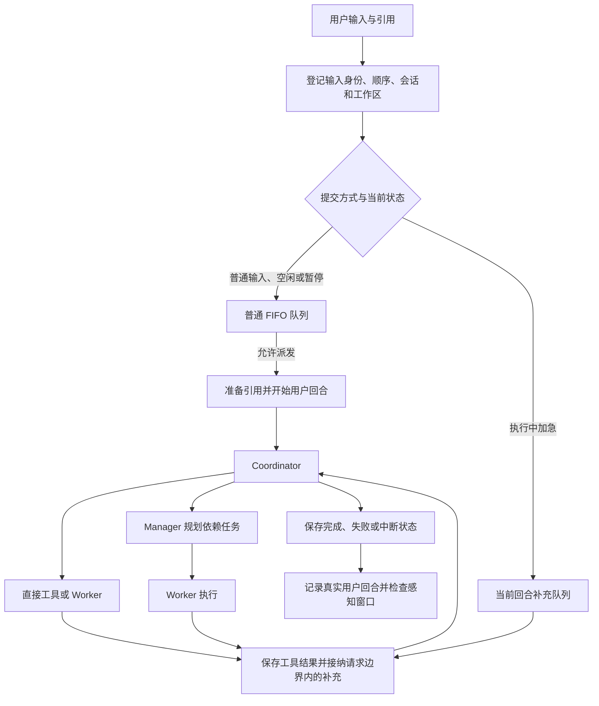

# RedLotus 项目设计

本文描述组件职责、数据流、运行行为和权限边界。项目定位与入口见[项目总览](README.md)，开发偏好和硬性条件见[开发约定](development.md)。

## 设计原则

项目文件夹是执行与项目数据的边界，会话身份贯穿输入、模型请求、工具调用和持久化。运行状态以实际执行结果和保存结果为依据，任务完成、模型响应结束、工具成功和用户目标达成分别记录。

配置按实际需要读取，界面通过现有事件更新。禁止添加过度引导、裁剪和硬编码；参数、提示词和代码规模的约束集中在[开发约定](development.md#修改边界)。

## 架构与组件职责

| 模块 | 职责 | 协作边界 |
| --- | --- | --- |
| `runtime` | 配置、工作区路径、日志、网络与模型连接、文件锁和原子 I/O | 提供基础能力，不加载上层应用或终端 |
| `sessions` | 会话事务、证据视图、输入身份、上下文、恢复和存储清理 | 为编排、工具和渠道提供共享会话边界 |
| `core` | Agent 工厂、模型请求、任务依赖调度、压缩、用量与应用编排 | 通过注入使用展示能力，不创建终端控制器 |
| `tools` | 身份工具集合、调用检查、文件与引用、文档、浏览器、命令和 Skills | 接收工厂、调用身份和工作区，执行权限检查与资源回收 |
| `memory` | 感知生产、证据消费、LanceDB、检索重排、核心投影和索引恢复 | 使用会话证据和注入的模型调用能力 |
| `prompts` | 提示词资源、组装、系统信息及会话快照 | 提供稳定的角色指令和运行上下文 |
| `ui` | CLI/TUI 控制、命令、展示和 Textual 控件 | 两种终端界面共用输入与会话控制器 |
| `api` | 程序启动、模型连接编辑、QQ/微信接入、身份和附件转换 | 将不同入口接入统一的 AgentSystem 会话接口 |

Agent 工厂集中管理身份、调用记录和线程额度。Worker、Manager、感知共享当前会话配置的工厂额度，取得名额后才创建 Agent 线程；等待名额和工具调用不单独计为 Agent 线程。该额度不代表整个进程的操作系统线程数。

## 请求执行



输入在附件解析前登记，解析快慢不改变提交顺序。每次模型请求边界固定本批补充的范围，等待该范围内的引用准备完成，再将补充按顺序接在工具结果后；更晚的输入进入下一边界。当前回合接纳的完整用户输入随会话保存。

Enter 普通提交；Ctrl+Enter 和 `↑` 调用同一加急入口。空闲时加急按新任务提交，执行中作为当前回合补充，等待用户回答时沿用回答流程。空白输入不创建任务，提交后清空草稿并恢复焦点，连续提交不重复使用同一草稿。加急内容按普通用户消息展示。

输入控件识别 `ctrl+enter`、`ctrl+j`/LF 和带修饰的 CR；普通 CR 是 Enter，粘贴文本中的换行不提交。应用只能区分终端实际传入的不同事件，不修改终端或 IDE 设置，也不包含按键校准流程。

`/stop` 停止当前操作及其补充，保留独立普通任务队列。清空、加载、切项目和退出使旧代次的迟到回调失效；切换期间锁定输入。加载先准备所选记录，再提交切换，取消选择或准备失败时保留原会话和草稿。

### 暂停、恢复与响应中断

- `■` 先关闭队列派发，再取消当前模型请求、子 Agent、工具和待答问题，完成资源回收后进入暂停状态。
- 暂停保留目标、执行模式、上下文、工具结果、引用、已接收补充和排队顺序。暂停期间提交的新输入进入等待队列，不触发恢复。
- 暂停信息写入既有会话 JSON 的 `paused_turn`。退出后加载该会话保持暂停，等待用户点击 `▶`。
- `▶` 优先继续被暂停的任务，再处理普通队列。已提交的任务沿用保存的上下文和工具结果，不把原任务整段重发；尚未进入模型的输入继续其准备流程。未完成的工具调用记录结果未知，不自动重放已完成的副作用。
- 暂停和恢复操作有独立记录，处理中禁止重复点击。会话代次与存储身份检查阻止旧回调操作新会话。
- `RemoteProtocolError` 及可识别的 SDK 包装原因进入“模型响应中断”状态，使用同一个恢复入口。已收到的正文、思考、工具结果和真实用量保留，完整异常进入日志；部分响应不标为成功，缺失用量保持未知，后续队列等待恢复。
- 传输中断不触发应用层自动重试、额外超时或后台重跑。暂停保存失败单独报告，不因异常上下文把存储错误归为网络错误。

同一回合中的工具往返、中间回复、补充和子 Agent 内部消息不增加用户回合数。goal 模式在持续迭代中保存目标、约束、完成状态和未决事项，接受补充及停止控制。

## Agent 与工具边界

| 身份 | 功能与工具权限 |
| --- | --- |
| 本人 Coordinator | 理解请求、直接执行或委派、汇总结果；执行工具外包含 `execute_task_with_manager`、`execute_task_with_worker`、`resume_task` |
| Manager 规划 | 拆分依赖任务；`create_todo_list`、`get_todo_list`、`ask_user`，本人权限下可用 `search_memory` |
| Manager 最终汇报 | 汇总任务结果，不注册规划工具 |
| Coordinator 直接委派的 Worker | 执行单个明确任务，使用执行工具集合，包含浏览器 |
| Manager 委派的 Worker | 执行所分配任务，使用同一集合但不包含浏览器 |
| 感知 Agent | 读取已封存的会话证据；`search_memory`、`read_evidence`、`read_reference` |
| Compressor / Title | 分别压缩上下文和生成标题，不注册业务工具 |
| 未绑定本人的渠道 Coordinator | 文本对话，不注册执行工具或个人记忆工具 |

| 执行工具组 | 接口 |
| --- | --- |
| 常驻读取 | `list_files`、`read_file`、`search_in_files`、`search_web`、`ask_user`、`read_reference` |
| 文件修改 | `write_file`、`edit_file` |
| 命令 | `run_command`、`execution_environment` |
| 文档与生成 | `extract_text`、`generate_image` |
| 本人记忆 | `search_memory`、`remember`、`update_memory`、`delete_memory` |
| Skills | `list_available_skills`、`get_skill_instructions`、`load_skill_resource`、`refresh_skills`、`execute_skill_script` |
| 浏览器 | `browser_navigate`、`browser_get_content`、`browser_screenshot`、`browser_click`、`browser_fill`、`browser_press_key`、`browser_wait_for_selector`、`browser_evaluate`、`browser_close` |

英文函数 docstring 是工具描述来源，Pydantic AI 根据签名和类型生成参数定义。Worker 的读取工具常驻，其余按原生能力组渐进加载；Coordinator 直接执行复用完整函数集合。Skills 名称和简介进入提示词快照，正文与资源按需读取；磁盘 Skills 可在后续用户回合重新发现，已固定的 system 快照保持不变。

任务状态区分 `completed`、`failed`、`cancelled`、`needs-input` 和 `unverified`。计划、派发及结果经会话持久化回调保存，依赖任务等待完成状态落盘。加载中断的 running 任务时标记为 unverified。失败、取消、待输入和未验证任务保留证据，不自动重新排队。

`resume_task(task_id)` 显式恢复指定阻塞任务，使用当前会话实际接纳的新输入，保留其他已完成结果；重复提交相同任务定义不解除阻塞。Worker 输入分开表达父目标、唯一任务、依赖结果和用户补充，结构化结果只描述该 Worker 的任务。续执行复用基础 instructions，SDK 动态工具目录不再次拼入基础提示词。

QQ/微信适配器按 `bot.owner_channels.qq` 和 `bot.owner_channels.wechat` 判断本人身份。输入先登记，再准备附件和执行；附件未完整准备时不提交残缺请求。两个渠道支持 `/stop`、`/clear`，渠道身份约束同时作用于执行工具和个人记忆。

### 执行环境与权限

文件操作解析实际路径后检查工作区边界，搜索逐项检查，不能通过符号链接或 Junction 读取项目外文件。随包 Skills 是只读资源；文件修改和浏览器截图遵守项目写入边界。

命令与 Skill 脚本共用检查入口，保留日常 Git/SSH 等用户环境，外部命令环境筛除模型凭据，依赖缓存和临时目录归属于项目 runtime。检查命令位置、静态包装和已识别的进程 API；无法确定已识别启动调用的目标时拒绝执行。

取消只回收确认归属当前调用的资源，不按端口推断所有权。进程树终止、退出等待和管道回收在实际清理时读取可选的 `lifecycle.shutdown_grace_seconds`；配置存在时共享截止时间，缺失时不添加应用期限，失败保留具体原因。这些检查不提供任意代码或第三方程序的系统级隔离，也不承诺回收所有未登记且已脱离的后代进程。

## 本地引用与文件审查

引用接受本地文件和图片，支持中文、空格、引号、花括号及相邻多文件路径，规范化后按首次出现顺序去重。`@HTTP(S)网址` 不作为本地引用接受，普通正文网址保持文本。引用数量、字节和模型请求限制使用现有配置，超限明确报告，不静默漏文件。

引用建立按内容哈希复用的不可变快照，恢复时关联原快照。引用正文携带身份、范围和定位，与用户指令分开。图片以真实 MIME 和内容交给 SDK；PDF、Word、Excel、PPT、CSV、Markdown/HTML 使用对应解析器，旧 DOC/PPT/XLS 转换依赖 LibreOffice。

`read_reference` 读取已登记快照，`read_file` 读取项目磁盘当前文本，`extract_text` 解析文档。`read_file` 保留原字符串返回值，同时提供 JSON 字符视图区分换行、反斜杠和引号。`write_file` 的 `content` 与 `copy_from` 恰选一个：前者原样写入，后者读取 UTF-8 源文件并沿用同一审查、权限和原子写入流程，不自动解码或修正模型参数。

原子写入在目标同目录排他创建唯一临时文件，只清理本次创建的文件，替换失败不移走用户的同名临时文件。文件审查支持逐块保留或撤销，并核对外部修改；退出审查时，在同一锁内核对版本身份、决定状态和移除记录，避免移除并发产生的新版本。

## 会话与数据存储

数据归属见[项目总览](README.md#数据归属)。主会话按 session ID 保存 `model_messages.json`；其他角色懒创建 `model_messages.<role>.json`，同角色记录按 Agent/调用身份区分。主会话保留子任务调用及返回，各角色保存自身恢复所需的上下文。会话索引只保存摘要元数据。

消息、工具配对、提示词快照、引用身份、任务状态、计数和感知进度以带序号及完整性校验的事务批次提交。增量写入保留合法 JSON，已提交消息不因普通节点保存而重复完整序列化。实际落盘在所属事件循环内串行，文件锁等待与取消共用现有保存边界。

可识别的尾部半写恢复到上一完整批次；中间损坏或损坏位置之后仍有有效提交时拒绝自动修复。未完成工具配对补充结果未知回执，不自动重放操作。已支持的混合角色记录读取后，拆分保存成功才移除重复记录。

启动有会话记录时提供新建、恢复和取消；无记录时首次输入才创建会话文件。恢复沿用原 session ID、提示词、记录和计数。完成且已交付、无恢复及感知用途的 Worker 正文可清理，累计用量保留。

写入空间不足时，按已配置的会话保留和执行缓存策略清理，再重试原事务。年龄清理只删除符合条件的过期会话主记录 `model_messages.json`；当前、活跃、中断、暂停、有未完成任务及无法取得锁的会话受保护。缓存清理核对目录归属、活动状态与存储卷，权限或路径错误不触发空间清理。保存仍失败时保留内存进度和队列，后续输入先重试保存；存储等待解除不会自动解除任务暂停。

### 日志与资源回收

日志持续追加，不按大小轮转；不创建、重命名或删除 `.log.1`。日志年龄清理由首次进入会话、成功新建或恢复会话、项目切换的入口触发，在开放任务输入之前执行，嵌套切换由外层入口负责。取消加载选择并继续原会话时不触发清理；机器人创建会话后在处理首条消息前执行。

清理只检查已配置日志根目录直属的普通 `*.log`，按最后修改时间删除严格超过 `storage.cleanup.log_retention_days` 的文件。保留期缺失或小于等于零时不启用；代码不补入保留天数，不递归处理会话、记忆或其他目录。日志初始化、普通写入和机器人周期回收不触发年龄清理。

会话释放和进程退出负责相应 Agent、调用诊断、网络客户端及执行资源的回收。退出取消子 Agent 和感知请求，不等待其模型自然完成；退出期限沿用[执行环境与权限](#执行环境与权限)的规则。引用快照和正式会话记录不因普通退出删除。

## 模型、配置与上下文

### 配置读取与编辑

每个实际需要的参数独立按以下顺序查找，命中后停止该参数的后续读取：

1. 项目 `config.json`。
2. 仅对未取得值的参数读取项目 `.env`。
3. 仅对仍未取得值的参数读取全局 `config.json`。

低优先级来源不得覆盖已命中的值。嵌套对象按具体字段判断，不整组覆盖；不同字段可以来自不同层。

| 参数 | 项目 JSON | 项目 `.env` | 全局 JSON | 结果 |
| --- | --- | --- | --- | --- |
| `arg` | A | B | C | A |
| `arg2` | 空 | A | B | A |
| `arg3` | 空 | 空 | A | A |
| `arg4` | 空 | 空 | 空 | 未命中；连接或模型选择缺项进入相应引导 |

“空”依据字段的合法语义判断。空白凭据继续查找；合法的 `null`、`0`、`false`、空列表可以构成命中。非空但非法的值由读取或使用入口报错，不作为缺项静默回退。

默认项目 JSON 位于启动基准下的 `src/redlotus/config.json`，dotenv 为该基准下的 `.env`，全局 JSON 位于 `~/.redlotus/config.json`。启动基准见[运行入口](README.md#运行入口)。`REDLOTUS_CONFIG_FILE`、`REDLOTUS_DOTENV_FILE`、`REDLOTUS_CONFIG_DIR` 分别选择这三个来源的路径，不增加配置层。`.env` 使用 python-dotenv 格式，以 `__` 分隔嵌套字段，按 JSON 类型解释值；不插值，也不从宿主环境变量导入业务配置。

配置入口保留 JSON 语法、对象根、连接输入和模型选择检查，读取值用于独立副本。首次引导遍历已有 `models` 角色，仅补齐模型名称、API Key 和 Base URL；密钥隐藏输入，模型名可用 `=角色名` 复用。连接或模型选择缺项提示包含字段、作用、类型、可选值和来源，无枚举限制时如实说明。`/api embedding` 单独编辑检索连接。

非模型参数没有启动填表或额外补填提醒；可选能力实际使用时读取其已有业务字段，真实操作错误保留。缺少未使用能力的配置不阻止进入交互。参数范围以现有项目 JSON 声明为依据，BFL 图像生成保留 `BFL_BASE_URL` 和 `BFL_API_KEY` 连接入口；无通用 schema、模型预设、命名网关或替代配置框架。

配置编辑写入既有项目 JSON，否则写入全局 JSON，不写 `.env`。确认后在原生文件锁内重读最新 JSON，仅原子提交本次差异，不回写合并后的所有来源，不依赖额外锁等待参数。Esc 取消不保存。安装包排除私人配置和凭据，不随包生成完整运行配置。

模型标识由 SDK 路由，连接由统一入口注入。模型选择、采样、输出和输入限制使用配置中的现有字段；工具显式业务入参继续传给第三方库，未提供的可选入参省略。`parallel_tool_calls=True` 是固定的并行工具调用约定，不扩展为新的配置能力。

### 提示词与压缩

会话 system 保存 Skills 布局和简介、系统信息、角色行为、项目 `AGENT.md` 及长期记忆快照。时间采用 `YYYY-MM-DD` 格式。动态补充和工具结果随新消息追加，记忆更新不重写同一会话的静态前缀，恢复沿用原快照。

上下文容量优先使用角色的 `max_context_windows`；缺失或 null 时查询 OpenRouter 模型元数据。自动压缩阈值为：

```text
ceil(min(上下文容量 × 配置比例, 上下文容量 − 最大输出))
```

计算使用 Decimal 和向上取整。最大输出未指定时不扣除未知预算，也不补入输出上限。界面和请求边界使用同一计算；触发依据是服务已报告的输入 Token，新材料首次发送前的真实 Token 尚未知，不能以字符估算代替。

压缩保留系统指令、角色配置的首尾内容和完整工具配对边界，不预先裁剪工具、引用或证据。候选先校验并持久保存，再核对会话身份和取消状态，成功后才替换运行上下文。失败保留原始记录；手动 `/compress` 串行执行，不增加用户回合，停止或切换使迟到候选失效。

具有持久检查点的请求遇到可识别的服务容量拒绝时，沿完整回合、证据及闭合工具边界二分，使用现有压缩模型并发处理；各段摘要按原顺序组成一个检查点，全部保存后只重试该请求一次，不重跑工具。压缩器仍超限时继续二分，范围严格缩小；最小不可分单元失败时保留失败和原文，不无限重试。识别范围为现有 OpenAI 兼容接口的容量错误，其他错误按原类型处理。

## 感知与记忆

| 层级与入口 | 功能和边界 |
| --- | --- |
| 主动 `remember` | 用户明确要求全局长期记忆时登记 L2 生产，不等待窗口；仅项目记忆请求不走此入口 |
| 自动感知 L1 | 消费当前 session 已封存的新回合，生成项目情景记忆 |
| L1 提炼 L2 | 根据独立用户行为、出处、关联的有效 L1 和长期线索判断，不设固定证据次数门槛 |
| 记忆消费 | `search_memory` 搜索或按 ID 读取，`update_memory` 更新，`delete_memory` 遗忘；均检查作用域与权限 |

L1 限当前项目，L2 在本人权限下跨项目使用。明确长期表述可以构成强线索，临时要求不自动成为长期偏好。工具往返、助手复述、重试、恢复和 overlap 不增加独立证据次数。

### 窗口与调度

窗口大小和 overlap 来自 `memory_perception.window_turns`、`memory_perception.overlap_turns`，满足 `0 ≤ overlap < window`。只有当前 session 新增的已结束用户回合达到窗口大小才封窗；overlap 仅提供衔接上下文，游标和预留位置随会话保存。

新建、加载、清空、切项目和退出不补造不足窗口的感知任务。恢复处理已登记任务，失败窗口保留身份和证据；一次窗口生产可以包含多次模型与工具往返。无记忆价值时允许完成消费并返回空结果。

后台任务在登记时绑定原 storage，处理前后核对父会话身份。切换先取消旧工厂任务再释放存储，旧任务不能读取新会话目标或覆盖其状态。终端 `/STM retry` 与切换经共享控制器互斥；绕过控制器的程序化调用须自行保持串行边界。感知在后台运行，完成索引且有就绪时间的自动窗口记录任务总耗时、模型 API 耗时和其他耗时。

### 生产、投影与索引

L2 新增或更新先搜索已有记录；相似记录更新原 ID，无相似项才新增。搜索失败保留非空错误，不能当作空结果。自动提炼校验独立证据、出处和关联 L1，提交前检查范围版本，避免并发重复与过期事实回写。

记忆生产按“生成候选 → 校验来源与版本 → 正式记录落库 → 核心投影 → 向量索引”推进，阶段状态随已有任务保存。未提交候选遇到版本冲突时重新搜索、生成与校验；已经提交的任务幂等补全后续阶段，不再次调用模型生产。

正式记录和向量索引使用 LanceDB。`MEMORY.md` 是核心长期记忆投影：写入前核对版本和文件快照，原子更新托管内容，保留非托管手写内容；新会话只注入与正式记录一致的托管块。投影失败与正式记录保存结果分别报告，恢复不能覆盖后来提交的新版本。

检索包含 embedding、向量候选、相似度过滤、rerank 和分块去重，相关参数使用既有配置。向量索引按正文哈希与 embedding 空间校验，缺失或陈旧时标明召回不完整并使用文本回退。embedding 在写锁外运行，写入前再次核对当前正文和有效状态；正式记录已提交而索引失败时，只补索引，保留正文、错误和证据，索引阶段保持待补全，不将索引标为完成。

更新、遗忘和清空的版本边界优先于旧任务，overlap、过期索引或恢复不能重新引入已删除事实。

## 展示与统计

主 Agent 的服务端思考和正文独立流式展示。每个用户回合首次思考增量初始化展开，后续增量及同回合的后续响应尊重用户折叠选择，内容继续接收；不伪造思考或展示签名、内部标识。子 Agent 使用自身状态和结果展示。

「会话 / 加载」位于底部快捷栏的「审查更改」之后。输入框保持弹性宽度，右侧 `↑` 使用主色背景和高对比箭头；它只随输入锁定禁用，执行中仍可加急。相邻控制按钮运行时显示 `■`、暂停时显示 `▶`，空闲、切换及控制处理中禁用。控制操作保留草稿和焦点，不将草稿作为恢复指令。

| 展示项目 | 统计口径 |
| --- | --- |
| 会话 API 用量 | 按会话展示时间、标题、Agent、响应数和服务报告的 Token |
| 新增用户输入 | 按实际进入回合的输入 ID 计正文，同一引用哈希在会话内只计一次，文本估算明确标注 |
| 模型与推理输出 | 按唯一响应累加，推理是输出子项，不重复相加 |
| `/usage` | 服务累计输入、输出、缓存命中和未命中；重复发送历史产生的消耗计入 |
| Running / Queued | 前台 Agent 的执行及等待额度状态，工具、标题、压缩和感知不混计 |
| 计划任务 | 来自任务清单，与 Agent 运行状态分开 |

无法独立计量的附件、服务缺失的 reasoning/usage 和记录缺项标为未知或不完整。压缩、正文清理和恢复不重复计数或清零累计用量。

`/trace` 和调用历史查询保留完整诊断，不按固定数量淘汰或缩短 ID；它们与正式会话记录分工不同。diff、流式正文、会话列表、补全、用量文件、工具参数和错误详情完整可查。`/panel --all` 与 `/panel` 均显示完整列表。文件名仅清洗非法字符，不按长度静默截短，文件系统错误如实报告。

状态栏和面板复用输入、输出、用量、审查及会话切换事件更新，不设周期刷新轮询。简单终端连续两次空行 Ctrl+C 退出，正常输入清除连续计数，不计算时间窗；TUI 保留停止当前回合和空闲退出的按键行为。
