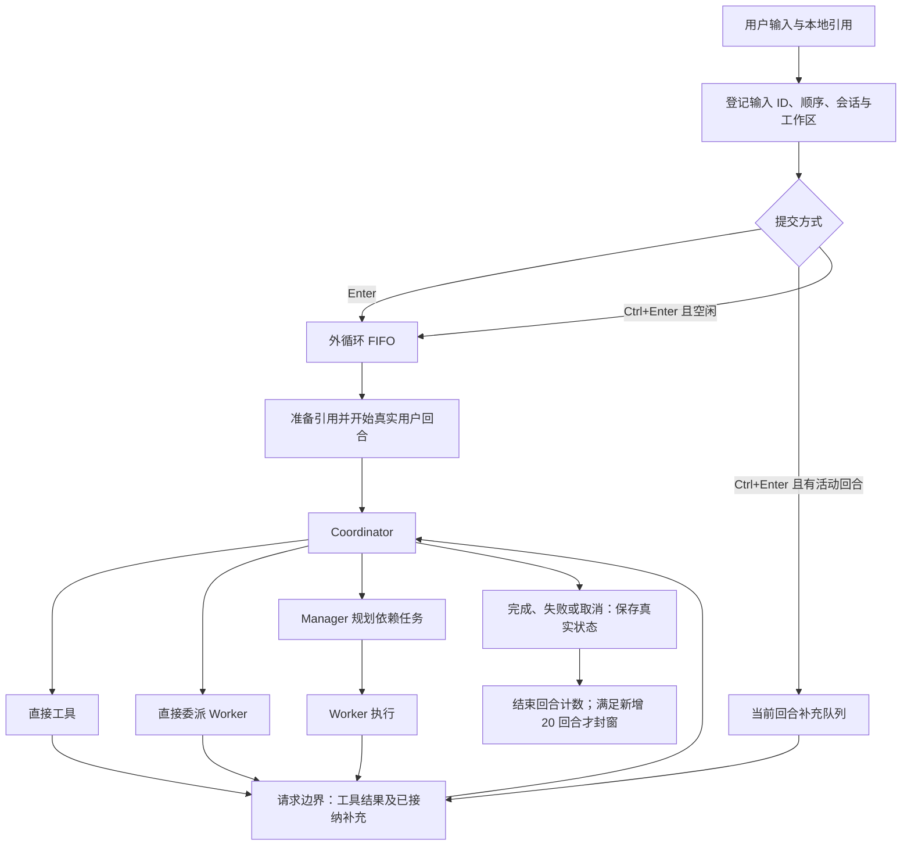
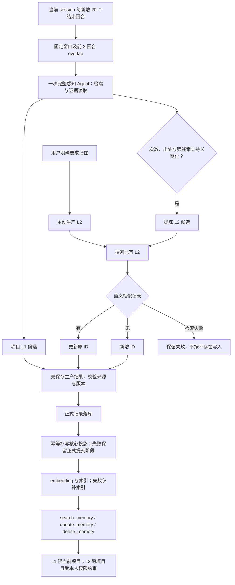

# RedLotus 现行设计

> 本轮代码已通过 `9b7e95c8` 完整撤回 12 模块整改版本，恢复到 `ca98b811`。用户要求功能完整、原则上 6 模块且必要时最多 8 模块、每模块最多 5 个 Python 文件、每文件最多 500 有效行；物理行数不限。当前正在重新精简，旧版通过记录不代表新版已通过。

## 状态说明

- **已实现**：有对应代码路径；是否真实验证另行说明。
- **已确认但未完成**：用户已明确要求，仍缺实现、质量验证或完整交付。
- **尚未真实验证**：没有当前版本、对应入口的充分真实证据；本地检查不能替代。

## 现有职责与八模块边界

本次整合采用用户新授权的必要扩展：`ui` 独立承载 CLI/TUI、可复用控件与展示，入口把展示能力注入 core 和工具，core 不再创建终端控制器。`sessions` 独立承载会话日志、事务恢复、输入控制、上下文数据和存储清理，提供渠道、编排及记忆共用的会话边界。两者分别消除反向界面依赖和会话文件的多重职责；不会新增第九模块或用空代理保留重复实现。隔离子进程验证 runtime、sessions 不加载上层模块，core 不加载终端，tools／memory 不直接加载 core。

| 板块 | 职责与边界 | 状态 |
| --- | --- | --- |
| `core` | Agent 工厂、模型请求、任务调度、压缩、用量与应用编排 | 任务状态和 Manager／goal 调度集中到 tasks；不创建终端 |
| `tools` | 身份工具集合、注册和执行检查、文件引用、文档解析、浏览器及 Skills | 已实现 |
| `api` | CLI 启动与配置向导、QQ／微信消息接入、本人身份判断、附件转换 | 启动及渠道适配器已复用共享会话入口；真实账号验收待办 |
| `prompts` | 提示词资源、组装、系统信息及会话快照 | 已实现；正文变更仍受单独审批约束 |
| `memory` | 记忆生产、证据与消费、LanceDB、embedding／rerank 和索引恢复 | 已实现；完整质量门槛未完成 |
| `runtime` | 配置、工作区路径、日志、HTTP 客户端与模型连接、锁及原子 I/O | 四个文件；独立导入不加载应用层 |
| `ui` | CLI／TUI 控制、命令、展示及 Textual 原生控件 | 五个文件；展示通过入口注入；控件共享同一输入及会话控制器 |
| `sessions` | 会话事务、证据视图、输入代次、上下文数据及存储清理 | 五个文件；SessionFile 继承真实日志事务实现，共享取消与保存边界 |

CLI/TUI 和渠道适配器进入统一的 AgentSystem 会话接口。工具通过工厂获得调用身份和工作区；记忆服务使用会话证据和统一模型入口。代码规模要求及逐函数审查状态见[开发约定](development.md#代码组织与精简)。

以上八个模块是当前实现，已达到本轮允许的模块上限。工具执行实现在 `tools/worker_tools.py`，Agent 构造、运行与注册通过已存在的工厂注入；不保留重复转发模块。重做保留已有功能，应用有效行必须少于基线 10,373 行，代码删除行数大于新增行数；逐函数以职责、调用关系和删除后具体行为损坏的证据验收。不得挤行、将业务实现藏入资源／测试、硬删功能或人为制造崩溃来达标。功能改造和测试审批均执行同一约束。

## 请求执行

**已实现：**输入在附件解析前登记；解析完成速度不能改变原提交顺序。请求边界固定补充消息范围，等待该范围解析，再按顺序接在工具结果后；更晚的补充进入后续边界。加急显示为普通用户消息，不添加“加急”标签或说明。

- `/stop` 停止当前操作及所属补充，保留独立普通任务队列。
- 清空、加载、切项目和退出使旧代次的迟到结果失效；切换期间锁定输入。
- 加载采用先完整准备、再提交切换；取消或准备失败保留原会话、草稿、引用和资源。
- 同一回合的工具往返、重试、中间回复、补充及子 Agent 内部消息，不增加用户回合计数。
- 退出取消子 Agent 和感知，不等待模型完成；清理使用既有退出期限并保留可恢复状态。

按键检测仅用于开发验收，正式程序不包含检测页面、按钮或启动校准。仅 Enter 与 Ctrl+Enter 分别承担两种提交行为；不使用 LF／Ctrl+J 兼容加急，不恢复文字加急命令。Windows Terminal 曾由用户物理验证；PyCharm Classic 的事件不可区分问题仍存在，新环境须在测试阶段实际检测。程序不会自动修改终端设置，Textual 注入事件通过不等于物理按键通过。

## Agent 与工具边界

**已实现：**英文函数 docstring 是工具描述来源，Pydantic AI 根据函数签名和类型生成参数定义。不得用外部 Markdown 覆盖描述、修改 `__doc__` 或决定注册内容。

| 身份 | 注册范围 |
| --- | --- |
| 本人 Coordinator | 下表执行工具，另加 `execute_task_with_manager`、`execute_task_with_worker`、`resume_task` |
| Manager 规划 | `create_todo_list`、`get_todo_list`、`ask_user`；本人权限下加 `search_memory` |
| Manager 最终汇报 | 不注册规划工具 |
| Coordinator 直接委派的 Worker | 下表执行工具，包含浏览器 |
| Manager 委派的 Worker | 同一执行集合，排除浏览器 |
| 感知 Agent | `search_memory`、`read_evidence`、`read_reference` |
| Compressor / Title | 无业务工具 |
| 未绑定本人的渠道 Coordinator | 当前实现只提供文本对话，不注册执行或个人记忆工具；实际渠道边界尚未真实验收 |

| 执行工具组 | 函数清单 |
| --- | --- |
| 常驻读取 | `list_files`、`read_file`、`search_in_files`、`search_web`、`ask_user`、`read_reference` |
| 文件修改 | `write_file`、`edit_file` |
| 命令 | `run_command`、`execution_environment` |
| 文档与生成 | `extract_text`、`generate_image` |
| 本人记忆 | `search_memory`、`remember`、`update_memory`、`delete_memory` |
| Skills | `list_available_skills`、`get_skill_instructions`、`load_skill_resource`、`refresh_skills`、`execute_skill_script` |
| 浏览器 | `browser_navigate`、`browser_get_content`、`browser_screenshot`、`browser_click`、`browser_fill`、`browser_press_key`、`browser_wait_for_selector`、`browser_evaluate`、`browser_close` |

Worker 使用 SDK 原生能力组：读取工具常驻，其他工具按组渐进加载。Coordinator 直接执行复用完整函数集合。Skills 的名称与简介进入会话提示词快照，正文和资源按需读取；磁盘 Skills 在后续用户回合重新发现，不重写已固定的 system 快照。

计划创建、派发和结果转换经同一会话的持久化回调保存；依赖批次等待完成状态落盘。加载时把中断的 running 标成 unverified，取消及未验证结果不进入自动重试。`resume_task(task_id)` 只恢复指定阻塞任务，取用当前会话实际接纳的新用户输入，保留其他已完成结果；重新提交相同任务定义不能解除阻塞。

Worker 输入分别标明父目标背景、唯一分配的任务 ID／描述、已完成依赖结果及用户补充；结构化结果仅描述该 Worker 的任务。真实 API 首测暴露过 A、C 同时执行 C 的追加操作，调整输入结构后重测为 A 等输入、C 执行一次。C 的首次产物仍有行尾空格，不能据此宣称产物验收完全通过。

Manager／Worker 续执行从历史复用基础 instructions；SDK 的动态工具说明不作为基础提示词再次拼入。请求元数据保存静态前缀长度，旧会话依据 SDK 自身的目录标记兼容读取。真实续跑曾暴露重复追加 6,701 字符；修复后相同 Worker 的新请求提示词指纹恢复为首次值。压缩候选与普通检查点共用保存回调，保存成功并核对会话及取消状态后才采用。回合清理保留未完成计划任务的 Worker 上下文。真实自动压缩阈值和全部新建／重建身份路径仍待完整验收。

同一 session 的工厂线程上限为已确认的 16，Worker、Manager 及感知按实际工厂调用共享额度；取得名额后才创建线程。等待名额不另开 Agent 线程，工具调用不单独算 Agent。这个上限不是整个进程的操作系统线程总数。

### 执行环境与保护

源码和 pip 使用启动解释器；EXE 寻找 PATH 中已有的外部 Python。没有外部 Python 时仅阻止相关 Python 功能。命令和 Skill 共用检查入口，保留日常 Git／SSH 等用户环境；外部命令环境筛除模型凭据，依赖缓存与 TEMP 指向项目 runtime。

已确认的进程保护作为工具业务逻辑保留：检查命令位置、静态包装和已识别的进程 API；普通字符串、注释及业务对象同名方法不应被误拦。已识别启动调用无法确定目标时拒绝并要求明确命令。取消只处理确认归属当前调用的资源，不按端口判断所有权，不引入 Windows 权限库、Hook 或账户隔离。

**边界：**这不是任意代码或第三方程序的系统级隔离；未登记且已脱离的后代进程不承诺全面回收。Playwright 驱动默认环境及全部浏览器临时目录归属，尚未完成隔离验证，不能将命令入口的验证结论套用到浏览器。

## 本地引用与交付审查

**已实现：**引用只接受本地图片或文件。保留中文、空格、单双引号、花括号、相邻引用及多文件输入；规范路径按首次出现顺序去重。数量和字节限制读取配置，已确认的常规边界为 20 个原始文件、未另声明时单文件 20,000,000 字节；发送前还检查声明的请求限制。

`@HTTP(S)网址` 应报“引用仅支持本地文件”并保留输入；普通正文网址保持文本。渠道附件在登记输入后逐一下载为真实内容，任一失败都报告文件身份和重试信息，不向模型执行残缺请求。`read_image` 已删除；本地图片由 SDK 按实际 MIME 编码为 base64 data URL，不能只发送文件名。

引用建立不可变快照，按内容哈希复用；恢复会话继续关联原快照。正文带文件身份、内容范围和定位，不能冒充用户指令或主动记忆要求。PDF、Word、Excel、PPT、CSV、Markdown／HTML 等保留对应结构；旧 DOC／PPT／XLS 转换需要现有 LibreOffice。扫描材料可带页面图片，不承诺未验证的格式质量或视频识别。

`read_reference` 读取登记快照，`read_file` 读取项目磁盘当前文本，`extract_text` 解析文档。文件错误应返回可恢复结果并保持调用配对；不能静默漏文件。审查模式保留逐块决定、撤销及外部修改冲突检查；核验依据是实际文件，不是界面是否显示成功。goal 持续迭代保留目标、约束、完成状态和未决事项。

## 会话与数据存储

**已实现：**项目以当前打开文件夹为边界，不向父目录查找项目。配置指定项目路径，全局 LanceDB 仍位于用户数据目录；已撤回 SQLite 方案，不保留两套运行后端。

| 数据 | 归属与保存策略 |
| --- | --- |
| 主会话 | 项目 `.redlotus` 内按 session ID 保存 `model_messages.json` |
| 其他角色 | 同目录懒创建 `model_messages.<role>.json`，同角色按 Agent／调用身份区分 |
| 会话索引 | 轻量摘要元数据，不复制聊天正文 |
| 引用原件与解析快照 | 项目 `WorkDatabase/references`，普通退出不删除 |
| 项目日志、感知进度、`AGENT.md` | 项目 `.redlotus`；进度与恢复必要状态随会话保存 |
| 产物、依赖缓存、临时文件、技能 overlay | 项目 `WorkDatabase` 及其 runtime |
| 正式 L1／L2 与向量索引 | 用户 `~/.redlotus` 下配置指定的 LanceDB；按作用域和项目隔离 |
| 核心长期投影 | 用户数据目录中的 `LongTermMemory/MEMORY.md` |

角色拆分是对早期“整个 session 只有一个文件”要求的后续明确调整：每个角色恢复文件只保留自身必要上下文，主会话保留子任务调用和返回，不混入子 Agent 全部内部历史。完成且已交付的 Worker 正文可清理，累计 usage 保留。

增量批次用 `json.dump` 缩进写入；正常提交后文件保持合法 JSON。消息、工具关系、提示词快照、引用身份、任务状态、计数和感知进度按事务提交，包含序号与完整性校验。清理只处理已无恢复或待感知用途的正文，不丢累计统计。已提交批次不因普通节点保存而反复完整序列化。

尾部半写只在能确认损坏范围时恢复上一完整批次；中间损坏或后方存在有效提交时拒绝自动修复，保留文件。未完成工具配对补“结果未知”回执，不自动重放副作用。旧混合角色记录仍可读取，拆分成功后才移除重复保存。

启动有历史时选择新建、恢复或取消；无历史时首次输入才创建恢复文件。恢复沿用原 session ID、文件、提示词和计数。保存失败不得假报成功：按已配置且获确认的七天历史清理及缓存清理策略处理空间不足，保护活动会话和正式数据；仍失败则暂停，保留内存进度和队列，下一次普通输入先重试原保存。权限／路径错误不触发无效清理。

## 模型、配置与上下文

**已实现：**三层配置逐字段合并并返回独立副本：本地 JSON → 本地 `.env` → 全局 JSON。源码基准为仓库根，pip 为启动目录，EXE 为程序目录；不向父目录搜索、不从解压目录读取业务配置。宿主环境变量不覆盖业务参数，既有显式路径选择用于隔离；不存在全局 `.env` 第四层回退。

空白凭据继续查找下层；有效的 false、0、空列表及允许的 null 保持语义。类型错误或损坏 JSON 报来源和字段，不静默忽略。配置命令仅写既有本地 JSON，否则写全局 JSON，不回写整个合并结果。随包配置复制与隐藏模板已删除；完全无配置的首次使用尚不具备已验收的完整填表初始化流程。

模型标识采用 Pydantic AI 的“服务:模型”路由，地址和凭据由统一入口注入。没有新增 provider 配置；`parallel_tool_calls=True` 是用户明确批准的例外。模型、采样、RAG、超时及压缩政策取自现有配置。非当前实际服务的协议适配只能记为代码／辅助检查覆盖，不能称真实跨服务验收完成。

首用向导与配置读取共用字段契约。内置能力的必填关系写在 schema，运行时仍枚举实际配置身份；schema 的范围校验不是默认配置。新增必填字段为 `agent_run_policy.max_task_retries`、`storage.cleanup.log_retention_days`、`storage.cleanup.session_log_max_bytes`。QQ／微信额外收集 `bot` 下的执行期限、回复期限、分块长度、闲置保留期、清理间隔及问答期限，具体字段见契约；CLI 不强制填写未使用的渠道策略。重试上限始终取当前配置，恢复的旧任务不能用已保存的旧上限绕过新设置。日志轮转阈值按会话上下文快照读取，清理保留期在实际清理时读取。工具默认等待值等剩余运行策略仍需逐项审查，不能宣称所有字面量均已消除。

### 提示词与压缩

会话 system 保存 Skills 布局及简介、系统信息、行为约束、长期记忆和项目 `AGENT.md` 快照。新增时间、补充输入和工具结果随新消息追加；记忆写入不重写当前会话前缀，恢复沿用原快照。

自动压缩按“有效上下文容量 × 配置比例”判断，比例已确认为 0.9；例如容量为 1,024,000 时阈值为 921,600。容量优先角色 `max_context_windows`，否则查询既有 OpenRouter 元数据。使用最近已报告的服务端输入 Token，在模型请求边界检查，不扣除最大输出预算提前触发，也不把含历史思考的字符估算冒充实际用量。新增长材料在首次发送前的实际 Token 尚未知，不能声称已经精确测量。

首尾保留量来自角色配置；压缩内部字段不发给模型 API。压缩候选先校验并持久保存，成功才替换运行上下文，失败保留历史。手动 `/compress` 串行执行、不增加用户回合，停止或切换使迟到候选失效。Compressor 已确认使用 max 思考及 131,072 最大输出；这些值仍由配置提供，感知独立使用所选角色。

待压缩正文不预先截断工具、引用或证据。**已确认但未完成：**最终版本在实际自动阈值下的摘要保真和三环境长会话验收；手动压缩成功不能替代这项验证。

## 感知与记忆

| 层级／入口 | 规则 | 状态 |
| --- | --- | --- |
| 主动生产 L2 | 用户明确要求“记住”，立即登记生产，不等待自动窗口 | 已实现；有真实生产与更新证据 |
| 感知生产 L1 | 只根据当前 session 的封存回合生成项目情景 | 已实现；完整 60 回合质量复核未完成 |
| L1 提炼 L2 | 保存独立次数与出处，由模型结合强线索判断；不设固定次数门槛 | 已实现；完整多样场景质量尚未真实验证 |
| 记忆消费 | 三个工具：`search_memory`、`update_memory`、`delete_memory` | 已实现；有局部跨项目及遗忘实测 |

明确长期表述可以一次构成强线索；临时要求不能成为长期偏好。工具往返、助手复述、重试、恢复和 overlap 不增加独立证据次数。全部 L2 生产先搜索：语义相似则更新原 ID，无相似项才新增；搜索失败不能当作空结果，提交前核对版本，避免并发重复。

自动窗口不扫描其他 session，也不重复消费已封存的新回合：

| 已结束真实回合 | 新消费 | 衔接 overlap |
| --- | --- | --- |
| 0–19 | 不调度 | 无 |
| 20 | 1–20 | 无 |
| 40 | 21–40 | 18–20 |
| 60 | 41–60 | 38–40 |

新建、加载、清空、切项目和退出不额外产生不足 20 回合的任务。加载第 19 回合后的第 20 回合应形成首窗。失败窗口保留原身份与状态供后续重试；自动任务数与 API 请求次数分别统计，一次感知允许多次工具／模型往返。无记忆价值可以完成消费并返回空结果。

`search_memory` 同时支持搜索和按 ID 读取完整记录及关联引用；`remember` 是生产入口，不算第四个消费工具。各入口检查 L1 项目归属及本人权限。更新、遗忘和清空的版本边界优先于旧任务，不能由 overlap 或过期索引恢复旧事实。五种任务结果与 L1／L2 层级分开。

正式记录和索引继续使用 LanceDB，保留 embedding、向量候选、相似度过滤、rerank、分块去重与服务不可用时的文本回退。embedding 在写锁外执行，写入前重新核对正文及有效状态。索引失败只补索引，不重新调用模型生产。

记忆候选沿用现有持久化任务，保存生成时的版本和核心文件快照。先校验版本与手工修改，再提交正式记录并保存提交阶段，最后原子更新 `MEMORY.md`；投影失败恢复该阶段，不重新调用模型，也不覆盖后来提交的新版本。新会话只注入与正式记录版本一致的托管块，保留非托管手写内容；同一会话仍复用首次快照。投影失败回执明确区分“正式记忆已保存”和“核心投影尚未完成”。

感知在后台静默执行。准备、等待额度、API、工具、保存及索引耗时应分别记录；用户已允许真实 API 延迟超过早期一分钟标准，但不接受框架反复消费、无限积压或退出等待模型完成。每 60–120 个真实回合通常对应 3–6 个自动窗口，主动记忆另计。

## 展示与统计

**已实现：**主 Agent 的服务端思考与正文独立流式展示，执行时展开思考、结束后折叠并允许手动展开。不展示签名或内部标识，不伪造思考内容；子 Agent 使用自身状态和结果展示。

| 区域 | 统计口径 |
| --- | --- |
| 会话 API 用量 | 历史会话表中显示时间、标题、Agent、响应数、准确 Token 数及相对条形；最近 20／全部范围 |
| 新增用户输入 | 按真正进入回合的输入 ID 计正文，同一引用内容哈希在会话内只计一次；标注文本估算 |
| 模型与推理输出 | 按唯一响应累加；推理是输出子项，拆分后不重复相加 |
| API 实际用量／`/usage` | 服务端累计输入、输出、缓存命中与未命中；历史重发确实消耗的输入仍计入 |
| Running／Queued | 当前前台 Agent 的实际运行和等待额度状态，不把工具、标题、压缩或感知混算 |
| 计划任务进度 | 来自任务清单，与 Agent 状态分开；没有清单显示“暂无计划任务” |

图片等无法独立计量的附件、缺失 reasoning 或旧会话统计缺项，必须明确标注未知／不完整。压缩、角色正文清理和恢复不能重复输入计数，也不能清零累计用量。缺 usage 的请求不能被当作零消耗来证明缓存达标。

## 验收状态与已知缺口

本轮重做的当前证据：85 项隔离辅助检查通过，覆盖配置三层覆盖与最小写回、依赖边界、会话尾写恢复与中间损坏保护、HTTP 连接池释放、磁盘清理保护、任务恢复／保存顺序、子 Agent 压缩保存、SDK 提示词拼接、记忆版本／索引完整性及分阶段提交，以及渠道输入顺序、附件失败和非本人会话计数；尚不能替代这些能力的完整真实验收。源码实际入口完成连续 3 回合 API 对话及恢复，加载列表显示 1／2／3 回合，浏览器实际打开、读取、截图和关闭通过。另以真实 Coordinator 委派复现 Worker 检查点持续写盘失败，修复后停止、清空、切项目均返回，3 个故障回合保存为取消，切项目后新对话成功；该故障在 Worker 模型请求前触发。

渠道共用 sessions 输入控制器，在下载前分配输入身份、顺序及代次。微信适配器至真实模型回放验证附件先于后续文本、单个附件失败不调用模型、停止保留独立队列、清空丢弃旧输入；完成回合数分别为 2、3 和新会话的 1。入站 SDK 消息和附件是隔离夹具，回复只写本地，未登录或发送机器人消息。首轮有一次未分类的真实流式失败，日志与不完整用量保留，第二轮同场景通过。真实回放还发现非本人渠道不累计回合，现已修复；个人记忆及执行工具的本人权限继续独立校验。

最新真实 Manager／Worker 场景保存 A 待输入、B 待依赖、C 完成；重启后的第一次恢复因模型尝试不存在的能力而失败，准确保留为未验证且未自动重试。修复提示词重复并明确补充后，再次重启恢复 A，随后执行 B，C 的输入边界、完成结果及文件字节保持不变。调度及恢复链路已有真实证据；C 的首次产物有行尾空格，B 返回 CSV 正文而非格式名称，仍保留为模型交付偏差，不能称该题全项通过。隔离记忆库另完成真实 embedding 建索引及同义检索。OpenRouter 实际元数据查询已验证容量缺失与 null 的回退；总量精简已达数量门槛；逐函数审查及完整发布门槛仍未完成，最新 pip／EXE 证据见下文。

基础设施迁移后，源码入口另完成 3 回合真实 DeepSeek 验收：主 Agent 回复、实际 Worker 浏览器打开／读取标题／关闭、正常退出并重启恢复。加载列表显示 2 → 3 回合，Coordinator 静态提示词指纹保持一致。账本保留主 Agent 4 次响应（31,756 输入／620 输出 Token）和 Worker 5 次响应（38,748 输入／733 输出 Token）；标题用量尚未补齐，不计入这些数值。上述记录属于 runtime 迁移检查点；最新结构为八模块、36 个应用 Python 文件、10,370 有效行，各模块最多 5 文件，单文件最多 498 有效行。数量门槛与净减少通过；逐函数必要性和功能等价不能仅凭数量判定。

记忆分阶段提交已通过真实源码入口定向验收：正常画像保存后新会话直接读取；正式数据库故障保留候选，恢复后沿用候选保存；核心投影故障时正式记录为版本 1、画像未更新，退出并重启加载后使用 `/STM retry` 补写成功，新会话直接回答画像中的偏好。两种故障恢复前后感知模型调用均为 2 次，正式版本未重复增长。首轮“虚构用户”被模型归类为不投影的测试资料，只算保存和跨会话检索证据；普通模拟用户另行覆盖画像。真实故障还暴露旧回执误报“未保存”，已修正并保留复现。数据库失败场景的候选不含画像投影，其原子性另由故障回归与实际投影失败场景交叉验证；这些证据不替代完整感知窗口、并发与三环境验收。

八模块整合后，实际 Textual 界面经原生测试驾驶器接入真实 API，完成记忆请求、中文文件引用求和、面板刷新、加载列表及浏览器打开／关闭；最终 3 回合、活动 Agent 为 0。首测在第一题达到 240 秒观察期限，保留取消和未知原因；相同题面重放各题约 108／46／14 秒，不能删去首次失败，也不把界面事件注入当作物理按键验收。工厂注入完成后，另从实际 `main.py` 与终端入口完成 Worker 计算写入／读回 42、感知保存模拟饮品偏好、正常退出并重启读取同一文件和偏好；加载计数 2 → 3。正常链路没有未解释的 WARNING／ERROR；该架构检查点尚缺辅助用量；最新补齐和本轮 pip／EXE 证据见下文。

辅助用量改用同一会话账本，首次标题请求前分配并保存会话身份。请求回执在输出校验前落账，保存重试按服务响应 ID 去重；角色正文清理及压缩继续保留累计值。主 Agent、普通子 Agent、辅助角色及每个身份分别展示，旧记录无法分类时明确标注。Compressor 复用异步执行器及取消语义；SDK 实际中断响应的 usage 缺失仍记录未知，运行时取消回执不作为模型消耗。辅助检查覆盖校验重试后取消、压缩保存失败、跨清空代次的原会话归属和磁盘失败退出。真实源码完成标题、Worker、压缩、恢复：重启前后均为 8 次响应／45,844 输入／1,931 输出 Token；续答后为 9 次／54,270／2,095。另一个新会话的压缩被停止后仍能回答原代号，账本保留 1 次缺失 usage；第二次压缩成功，最终 5 次响应，活动 Agent 为 0，正常退出。以上为定向手动压缩验收，不证明自动阈值、缓存或长会话门槛通过。

以下保留 `ca98b811` 的历史结论，全部不作为当前重做版本的通过证据。新版须重新执行真实 API、安装和打包验收；本轮隔离回归也不能替代这些门槛。

| 项目 | 状态与证据边界 |
| --- | --- |
| 三种入口的定向业务 | 已实现且部分真实验证：日常 CMD pip 与 onedir 各有 4 回合及 8 项入口检查；源码另有 Worker、图片、Skills、浏览器和 goal 局部测试。不同入口／版本结果不能混算 |
| 加载与线程 | 已实现；本地故障注入验证原会话保护，24 个工厂任务为 16 运行／8 排队，取消释放；不等于全产品无资源泄漏 |
| 记忆 | 源码 20 回合形成一窗；首批 600.11 秒超时保留，原窗口重试约 265.91 秒完成。另有真实 L1 消费、L2 同 ID 更新与遗忘证据；未证明所有提炼场景正确 |
| 自动压缩与长测 | 已确认但未完成：最终版本三环境合计 360 轮、每环境至少三次真实自动压缩、60 回合最多三窗及 100 回合五窗的完整核验 |
| 缓存 | 已确认但未完成：主 Agent＋普通子 Agent 每环境总体 >90%，含冷请求与压缩后请求；辅助角色单列。局部 98.50% 不抵销其他小批 76.72%／79.68% |
| 终端按键 | Windows Terminal 用户物理验证通过；PyCharm Classic 仍不能区分。新环境须检测，不承诺自动可用 |
| Python 工具 | 常规命令与选定环境验证通过；已有项目环境缺 pip，`python -X utf8 -m pip` 仍可能失败，不擅自安装或换环境掩盖 |
| 浏览器存储与凭据环境 | 尚未真实验证默认驱动的完整环境隔离与临时文件归属；E 盘 TEMP 的定向测试不能证明默认路径 |
| QQ／微信及其他模型服务 | 尚未真实验证对应账号收发及跨服务兼容；仅有本地适配检查或 SDK 构造证据 |
| 首用与更新 | 源码空配置引导已验证；最终三环境全新用户及完整升级流程尚未完成；候选 1.0.1 覆盖安装不冒充公开升级 |
| 结构与功能等价 | 当前八模块／每模块最多 5 文件／单文件最多 498 有效行；总有效行净减少已达标；逐函数必要性、复用及完整功能等价门槛未关闭 |
| 平台与媒体 | 当前主要真实环境为 Windows；Linux／macOS 全流程、视频识别及全部文档变体尚未真实验证 |

历史背景可用 `git show d6bcc414:docs/framework-remediation-audit.md` 及相应旧文档查阅。源码结构、协议适配或单个成功回复，均不能替代真实使用结果。

首次配置整改：共享 `config.schema.json` 的类型、必填说明及模型预设解析，空配置和两字段片段都进入交互向导；`max_context_windows` 不提问、不补值。首次配置检查点的私有配置仅经读取器校验。后续新增的任务重试及日志策略必填字段由向导提示，未擅自写入用户私有配置；真实测试显式选择非敏感策略覆盖。隔离回归覆盖完整填写、错误类型重填、角色模型名复用、额外身份、三层覆盖、确认取消与最小写回；首次复用测试暴露的角色压缩策略覆盖已修复。真实源码终端从空目录进入第一项提问，Esc 正常退出且无配置文件；随后使用现有配置完成真实标题和主 Agent 回复“配置启动通过”，账本 2 次响应／7,837 输入／126 输出，无缺失 usage，正常退出。完整填表回归与真实 API 是独立证据，不等同三种安装环境全部首用验收。

2026-09-21 本地制品重测（均用隔离项目、模拟数据和现有配置的正常认证，不复制或向模型提供私有配置）：

| 入口／检查 | 当前证据 | 尚不能据此宣称 |
| --- | --- | --- |
| 源码 | 真实 Manager 建立 A→B；A 用 Python 写入精确字节 `42`，B 在 A 完成后读回；结果及产物落盘，退出活动 Agent 为 0 | B 的结构化摘要曾是占位符，Manager 已披露；不等于所有模型输出质量通过 |
| 日常 pip | 本地 wheel 装入日常 Miniconda；恢复源会话、读回文件、打开并关闭浏览器。最后兼容修复后再次恢复隔离会话，准确读回 `17 + 25 = 42`，无旧任务重放 | 仍是本地 1.0.1 候选，不是新版本发布或真实版本升级；共享环境有既存 gradio／streamlit／pdf2zh 依赖冲突 |
| 干净 pip | 新虚拟环境从 wheel 安装声明依赖；`pip check` 无冲突。真实 Worker 计算并写入／读回 42；最终安装代码 84 项隔离回归通过（32.71 秒） | 隔离回归不替代真实 API；没有借换环境掩盖日常环境冲突 |
| wheel／sdist | 资源清单含 36 个应用 Python 文件、字段契约、提示词和 Skills；不含 config.json、.env、机器人 config.yaml 或个人记忆 | 未上传 PyPI，未验证完整版本升级链路 |
| onedir | DOCX／XLSX 求和及验收标记通过。包内浏览器修复后，实际打开、读取、截图、关闭；最终制品重启恢复后再次打开并确认旧截图未变，2 回合、11 次响应、无缺失 usage | 不代表所有文档变体、媒体或全部浏览器场景已通过 |
| onefile | 构建成功；较浅隔离项目真实 Worker 计算／写读、包内浏览器截图／关闭通过；1 回合、12 次响应、116,052 输入／8,577 输出 Token；正常退出后 `_MEI` 清理完成 | **深层项目仍解压失败，发布阻断未关闭**；该机器 LongPathsEnabled=0，失败目标 273 字符，失败解压目录保留作证据。未修改系统设置或添加隐式短路径回退 |
| 结构／辅助检查 | 8 模块／每模块≤5 文件／最大 498 有效行；总有效行 10,370，较基线少 3。源码 85 项通过；测试自身 5 文件、最大 465 有效行；Ruff 和 whitespace 检查通过 | 逐函数必要性／正交性以及完整运行策略来源尚未全部证明 |
| 三平台辅助 CI | 已加入 Windows／Linux／macOS 的构建、安装及隔离回归；零收集失败 | 工作流尚未在远端运行，未完成三平台真实 API 验收 |

最近定向会话仍未满足总体缓存 >90% 门槛：源码 Manager 场景约 69.70%，pip 恢复累计约 75.70%，onedir 约 87.57%，onefile 约 79.08%；缺失 usage 不按零处理。完整 360 回合、每环境三次实际阈值自动压缩、全部窗口封存、真实 QQ／微信账号、四种真实协议和跨平台流程继续保留未完成。

本轮证据保留在本地 `WorkDatabase/runtime/six-module-redo`：`native-final-green.log`、`clean-pip-final-regression.log`、`packages-final/inspection.json`、`final-entry-summary.json`、`current-inventory.json`、构建日志及隔离会话。该批制品对应提交 `6b13926a`；后续共享保存重试修复尚需刷新制品，不沿用旧制品作为新提交的通过证据。onefile 长路径失败位于 Python 启动前，参见 [PyInstaller 的解压文件调用](https://github.com/pyinstaller/pyinstaller/blob/v6.20.0/bootloader/src/pyi_path.c)；浅目录对照只用于定位边界，不是对失败的修复。

PyInstaller 浏览器构建采用 [Playwright 官方方式](https://playwright.dev/python/docs/library#pyinstaller)：构建前设置 `PLAYWRIGHT_BROWSERS_PATH=0` 并安装 Chromium，再打包。冻结 SDK 默认从包内寻找浏览器，系统缓存中有浏览器也不能证明制品完整。首次 onedir 的 DOCX／XLSX 与模型对话通过，但 Worker 浏览器因缺少包内可执行文件失败，已停止并保留回合；构建脚本现先校验浏览器安装，再用 SDK 自带 hook 收集资源。包体相应增大。重建的 onedir 已实际打开 Example Domain、保存 11,608 字节截图并关闭，正常退出、活动 Agent 为 0。onefile 的深目录解压失败另列，不能因 onedir 通过而视为通过。

最终只读源码审查发现渠道普通输入不能唤醒失败的会话保存。共享输入登记已修复，CLI 的重复逻辑已删除；源码 85 项辅助回归通过（27.14 秒）。真实微信适配器至模型链路在第一条响应后注入一次写盘失败，恢复后提交第二条消息，两条依次回复、2 个完成回合、2 次实际响应，正常释放资源；不涉及机器人账号登录或发信。证据为 `channel-checkpoint-red.log`、`channel-checkpoint-green.log`、`channel_checkpoint_live.json`。
