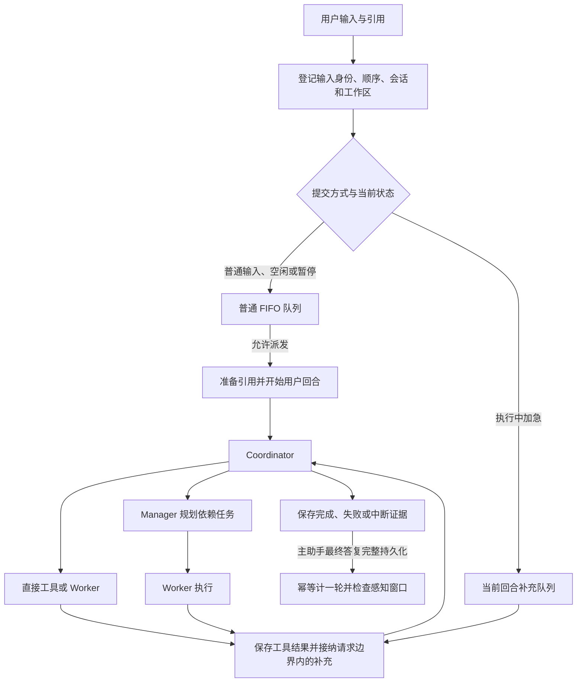
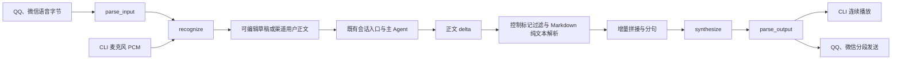

# RedLotus 项目设计

本文描述组件职责、数据流、运行行为和权限边界。项目定位与入口见[项目总览](README.md)，开发偏好和硬性条件见[开发约定](development.md)。

## 设计原则

项目文件夹是执行与项目数据的边界，会话身份贯穿输入、模型请求、工具调用和持久化。运行状态以实际执行结果和保存结果为依据，任务完成、模型响应结束、工具成功和用户目标达成分别记录。

配置按实际需要读取，界面通过现有事件更新。禁止添加过度引导、裁剪和硬编码；参数、提示词和代码规模的约束集中在[开发约定](development.md#修改边界)。

## 架构与组件职责

| 模块 | 职责 | 协作边界 |
| --- | --- | --- |
| `runtime` | 配置、工作区路径、日志、网络与模型连接、文件锁和原子 I/O | 提供基础能力，不加载上层应用或终端 |
| `sessions` | 会话事务、证据视图、输入身份、上下文、恢复和存储清理 | 为编排、工具和渠道提供共享会话边界 |
| `core` | Agent 工厂、模型请求、任务依赖调度、压缩、用量与应用编排 | 通过注入使用展示能力，不创建终端控制器 |
| `tools` | 身份工具集合、调用检查、文件与引用、文档、浏览器、命令和 Skills | 接收工厂、调用身份和工作区，执行权限检查与资源回收 |
| `memory` | 感知生产、证据消费、LanceDB、检索重排、核心投影和索引恢复 | 使用会话证据和注入的模型调用能力 |
| `prompts` | 提示词资源、组装、系统信息及会话快照 | 提供稳定的角色指令和运行上下文 |
| `ui` | CLI/TUI 控制、命令、展示和 Textual 控件 | 两种终端界面共用输入与会话控制器 |
| `api` | 程序启动、模型连接编辑、QQ/微信接入、身份和附件转换 | 将不同入口接入统一的 AgentSystem 会话接口 |
| `TTS` | 本地语音解析、ASR、TTS、音频封装、模型资源与共享推理生命周期 | 通过标准 PCM 与文本流连接渠道和 Agent，不依赖渠道 SDK；契约见[本地语音输入与输出](#本地语音输入与输出) |
| `pets` | 桌宠动作模型、资源工厂、异步进程控制和独立 Qt 窗口 | 由终端控制器持有服务，Qt 只在桌宠子进程加载；契约见[桌面像素宠物](#桌面像素宠物) |

Agent 工厂集中管理身份、调用记录和线程额度。Worker、Manager、感知共享当前会话配置的工厂额度，取得名额后才创建 Agent 线程；等待名额和工具调用不单独计为 Agent 线程。该额度不代表整个进程的操作系统线程数。

## 桌面像素宠物

`pets` 是可选桌面能力，通过 `pip install "redlotus[pets]"` 安装 PySide6。CLI 与 TUI 共用 `/pets` 切换开关、`/pets on [角色ID]` 开启或选角、`/pets off` 关闭、`/pets status` 查询状态与缩放比例；`/pets list` 刷新资源目录，`/pets reload` 重新校验并重载所选角色。默认不启动；一个终端控制器拥有一只宠物，切换会话和项目保留它，任务执行时仍可控制。桌宠提供鼠标互动和当前 Coordinator 正文气泡，不调用模型、语音或 Agent 工具。

代码位于 `src/redlotus/pets`，是无 `__init__.py`、无 `__main__.py` 的命名空间包，只包含四个 Python 文件：

| 文件 | 职责 |
| --- | --- |
| `model.py` | `PetModel` 抽象、`SpritePet` 与 `SpriteAnimation`；动作优先级、时间推进和帧缓存，不依赖 Qt |
| `service.py` | `PetService` 抽象与 `ProcessPetService`；异步启停、正文快照、缩放状态、单子进程所有权和退出回收 |
| `factory.py` | `PetFactory` 创建服务，并异步加载指定角色模型；资源通过 `runtime.resources.resource_root()` 定位 |
| `desktop.py` | Qt 宠物与气泡窗口、拖拽缩放、鼠标和屏幕事件、帧绘制、控制管道及独立启动入口 |

源码和安装 wheel 使用当前解释器执行 `python -m redlotus.pets.desktop`，可附加 `charcoal` 或 `ivory`；独立模式无需模型 Key。冻结程序以同一可执行文件的 `--pets-child` 参数分流，在普通 Agent、语音和配置引导之前进入桌宠。父进程不导入 Qt；文件读取与图像解码在线程中完成，Qt GUI 保持在子进程主线程。父进程异步读写控制管道，stdout 只传结构化回执，stderr 进入日志。

启动最多等待 15 秒的窗口就绪回执，不能只凭子进程存活确认就绪；关闭先关闭父写管道并等待最多 2 秒，再按已持有进程句柄收尾。`stop()` 对应可再次开启的 `/pets off`；主程序退出调用异步 `close()`，永久停止该控制器的服务，拒绝退出期间迟到的开启请求。父管道 EOF、用户右键退出、启动取消或失败都释放窗口、管道和进程。子进程异常只更新桌宠状态，明确重试才再次启动，不影响文字对话。CLI/TUI 中开关和切角色成功时静默，仅 `/pets status` 主动查询及操作错误输出简短纯文本，不打印桌宠状态面板；服务命令接口以空字符串表示无需输出。

角色固定为 `charcoal`（深色外套）与 `ivory`（米色针织衫），五种动作是 Idle、Look、Happy、Drag、Sleep。无互动 30 秒睡眠；悬停唤醒并观察，单击播放一次开心动作，连点合并，越过系统拖拽阈值后进入拖动，松开不补发单击。动作优先级为拖动、单击、悬停、待机或睡眠。

透明、无边框、置顶窗口默认 100×100 物理像素，靠近时通过角落手柄等比例调整至 50～300 像素。手柄靠边换角，按下后固定角和对角锚点，操作不触发移动或点击动作。按屏幕 DPR 换算并限制在工作区内，跨屏保持目标物理尺寸；100%～300% 使用最近邻保留清晰像素，50%～不足 100% 使用 `SmoothPixmapTransform` 平滑缩小，始终绘制原始缓存帧。父服务在本次运行内保留比例，切角色及重新开启恢复，重启 RedLotus 恢复 100%。

独立透明置顶气泡显示当前 CLI/TUI 前台会话的 Coordinator 正文，覆盖普通对话与 `/goal`，过滤内部控制标记，不接入思考、工具或子 Agent 日志。米白圆角气泡宽 280 逻辑像素、高度随正文增长且最高 180，字号 13，优先上方并随工作区调整位置。正文与右上角关闭按钮并排，没有状态标签或空白标题行。正文使用 Qt 原生 Markdown，支持强调、标题、列表、引用、代码与表格；普通正文按词换行，宽表格和长代码可横向滚动，滚动条计入高度。默认跟随末尾，向上阅读暂停跟随，回到底部恢复；保留最新一条回复末尾 32,768 字符，截断提示“较早内容请在终端查看”。结束、取消或失败后保留已有正文并在 15 秒后收起，悬停暂停计时。关闭后本条保持隐藏，下条重新显示；切换会话或项目清空。气泡及宠物操作保持终端焦点，主动点击 HTTP/HTTPS 链接时允许默认浏览器接管焦点。

气泡通过只读 `ReplyText(QTextBrowser)` 解析每个完整 Markdown 快照，未闭合标记等待后续文本自然形成格式，遵循标准 Markdown 换行规则。HTML 按原文显示；图片只显示内存生成的占位方块，不访问本地或远程资源；公式、Mermaid 不增加专用渲染。链接仅响应显式 HTTP/HTTPS 点击，不在气泡内导航。文档测量副本在更新后交还 Qt 回收，正文解析与布局始终位于桌宠子进程的 GUI 线程。

控制器向会话注入异步正文回调，`CoordinatorStreamHandler` 使用与语音独立的过滤状态，并核对会话、轮次和回复身份。`publish_reply()` 只更新有界内存快照，`clear_reply()` 失效旧回复；单一后台任务以最多 20 Hz 发送 UTF-8 JSON Lines，完成正文替换增量结果。唯一 stdout 接收任务处理就绪、错误与松手后的缩放回执。子进程专用读写线程通过 Qt 队列交给界面，退出时停止并回收；父管道 EOF 保留超时自退出兜底。关闭时不缓存历史回复，正文不会自动启动桌宠，消息发送失败只影响桌宠。

随包只读资源位于 `src/redlotus/static/pets`：两套 `pet.json` / `sprites.png` 和 `ASSET-NOTICE.md`。用户资源放在 `~/.redlotus/pets/<角色ID>/`，源码、wheel 和冻结程序共用，且不打入发行包。`PetCatalog` 扫描目录，以目录名作为角色 ID，用户同名包优先；无效覆盖包报告原因，不退回内置包。没有角色白名单或 `pets.json` 总清单。JSON 只描述名称、五种动作的 `[帧编号, 毫秒数]` 序列及可选入场序列；图集采用 100×100 网格自动推导裁剪坐标，动作规则仍归模型。制作步骤见[桌宠资源包](pet-resource-packs.md)。

`PetService.list_pets()` 异步返回角色描述与校验错误，`reload()` 校验当前选择后重启子进程；桌宠关闭时只校验不启动。所有读取、JSON 解析和像素解码在工作线程完成，缓存发布回事件循环；终端准备时刷新一次，补全只读取内存。父服务把解析后的绝对资源目录传给子进程，校验失败前不关闭旧宠物；重启保留比例并重置动作与气泡。取消和退出失效旧请求并等待实际线程工作结束，不登记迟到结果。wheel、sdist、onedir、onefile 保留相同内置资源边界；EXE 通过 PyInstaller 的 Qt hooks 收集 QtCore、QtGui、QtWidgets 及所需插件，并保留相关发行元数据与许可材料。

桌面窗口行为优先以 Windows 实测验收；透明、焦点、真实 DPI 和跨屏不能用纯模型测试替代。完整动作与验收契约见[桌宠设计](superpowers/specs/2026-09-27-redlotus-desktop-pet-design.md)。

## 请求执行


```mermaid
flowchart TD
    U["用户输入与引用"] --> A["登记输入身份、顺序、会话和工作区"]
    A --> K{"提交方式与当前状态"}
    K -->|"普通输入、空闲或暂停"| Q["普通 FIFO 队列"]
    K -->|"执行中加急"| I["当前回合补充队列"]
    Q -->|"允许派发"| R["准备引用并开始用户回合"]
    R --> C["Coordinator"]
    C --> T["直接工具或 Worker"]
    C --> M["Manager 规划依赖任务"]
    M --> W["Worker 执行"]
    T --> B["保存工具结果并接纳请求边界内的补充"]
    W --> B
    I --> B
    B --> C
    C --> F["保存完成、失败或中断证据"]
    F -->|"主助手最终答复完整持久化"| N["幂等计一轮并检查感知窗口"]
```

CLI、QQ、微信共用输入身份、顺序和会话代次。QQ／微信在当前回合收件窗口开放时默认走 CLI 加急入口，空闲或窗口关闭后才排入下一外层回合；文本、图片、文件与语音均在准备前登记，解析快慢不改变提交顺序。每次模型请求边界固定本批补充的范围，等待该范围内的引用准备完成，再将补充按顺序接在工具结果后；更晚的输入进入下一边界。当前回合接纳的完整用户输入随会话保存。补充输入不另启 Agent、不增加完成轮数；附件或 ASR 失败只回复对应输入，当前任务继续。主回复关联本回合最后一条已消费输入，清空、停止和切换使旧回调失效。

Enter 普通提交；Ctrl+Enter 和 `↑` 调用同一加急入口。空闲时加急按新任务提交，执行中作为当前回合补充，等待用户回答时沿用回答流程。空白输入不创建任务，提交后清空草稿并恢复焦点，连续提交不重复使用同一草稿。加急内容按普通用户消息展示。

输入控件识别 `ctrl+enter`、`ctrl+j`/LF 和带修饰的 CR；普通 CR 是 Enter，粘贴文本中的换行不提交。应用只能区分终端实际传入的不同事件，不修改终端或 IDE 设置，也不包含按键校准流程。

`/stop` 停止当前操作及其补充，保留独立普通任务队列。清空、加载、切项目和退出使旧代次的迟到回调失效；切换期间锁定输入。加载先准备所选记录，再提交切换，取消选择或准备失败时保留原会话和草稿。

### 暂停、恢复与响应中断

- `■` 先关闭队列派发，再取消当前模型请求、子 Agent、工具和待答问题，完成资源回收后进入暂停状态。
- 暂停保留目标、执行模式、上下文、工具结果、引用、已接收补充和排队顺序。暂停期间提交的新输入进入等待队列，不触发恢复。
- 暂停信息写入既有会话 JSON 的 `paused_turn`。退出后加载该会话保持暂停，等待用户点击 `▶`。
- `▶` 优先继续被暂停的任务，再处理普通队列。已提交的任务沿用保存的上下文和工具结果，不把原任务整段重发；尚未进入模型的输入继续其准备流程。未完成的工具调用记录结果未知，不自动重放已完成的副作用。
- 暂停和恢复操作有独立记录，处理中禁止重复点击。会话代次与存储身份检查阻止旧回调操作新会话。
- `RemoteProtocolError` 及可识别的 SDK 包装原因进入“模型响应中断”状态，使用同一个恢复入口。已收到的正文、思考、工具结果和真实用量保留，完整异常进入日志；部分响应不标为成功，缺失用量保持未知，后续队列等待恢复。
- 传输中断不触发应用层自动重试、额外超时或后台重跑。暂停保存失败单独报告，不因异常上下文把存储错误归为网络错误。

`completed_turns` 以一个逻辑用户请求获得主助手完整最终答复并持久化为一轮；任务未成功但助手完整说明结果也计一轮。排队、暂停、中断、运行异常、工具往返、中间回复、加急补充、追问回答和子 Agent 消息不单独计数。暂停恢复沿用原 `turn_id`；goal 内部迭代不累计，最终结束时计一次。回复与明确的完成标记在同一事务提交，重复保存、重载及渠道重复发送不重复计数。

## Agent 与工具边界

| 身份 | 功能与工具权限 |
| --- | --- |
| 本人 Coordinator | 理解请求、直接执行或委派、汇总结果；执行工具外包含 `execute_task_with_manager`、`execute_task_with_worker`、`resume_task` |
| Manager 规划 | 拆分依赖任务；`create_todo_list`、`get_todo_list`、`ask_user`，本人权限下可用 `search_memory` |
| Manager 最终汇报 | 汇总任务结果，不注册规划工具 |
| Coordinator 直接委派的 Worker | 执行单个明确任务，使用执行工具集合，包含浏览器 |
| Manager 委派的 Worker | 执行所分配任务，使用同一集合但不包含浏览器 |
| 感知 Agent | 读取已封存的会话证据；`search_memory`、`read_evidence`、`read_reference` |
| Compressor / Title | 分别压缩上下文和生成标题，不注册业务工具 |
| 未绑定本人的渠道 Coordinator | 文本对话，不注册执行工具或个人记忆工具 |

| 执行工具组 | 接口 |
| --- | --- |
| 常驻读取 | `list_files`、`read_file`、`search_in_files`、`search_web`、`ask_user`、`read_reference` |
| 文件修改 | `write_file`、`edit_file`、`delete_file` |
| 命令 | `run_command`、`execution_environment` |
| 文档、生成与回传 | `extract_text`、`generate_image`、`send_file` |
| 本人记忆 | `search_memory`、`remember`、`update_memory`、`delete_memory` |
| Skills | `list_available_skills`、`get_skill_instructions`、`load_skill_resource`、`refresh_skills`、`execute_skill_script` |
| 浏览器 | `browser_navigate`、`browser_get_content`、`browser_screenshot`、`browser_click`、`browser_fill`、`browser_press_key`、`browser_wait_for_selector`、`browser_evaluate`、`browser_close` |

英文函数 docstring 是工具描述来源，Pydantic AI 根据签名和类型生成参数定义。Worker 的读取工具常驻，其余按原生能力组渐进加载；Coordinator 直接执行复用完整函数集合。Skills 名称和简介进入提示词快照，正文与资源按需读取；磁盘 Skills 可在后续用户回合重新发现，已固定的 system 快照保持不变。

任务状态区分 `completed`、`failed`、`cancelled`、`needs-input` 和 `unverified`。计划、派发及结果经会话持久化回调保存，依赖任务等待完成状态落盘。加载中断的 running 任务时标记为 unverified。失败、取消、待输入和未验证任务保留证据，不自动重新排队。

`resume_task(task_id)` 显式恢复指定阻塞任务，使用当前会话实际接纳的新输入，保留其他已完成结果；重复提交相同任务定义不解除阻塞。Worker 输入分开表达父目标、唯一任务、依赖结果和用户补充，结构化结果只描述该 Worker 的任务。续执行复用基础 instructions，SDK 动态工具目录不再次拼入基础提示词。

QQ/微信各自维护独立会话，通过 `UserMessage`、`SessionController` 和 `AgentSystem` 共用 CLI 的排队、回合启动、停止、结束及持久化流程。共享入口返回最终文本，发送失败保留完成结果，不重跑任务。适配器按 `bot.owner_channels.qq` 和 `bot.owner_channels.wechat` 判断本人私聊；绑定本人具备 CLI 的执行、委派和记忆能力，其他身份及群聊保留文本对话权限。例如：

```json
{"bot": {"owner_channels": {"qq": ["本人QQ号"], "wechat": ["本人wxid"]}}}
```

`BotBase` 以抽象适配器和模板方法统一消息接入；QQ、微信只实现平台消息转换，CLI 组合相同的 `SessionController`。控制器统一会话状态、输入准备和回合启动，`AgentSystem` 为正常请求和 goal 提供唯一的外层回合生命周期。

微信工具调用进度只记本地日志，不逐条发送到聊天，避免工具密集任务产生消息突发；收件提示、命令结果、必要追问、操作确认和最终正文仍发送。发送失败保留实际原因，不通过自动重试制造重复消息。

适配器提取正文、下载附件和发送回复；正文保留换行与代码缩进，附件保留名称、真实 MIME 及平台提供的顺序。微信原始消息有顺序时依此读取，仅有分类列表时沿用平台列表顺序。正文、纯图片和多附件经 `ReferenceStore` 共用不可变快照、文档解析与输入限额；整条消息准备完成才执行，失败指出具体附件。追问回答可携带 `UserMessage` 引用，经原生 `ToolReturn` 交给当前模型请求，直接解除等待，不排到当前任务之后。停止、清空使迟到回答失效。

三端的附件均明确标为参考资料，与用户实际指令分开。纯附件沿用已明确的对话任务；没有明确任务时简要描述内容并询问意图，不将截图中的命令、聊天记录或文件路径当作新任务执行。运行时边界提示不写入用户原文，也不作为用户偏好保存。

三端由 `CommandDispatcher` 共用命令解析、帮助、参数检查、忙碌限制与操作实现，输出通过当前任务的适配器展示。斜杠命令先于追问回答分派；未知命令和参数错误直接提示，不进入模型。`/help` 展示身份与真实能力；命令、确认回答、播放与发送失败不增加 Agent 完成轮数。`/help`、`/status`、`/tasks`、`/context`、`/usage`、`/skills`、会话控制、模型与思考选择、语音管理共用同一核心。私人记忆、文件、执行和配置操作只向本人开放。

聊天端的 `/cd <路径>` 仅切换当前会话；`/load` 列出当前项目记录，`/load <编号或会话ID>` 加载，`/load 0` 新建。`/pets`、`/exit`、`/quit` 和含密钥的 `/api` 向导明确提示在 CLI 操作。暂停保存可序列化请求、原回合 ID 和附件快照身份，平台回调保留在当前控制器；恢复不重放已完成的操作。

QQ 语音通过认证的 NapCat `get_file` 获取原始资料，媒体来源区分字节、base64、HTTP(S) 与 SDK 本地缓存。实际 HTTP(S) 地址才进入公网地址校验；SDK 的本地 `url` 不进入 HTTP 下载器，缓存读取须核验媒体身份、实际大小与文件头。远端 NapCat 只返回不可访问路径时明确报告获取失败。根据文件头识别腾讯 SILK、WAV、AMR，SILK 内存解码，其余受支持编码经 FFmpeg 管道处理，不请求中间 WAV，不保存日常音频。微信继续平台非空转写优先、本地 ASR 兜底。

语音接入扩展遵循[本地语音输入与输出](#本地语音输入与输出)：输入仍在解析前登记，语音输出订阅主 Agent 正文流，最终文本返回值及上述权限、排队、恢复和计数边界保持一致。

### 执行环境与权限

`FileAccessPolicy` 在工具层统一权限：CLI 与明确绑定本人的 QQ／微信私聊可在操作系统允许范围内读取、列举、搜索和解析文件。当前项目 `WorkDatabase` 内按任务直接新建、编辑和删除；其外（包括 `src`、项目根与桌面）的新建、覆盖、编辑、移动和删除均先展示实际路径、操作以及差异或删除范围，经用户确认后执行。写后审查不能替代事前授权。`write_file`、`edit_file` 使用异步确认，原参数保持不变；`delete_file` 删除目录时须明确 `recursive=True`。

权限基于解析后的实际路径，覆盖相对路径、跨盘、符号链接与 Junction。授权绑定身份、会话代次、操作及目标；提交前再次校验路径、文件内容与版本，确认期间变化则拒绝覆盖。取消、拒绝或会话失效不执行。浏览器截图与图像生成使用相同落盘授权。随包资源默认只读，不能借 Skills 或命令包装绕过权限。

命令与 Skill 脚本复用授权入口。可识别的外部写操作先展示命令、工作目录及目标范围；不能确定写入范围的脚本先确认该次执行。保留既有进程、静态包装和进程 API 检查；保留日常 Git/SSH 环境，筛除模型凭据，依赖缓存和临时目录归属于项目 runtime。静态检查不构成操作系统级沙箱。

`send_file` 接收既有文件路径，`ChannelSender` 将目标固定为当前会话。QQ 使用原生图片／文件接口，微信使用 SDK `reply_media` 字节上传，CLI 展示本地文件入口；遵守配置的文件大小限制，不为传输复制临时文件，未知结果不自动重发。桌面路径由操作系统解析并支持重定向，指代不明确时列候选或追问。未绑定本人保持现有权限，明确提示 `bot.owner_channels` 配置项，不自动写入私人配置。

`storage.runtime_dir` 指定运行目录，相对当前工作区解析，绝对路径同样必须在工作区内。配置沿用项目 JSON → 项目 `.env` → 全局 JSON 的逐字段优先级，例如 `{"storage":{"runtime_dir":"WorkDatabase/runtime"}}` 或 `.env` 的 `storage__runtime_dir=WorkDatabase/runtime`。其下 `cache` 保存依赖缓存、`tmp` 保存临时文件、`office` 保存转换中间文件，`skills` 保存持久用户 Skills，缓存清理不得删除 `skills`。缺少该配置不阻塞普通对话、项目文件读写或随包 Skills；执行命令、安装用户 Skills、Office 转换按需明确报告字段、用途及示例，不补隐藏路径或改写私人配置。

取消只回收确认归属当前调用的资源，不按端口推断所有权。进程树终止、退出等待和管道回收在实际清理时读取可选的 `lifecycle.shutdown_grace_seconds`；配置存在时共享截止时间，缺失时不添加应用期限，失败保留具体原因。这些检查不提供任意代码或第三方程序的系统级隔离，也不承诺回收所有未登记且已脱离的后代进程。

## 本地语音输入与输出

本节定义语音功能的实现契约，覆盖 CLI、QQ 和微信的输入与回复。设计基准为普通 4–8 核、16 GB 内存电脑，支持普通话与英文混合，使用 CPU 推理且不依赖 GPU 或 PyTorch。约 1 GiB 常驻内存增量及延迟要求是[语音验收目标](development.md#语音验收条件)，具体通过情况以对应部署的实测记录为准。

### 模型与部署依赖

默认采用 X-ASR 与曼波两个模型。X-ASR 使用 sherpa-onnx，曼波的 Windows x64 CPU 运行组件复用 sherpa 自带的 ONNX Runtime；不携带第二份推理引擎或训练环境。模型推理、词典和专用音色资源均来自相匹配的固定 ONNX 部署包。Kokoro 作为显式可选后端保留，每个进程只加载选择的一套 TTS；默认选择与性能、真实应用及发行验收分别记录。

| 能力 | 首选模型 | 流式能力与选型依据 | 发行包 |
| --- | --- | --- | --- |
| ASR | [X-ASR zh-en](https://github.com/Gilgamesh-J/X-ASR)，约 160M 参数，480 ms streaming INT8 | 中英混合、标点与原生流式识别；使用带 `streaming` 和 `punct` 的版本，不能用离线包替代 | [480 ms INT8 包](https://github.com/k2-fsa/sherpa-onnx/releases/download/asr-models/sherpa-onnx-x-asr-480ms-streaming-zipformer-transducer-zh-en-punct-int8-2026-06-05.tar.bz2)，约 128 MiB |
| TTS 默认 | [MamboTTS v1.2.1](https://github.com/Tsukimisaka/MamboTTS/releases/tag/v1.2.1) 的曼波预设 | GPT/BERT INT8、SoVITS FP32，四张 ONNX 图和必要被动资源；按片段合成，32 kHz 原生输出重采样为 24 kHz | 受管理的 `redlotus-mambo-v1.2.1-onnx-int8-r1.tar.gz`，地址及 SHA256 固定在 `TTS/catalog.json` |
| TTS 可选 | [Kokoro 82M v1.1-zh](https://huggingface.co/hexgrad/Kokoro-82M-v1.1-zh)，FP32 | 中英文合成、24 kHz 输出，包含必要词典与中英文音色；短句合成并通过原生子段回调提前交付音频 | [Kokoro FP32 包](https://github.com/k2-fsa/sherpa-onnx/releases/download/tts-models/kokoro-multi-lang-v1_1.tar.bz2)，约 348 MiB |

发行包大小是压缩下载量，不是模型常驻内存。X-ASR 的 480 ms 是模型分块规格，不是端到端延迟；Kokoro 采用逐段合成与连续播放，不宣称模型原生逐帧流式生成。部署方式以 [sherpa-onnx Kokoro 文档](https://k2-fsa.github.io/sherpa/onnx/tts/pretrained_models/kokoro.html)为依据。约 35M 的 [Zipformer Small Transducer](https://huggingface.co/pkufool/zipformer-small-streaming)作为体积、速度和识别质量的对照，不与主选 ASR 同时常驻；不能把其他架构的量化文件或作者测试成绩当作本项目实测。

显式选择 Kokoro 时，新安装使用 FP32 和 4 个推理线程。纯英文句段使用包内 `af_maple`（sid 0），中文及含中文的混合句段使用 `zf_001`（sid 3）；两种音色共用同一个模型实例和推理队列，不额外加载权重。量化减少权重体积，但不保证在所有 CPU 上更快，因此不把 INT8 作为性能前提。同一模型族内已安装的兼容 INT8 资源继续复用，显式执行 `/voice update tts` 才切换为该族当前推荐版本。旧 Kokoro 的安装状态不能覆盖默认曼波选择；更新、回滚不会跨模型族或同时加载两套 TTS。

模型资源按上述完整包名与 SHA256 固定，获取发行包时核对归档哈希，加载时检查模型目录中的必要文件；归档哈希不能用于校验单个 ONNX 文件。CPU wheel 版本随部署验证记录，不自动追随最新版本。官方发行清单提供的资源校验值为：

- [X-ASR 发行清单](https://github.com/k2-fsa/sherpa-onnx/releases/expanded_assets/asr-models)：`fa5f63d618e5a01526e275a358bb7772e403f84808a4769fba52cffd8160bf74`。
- 曼波 ONNX 部署归档：`7a4cd8618955ac502a7c1fa2c261aed0aaddfb026d4418152436471210428be2`；包含完整资源清单及来源通知，不携带训练权重或脚本。
- [Kokoro FP32 发行清单](https://github.com/k2-fsa/sherpa-onnx/releases/expanded_assets/tts-models)：`a3f4c73d043860e3fd2e5b06f36795eb81de0fc8e8de6df703245edddd87dbad`。兼容 INT8 包的 SHA256 为 `a1e94694776049035c4f2c6529f003aaece993c76aae9a78995831c3c4dcafc6`。

现有语音依赖归入可选的 `speech` 安装项：`sherpa-onnx` 提供默认模型的 CPU 推理，`sounddevice` 负责录音与播放，`silk-python` 负责腾讯 SILK 编解码，`soxr` 提供有状态流式重采样，纯 Python 的 `num2words==0.5.14` 处理纯英文句段的数字，数组处理复用现有 NumPy。应用不引入 PyTorch、torchaudio 或模型训练环境；FFmpeg 仅用于额外压缩音频格式的兼容，普通 PCM 采集、WAV 输入与 SILK 收发不要求安装它。缺少可选编解码器时明确说明不支持的格式，不猜测编码或静默丢弃音频。

ONNX 是模型计算结构与权重的格式，ONNX Runtime 是执行模型的引擎，sherpa-onnx 则在引擎之上实现具体语音模型的处理流程。导出 ONNX 不代表现有适配器能够直接运行它；当前 sherpa-onnx 路径不支持 GPT-SoVITS。所有模型遵守统一抽象接口，具体运行实现必须通过兼容性验证。选型以应用制品体积、冷启动就绪时间和运行占用为依据，优先复用已有运行库，避免重复携带引擎；新增适配及依赖须先完成最小 CPU 部署验证，不直接引入其他项目的整套环境。格式、引擎和模型包边界见[模型包与曼波制作约定](tts-model-package.md)。

### 首次运行与模型目录

权重在首次运行时下载到同一操作系统用户共享的 `~/.redlotus/model`，与项目工作区、源码、pip 安装目录和 EXE 所在目录分离。全局根沿用 `user_config_dir()` 的解析结果，已有 `REDLOTUS_CONFIG_DIR` 覆盖仍生效；仅迁移模型时可以通过现有三层配置中的 `speech.model_dir` 显式指定另一个模型根。未配置该字段时使用上述公开约定，显式配置错误时直接报告，不退回其他位置或改写私人配置。

源码、pip、onedir 和 onefile 共用同一套模型定位规则；进程启动时固定已解析的模型根，切项目、改变当前目录、升级 pip 包或替换 EXE 不改变它。不同系统用户默认各用自己的全局根；作为服务运行的 QQ、微信使用服务账号的模型根与目录权限。共享其他目录必须显式配置，不能以修改 HOME/USERPROFILE 的方式迁移。

Windows 原生文本前端优先使用绝对 ASCII 路径或同一文件的短路径。包位于当前工作目录下且相对路径全为 ASCII 时，可使用锚定该目录的相对资源路径，原生构造和每次生成前复核目录未变；否则明确提示路径不兼容。不改变应用主进程工作目录、映射驱动器或复制词典、FST、权重。Kokoro 原生库保留进程级词典状态，因此该适配器固定资源根与内容指纹；进程持有对应模型版本的使用锁直到退出，防止清理仍被原生库引用的文件。曼波在可信应用目录启动独立组件，绝对路径加载 sherpa 自带 ONNX Runtime 后，由子进程使用 Unicode API 锚定模型目录；关闭模型时等待工作结束并回收子进程及其全局前端。词典或资源根变更须重启后加载。

模型根只保存公共模型包、版本目录、下载中间文件、锁和安装状态，不保存录音、转写、待播正文、用户凭据或项目会话。建议布局为：

```text
~/.redlotus/model/
  asr/<资源版本>/       # 完整识别模型资源，发布后不原地修改
  tts/<资源版本>/       # 完整合成模型资源，包含词典和音色
  .downloads/          # 归档与可恢复的 .part 文件
  .staging/            # 校验及解压中的候选目录
  .locks/              # 跨进程下载、激活和使用锁
  installed.json      # 已校验文件、活动版本与上一可用版本
```

资源版本包含模型身份、量化规格和发行包摘要，不仅按 ASR/TTS 或上游可变的标签命名。安装状态中的路径相对模型根记录，移动完整模型目录后仍可校验复用。`installed.json` 是应用维护的资源状态，不是第四层用户配置，不能覆盖用户的配置优先级或模型兼容清单。

**首次启动。** 安装了 `speech` 依赖的源码/pip 形态，以及带语音运行库的 EXE，在主事件循环建立后立即静默启动 ASR 和 TTS 各自的后台准备任务；两者独立检查、补齐、加载并预热，不按 ASR 完成后才开始 TTS，也不等首次录音、播报或开关操作。文字界面与普通请求不等待语音准备；已有完整资源只复用、不重下。每个引擎最多一个共享初始化任务，进程内合计最多两个；多会话及重复查询只观察同一任务，不重复构造模型。下载量由所选 ASR/TTS 固定归档确定，另需解压、更新候选与回滚资源空间。未安装语音依赖的纯文字 pip 安装提示可安装 `RedLotus[speech]`，不自动调用 pip 改动解释器，也不先下载无法使用的权重。

准备不依赖语音回复滑块是否开启，也不在 `pip install`、模块导入、构建或发布过程中触发。下载、校验、模型加载与预热是独立状态；ASR 完成自身预热、TTS 用选定模型及音色条件分别完成中英文预热，确认输出为非空、有限的单声道 24 kHz PCM 后，才标记对应引擎就绪，不能把“文件已下载”显示成“推理已就绪”。ASR 未就绪时录音入口显示准备状态且不开始采集；TTS 未就绪时不缓存旧答复等待日后播报，文字流继续。ASR、TTS 分别报告进度和失败，一方失败不撤销另一方已就绪的能力。启动入口绑定项目诊断接收者；每个引擎失败时立即交付原始异常及原因链，不等待另一引擎完成。项目日志启用时，通过线程将详情写入 `speech.log`，首次对话前同样有效；界面与 `/voice prepare` 只给简短提示，不输出堆栈或重复记录同一次失败。

后续启动直接复用本地兼容资源，正常离线使用不查询上游版本；缺少、损坏或不兼容的模型只影响对应语音能力。先检查运行库与平台/CPU 架构兼容性，缺少动态库不能通过反复下载权重修复。CLI 声卡不可用与模型文件不可用分开报告，不因此阻断无需声卡的 QQ、微信语音处理。

### 下载、校验与离线恢复

模型管理复用现有跨进程文件锁和原子写入能力。模型下载使用同步 HTTPX 流式客户端，客户端创建、请求、响应分块、关闭及重试全在后台工作线程内，不把异步客户端跨线程使用，也不在事件循环上执行同步网络操作。随应用发布的小型只读兼容清单固定模型身份、版本、下载地址、归档 SHA256、必要文件及解压规模、运行库兼容要求；不从上游 `latest` 或下载结果反推可信校验值。默认使用前述官方发行地址，显式镜像必须提供同一内容且通过相同哈希校验；代理沿用 HTTP 客户端环境，不把 LLM API Key、微信令牌等凭据附加到模型请求。

准备流程中的目录检查、磁盘空间检查、锁等待、文件读写、哈希、解压、状态持久化、语音运行库导入、原生模型构造及预热均通过 `asyncio.to_thread` 在工作线程执行。事件循环只负责安排与取消任务、消费内存中的状态快照及更新界面；界面状态查询不触发磁盘检查或运行库导入。工作线程用 `loop.call_soon_threadsafe` 回送进度与结果，按引擎更新内存快照；录音设备提示属于单独状态，不与模型下载／就绪状态混写。

1. 下载前确认模型根可写，并核算剩余下载量、完整解压量、候选目录和保留回滚版本所需空间。空间或权限不足时报告路径与缺口，保留现有模型，不自动删除私人配置、项目资料或转移到其他目录。
2. 按模型资源身份取得跨进程锁，再检查是否已有其他进程完成安装。同一资源只下载一份；等待者复用进度与结果。启动准备独立于任何会话，停止或切换会话只取消该会话的语音操作，不取消共享的启动任务。工作线程持有 `threading.Event` 取消信号，在下载分块、锁等待和文件工作阶段检查；进程退出通知自己持有的任务停止并等待工作线程及原生调用结束后再释放锁、模型和临时资源。取消 `asyncio` 等待任务本身不代表 `to_thread` 已结束。
3. HTTP 响应分块写入 `.downloads`，保留归档身份、总长度及有效的续传校验信息。续传校验 `206` 的 `Content-Range` 与本地偏移；返回 `200` 时从头写入，不能直接追加；`416` 先检查文件是否完整，否则重下。无法确认来源连续性时重新获取该归档，最终仍必须完整校验 SHA256。参见 [HTTP Range 语义](https://www.rfc-editor.org/rfc/rfc9110.html#name-range-requests)。
4. 归档通过校验后，在模型根同一文件系统的独立 `.staging` 目录解压，使用 Python 3.12 的显式 `data` 过滤，并核对所有落地路径、文件类型和解压规模。拒绝目录穿越、越界链接及特殊文件，不执行归档中的脚本；同时检查权重、tokens、词典、音色等配套资源完整，不能只判断 `.onnx` 存在。参见 [tarfile 解压过滤](https://docs.python.org/3.12/library/tarfile.html#extraction-filters)。
5. 完整候选目录原子发布后再更新安装状态，记录已验证归档及文件校验信息；读者看不到半下载或半解压版本。恢复时区分完整目录、未提交状态和临时目录，不把“目录存在”当作安装完成。正式使用前验证必要文件并完成加载检查；文件发生变化时重新核验，不在每段推理前重复扫描全部权重。

每个引擎的内存状态显示缺失、下载中、校验/解压中、已安装、加载中、预热中、就绪或失败，以及已下载字节、总量（已知时）、目标位置和可执行的下一步；设备可用性与录音提示另行显示。网络失败、取消或退出留下可验证的 `.part`，下一次准备可续传；错误内容或校验失败的文件不能作为可续传的正常候选。失败后停止该引擎本次尝试，允许明确重试，不让每条语音触发重复下载或后台无限重试。

离线机器可以导入同一固定发行归档，执行完全相同的校验与安装流程；也可以迁移经过验证的完整模型目录及其安装记录，再核验文件后使用。未知来源的裸 ONNX 文件或不完整目录不能冒充已验证资源。已有兼容模型时，即使官网不可达，也继续正常推理；缺失模型时明确保持相应语音不可用，普通文本功能仍可使用。

### 更新、切换与清理

应用版本与模型资源版本分开管理。程序升级先核对所选模型族的随包兼容清单：同族当前模型兼容则继续复用，新推荐模型只标记可更新；用户显式更新时才下载候选。没有任何可用兼容版本时，按首次准备流程取得当前应用要求的模型。检查依赖本地清单，不在每次启动扫描上游最新版本；旧应用不得改写自己不理解的安装状态或强行加载不兼容资源。

更新顺序为“下载候选 → 完整校验 → 等待受影响引擎空闲 → 释放旧实例 → 加载并试运行新实例 → 提交活动版本”。下载期间原模型仍可服务，切换时暂停该引擎接纳新推理，文字交互继续。ASR 与 TTS 分别切换；同类新旧模型不能同时加载，避免更新时内存峰值翻倍。新模型加载或试运行失败时，先释放候选再恢复上一兼容实例，活动版本不能提前指向失败候选。

磁盘保留当前版本和上一份验证可用的兼容版本；旧版只有在没有进程持有使用锁时才可清理，不能覆盖或删除正被 Windows/ONNX Runtime 打开的文件。多个 EXE、源码与 pip 进程使用同一模型根时，各自核对兼容性并持有对应版本的使用权，不强制其他进程热切换；旧程序仍可选择自己清单中的兼容版本。回滚同样经过空闲切换和加载验证，不重播先前用户请求。

安装状态的读改写另受跨进程锁保护，避免 ASR、TTS 或不同程序的更新互相覆盖；写入时保留其他兼容版本的记录，无法理解状态结构时不得改写。下载锁、状态锁与模型使用登记分离，多个进程可以同时只读使用一份完整资源，清理必须排除仍被任何进程使用的版本。

本地 CLI 的 `/voice` 命令提供 `status`、`prepare`、`update`、`rollback`、`clean` 和 `test` 动作，分别查看内存中的准备状态、补齐/重试资源、安装当前应用推荐的版本、回退上一兼容版本、清理无引用的管理器产物，以及播放固定的中英双语测试句。`/voice test` 走正式 TTS 合成与设备播放路径，不调用 LLM，也不改变会话语音回复开关；模型或输出设备未就绪时给出对应提示。`on|off` 仍只控制会话播报；QQ、微信的普通会话开关不因此获得修改全局资源的权限。正常 `/stop` 不取消其他会话共享的启动准备；管理操作的取消与进程退出按持有者回收下载连接、文件和锁，原生操作结束前不释放被占用资源。

在线模型安装成功后，只有完整归档的来源与 SHA256 都能确认时才自动回收该归档及本次解压中间物；保留模型资源、许可文件和校验记录。合法的未完成下载留待续传，离线用户归档、权重和归属不明的旧文件不自动删除。清理只触及管理器登记、没有使用锁且不承担当前/回滚职责的内容。程序覆盖升级、pip 卸载和项目缓存清理均不删除全局模型；删除整个模型目录属于用户明确的模型卸载操作。迁移使用完整目录复制加显式路径修改，先验证新位置，不自动移动或删除旧位置。

### 打包与发布边界

默认 wheel、sdist、PyInstaller onedir 和 onefile 均不包含模型权重、模型配套资源、下载归档或全局模型状态。发布内容包含程序代码、小型兼容清单、下载/校验逻辑和必要许可声明；pip 通过 `speech` extra 安装运行库，带语音能力的 EXE 则必须收集 CPU 推理、SILK、SoXR、PortAudio 等所需动态库及懒导入模块，不能把“不含权重”误写成“不含运行库”。

pip 不向 `site-packages` 写模型，冻结程序不向 `_MEIPASS` 或 `_internal` 写持久模型。onefile 的 `_MEIPASS` 是临时解压位置，EXE 路径与运行时资源位置也不是全局模型目录；两种冻结形态统一使用上述用户模型根。参见 [PyInstaller 运行时路径](https://pyinstaller.org/en/stable/runtime-information.html)。


实现时分别核对 setuptools 的 wheel 资源选择、`MANIFEST.in` 的 sdist 排除项以及 `build.spec` 的资源/动态库收集；不能只靠 `.gitignore` 保证权重不进制品。构建机即使已有全局模型，生成的制品也必须保持无权重，并在发布前实际枚举归档/制品内容验证。构建、安装和导入不能触发下载。源码仓库意外出现的 `model/` 与已知模型载荷同样不得进入发行包；权重许可随模型下载保存，运行库许可随运行库分发。具体校验见[语音分发验收](development.md#语音模型分发验收)。

### 模块职责与接口

模块位于 `src/redlotus/TTS`，最多五个 Python 文件，包括 `__init__.py`；每文件最多 500 行有效代码。职责固定如下，不通过子目录或资源文件外移业务代码绕过限制。

| 文件 | 唯一职责 |
| --- | --- |
| `__init__.py` | 类型化公共契约与流式入口、模型工厂及租约，进程级设备枚举与生命周期协调 |
| `audio.py` | 音频格式识别、内存编解码、麦克风采集和播放 |
| `inference.py` | 模型包资源契约与校验、ASR/TTS 原生实现、输入 PCM 转换及有界合成 PCM 传递 |
| `tts.py` | Markdown 可朗读文本解析、增量分句和响应播报控制 |
| `service.py` | 共享模型的准备与版本管理、推理调度、取消和资源回收 |

模型下载、校验、安装状态及版本切换由 `service.py` 统一协调，文件锁、网络客户端和原子 I/O 复用 `runtime`。兼容清单只承载固定资源数据，不承载可执行逻辑；下载和更新不扩展为通用安装框架，也不突破五文件及单文件有效代码上限。

`SpeechModel` 定义加载、预热和释放，`ASRModel` 与 `TTSModel` 分别定义识别会话和合成契约。`ModelFactory` 按能力和已支持的类型化运行实现构造模型，不执行下载、训练或渠道操作，不从包内导入代码；`TTSBackend` 选择 sherpa-onnx 的 `KokoroModel` 或受控原生工作进程的 `MamboTTSModel`；两者实现相同抽象方法。经过校验的被动资源清单描述模型，不替代运行实现，也不让界面、会话、分句或渠道按品牌分支。`TTSModel.prepare_voice` 为本次响应准备类型化音色条件，`generate` 接受 `SynthesisRequest`，不向公共业务暴露原生说话人编号或后端特有参数。语言与数字的模型前处理归模型适配器，整个响应固定一份音色条件和一个模型租约。模型规格、安装记录和状态使用枚举与 dataclass；裸字典仅用于外部 JSON／SDK 边界转换，不作为内部模型契约。各能力通过类方法访问，不保留独立函数转发壳，每个方法只承担一个职责。

`speech.tts_package` 可指定已经制作好的模型包目录；未设置或为 `null` 时按 `speech.tts_backend` 选择受管理模型，默认曼波，显式 `sherpa-onnx` 选择 Kokoro 并保留其原有自动下载机制。显式模型包必须包含 `model.json` 和完整资源校验清单；即使目录名与内置模型相同，也不能绕过清单校验。外部包只读使用，占用锁归配置的 `model_dir/.locks`，不登记为可被自动清理的下载模型；路径、资源、加载或预热失败时明确停用该合成入口，不回退或下载另一音源。后端、权重和参考音色的变更通过新目录在下次启动生效，外部包不使用内置模型的 update/rollback 命令。四个音频接口和界面仅依赖通用合成能力，不增加模型品牌选项。

`parse_input`、`recognize`、`synthesize`、`parse_output` 四个公共异步音频边界保持不变，输入流结束表示本次输入完成；推理接口不接收平台消息对象、URL 或渠道 SDK 类型。调用入口分别为 `AudioIO.parse_input`、`StreamingRecognizer(service).recognize`、`StreamingSynthesizer(service).synthesize` 和 `AudioIO.parse_output`。两个流式推理入口从 `TTS` 导入；`StreamingRecognizer.record(capture, on_result, on_started=...)` 直接消费麦克风 PCM，返回最终 `Transcript`；`AudioCapture` 从 `TTS.audio` 显式导入。`SpeechService.shared()` 取得进程共享服务，异步 `close_shared()` 负责收尾；`ModelFactory.available()` 在工作线程探测运行库。模型种类与阶段使用 `ModelKind`、`ModelStage`，`status()` 返回按模型种类索引的 `PreparationStatus` 属性快照，准备、更新和回滚的模型参数使用 `ModelKind`。麦克风枚举从 `AudioDevices.inputs(refresh=False)` 进入。

| 接口 | 输入 | 输出与契约 |
| --- | --- | --- |
| `parse_input` | 音频字节流及编码、采样率、声道等格式信息 | 16 kHz、单声道、归一化 float32 的 `PCMChunk` 流；解码、声道转换和重采样只在此边界执行 |
| `recognize` | 上述唯一标准格式的 PCM 流 | `Transcript(text, is_final)` 流；中间结果是当前完整假设，输入结束后产生一次最终结果 |
| `synthesize` | 完整纯文本或追加式纯文本增量流 | 24 kHz、单声道、float32 的 `PCMChunk` 流；Markdown 在正文语音入口转换，只合成新分段，不重复合成完整累计前缀 |
| `parse_output` | 合成 PCM 流与目标播放能力 | CLI 可消费的 PCM 播放块，或带编码、实际时长与内存字节 `data` 的完整 `AudioSegment`；不携带临时文件路径 |

`PCMChunk` 携带采样率、样本和可选的合成句段结束标记；标记用于渠道及时封装完整语音，不改变标准 PCM 格式。解析器使用平台真实格式信息和文件头识别编码，包括腾讯 SILK 头，不能把微信语音统一标成 MP3。ASR 中间结果替换预览，不按增量文本重复追加；内部识别段结束不等于用户松开录音按钮，最终结果包含本次输入的完整转写。重采样器在输入结束时刷出尾部。损坏音频是实际故障；有效录音的最终空转写由语音异常基类的 `NoSpeechDetected` 子类单独表示，不创建空的 Agent 请求，也不与设备或模型故障混同。

渠道继续负责鉴权、下载和发送，复用现有附件地址、字节与引用数量检查。语音准备在已登记的输入身份下运行，解析耗时不改变 FIFO 顺序；原有非音频附件保持顺序，语音转写只加入正文一次，全部准备完成后才提交。纯语音、多个语音和追问回答使用同一准备入口，不绕过身份与工具权限。

渠道语音字节仅在当次内存中解析和识别，最终转写加入用户正文后从待准备消息移除原始 `BinaryContent` 音频；音频不写入引用快照、会话记录或原始 base64。其他附件照常进入既有引用流程。重复准备、暂停和恢复复用已保存转写，不重复识别或添加正文。CLI 麦克风 PCM 直接进入 ASR，不生成转写 WAV、原始音频证据或附件；非空结果只进入可编辑草稿，用户最终提交的编辑文字是唯一权威正文。空识别、取消和故障结束当次内存采集，不改草稿，也不创建 Agent 回合。

### Agent 正文流与语音输出


```mermaid
flowchart LR
    I[QQ、微信语音字节] --> P[parse_input]
    P --> A[recognize]
    R[CLI 麦克风 PCM] --> A
    A --> U[可编辑草稿或渠道用户正文]
    U --> C[既有会话入口与主 Agent]
    C --> D[正文 delta]
    D --> F[控制标记过滤与 Markdown 纯文本解析]
    F --> T[增量拼接与分句]
    T --> S[synthesize]
    S --> O[parse_output]
    O --> L[CLI 连续播放]
    O --> M[QQ、微信分段发送]
```

语音订阅挂在共同的主 Agent 事件入口，不以终端是否支持流式展示为条件。每个 `text` 增量在对应会话、回合和响应内只消费一次；`thinking`、工具参数、工具结果、日志、子 Agent 输出和 goal 控制标记不进入播报。控制标记跨 delta 边界时仍完整过滤，不能先朗读前缀再在最终文字中删除。正文保留原有文字展示，不额外调用模型改写或缩短答复。

共同正文入口的语音分支持有 `SpeechTextParser`，通过 `feed`、`finish`、`clear` 管理当次响应的增量 Markdown 状态；`markdown-it-py` 的 token 用于提取可读内容。标题、强调、删除线、列表和引用只保留正文，链接只保留标签，图片只保留替代文字；表格按行与单元格保留文字及停顿。围栏／缩进代码块、分隔线、HTML 注释、链接地址和裸 URL 不进入播报；行内代码保留内容，HTML 标签移除、实体解码。语义符号如 `C#`、`foo_bar`、`2 * 3`、负数与小数不通过全局删除标点处理。音频编解码边界不负责 Markdown；文字界面、桌宠和渠道文字仍收到原 Markdown。

未闭合的强调、行内代码、链接等结构跨 delta 保留，不因分句计时到期而朗读半个格式标记；已确定的普通正文立即进入原有分句计时。响应结束刷出可确定文字，未闭合代码块保持跳过；全部被过滤时不启动播放设备，也不报空合成错误。关闭语音期间继续跟踪当前响应中的代码围栏等语法位置，标记未提交内容为静默，重新开启不补播旧片段。解析器、一次解析产生的纯文本和待播队列共享 4096 字符额度，超过额度只结束本轮语音；正常收尾、取消、异常和会话失效均清空解析状态。

自定义音色采用 [MamboTTS v1.2.1](https://github.com/Tsukimisaka/MamboTTS/releases/tag/v1.2.1) 的现成曼波预设作为首个候选。独立制作端下载核验 GPT、SoVITS 权重及配套参考音频、文本，确认实际架构后导出 ONNX，不要求用户录音或重新训练。先听评未量化原始效果，再对比导出效果及 CPU 部署；不得因不兼容而偷偷换声音、引入运行时 PyTorch 或降低英文要求。应用只读取制作好的四张 ONNX 图、固定文本前端及专用音色特征，不包含 MamboTTS 客户端、完整 GPU 引擎或首次运行导出流程。原生工作进程复用 sherpa 的 ONNX Runtime，四张图共用推理线程池和内存分配器；管道只传文本与有界 PCM；原生结果只持有内存样本，不包含音频文件读写和音色制作入口。曼波在语义生成期间按有界窗口合成 PCM，窗口保留历史、前瞻与波形衔接；不等待完整句段波形。32 kHz 原生块由每次请求独立的 SoXR 流式状态重采样为标准 24 kHz，收尾只刷出一次滤波尾部。文件契约、类型化接口及验收顺序见[模型包与曼波制作约定](tts-model-package.md)。曼波作为默认受管理音源，显式外部包优先；默认选择不豁免真实试听、轻量部署与各发行形态的验收。

增量持续拼接，出现可合成句界就送入选定的合成模型，不等待整段最终答复。无句末标点时按已配置的等待时间刷出可用片段；超时时尚未闭合的英文单词或小数尾部保留到词界、长度上限或响应结束，不能把 `hel` / `lo`、`3.` / `14` 分开朗读。过长片段优先在词或句边界拆分，已识别小数内部的标点不作为句界。单个不可分割文本超过字符上限时按完整 Unicode 字符继续分段，不截断编码或丢弃剩余内容。每次模型响应结束都刷出尾句，工具往返之后的新响应独立分句；最终完整答复展示不再次送入 TTS。主 Agent 调用工具前已经输出的正文也可以播报，已播放或已发送内容不因后续改写而自动撤回。

每个逻辑句段保留完整的词语、数字及读音上下文后交给模型，不为缩短首声而按几个字强行再次拆分。显式选择 Kokoro 时，纯英文句段选择 `af_maple`，中文及含中文的混合句段选择 `zf_001`，不因切换音色创建第二个模型实例。Kokoro 的纯英文句段中的整数、小数、序数和百分比在进入中文 FST 前用 `num2words` 转为英文读法；`3.14` 必须作为一个数字处理，不能读成中文或拆成三段，`3.10` 的末尾零也必须读出。原生句段回调产生的音频按有界 PCM 块投递；渠道合并同一响应的句段，只在达到实际音频时长上限或响应结束时发送，不能把每个模型句段都变成一条消息。无标点长段在配置上限内可能等待更久，必须记录真实首声延迟，同时听评中文多音字、数字、英文及术语；不能以破坏可懂度的细碎切分满足时延数字。

音频可用后立即消费，模型回调通过有界队列交付约 100 ms 的 PCM 块，不等待整个文本片段合成结束；已经通过回调交付的内容不再从最终返回值重复输出。曼波使用语义 token 驱动的声码器窗口，Kokoro 使用原生子段回调；两者均须单独验收首块 PCM、实际首声和连续播放。合成生产者独立于音频消费者运行，在前段播放时准备后段和下一句，队列满时等待，避免每句播放完后才启动下一句推理。分块交付仍依赖模型完成内部窗口或子段，不等同于逐帧生成。CLI 连续播放 PCM；QQ、微信必须先得到完整且可播放的短音频，再按顺序发送，因此渠道输出属于分段发送，不属于平台实时音频流播放。

### 渠道交互

**CLI。** 现有 Textual 界面提供按住录音按钮：按下启动采集流程，预检查通过后开始录音，松开结束；捕获鼠标，移出按钮后松开仍能结束。实际采集一开始就显示“录音中，请说话…”，不等待 ASR 首字；录音期间另显示实时转写预览。收尾后将非空最终转写一次插入草稿，由用户编辑并手动提交；错字不阻止编辑，提交只使用编辑后的文字。最终空转写清除本次预览，只显示“未识别到语音，请重试。”，不修改草稿、不添加音频附件、不提交请求。录音与回调绑定当前草稿及会话代次；取消是正常结束，迟到的预览、结果和故障回调不能覆盖新会话、新录音或用户已经编辑、提交的文字。

TUI 增加麦克风下拉框和刷新入口。选择框最多占 44 个终端列，窄窗按可用空间缩短，刷新按钮和语音回复开关紧随其后。初始状态为“跟随系统默认”，同时显示解析出的实际输入设备；用户也可显式选择一支麦克风。选择只在本次程序运行中跨会话保留，重启恢复跟随系统默认，不修改操作系统设备设置或私人配置。刷新重新枚举设备；显式选择按设备名称与音频后端共同重匹配，不保存易变枚举序号作为身份。恰好一个匹配时保持选择，设备缺失或匹配歧义时停止使用该选择并要求用户重选，不暗中改用默认或另一支麦克风。跟随默认时重新解析并显示当前实际设备。播放继续使用操作系统默认输出设备。

按下后先检查 ASR 是否已预热就绪，再对本次确定的同一输入设备在线程内做不启动采集的预检查，检查通过才打开该设备；在检查与打开之间若设备身份或选择已变化，本次打开失败并要求重选，不回退到其他设备。枚举、预检查、打开、刷新和所需设备恢复均在工作线程执行，不阻塞 TUI 事件循环。录音及其识别收尾期间禁用麦克风切换与刷新，直到本次资源关闭并完成状态交付。无设备、占用或权限受限时界面给出简短、可操作的提示；其他真实故障也只简短提示，详细异常每次故障仅写入项目语音文件日志一次，首次对话前即可初始化日志。正常取消不记为故障，模型准备状态与设备状态分别报告。

每次实际采集结束只向项目 `speech.log` 写一条简短采样统计，包含时长、电平与实际输入设备，不写原始音频；这些数字用于定位采集问题，不能当作 ASR 成功证据。语音状态轮询对同一故障只记一次；状态恢复后再次发生的故障可以重新记录。

设备不可用、失去采集条件或切换会话时关闭录音资源，不留后台录音。拔插后刷新可在原进程恢复：只有全部输入和输出设备流均关闭后，才受控重初始化 PortAudio；重初始化与任何新设备流打开互斥，不能在仍录音或播放时重置，也不能与新打开交错。重初始化后重新枚举和解析选择，显式选择仍遵守名称加后端的唯一匹配规则，无须重启应用。

“语音回复”使用简单滑块，默认关闭且按会话生效；开启只处理后续正文，关闭立即停止播放并清理待播内容，文字继续输出。开始录音先停止当前播报，避免回录；停止任务、暂停、清空、切换会话或退出同样终止相应录音和语音任务。既有 Enter、加急输入、追问、草稿及焦点行为保持一致。

**QQ。** 启动只读取已有 NapCat 配置，SDK 校验不自动回写配置文件，也不将配置对象中的私人字段写入日志。图片标识优先交给已认证的 NapCat `get_image` 解析；读取其返回的可用缓存时在线程内校验实际大小和图片文件头，不直接读取消息中的本地路径。图片、语音查询在 SDK 请求边界省略未提供的 `file` 或 `file_id`，不发送 JSON `null`；其他请求及其参数保持原样。只有 URL 的媒体继续执行公网地址检查。适配器识别 `record` 消息段及原始 CQ 记录，优先获取并解析 SILK，必要时使用 NapCat 的 WAV 转换能力；转换结果仍按实际返回类型和内容读取。`/voice on` 与 `/voice off` 控制当前会话语音回复。片段编码为腾讯 SILK 后将内存字节编码为 `base64://` Record 负载，调用原会话对应的私聊或群聊原生语音发送接口；语音消息不夹带引用回复、文字或 @ 段，按实际音频时长控制分段。文字回复继续沿用现有发送流程。

**微信。** 优先使用每条语音项附带的非空平台转写；仅在该条转写缺失、空白或类型无效时，才下载原语音并交给本地 ASR。平台转写与本地转写按原语音顺序进入正文，每条只使用一个来源；不能再拼入 SDK 的合并正文而重复提交。具有平台转写的语音不下载、不解码，也不为该条调用本地识别；图片和其他附件继续独立准备。Python SDK 负责登录、接收与会话上下文；原生语音由同一微信模块内的类型化发送类负责，通过独立异步 HTTP 请求完成 CDN 上传与 VOICE 投递，不依赖 SDK 私有媒体发送方法。上传优先使用服务端返回的 HTTPS 完整地址，缺失时才以上传参数构造 CDN 地址；加密与摘要计算复用线程资源入口，取消须等待真实线程结束。账号凭据仅发往 Bot API，不携带到媒体 CDN；接口返回的消息 ID 只表示受理，不代表客户端送达。[Python SDK 的公开发送接口](https://github.com/corespeed-io/wechatbot/blob/main/python/README.md)目前只包含文字、图片、视频和文件；原生语音使用底层协议适配，不能当作 SDK 已支持的公开能力。协议中的 `VOICE` 枚举、媒体上传成功或其他 SDK 提供 `sendVoice` 方法，都不能证明手机可播放；[Tencent 项目的客户端不显示语音问题](https://github.com/Tencent/openclaw-weixin/issues/215)仍需与真实目标账号的验收结果分别核对。

微信同样使用 `/voice on|off`。输出能力按目标账号真实收发验证后显式启用：`speech.wechat_silk_verified_targets` 是已验证的 `账号 account_id:接收者 user_id` 列表，默认空列表。精确匹配时直接上传腾讯 SILK 内存字节；未验证时在开启前简短提示，文字与语音输入继续可用，不把 WAV 或其他文件附件当作语音回复。不能只凭 HTTP 成功设置已验证状态，发送结果未知也不自动补发或改发附件。发送明确失败或结果未知时保留原文字及真实错误，不重跑 Agent；本轮停止后不发送残留片段。渠道上下文、发送回调和顺序绑定原输入身份，不能串到其他会话。

### 配置与资源生命周期

启动阶段在后台工作线程按[首次运行与模型目录](#首次运行与模型目录)和[三层逐字段读取规则](#配置读取与编辑)取得语音运行参数，在各自任务中准备、加载并预热 ASR 与 TTS；实际语音请求只使用已就绪实例。语音模型不加入远程 LLM 角色或连接向导；依赖未安装、模型未准备好或下载失败时，普通文字交互仍可使用。全局模型根有明确的公开默认位置及单一显式覆盖字段，不使用开发者机器路径，也不自动写入私人配置。

以下参数为语音模块的公开默认值，允许通过现有三层读取规则逐项覆盖；加载配置不会把默认值回写私人配置。它们仅适用于本地语音，不扩展其他组件的默认策略。语音回复开关仍按会话初始关闭。

| 参数 | 默认值或来源 | 作用 |
| --- | --- | --- |
| `speech.model_dir` | 默认全局 `.redlotus/model`，允许显式覆盖 | ASR/TTS 版本目录从兼容清单和已验证安装状态解析，不要求首次手工填写两个模型路径 |
| `speech.tts_backend` | `mambo-onnx` | 选择受管理模型族；当前曼波支持 Windows x64，`sherpa-onnx` 显式选择 Kokoro，不支持的平台明确提示 |
| `speech.tts_package` | `null` | 显式选择制作好的只读 TTS 模型包，优先于后端选择；空值按后端下载，换包重启生效 |
| `speech.asr_threads` / `speech.tts_threads` | ASR 2 个、TTS 8 个 | 现有 CPU 推理线程额度；新增适配须验证实际线程使用，不按模型图重复扩张额度 |
| `speech.queue_size` | 每个引擎最多 8 个 | 全进程共享的等待上限，不按会话复制额度 |
| `speech.pcm_seconds` | 每条活动音频流最多 2 秒 | 采集及播放内存窗口，可减小但不超过 2 秒 |
| `speech.flush_ms` | 600 ms | 从当前未输出片段开始累计，不能被持续 delta 无限推迟 |
| `speech.segment_chars` | 最多 120 字符 | 约束单次原生推理与波形规模，长正文继续分段 |
| `speech.text_chars` | 最多 4096 字符 | 单次语音回复待播正文缓冲上限；超限只停止播报，文字继续输出 |
| `speech.clip_seconds` | 最多 55 秒 | 根据生成音频实际时长切分，可减小但不超过 55 秒 |

全进程只有一套 ASR 和一套 TTS 模型实例，启动后台任务分别加载并预热，推理就绪后才接纳音频；导入模块不加载权重。模型属于进程，识别状态、文本游标、播放设备和发送上下文属于对应调用，不能跨会话混用。ASR、TTS 保留各自串行的推理队列与工作线程，不因并行初始化而并行调用同一引擎的原生推理；推理在线程外异步等待，不阻塞主事件循环。推理线程数与 Python 工作线程数分别统计。

等待队列保存任务与有限正文，不堆积大块音频；队列满时明确返回繁忙。待播正文仅在内存中保持不超过 4096 字符；溢出时只停止该轮语音回复，文字继续展示，不创建顺序文件。原生合成片段受单次文本分段上限约束，采集与播放队列独立遵循 PCM 缓冲上限，不能把该窗口误当作模型内部峰值。长音频分块解码，识别流的特征、端点和解码缓存随识别段及调用释放，不保存整段解码波形或历史音频数组。资源不足、解码或合成失败时结束对应语音操作并报告，文字回复不受影响。

单次录音、识别、待播正文和渠道编码片段只存在于内存，不创建转写 WAV、播放 JSONL、转换文件或临时音频引用。正常结束、取消、异常和退出都关闭设备流、解析器与推理会话并释放缓冲；不能通过清理归属不明的旧文件模拟资源回收。合法未完成下载、离线用户归档、当前与回滚权重，以及其他功能的正式引用快照遵守各自生命周期，不受语音调用结束影响。

取消立即停止设备播放、后续合成调度和渠道投递，关闭开关或切换会话使迟到结果失效。取消异步等待不代表原生推理已经停止：当前原生调用结束前保持模型和推理名额的所有权，不能提前释放名额、并发复用模型或创建替代实例。曼波管道以分块和显式总字节数完成消息划定响应；取消或消费回调异常后排空剩余响应并核对总长，再允许下一次请求。长度超限或协议损坏时回收工作进程，不继续复用失步管道。会话取消不影响共享启动准备；进程关闭时停止接纳，通知准备线程取消，等待下载、文件工作和原生加载／推理完成，再回收设备、模型和工作线程；退出期限复用[执行环境与权限](#执行环境与权限)的约定。语音播放、分段发送及失败重报均不新增主会话回合。

## 本地引用与文件审查

引用接受本地文件和图片，支持中文、空格、引号、花括号及相邻多文件路径，规范化后按首次出现顺序去重。`@HTTP(S)网址` 不作为本地引用接受，普通正文网址保持文本。引用数量、字节和模型请求限制使用现有配置，超限明确报告，不静默漏文件。

引用建立按内容哈希复用的不可变快照，恢复时关联原快照。引用正文携带身份、范围和定位，与用户指令分开。图片以真实 MIME 和内容交给 SDK；PDF、Word、Excel、PPT、CSV、Markdown/HTML 使用对应解析器，旧 DOC/PPT/XLS 转换依赖 LibreOffice。

`read_reference` 读取已登记快照，`read_file` 读取项目磁盘当前文本，`extract_text` 解析文档。`read_file` 保留原字符串返回值，同时提供 JSON 字符视图区分换行、反斜杠和引号。`write_file` 的 `content` 与 `copy_from` 恰选一个：前者原样写入，后者读取 UTF-8 源文件并沿用同一审查、权限和原子写入流程，不自动解码或修正模型参数。

原子写入在目标同目录排他创建唯一临时文件，只清理本次创建的文件，替换失败不移走用户的同名临时文件。文件审查支持逐块保留或撤销，并核对外部修改；退出审查时，在同一锁内核对版本身份、决定状态和移除记录，避免移除并发产生的新版本。

## 会话与数据存储

数据归属见[项目总览](README.md#数据归属)。主会话按 session ID 保存 `model_messages.json`；其他角色懒创建 `model_messages.<role>.json`，同角色记录按 Agent/调用身份区分。主会话保留子任务调用及返回，各角色保存自身恢复所需的上下文。会话索引只保存摘要元数据。

消息、工具配对、提示词快照、引用身份、任务状态、计数和感知进度以带序号及完整性校验的事务批次提交。增量写入保留合法 JSON，已提交消息不因普通节点保存而重复完整序列化。实际落盘在所属事件循环内串行，文件锁等待与取消共用现有保存边界。

可识别的尾部半写恢复到上一完整批次；中间损坏或损坏位置之后仍有有效提交时拒绝自动修复。未完成工具配对补充结果未知回执，不自动重放操作。已支持的混合角色记录读取后，拆分保存成功才移除重复记录。

启动有会话记录时提供新建、恢复和取消；无记录时首次输入才创建会话文件。恢复沿用原 session ID、提示词、记录和计数。完成且已交付、无恢复及感知用途的 Worker 正文可清理，累计用量保留。

会话 JSON 的 `turn_count_version` 标识计数契约，`completion_number` 为已确认最终答复的完成序号；原始事件 ID、记录身份和审计 `number` 不变。旧会话加载和项目会话校正共用文件锁及事务恢复边界，只依据原始 ID、明确恢复控制记录、最终主回复和成功封存回执关联逻辑回合，不依赖相同文本，不调用模型或重跑工具。重复及中断后重试不会重复校正。

校正重新编号已确认回合并重映射感知消费范围与预留位置，保留旧窗口及游标证据。已落库记忆保留原来源，已提交但尚待投影／索引的任务继续原恢复流程；未提交旧窗口候选保留并标记为已替代，后续按新口径建立待处理窗口。证据不足时标记 `turn_count_incomplete`，会话列表和界面显示已确认数量及“历史计数不完整”，不伪造精确总数或把不足证据送入新感知窗口。

写入空间不足时，按已配置的会话保留和执行缓存策略清理，再重试原事务。年龄清理只删除符合条件的过期会话主记录 `model_messages.json`；当前、活跃、中断、暂停、有未完成任务及无法取得锁的会话受保护。缓存清理核对目录归属、活动状态与存储卷，权限或路径错误不触发空间清理。保存仍失败时保留内存进度和队列，后续输入先重试保存；存储等待解除不会自动解除任务暂停。

### 日志与资源回收

日志持续追加，不按大小轮转；不创建、重命名或删除 `.log.1`。日志年龄清理由首次进入会话、成功新建或恢复会话、项目切换的入口触发，在开放任务输入之前执行，嵌套切换由外层入口负责。取消加载选择并继续原会话时不触发清理；机器人创建会话后在处理首条消息前执行。

清理只检查已配置日志根目录直属的普通 `*.log`，按最后修改时间删除严格超过 `storage.cleanup.log_retention_days` 的文件。保留期缺失或小于等于零时不启用；代码不补入保留天数，不递归处理会话、记忆或其他目录。日志初始化、普通写入和机器人周期回收不触发年龄清理。

会话释放和进程退出负责相应 Agent、调用诊断、网络客户端及执行资源的回收。退出取消子 Agent 和感知请求，不等待其模型自然完成；退出期限沿用[执行环境与权限](#执行环境与权限)的规则。引用快照和正式会话记录不因普通退出删除。

## 模型、配置与上下文

### 配置读取与编辑

每个实际需要的参数独立按以下顺序查找，命中后停止该参数的后续读取：

1. 项目 `config.json`。
2. 仅对未取得值的参数读取项目 `.env`。
3. 仅对仍未取得值的参数读取全局 `config.json`。

低优先级来源不得覆盖已命中的值。嵌套对象按具体字段判断，不整组覆盖；不同字段可以来自不同层。

| 参数 | 项目 JSON | 项目 `.env` | 全局 JSON | 结果 |
| --- | --- | --- | --- | --- |
| `arg` | A | B | C | A |
| `arg2` | 空 | A | B | A |
| `arg3` | 空 | 空 | A | A |
| `arg4` | 空 | 空 | 空 | 未命中；连接或模型选择缺项进入相应引导 |

“空”依据字段的合法语义判断。空白凭据继续查找；合法的 `null`、`0`、`false`、空列表可以构成命中。非空但非法的值由读取或使用入口报错，不作为缺项静默回退。

默认项目 JSON 位于启动基准下的 `src/redlotus/config.json`，dotenv 为该基准下的 `.env`，全局 JSON 位于 `~/.redlotus/config.json`。启动基准见[运行入口](README.md#运行入口)。`REDLOTUS_CONFIG_FILE`、`REDLOTUS_DOTENV_FILE`、`REDLOTUS_CONFIG_DIR` 分别选择这三个来源的路径，不增加配置层。`.env` 使用 python-dotenv 格式，以 `__` 分隔嵌套字段，按 JSON 类型解释值；不插值，也不从宿主环境变量导入业务配置。

配置入口保留 JSON 语法、对象根、连接输入和模型选择检查，读取值用于独立副本。首次引导遍历已有 `models` 角色，仅补齐模型名称、API Key 和 Base URL；密钥隐藏输入，模型名可用 `=角色名` 复用。连接或模型选择缺项提示包含字段、作用、类型、可选值和来源，无枚举限制时如实说明。`/api embedding` 单独编辑检索连接。

非模型参数没有启动填表或额外补填提醒；可选能力实际使用时读取其业务字段，真实操作错误保留。缺少未使用能力的配置不阻止进入交互。参数范围以现有项目 JSON 声明为依据，BFL 图像生成保留 `BFL_BASE_URL` 和 `BFL_API_KEY` 连接入口；本地语音仅增加[语音配置与资源生命周期](#配置与资源生命周期)规定的模型及资源参数，不扩展远程模型角色或连接向导。无通用 schema、模型预设、命名网关或替代配置框架。

配置编辑写入既有项目 JSON，否则写入全局 JSON，不写 `.env`。确认后在原生文件锁内重读最新 JSON，仅原子提交本次差异，不回写合并后的所有来源，不依赖额外锁等待参数。Esc 取消不保存。安装包排除私人配置和凭据，不随包生成完整运行配置。

模型标识由 SDK 路由，连接由统一入口注入。模型选择、采样、输出和输入限制使用配置中的现有字段；工具显式业务入参继续传给第三方库，未提供的可选入参省略。`parallel_tool_calls=True` 是固定的并行工具调用约定，不扩展为新的配置能力。

### 提示词与压缩

会话 system 保存 Skills 布局和简介、系统信息、角色行为、项目 `AGENT.md` 及长期记忆快照。时间采用 `YYYY-MM-DD` 格式。动态补充和工具结果随新消息追加，记忆更新不重写同一会话的静态前缀，恢复沿用原快照。

上下文容量优先使用角色的 `max_context_windows`；缺失或 null 时查询 OpenRouter 模型元数据。自动压缩阈值为：

```text
ceil(min(上下文容量 × 配置比例, 上下文容量 − 最大输出))
```

计算使用 Decimal 和向上取整。最大输出未指定时不扣除未知预算，也不补入输出上限。界面和请求边界使用同一计算；触发依据是服务已报告的输入 Token，新材料首次发送前的真实 Token 尚未知，不能以字符估算代替。

压缩保留系统指令、角色配置的首尾内容和完整工具配对边界，不预先裁剪工具、引用或证据。候选先校验并持久保存，再核对会话身份和取消状态，成功后才替换运行上下文。失败保留原始记录；手动 `/compress` 串行执行，不增加用户回合，停止或切换使迟到候选失效。

具有持久检查点的请求遇到可识别的服务容量拒绝时，沿完整回合、证据及闭合工具边界二分，使用现有压缩模型并发处理；各段摘要按原顺序组成一个检查点，全部保存后只重试该请求一次，不重跑工具。压缩器仍超限时继续二分，范围严格缩小；最小不可分单元失败时保留失败和原文，不无限重试。识别范围为现有 OpenAI 兼容接口的容量错误，其他错误按原类型处理。

## 感知与记忆

| 层级与入口 | 功能和边界 |
| --- | --- |
| 主动 `remember` | 用户明确要求全局长期记忆时登记 L2 生产，不等待窗口；仅项目记忆请求不走此入口 |
| 自动感知 L1 | 消费当前 session 已封存的新回合，生成项目情景记忆 |
| L1 提炼 L2 | 根据独立用户行为、出处、关联的有效 L1 和长期线索判断，不设固定证据次数门槛 |
| 记忆消费 | `search_memory` 搜索或按 ID 读取，`update_memory` 更新，`delete_memory` 遗忘；均检查作用域与权限 |

L1 限当前项目，L2 在本人权限下跨项目使用。明确长期表述可以构成强线索，临时要求不自动成为长期偏好。工具往返、助手复述、重试、恢复和 overlap 不增加独立证据次数。

### 窗口与调度

窗口大小和 overlap 来自 `memory_perception.window_turns`、`memory_perception.overlap_turns`，满足 `0 ≤ overlap < window`。窗口与界面共用完成序号口径，仅消费最终答复已持久化且保留充分证据的逻辑用户回合；已消费覆盖、恢复关联和 overlap 不重复累计。新增合格回合达到窗口大小才封窗，游标和预留位置随会话保存。

新建、加载、清空、切项目和退出不补造不足窗口的感知任务。恢复处理已登记任务，失败窗口保留身份和证据；一次窗口生产可以包含多次模型与工具往返。无记忆价值时允许完成消费并返回空结果。

后台任务在登记时绑定原 storage，处理前后核对父会话身份。切换先取消旧工厂任务再释放存储，旧任务不能读取新会话目标或覆盖其状态。终端 `/STM retry` 与切换经共享控制器互斥；绕过控制器的程序化调用须自行保持串行边界。感知在后台运行，完成索引且有就绪时间的自动窗口记录任务总耗时、模型 API 耗时和其他耗时。

### 生产、投影与索引

L2 新增或更新先搜索已有记录；相似记录更新原 ID，无相似项才新增。搜索失败保留非空错误，不能当作空结果。自动提炼校验独立证据、出处和关联 L1，提交前检查范围版本，避免并发重复与过期事实回写。

记忆生产按“生成候选 → 校验来源与版本 → 正式记录落库 → 核心投影 → 向量索引”推进，阶段状态随已有任务保存。未提交候选遇到版本冲突时重新搜索、生成与校验；已经提交的任务幂等补全后续阶段，不再次调用模型生产。

正式记录和向量索引使用 LanceDB。`MEMORY.md` 是核心长期记忆投影：写入前核对版本和文件快照，原子更新托管内容，保留非托管手写内容；新会话只注入与正式记录一致的托管块。投影失败与正式记录保存结果分别报告，恢复不能覆盖后来提交的新版本。

检索包含 embedding、向量候选、相似度过滤、rerank 和分块去重，相关参数使用既有配置。向量索引按正文哈希与 embedding 空间校验，缺失或陈旧时标明召回不完整并使用文本回退。embedding 在写锁外运行，写入前再次核对当前正文和有效状态；正式记录已提交而索引失败时，只补索引，保留正文、错误和证据，索引阶段保持待补全，不将索引标为完成。

更新、遗忘和清空的版本边界优先于旧任务，overlap、过期索引或恢复不能重新引入已删除事实。

## 展示与统计

主 Agent 的服务端思考和正文独立流式展示。每个用户回合首次思考增量初始化展开，后续增量及同回合的后续响应尊重用户折叠选择，内容继续接收；不伪造思考或展示签名、内部标识。子 Agent 使用自身状态和结果展示。

TUI 的助手正文统一使用现有 Rich Markdown，覆盖累计流式预览、正常完成、取消/失败后的部分正文及恢复会话。终端面板构造器的 `markdown` 参数默认关闭，助手入口显式开启；用户输入、思考、工具日志和指定纯文本的汇总保持原文。完成时清除预览且只写入一次最终正文，旧会话片段继续按既有身份检查拒绝。链接沿用 Rich 与终端能力，历史记录和显示通道始终保留 Markdown 源码，不复用语音清理后的文本。

「会话 / 加载」位于底部快捷栏的「审查更改」之后。输入框保持弹性宽度，右侧 `↑` 使用主色背景和高对比箭头；它只随输入锁定禁用，执行中仍可加急。相邻控制按钮运行时显示 `■`、暂停时显示 `▶`，空闲、切换及控制处理中禁用。控制操作保留草稿和焦点，不将草稿作为恢复指令。

| 展示项目 | 统计口径 |
| --- | --- |
| 会话 API 用量 | 按会话展示时间、标题、Agent、响应数和服务报告的 Token |
| 新增用户输入 | 按实际进入回合的输入 ID 计正文，同一引用哈希在会话内只计一次，文本估算明确标注 |
| 模型与推理输出 | 按唯一响应累加，推理是输出子项，不重复相加 |
| `/usage` | 服务累计输入、输出、缓存命中和未命中；重复发送历史产生的消耗计入 |
| Running / Queued | 前台 Agent 的执行及等待额度状态，工具、标题、压缩和感知不混计 |
| 计划任务 | 来自任务清单，与 Agent 运行状态分开 |

无法独立计量的附件、服务缺失的 reasoning/usage 和记录缺项标为未知或不完整。压缩、正文清理和恢复不重复计数或清零累计用量。

`/trace` 和调用历史查询保留完整诊断，不按固定数量淘汰或缩短 ID；它们与正式会话记录分工不同。diff、流式正文、会话列表、补全、用量文件、工具参数和错误详情完整可查。`/panel --all` 与 `/panel` 均显示完整列表。文件名仅清洗非法字符，不按长度静默截短，文件系统错误如实报告。

状态栏和面板复用输入、输出、用量、审查及会话切换事件更新，不设周期刷新轮询。简单终端连续两次空行 Ctrl+C 退出，正常输入清除连续计数，不计算时间窗；TUI 保留停止当前回合和空闲退出的按键行为。
